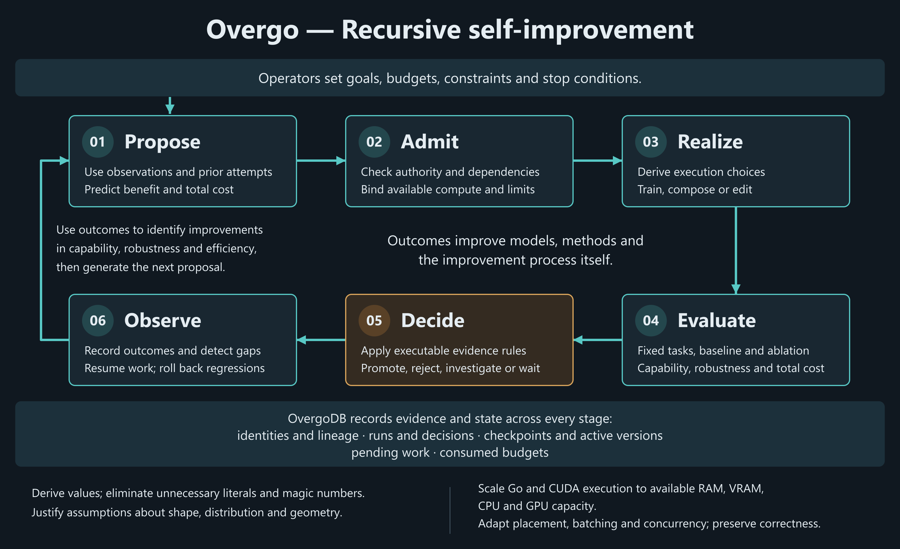

# Overgo

Overgo is an operating recursive self-improvement (RSI) system platform for
model-driven software agents.

It has two permanent uses:

- provide the deterministic framework needed to build RSI automation;
- expose the same model, agent, training, evaluation, and automation framework
  to people for useful work through the operator workbench, APIs, and command
  line.

The central design rule is that model cognition proposes work while
deterministic code controls state, authority, execution, verification, and
recovery. A model may interpret a problem or generate a candidate patch, but
acceptance still depends on measured evidence and executable policy.

A second design rule governs how models enter the system. Overgo owns no
model-family executors. It ports llama.cpp behavior -- container formats,
numerical rules, quantization, and kernels -- into generic Go and CUDA
components, and expresses each model family as a typed prototype definition in
OvergoDB: the tensor layout, execution modes, operators, and numerical features
that family needs. Specific checkpoints are verified as instances inside a
prototype. Adding a model is adding a prototype definition and a recipe, not a
new code path -- model identity lives in the store as data, and a reviewed
census (docs/family_branch_baseline.json, enforced by the architecture
family-branch test) pins the small residue of family-named branches that
remain in shared execution code: the GGUF tokenizer-algorithm kinds and the
llama-compatibility loader. That census only shrinks; a new model
expressible through existing primitives introduces no family-named branch.

An operator can steer the framework by supplying goals, constraints,
priorities, and decisions about what to investigate next. The graphical
workbench is an external interface for steering and observation; it is not the
RSI controller. The RSI path adds model-directed steering from durable
measurements and state alongside human-directed work. Both paths use the same
deterministic control plane to admit, evaluate, activate, reject, or recover
work.

Overgo was built by the loop it describes. Every commit in its history was
dispatched by `cmd/plan`, gated by `cmd/gate`, and carries the trailers that
record it -- the plan step it closed, the code and recipe manifests it
observed, and the falsifiable check that passed (`Overgo-Plan-Item`,
`Overgo-Code-Manifest`, `Overgo-Verify`) -- so the repository is the loop's
output, not a description of a loop that has yet to run.

What that demonstrates is bounded, and the boundary is the point. Supervised,
system-level RSI is not a future goal here: it is how this repository exists --
an external model proposes and executes work, the deterministic control plane
admits, gates, and records it, and an operator steers goals and priorities. The
recursive loop is implemented end to end: measurement, controlled experiments,
evidence-gated policy promotion, typed steering proposals, and a driver that
consumes them under mechanical stop conditions. What remains open is narrower
and specific -- unattended operation at scale, improvement of the proposing
model's own cognition, and measured effectiveness against competing strategies
(see What remains before fully autonomous RSI).



[Structured figure definition](docs/assets/overgo_graphic.json)

## The recursive control boundary

Overgo is an RSI system because measured outcomes can change the mechanism
that proposes, executes, or judges later work. It is not recursive merely
because a model can generate another patch. Every iteration crosses the same
deterministic boundary:

| Phase | Authority and invariant |
| --- | --- |
| Steer | An operator or model proposes a bounded goal. A proposal grants no execution or activation authority. |
| Form candidate | The proposal becomes a typed, falsifiable candidate over a model, recipe, policy, dataset, mechanism, or code change. |
| Compile and realize | Go owners prove dependency and capability closure, then materialize the candidate through bounded execution. |
| Evaluate | Baselines, ablations, benchmark suites, retrieval judgments, resource measurements, and production probes produce comparable evidence. |
| Decide | Executable policy admits promotion, rejection, quarantine, rollback, or further supervised work. Model preference cannot substitute for evidence. |
| Persist | OvergoDB records identities, lineage, receipts, metrics, decisions, checkpoints, and versioned active state. |
| Recur | Durable outcomes expose the next capability gap and inform the next steering proposal under explicit budgets and stop conditions. |

The same cycle governs changes to inference, training, evaluation, retrieval,
routing, automation, and the control system itself. The repository demonstrates
supervised system-level RSI through this loop. It does not claim unattended
operation at scale or autonomous improvement of the proposing model's
cognition.

## Objectives

Reliable RSI requires more than repeatedly asking a model to modify its own
code. The surrounding system must make each attempt reproducible, bounded, and
falsifiable. Human-directed use needs the same properties so useful work can be
inspected, resumed, compared, and trusted.

```text
steering: operator or model
      -> typed task and bounded context
      -> deterministic admission and execution
      -> independent tests and evaluations
      -> evidence-and-policy decision
      -> activate, reject, or roll back
      -> durable measurements and state
      -> next steering proposal
```

The same mechanism must also evaluate changes to the automation itself. An
improved prompt, planning policy, retrieval method, gate selector, or repair
strategy is only an improvement when repeated measurements show a better
result under the same constraints.

## What exists

Overgo already combines the following components in one codebase:

| Area | Current implementation |
| --- | --- |
| Model execution | Shared Go and CUDA execution for dense, mixture-of-experts, recurrent, hybrid, encoder, diffusion, and multimodal programs |
| Modalities | Text, image, audio, video, time-series, and tabular input or output paths |
| Model lifecycle | GGUF and safetensors intake, conversion, quantization, model construction, training, evaluation, serving, and rollback |
| Agent definitions | Immutable bindings among prompts, model configurations, tools, datasets, automations, and policies |
| Workflow control | Typed dependency graphs, bounded admission, resource placement, scheduled execution, restart recovery, and remote peers |
| Mutation safety | Exact tool identity, persistent executable policy, inspection before mutation, argument-bound approval, and a durable receipt before a side effect |
| Reproducibility | Content identities, provenance, run records, stage receipts, checkpoints, exact resume checks, and versioned activation |
| Verification | Plan-driven gates with manifest-derived check selection, structural source analysis, host/device comparisons, model-specific evidence, long-form fingerprints across context lengths, and compatibility records |
| Benchmarks and evaluation | Store-derived benchmark catalogs, native lm_eval-family suites, per-model prompt templates, domain-routed evaluation, and measured capability claims |
| Human-directed work | External workbench for goals, chat and media, agent sessions, model and data operations, measurement review, intervention, and rollback |
| RSI steering | Typed falsifiable proposals through deterministic admission, consumed by the driver under budget, saturation, and operator-stop conditions; shared with human-directed work |
| Tool calling | UTCP-style manuals in the store: each tool declares its effect class, typed arguments, and native transport; unregistered tools are not callable |
| Interfaces | Command line, HTTP APIs, scheduled jobs, and an external operator workbench over shared backend state; the whole public surface is enumerated in the generated [API manifest](docs/API_MANIFEST.md) |

## Capabilities

The following sections describe the implemented mechanisms. They do not imply
that every mechanism is available for every model. A capability becomes
servable only when the store contains an active recipe for the exact model,
task, runtime policy, and required components. Compatibility records identify
the artifacts and environments for which verification evidence exists.

### Serving and generation

- Text completion, chat completion, infill, embedding, reranking,
  tokenization, detokenization, perplexity measurement, and sequence scoring.
- OpenAI-compatible HTTP surfaces for Completions, Chat Completions,
  Responses, Embeddings, image generation, video generation and editing, and
  speech generation; a bounded Audio Transcriptions subset supports CPU ASR.
- An Anthropic Messages-compatible surface with token counting, system
  messages, image input, tool use, streaming events, and bounded local
  reasoning output.
- Buffered and streaming generation, stop sequences, grammar-constrained
  sampling, JSON Schema grammar compilation, log probabilities, prompt-state
  reuse, context shifting, and supported speculative decoding paths.
- Decode attention that walks the key cache in tiles with an online softmax
  and splits the keys across blocks per head, so a decode step keeps one
  launch shape at any cache capacity; a step the kernel cannot serve is
  refused rather than computed on the whole capacity.
- Runtime LoRA scale control, multimodal prompt projection, concurrent request
  admission, continuous multi-request scheduling, model properties, device
  statistics, and live model replacement through the model-swap proxy.
- Recipe-selected image, video, video-editing, speech, time-series, tabular,
  encoder, decoder, recurrent, hybrid, mixture-of-experts, and diffusion
  execution paths.

Authentication and method requirements are defined per route. The generated
[API manifest](docs/API_MANIFEST.md#routes) is the authoritative route list.

CPU transcription is enabled with `-transcription-policy <policy.json>` on
`cmd/server`; the existing positional GGUF model is still required. The strict
[policy](internal/server/transcription_workspace.go) supplies `recipe` (the exact
active transcription recipe ID), `memory_bytes`, and `inspection` (the existing
[audio admission policy](internal/dataset/testdata/audio_inspection_policy.json),
with bounds chosen for the admitted data). Startup refuses an inactive recipe;
execution rechecks activation after session admission. The endpoint uses the
existing bearer-authentication policy:

```sh
curl -H "Authorization: Bearer $OVERGO_API_KEY" \
  -F "model=$TRANSCRIPTION_RECIPE_ID" -F "file=@clip.wav" \
  http://localhost:8080/v1/audio/transcriptions
```

WAV and FLAC are decoded natively under the recipe's channel, sample-rate and
admission constraints. The response is `{"text":"..."}`. Only `file`, `model`,
`response_format=json`, and `stream=false` are accepted; timestamps, streaming,
language overrides and prompt conditioning are not implemented. Uploads,
operations and transcript runs retain OvergoDB lineage. The
[acceptance test](internal/server/audio_transcriptions_test.go) executes a small
encoder; it does not establish full-model WER or throughput.

### Model and artifact lifecycle

- GGUF inspection, hashing, splitting, merging, conversion, quantization, and
  importance-matrix processing.
- Safetensors inspection, bounded repository loading, conversion, and
  checkpoint publication.
- Hugging Face model and dataset search, verified download, repository intake,
  and conversion into registered local artifacts.
- Model characterization, tensor inventory, vocabulary inspection, hidden
  state and attention analysis, model construction, and active-recipe
  inspection.
- Scratch-model and corpus-derived model construction, including compiled
  construction plans, model-builder workflows, and registered output
  artifacts.
- LoRA extraction, model grafting, component alignment, interface-adapter
  training, model composition, candidate evaluation, activation, rollback,
  and supersession.
- CUDA device inspection, kernel compilation, generated host bindings, kernel
  ABI manifests, embedded PTX validation, and source-to-binary identity checks.
- Architecture profiles that compile tensor namespaces, operator sequences,
  numerical policies, cache behavior, execution modes, and runtime limits into
  a model program. A checkpoint that fits existing compiled behavior requires
  a prototype and recipe; a new numerical mechanism requires a corresponding
  generic operator or policy implementation and new verification evidence.

### Training and adaptation

- Native token-prediction training, direct preference optimization (DPO), and
  group relative policy optimization (GRPO).
- Host-reference and supported CUDA-resident forward, backward, loss, and
  optimizer execution.
- Compiled Muon optimizer plans with host and CUDA implementations, parameter
  grouping, portable optimizer state, and exact resume validation.
- Dataset streaming, deterministic batch selection, bounded sequence plans,
  frozen lexical or component surfaces, and adapter-only training with donor
  models held immutable.
- Exact checkpoints that bind model identity, recipe, objective, optimizer,
  random-number state, data-stream position, and parent lineage.
- Supervised training sessions with resource bounds, phase measurements,
  pre-training and post-training evaluation brackets, health classification,
  MoE router observations, evidence-derived routing targets and controllers,
  and operator intervention records.
- Dedicated probes and workflows for dense causal, mixture-of-experts,
  hybrid, image, video, modality-transformer, time-series, and tabular
  training paths.

The supported training combinations and their evidence are listed in
[Training compatibility](docs/TRAINING_COMPATIBILITY.md).

### Universal Muon Optimizer

Overgo uses a single optimizer policy across all trainable models and parameter geometries. Training exposes no user-facing optimizer controls. Learning rate, momentum, optimizer selection, scheduling, warmup, and parameter-specific optimizer recipes are determined by the trainer. The optimizer derives its behavior from statistical and geometric invariants rather than per-model hyperparameter tuning.

Overgo uses `CLTMinSamples = 30` as a minimum statistical sample floor, based on the conventional large-sample central limit theorem heuristic. For exponential momentum, the effective sample size is

$$
N_{\mathrm{eff}}=\frac{1+\mu}{1-\mu}.
$$

Setting \(N_{\mathrm{eff}}=30\) gives

$$
\mu=\frac{N-1}{N+1}
=\frac{29}{31}
\approx 0.93548.
$$

Momentum follows from the statistical horizon rather than being selected or tuned per model. The same `CLTMinSamples` invariant is used elsewhere in Overgo for autocorrelation-aware tail windows, batch-size derivation, evaluation sampling, and calibration. Each subsystem maps the common statistical floor into its own calculation.

Momentum accumulation changes the characteristic scale of an update. Overgo compensates for this with

$$
\sqrt{1-\mu^2}.
$$

This normalizes the effect of the derived momentum value on update magnitude.

For a trainable tensor represented as an \(m\times n\) matrix, Overgo forms the momentum direction and applies Newton–Schulz orthogonalization. The direction is normalized before orthogonalization, making the Muon update invariant to positive rescaling of the input gradient.

The approximately semi-orthogonal result is scaled by

$$
\eta_t
\sqrt{\max(m,n)}
\sqrt{1-\mu^2}.
$$

For an approximately semi-orthogonal \(m\times n\) matrix \(Q\),

$$
\|Q\|_F \approx \sqrt{\min(m,n)}.
$$

Therefore,

$$
\|\Delta W\|_F
\approx
\eta_t
\sqrt{1-\mu^2}
\sqrt{mn},
$$

and the RMS update per parameter is approximately

$$
\operatorname{RMS}(\Delta W)
\approx
\eta_t\sqrt{1-\mu^2}.
$$

The resulting RMS update is approximately independent of tensor dimensions. Matrix shape therefore does not require a separate learning-rate rule. Vectors and scalars are handled by the same optimizer rather than routed to a separate optimization algorithm. The optimizer is used for matrices, vectors, scalars, embeddings, normalization parameters, adapters, and other trainable tensors.

This removes several common sources of model-specific optimizer tuning:

* gradient magnitude is normalized before the Muon update;
* tensor geometry is compensated analytically;
* momentum is derived from an effective statistical horizon;
* momentum-induced update scaling is explicitly normalized;
* learning-rate policy is derived by the trainer;
* all trainable parameter geometries use the same optimizer implementation.

The low-level optimizer records resolved learning rate, momentum, schedule, and optimizer state for execution and exact checkpoint/resume. These values are execution state rather than caller-configured training policy.

The training interface is therefore reduced to:

$$
\boxed{
\text{model}
+
\text{data}
+
\text{objective}
+
\text{budget}
\longrightarrow
\text{train}
}
$$

The same trainer is used across dense decoders, encoders, mixture-of-experts models, LoRA and adapter training, image, video, audio, time-series, tabular, and other differentiable architectures without per-model optimizer tuning. Training policies that require repeated human hyperparameter search are not used.

### Evaluation, routing, and live safety

- Store-derived suites for exact answers, multiple choice, grouped choice,
  generated answers, structured generation, instruction rules, probability
  mass, sequence likelihood, preference targets, numeric targets, retrieval,
  and media outputs.
- Native evaluators and prompt construction for MMLU, MMLU-Pro, TruthfulQA,
  IFEval, BBH, MuSR, and other registered benchmark families.
- Per-model prompt templates, evaluation-domain declarations, group-safe data
  splits, resource measurements, failure records, comparison reports, and
  campaign history.
- Long-form verification before suite passes. Context rungs double from 1024
  until the declared context, corpus, per-rung budget or device memory ends the
  climb. Records include greedy token IDs, rates, per-token device work,
  repetition, and continuation likelihood under long and short contexts.
  Evidence binds weights and inference surface; `evaluate -all` requires a
  passing current-surface record. `longform -check` always measures again,
  comparing explicit baseline IDs on identical checkpoint, corpus, tokenization,
  raw-continuation protocol and declared floors.
- Capability-gap derivation, grounded retrieval replay, candidate attribution,
  evidence coverage checks, route selection, and counterfactual replay of
  alternative routing rules.
- Media-quality, offline-artifact, and composite-generation evaluation with
  production probes, candidate attribution, and ablation-bound promotion
  evidence.
- Deterministic rollout cohorts, reproducible evidence projections,
  distribution-free live-safety windows, circuit-breaker escalation,
  quarantine, atomic rollback, and evidence-bound quarantine reentry.
- Multidimensional improvement decisions that prohibit promotion when any
  required fitness dimension regresses, even if an aggregate score improves.

### Data and retrieval

- Typed dataset registration, inventory, aliases, content identities,
  provenance, availability checks, and deterministic train, validation, and
  test splits.
- Bounded readers for the supported Hugging Face Arrow IPC and Parquet
  subsets, plus benchmark-specific normalization and import paths.
- Text, image, audio, preference, rollout, interaction, capability-episode,
  and domain-specific training records.
- Incremental selection, streaming transformations, resumable materialization,
  benchmark catalog construction, and repository-backed dataset preview.
- Text, image, audio, preference, grouped-rollout, and multimodal training
  materializers that publish exact source and stream-position evidence.
- Agent retrieval with persisted indexes, embedding and reranking providers,
  retrieval receipts, held-out retrieval judgments, and quality evaluation.

### Agents, tools, workflows, and automation

- Immutable agent definitions that bind a prompt, model recipe, exact tool
  manuals, datasets, capability bundles, automations, and policies.
- UTCP-style tool manuals with typed arguments, effect classification,
  built-in or native HTTP streaming transports, executable policy, and exact
  registered identities.
- Inspection-before-mutation admission, action-bound approvals, durable
  pre-execution receipts, mutation checkpoints, bounded sessions, restart
  recovery, and interaction replay.
- Typed workflow graphs with compiled dependencies, bounded parallel ready
  sets, stage adapters, run receipts, cancellation, failure publication, and
  deterministic recovery of completed stages.
- Closed-world tool workflows that bind registered manuals, authorization
  evidence, typed inputs, execution receipts, and retained results to one
  compiled workflow authority.
- Scheduled automation, authenticated webhook intake, input binding, delivery
  tools, execution history, and recovery after interruption.
- Coalesced wake signals, late-stimulus reconciliation, incremental context
  handoff, and persistent obligations that reconstruct required follow-up work
  after interruption or restart.
- Remote peers, capability publication, placement decisions, delegated agent
  execution, remote stage adapters, capacity observations, and peer lifecycle
  reconciliation.
- Operator-visible operation queues, dependency graphs, timelines, decisions,
  cancellation, waiting, and recovery actions.

### Storage, provenance, and recovery

OvergoDB is the canonical transaction authority for artifacts and operational
evidence. It provides:

- kind-qualified SHA-256 content identities, immutable blobs, typed document
  contracts, manifests, lineage, causality, locations, and compare-and-set
  aliases;
- atomic batches, idempotent batch keys, store-head preconditions, a
  hash-chained journal, checksummed frames, writer locking, and torn-tail
  recovery;
- bounded projections and queries, query cursors, alias history, read-only
  refresh, per-projection checkpoints, snapshots, segmented journals, and
  deterministic replay;
- verified backup, import, compaction, retention, rebuild, repair, parity
  checking, and migration drills; and
- operational records for runs, evaluations, approvals, receipts, policies,
  rollouts, findings, advisories, and compatibility evidence.

The `overgodb-query`, `overgodb-backup`, `overgodb-import`,
`overgodb-compact`, `overgodb-rebuild`, `overgodb-repair`, and `store-check`
commands expose the principal administrative operations.

### Development, verification, and release

- A canonical dependency-aware plan, bounded work leases, explicit workspace
  claims, and deterministic dispatch through `cmd/plan` and `cmd/loop`.
- A commit gate that binds changes to the current plan step, derives test scope
  from source and manifest impact, executes the required checks, constructs the
  accepted Git commit, and publishes the result to OvergoDB.
- Structural source analysis, ownership checks, clone and closure censuses,
  modernization censuses, staged-surface records, architecture ratchets,
  generated API records, and compatibility evidence checks.
- Closure scanning, unclassified-surface reporting, deterministic remediation,
  reactivation checks, and restoration of displaced alias authority.
- Separate hermetic, race, browser, CUDA device, installed-model smoke, and
  performance lanes. An unavailable required environment is reported as
  unavailable and is not treated as successful evidence.
- Reproducible Windows release archives, version checks, kernel ABI and source
  verification, generated bindings, a CycloneDX software bill of materials,
  and content hashes for release artifacts.

## Capability status and evidence

Overgo distinguishes implementation from evidence and activation:

| State | Meaning |
| --- | --- |
| Compiled mechanism | The source contains the generic operator, format, workflow, or policy implementation. This alone is not a claim about a particular model artifact. |
| Candidate recipe | A content-addressed recipe binds an exact model and its dependencies to compiled behavior, but it is not available for serving. |
| Validated or verified recipe | The recipe passed its required structural or execution checks and remains non-serving unless separately activated. |
| Active recipe | A versioned activation makes the exact recipe available for its declared task and retains its predecessor for rollback where applicable. |
| Verified evidence tier | A candidate execution produced the required typed artifact. |
| Parity evidence tier | Output matched the declared reference implementation under the recorded comparison. |
| Production evidence tier | Production-shaped workloads and the recorded environment support the claim. |

Absence of a model, dataset, device, or required reference is reported as
unavailable rather than successful. The compatibility reports bind each claim
to an exact artifact, recipe, source revision, environment, and verifier.

## Operator workbench

The graphical workbench is the human interface to the same control plane the
automation uses. It is a self-contained browser client embedded in the server
binary: `cmd/server` serves it at the listen address under a same-origin
content-security policy, with no external assets or build step. The browser
projects backend records and submits bounded actions; it does not own
execution state or participate in the autonomous decision loop. Every panel
reads the same store the command line and the automation read, so a result
shown in the workbench is the same durable record a gate or a script would
see.

### Front page

The default page is a conversation against the served model. Its shape is
derived from the server, not from client configuration:

- **Capability document.** `/workspace/manifest` declares, for the served
  recipe, the modes the composer offers (chat, images, video, video edit,
  speech, embeddings, rerank, and agent), each enabled or carrying the reason
  it is refused, together with the media types the model accepts and the
  byte, dimension, and pixel bounds the media policy enforces. The composer
  derives itself from this document and re-derives when the served model
  changes.
- **Model pill.** The header names the served model beside its measured
  evidence. The picker lists every servable model in the store; choosing one
  switches the served model live through the swap proxy (`cmd/swap`), and
  the page reports the switch as an operation chip. The proxy started
  without a default model (`overgo_gui.bat` with no argument) answers the
  shell itself until a child serves: the client, health naming no model,
  the workspace manifest with every tab refused, and the store's catalog
  for the picker; every other route refuses with the reason. The pill
  says no model serves, the front page carries the one control that opens
  the picker, and the chosen model's serve launches the first child, after
  which the page continues as over any served model. The Library is the
  one tab the cold page serves: a hosted provider lists and declares
  there and a local model registers there through the same intake the
  launcher binds (`internal/providerintake`), over the store the proxy
  opens for the write while no child holds it; validation waits for a
  served model, and the download surface says so. The browser lane opens
  its journey from the cold proxy and declares its page provider there
  before the first model serves. The proxy admits a request exactly as the
  credential-less server does (a loopback Host on the listener, the
  browser's cross-origin protection), before a key is placed in its
  environment or a child is launched, so a foreign origin turns nothing.
- **Conversations owned by the server.** Conversations are listed, resumed,
  labelled, and reattached to a turn in flight from the interaction records;
  the browser holds no state a reload would lose.
- **Media import.** Images, audio, video, and documents attach by button,
  drop, or paste. An attachment the served capability does not accept is
  refused before upload with the declared reason; accepted media flow
  through the same bounded media policy the APIs enforce. A model whose
  store holds a projection activation serves its projector's media without
  a command-line flag: the server resolves the projector's bytes from the
  activation, so the swap proxy, the launcher, and the lane all serve
  image, audio, and video input for every model that declares it.
- **Generation from declarations.** A generation mode (images, video,
  video edit, speech) reads the store's generation capabilities: every
  model activated for the task is offered by name, a model whose request
  no page can type is listed with the reason, and the request's own fields
  render as controls, with the choices a model's artifact exports (a speech
  model's voices) offered as a select. A request field the runtime resolves
  from the typed ones is omitted rather than refused: Wan takes a prompt, a
  negative prompt and a seed, and its runtime derives the conditioning
  contexts through the model's own text encoder and the noise plan from the
  seed on the device, with every generation parameter left blank taken from
  the model's profile. LiveEdit takes a prompt, a seed and the artifact id
  of a source clip: the capability decodes the clip's GIF into the planar
  source video, derives the text context through the base model's text
  pipeline, and compiles the condition from the declared edit schedule
  (chunking, denoising timesteps, flow sigmas), refusing a clip whose
  latent frames the schedule cannot chunk. The run goes through the generic run
  route as an operation the strip shows, and its outputs land in the thread
  as media artifacts (PNG, GIF, WAV) with their provenance. A question about
  an image runs the same way: the vqa mode lists the models activated for
  visual question answering with an image control (a stored artifact) and a
  question control (the message body), the decode budget left blank is the
  serving declaration's, and the answer lands in the thread as the
  assistant's text, published as a plain-text output artifact behind the run
  record. The serving pipeline is the one the parity harness verifies
  (`internal/vqaserve`: the processor, the device vision tower, merger,
  chained prefill and decode, and the two-stage recipe execution), so the
  page answers with the activation the harness proved.
- **Remote providers.** A hosted model enters the store as a declaration,
  never as code: `go run ./cmd/remote-provider -declare docs/remote_providers/openrouter.json`
  commits a provider document (the service name, its OpenAI-compatible API
  endpoint, the environment variable holding the key) and, per model id, a
  model manifest at a remote location with an active remote inference
  recipe at the experimental tier. The servable catalog lists such a model
  beside local ones; while the environment lacks the key the entry is
  refused by the variable's name, and with it the server serves the model
  through a relay (`internal/remoterelay`) that carries each conversation
  to the provider's chat completions endpoint and streams the answer back.
  A stream that ends before its terminal marker (the `[DONE]` event or a
  finish reason) is refused as a truncated answer rather than returned as
  a complete one, a provider's error event inside the stream is the
  turn's error, and the caller's cancellation comes back as its own error.
  The relay forwards text only and counts no tokens (the provider does);
  its environment records the remote backend, so every interaction and
  observation under it is marked as not reproducible from the store.
  The front page lists a remote model in its picker under the model id's
  last segment with a `remote` tag beside its evidence line and, while the
  key is absent, its refusal; the capabilities document declares `remote`,
  so the welcome card and every assistant turn from the model carry the
  tag, and the composer sends a turn without an input-token count when the
  count route refuses. The swap proxy resolves the entry to its remote
  location, which the server serves through the relay. The Generate
  workspace lists no remote model, since a declaration carries the
  inference task only. The relay asks the provider's stream for its usage
  chunk, so a hosted turn's response and its facts carry the provider's
  prompt and completion counts where a local turn carries its own, and the
  stored response keeps them. A withdrawn provider retires by location
  (`go run ./cmd/remote-provider -retire remote://<provider>/<model> -reason <text>`):
  a failed gate record under the remote environment retires the
  activation and releases the model's active alias, so the catalog and the
  provider listing stop offering it while the declaration stays in the
  store's history. The browser lane declares a fake provider on loopback,
  proves a remote turn with its marker through the real proxy, and retires
  the declaration when the journey ends.
  A hosted model is scored beside local ones: `go run ./cmd/evaluate -all`
  lists a declared model whose key is set as a target without bytes on
  disk, and a worker given its `remote://` reference evaluates it through
  the relay under the hosted-chat protocol, in which each question travels
  as the user message with the answer opener (the provider owns its
  template) and multiple-choice suites score by the generated letter;
  likelihood-scored suites are named and not taken, since a hosted
  completion exposes no continuation likelihoods. The records are the
  same evaluation records local models produce, bound to a remote model
  definition (model, provider profile, relay recipe) in place of an
  architecture, and to the remote environment, so every one reads as not
  reproducible; the picker's evidence line marks such a score "hosted".
  Without the key the session is refused by the variable's name. The
  benchmark command refuses a hosted reference: there is no local decode
  to measure.
  The key can be entered on the page: a keyless hosted entry in the picker
  names its variable and takes the key beside its refusal; the page posts
  it to `/providers/key`, which the swap proxy intercepts to hold the key
  in its own process (every child it launches from then on inherits it)
  before the request rides on to the running child, which holds it too.
  Nothing writes the key to the store or a log; it lives in process memory
  until the proxy exits. The picker relists and the model serves.
  A provider is declared from the Library tab as well: its form (name,
  endpoint, key variable, model ids, context length) posts the same
  document the command's file carries to `/library/register` under the
  provider kind, the server commits it through the launcher's provider
  intake under the executable's source commit, and the answer names each
  declared location with the refusal its key's absence carries; the
  catalog relists and the picker offers the models. The form also asks
  the provider for the models it serves: `/library/providers/models`
  fetches the endpoint's models listing under the key its variable holds
  (the OpenAI-compatible listing carries each id; OpenRouter's adds the
  name and context length), and a listed model picked on the page fills
  the model ids and the declared context length, so a declaration names
  only models the provider lists. A declared hosted model's row in the
  Library catalog retires it with the section's reason through
  `/library/providers/retire`, exactly as `cmd/remote-provider -retire`
  does (a failed gate record under the remote environment, the active
  alias released), and the catalog and the picker stop offering it. The form also asks
  the provider for its own model listing (`GET
  /library/providers/models`, the provider's models route under the key
  its variable holds, so the key gates it): each listed model is offered
  with the context length it declares, and picking one fills the model
  ids and that context length, so a declaration made from the page names
  only models the provider lists.
- **Attachments as artifacts.** In a mode whose request names an artifact
  (the VQA image, LiveEdit's source clip), a file attached to the composer
  is stored before it is used: the page posts its bytes under their media
  type to `/artifacts/intake`, the server accepts every type it decodes
  (images against the image bounds, all media against the byte limits)
  whatever the served chat model's projectors, commits a file document of
  that type whose identity is the bytes, and answers its id; the card names
  the stored artifact and the control takes the id, so the executor behind
  the control accepts or refuses the document by its type. The file dialog
  in such a mode is not narrowed to the chat model's types. In every other
  mode an attachment travels inline with the turn as before.
- **Transcription as a mode.** A server whose store holds the active CPU
  transcription recipe of its transcription policy lists "Transcribe"
  beside chat; the capability declares one artifact-typed audio control,
  which an attached clip fills through the intake route and a stored
  card's "use as input" fills directly; the generic run route executes the
  transcription workspace under its resource bounds and completes with the
  run's transcription document and the transcript's text as a plain-text
  output, which the page renders as the assistant's turn. The policy comes
  from `-transcription-policy` or, for a server the swap proxy launches,
  from `transcription_policy.json` beside the store; a declared policy
  whose recipe is not active is logged and the mode is absent. No
  production path activates a transcription recipe yet (parked as a
  finding), so a store activated by the ASR baseline harness is the only
  one that lists the mode.
- **Keyboard and phone paths.** Alt+M opens the model picker from anywhere
  on the front page; its rows take focus, the arrows move between them and
  Enter serves the focused row, the same path the mouse takes. Escape stops
  a running turn from anywhere on the page, as the composer's stop control
  does, and closes the turn inspector. At a phone width a message bubble is
  bounded by the conversation's width and an unbroken line or a code block
  wraps inside it, so nothing scrolls sideways; the acceptance lane proves
  the keyboard path, the stop, and the phone-width conversation in the
  real browser.
- **The empty store.** When the catalog lists nothing servable the
  welcome card's model control reads "Add a model" and opens the picker,
  and the picker names the two ways a model enters: register a local
  model, or declare a hosted provider and enter its key. Each control
  opens the Library tab on its form with the first field focused. The
  acceptance lane proves the welcome card, the picker, and the path to
  the hosted form in the real browser.
- **Presets from declared bounds.** A numeric request field can declare
  its default, the step a valid value moves by and, for a frame count, the
  frames one second holds; the video capability derives them from its
  profile's generation policy and the model's strides (the VAE stride
  times the patch size per axis). A form with such bounds prefills the
  defaults, steps the fields by the stride, and offers aspect-ratio chips
  that keep the default's pixel area and duration chips in whole seconds,
  every value snapped to the stride. No ratio or size is typed for a model.
- **Media input slots.** A capability's artifact inputs are declared on
  its request (a label and a media kind per field), so a mode renders one
  labeled slot per input rather than an untyped artifact control, a strip
  of the store's recent files of that kind (attachments the composer
  stored, media a capability made) fills a slot with one click, and a fresh
  attachment goes to the slot of its kind. The store, not browser storage,
  is the history. The journey fills the VQA image slot from its strip.
- **Media gallery.** A generation mode lists the store's outputs of its
  kind (image, video or audio) newest first as a rail of thumbnails, each
  named by the capability that made it, with a filter to the picked
  model. A thumbnail opens the output as a media card with the record
  that made it: the run's request document as control and value rows
  (the seed among them), the run, a download of the bytes, and "use as
  input". A generation run cites the request document the runtime
  recorded (the decoded request under the capability's input schema) as
  its one input, so the record is the store's, never a second copy. The
  journey reloads the page after generating an image and finds it first
  in the rail, then opens its record.
- **Prompt enhancement.** The composer's "enhance" control sends the typed
  prompt through the served chat model under one fixed instruction the
  server owns, and shows the rewrite beside the original for acceptance.
  Every enhancement is stored as a record with the instruction, the
  original, the rewrite and the model. An accepted rewrite sent unchanged
  makes the record a source of the generation run: the run's request
  document records the accepted prompt, and the run cites the record as
  an input beside it, so the original stays its source and the lineage
  shows both. A Go test pins the instruction and the record, and the
  journey enhances a prompt before the oscillator image.
- **Lineage and next steps.** A media card's "lineage" reads the store's
  records around its artifact: the runs that made it, each with its
  request document and media inputs, and the runs that used it, each
  with its outputs. Beneath them the next steps list every active
  generation capability whose declared slot takes the artifact's kind,
  derived from the capability declarations and nothing typed for a
  model; one click opens that mode with the model picked and the
  artifact in the slot. The lineage route and the derivation are pinned
  by Go tests, and the journey continues the generated image into the
  slot of the capability that accepts an image.
- **Regenerate and vary.** A media card behind a run offers "regenerate"
  and "vary": both read the run's stored request document and resubmit it
  to the capability that made it, unchanged or with a fresh seed, so page
  state plays no part in the request. The new card names its parent. An
  unchanged request answers with the same output artifact, since the
  runtime keys the run by the request document, and the card says the
  store memoized it. A request without a declared seed control cannot be
  varied and the card says so. The journey varies the oscillator image
  from its record and regenerates it to the memoized output.
- **Media back in.** Every media card offers "use as input": the artifact's
  bytes re-enter the composer as a file of their own kind, accepted or
  refused by the served capability like any attachment. When the chosen
  generation mode's request names an artifact (LiveEdit's source clip),
  the same button fills that control with the card's stored id instead, so
  a clip the page just generated is the next edit's source without leaving
  the store.
- **Turn inspection.** Any turn opens in the inspector with its run record,
  and the analysis inspectors run over that turn's exact prompt and
  completion.
- **Agent mode.** With an active agent definition, the composer runs the
  agent from the same conversation: tool steps and chat turns appear inline,
  and exceptional mutations queue in the approvals inbox.
- **Operations strip.** Long operations appear under the header as chips with
  progress, a live event tail, cancel, and the durable receipt: run, outputs,
  traces, attempts, stages, and decisions. The header carries the server,
  proxy, and device state and the count of approvals waiting.
- **Keyboard, motion, colour, width.** Every control is reachable from the
  keyboard, the inspector closes on Escape and returns focus, reduced-motion
  and colour-scheme preferences are honoured, and the layout holds down to
  phone width.

### Library lifecycle

The Library tab takes a model or dataset from the Hugging Face hub into the
catalog in four stages, each offered only once the previous one is durable.
Select searches the hub. Download fetches the files with verified digests.
Register publishes a model's resolved facts and a candidate recipe (known to
the store, not yet servable), or registers a dataset's downloaded directory
under its name. Validate runs a model as an operation the strip shows with
its steps: an exact suite is recorded from the model's own greedy output over
the prompts in `library_validation.json`, replayed exactly, published as gate
and run evidence, and the recipe is activated with that evidence, after which
the catalog serves the model as verified. This replay checks consistency,
not independent task accuracy; a dataset validates by the preview
the datasets route answers. Every stage reports its receipt as the store's
identities. A projector beside the model, or one named with it, registers as
the model's projection candidate: the files sort by what each declares,
never by name. Projector activation requires an executed exact media suite
covering every declared input mode through the recipe CLI. The library's
text-prompt validation currently refuses projector requests because it has
no media fixtures; opening a projector cannot verify its outputs. A model
already on disk, with an optional projector, can register from the same tab.

### Retained workbench

The workbench tabs remain behind the front page:

- **Generate workspace.** One workflow tab over the store's generation
  capabilities: every activated media model by name, a refused one marked
  with its reason, the request's declared controls rendered by the same
  helper the front page's modes use, and the run as an operation with its
  receipt.
- **Agent sessions.** Agent definitions bind a prompt, model configuration,
  tools, and policies immutably; sessions execute with native tool calling
  against the typed tool catalog. Layered authority maps bound what each
  session may touch, and every past interaction replays from its durable
  record for inspection.
- **Approvals inbox.** Exceptional mutations queue as argument-bound approval
  requests. The operator sees the exact tool identity and arguments that will
  run; a durable receipt precedes the side effect, and a decision is bound to
  the approval request the operation advertises, so nothing executes on a
  stale approval.
- **Models and data.** The model catalog is derived from the store: every
  locally present model with its active recipe, verified capability tier,
  and measured evidence. Benchmark throughput and evaluation scores appear
  beside each entry in the picker. Dataset browsing reads the active catalog
  without payload access, and the model builder and recipe inspector expose
  construction and activation records.
- **Analysis.** Structure, tensor, attention, logit, hidden-state, and
  vocabulary inspectors over the loaded artifact. The attention view replays
  bounded plain-causal attention on the host and refuses compiled score
  policies it cannot reproduce exactly; the displayed weights are recomputed
  evidence, not a copy of runtime state.
- **Training.** Session-supervised training: a session is leased, observed,
  and recorded; the observer captures a pre-training evaluation bracket on
  admission and publishes the post-training deltas on finish, so every
  session's measured effect is attributed to it in the store.
- **Evaluation.** Suites derive from the benchmark catalog in the store and
  route by each model's declared evaluation domains. Results publish back
  through the campaign ledger and reappear as the evidence beside the model
  in the picker.
- **Workflows and runtime.** Typed workflow graphs with bounded admission,
  scheduled jobs, run browsing over the store's phased run records, media
  compositions, live runtime activity, and remote peers for distributed
  execution.
- **Artifacts and provenance.** The artifact gallery and the provenance
  records behind every displayed result, down to the content identities a
  claim cites.

### Verification

The client is held by measures, not by rule prose: the composer budget
test ratchets the JavaScript line count and the review criteria the lane
census measures (silent fallbacks, window dialogs, controls and buttons
without an accessible name, inline style attributes, nested ternaries,
timer literals, debt markers, the largest file), each at its measured
value and only tightening; `go run ./cmd/webui-lane -report` prints
them beside the size measures.

`go run ./cmd/webui-lane` runs the real-browser acceptance lane the gate
selects for every web UI change: the workbench acceptance steps, the front
page's keyboard, motion, colour, and width contract, and a first-run journey
against a served model through the real swap proxy. The lane is the only
way a browser test is evidence: outside it every browser test skips, so a
plan verify that names one through `go test` alone is refused as vacuous,
and a verify names the lane instead (`-run` selects the tests, `-require`
names a journey line the run must write; a named test that skips, a run
in which nothing passed, or a missing line fails the lane). The journey proves, in
order, that the page boots once the default model serves, that the first
message streams a reply and fills the context meter, that the inspector
opens over the turn with its run record, that an agent created through the
API runs a tool step and a chat turn from the same composer, that an image
attachment reaches a grounded reply from the smallest model whose store
declares a projector (the journey switches to it by declaration) or is
refused with the declared reason when none is declared, that the served
model switches through the picker and the composer re-derives, that a
running turn stops from the composer, that an image comes out of the
cheapest declared image model as an artifact card and goes back in as the
next attachment, and that a speech clip comes out of the declared speech
model with a voice its artifact exports. A leg whose prerequisite is absent
(a browser, the built server, a servable model with bytes on disk) reports
UNAVAILABLE rather than failing what it cannot observe.

### Usage

Launch the server with a model (see Quick start) and open the listen
address; the front page is the default page. A typical serving session:
pick a model from the pill, then chat, attach media, or choose a generation
mode. A typical intake session: search the hub in the Library tab, download,
register, and validate, and watch the model appear in the pill as verified.
A typical measurement session: open the evaluation workspace, run the
store-derived suites for the served model, and watch the results land in the
picker as published evidence. A typical training session: start a supervised
session from the training workspace and read its bracket when it finishes;
the pre/post deltas are the session's measured effect.

Interventions follow the same shape everywhere: inspect the record first,
act through a bounded control, and find the durable receipt in the store
afterward. Steering from the workbench (goals, priorities, interventions,
approvals, rollback) enters through the same bounded interface the RSI
path uses. Nothing is reachable from the browser that is not equally
reachable, and equally checked, from the deterministic control plane.

## Tool calling: typed manuals and native transports

Agent tool calling follows the UTCP philosophy: describe each tool once in a
typed manual and invoke its declared transport. The executor includes adapters
for built-in Go functions, HTTP, argv processes, HTTP JSON streams, and MCP over
HTTP. MCP support is an invocation adapter for registered tools; it does not
bypass the shared policy, approval, or receipt boundary.

A manual is a store document (`overgo/agent-tool-manual/v1`) declaring the
tool's name, its **effect class** — `inspection` reads state, `mutation`
changes it and is permitted only after a prior inspection — its typed arguments, and its
transport binding, including the endpoint or executable and protocol details.
Manuals are published to OvergoDB under registered aliases; orchestration
resolves tools from the store, never from code alone, so an unregistered tool
is not callable and a mutation without a durable receipt does not execute.

```bash
go run ./cmd/agent-tool -manuals tools.json            # register manuals
go run ./cmd/agent-tool -resolve <name>                # resolve one registered manual
```

Agent sessions in the workbench execute against this same catalog: the server
derives each session's tool-manual set and layered authority map server-side,
exceptional mutations queue as argument-bound approvals, and every invocation
lands as a durable record. The `agent-tool-manuals` protocol row in the
[API manifest](docs/API_MANIFEST.md) is the machine-readable statement of this
contract; capability proxies that expose model recipes as agent tools are
staged surface awaiting the delegation campaign
([staged surface](docs/staged_surface.json)).

## Current state

The deterministic harness is substantially implemented, but evidence maturity
varies by capability.

| Requirement | State |
| --- | --- |
| Exact identities for code, models, data, tools, policies, and runs | Implemented |
| Bounded and recoverable workflow execution | Implemented |
| Durable authorization and mutation receipts | Implemented |
| Independent host, CUDA, integration, and model verification lanes | Implemented; artifact coverage varies |
| Long-context verification of installed models | Implemented: the ladder climbs to 32768 tokens on the gemma-4-E4B and 16384 on the Qwen2.5-0.5B with rates, device work, degeneration measures, and context gain recorded per rung; its first climb found and fixed a decode collapse past 8192 tokens; per-key cost on small heads and memory retention across capacities remain open rows |
| Verification derived from exact code manifests, fail-closed on unproven independence | Implemented |
| Exact training checkpoints and fail-closed resume | Implemented for supported training paths |
| Agent and automation lifecycle management | Implemented |
| Measurement of automation effectiveness | Implemented: every gate run emits a typed attempt record, success and failure |
| Durable cross-run measurement history for steering | Implemented: attempt history is store-queried and aggregated per step and strategy |
| Controlled comparison of competing automation strategies | Implemented: isolated-worktree experiments from one baseline, judged by each step's own verify |
| Evidence-conditioned promotion of automation policies | Implemented: declared to active on recorded evidence and measured wins, rollback retained |
| Model-proposed steering from accumulated evidence | Implemented: typed falsifiable proposals through deterministic admission; history-free proposals are refused |
| Closed recursive policy-improvement loop | Implemented: the driver consumes admitted proposals under budget, saturation, and operator-stop conditions; live unattended campaigns remain to accumulate evidence |
| Evidence-derived model routing | Implemented: typed routing decisions derived from admitted evaluation evidence, every selection recorded, candidate routing rules measured by counterfactual replay over recorded decisions |
| Deterministic rollout of promoted candidates | Implemented: content-addressed rollout plans, deterministic cohort assignment that is identical across retry, replay, and restart, reproducible projection reports, promotion only after the required evidence is present |
| Live-safety containment | Implemented: comparison windows derived from each metric's own history without distributional assumptions, staged circuit-breaker escalation ending in operator stop, atomic rollback with recorded cause, and quarantine reentry that requires evidence committed after the quarantine |
| Prototype recipe lifecycle with rollback | Implemented: candidate, validated, active, refused, superseded, and rollback transitions; a superseded recipe returns to service only through a new verified activation |
| Composition improvement driver | Implemented: exact retrieval over normalized component descriptors, seam alignment residual audited against measured bridge results, ranked candidate enumeration, adapter training with both models frozen, multidimensional fitness selection without averaging, promotion through the existing ablation-controlled check, and run bounds computed from measured history; live composite campaigns remain to accumulate evidence |

Architecture support and artifact verification are separate claims. Shared
components can express more model types than are installed and tested on the
current hardware. Compatibility records therefore identify the exact artifact,
configuration, environment, and verification command behind each claim.

## The recursive loop, as implemented

The mechanisms the loop needs now exist end to end, each deterministic and
store-recorded:

- **Measurement.** Every gate run — success and failure alike — emits a typed
  attempt record binding the plan step it served, the strategy that produced
  it, the manifest selection it observed, the change size, wall time, and
  outcome. Attempt history is queryable across runs, strategies, and code
  revisions, aggregated per step, never scraped from logs.
- **Controlled experiments.** Competing worker strategies run the same plan
  step in isolated worktrees from the same baseline commit; each trial is
  judged by the step's own machine verify, selection is verify outcome first
  and measured cost second, and failed trials persist as durable
  counterexamples.
- **Policy promotion.** Automation policies move declared, experimental,
  verified, active — exactly as model recipes promote. Each promotion demands
  recorded evidence: an experiment for experimental, repeated measured wins
  for verified, and a measured non-regression over the incumbent for active,
  with the displaced incumbent retained as the rollback target.
- **Steering proposals.** A model — or a human — proposes the next task as a
  typed document: goal, predicted benefit, predicted cost, explicit
  uncertainty, a falsifiable check, and references into recorded measurement
  history. Deterministic admission refuses a proposal that cites nothing or
  cites measurements nobody recorded, and converts an admitted proposal into
  a plan row whose verify is the falsifiable check and whose rationale
  carries the prediction, so outcome is comparable against what was promised.
- **Closure.** When the plan drains, the driver consumes the next admitted
  proposal instead of stopping, under three mechanical stop conditions: the
  invocation budget, saturation — consecutive proposal rows ending without
  their falsifiable check passing — and the explicit recorded operator stop.
  Proposals never execute anything; every row still advances only through
  the gate.
- **Routing.** Which model serves a task is a recorded decision. Candidates
  are admitted only through verified evaluation evidence measured on the
  same data split. The quality threshold is the current model's own
  measured value, and one registered rule picks the cheapest candidate
  that meets it. A new routing rule is first replayed against the recorded
  decisions to measure what it would have changed; only then can it serve
  live traffic.
- **Rollout and containment.** A promoted candidate is activated for
  everyone only after a rollout: an immutable plan assigns each workload
  to the baseline or the candidate by a hash of stable identities, so the
  assignment is the same across retries and restarts. Reports over the
  rollout are reproducible: reading the same store state twice produces
  the same bytes. Promotion requires the observation count the plan
  demands, a committed rollback authority, and the plan's baseline still
  in service. If the live metrics regress past bounds computed from the
  metric's own history, a circuit breaker escalates step by step —
  advisory, finding, quarantine, operator stop — and rollback restores the
  previous model in one step with the causing evidence recorded. A
  quarantined candidate can only return with new evidence committed after
  the quarantine; resubmitting old evidence does nothing.
- **Composition.** The model-improvement driver follows the same structure
  as the policy loop. Improvement targets come from admitted evaluation
  results. Donor components are found through an exact index over
  normalized component descriptors. For each candidate seam, a linear
  least-squares fit over recorded activations measures how well a simple
  adapter could connect the two models; that residual is checked against
  measured bridge results before it is trusted. Realization initializes
  the adapter from that fit and trains only the adapter — both models
  stay frozen, and the result proves their bytes did not change. A
  composite is selected only if no fitness dimension got worse and at
  least one got better; averaging across dimensions is not allowed.
  Promotion requires ablation evidence through the existing promotion
  check: the composite must lose its measured gains when the donor input
  is dropped or shuffled. The run stops at an attempt budget and failure streak
  computed from its own history. Hit rate, fitness per compute, and
  adapter training cost are aggregated into a learning curve, which is
  the record the autonomy ratchet reads.

## What remains before autonomous RSI

The sole live backlog and dependency queue is [docs/plan.json](docs/plan.json).
Imported branch plans, design records, staged-surface inventory, and historical
Git snapshots are evidence only; distinct requirements from them are mapped
into that canonical plan instead of maintained as parallel checklists. A
plan names its lane (`lane`) and an item its owner (`owner`); dispatch in a
lane takes the lane's own rows first and then unowned rows, never another
lane's, so a worktree that carries rows retained from another lane cannot
dispatch them, and the stop gate counts only what the lane can dispatch.
`go run ./cmd/plan -assign <item> -owner <lane>` and `-set-lane <lane>`
record the ownership; an explicit `-role` or `OVERGO_AUTOMATION_ROLE`
still takes precedence over the plan's lane.

Human steering remains a supported operating mode throughout: human and model
steering submit goals through the same bounded interface, and deterministic
policy retains admission, evaluation, activation, rollback, resource budgets,
saturation detection, and stop conditions.

The current campaign validates existing capabilities before simplifying their
implementation. Benchmarks and modality checks establish the current picture;
an accepted baseline and a regression gate protect subsequent changes. The RSI
goal is a repeatable gain on a fixed external task under the same resource
budget, with a matched baseline, an ablation of the proposed change, and a
tested rollback. More mechanisms or successful gate runs alone do not establish
that gain. Unattended operation and improvement of the proposing model's own
cognition remain separate claims requiring their own evidence.

## Scope

Overgo includes a broad model-engineering runtime because an RSI harness must
be able to execute and evaluate the systems it changes. The same inference,
training, evaluation, multimodal processing, agent, automation, and distributed
execution capabilities are also exposed for direct human use. These are two
consumers of one control and evidence system, not separate platforms.

The current host target is Windows amd64 with Go 1.26 and an NVIDIA CUDA
driver. The runtime uses the Windows ABI without cgo. Public interfaces may
change while the control and evidence model is tightened.

Current release designation: **v0.1.1**.

## Quick start

Requirements:

- Windows amd64
- Go 1.26
- NVIDIA CUDA driver
- A model artifact supported by an available configuration

Start the front page (builds the server and the swap proxy, then opens the browser):

```bat
overgo_gui.bat "D:\models\model.gguf"
```

Or start the server directly:

```bash
go run ./cmd/server -listen 127.0.0.1:8080 D:/models/model.gguf
```

Open `http://127.0.0.1:8080/`.

Run the hermetic verification lane:

```bash
go run ./cmd/compatibility -check
go run ./cmd/test-lane ./...
```

Real-device and installed-model checks are separate:

```bash
go run ./cmd/device-lane
go run ./cmd/smoke-lane
go run ./cmd/race-lane
```

An unavailable model or device is not counted as a successful verification.

A benchmark suite pass over the installed models is admitted by a long-form
record on the current inference code surface, so the records are published
first, then the pass runs, then the report is regenerated from the store:

```bash
go run ./cmd/longform -repo overgodb-store -all -publish -budget 3h
go run ./cmd/evaluate -all -repo overgodb-store -family mmlu-pro -budget 3h
go run ./cmd/evaluate -all -repo overgodb-store -family mmlu-pro -chat-protocol -budget 3h
go run ./cmd/benchmark-report -update
```

Publishing binds evidence to a clean worktree at its commit; a detached
worktree at the same commit keeps the main tree editable while a pass runs.
These full-catalog examples are operator-launched and include any servable
27B model. Each protocol has its own explicit budget; a budget-exceeded record
is incomplete coverage. The plan separates smaller-model work from the full
27B pass and keeps MATH excluded.

Freeze regression input with `longform -export-corpus <file> -corpus-bytes
<required-bytes>`; publish and check with that same `-corpus <file>`. Repeat
`-baseline <record-id>` for each checked model. Choose `-budget` from measured
cost; optional `-model-budget` bounds each model within the total. Cancellation
between runtime operations preserves earlier publications and reports unfinished
coverage. Legacy admission records remain usable; regression baselines require
bound inputs. Add `-guard` when publishing or checking the small regression
baseline: it caps the ladder at the declared check ceiling and requires every
planned rung, recipe/device identity, quality fingerprints, and owned allocation
measurement. It retains sampled end-of-generation tokens and continues on the
same greedy device path to measure all 64 short and 256 long output tokens, with
protocol identity `guard-continuation/fixed-budget/v1`. Runs without `-guard` retain natural stopping
under `raw-continuation/v1`; comparisons refuse different protocols. The frozen
small-guard corpus is [guard-corpus.txt](cmd/longform/testdata/guard-corpus.txt).
Peak allocation is cumulative since model open; retained allocation
is sampled after generation and scoring. Neither includes other processes or
untracked driver allocations. Checks reject growth above the selected record's
peak or retained bytes. `-validate-baselines -corpus <file> -baseline <record-id>`
with explicit model paths audits current-surface guard records without loading
models; it does not establish fresh performance or parity evidence.

## References

- [API manifest](docs/API_MANIFEST.md) — the generated public surface: every
  command binary, every typed store document contract, the UTCP tool
  protocol, and content-digested automation authorities; canonical JSON at
  [docs/api_manifest.json](docs/api_manifest.json); regenerate with
  `go run ./cmd/api-manifest -update`, verify with `-check`
- [Media capability report](docs/MEDIA_REPORT.md) — every media activation
  with its measured verifier run, phase decomposition, peak device bytes,
  and generated samples beside the requests that produced them; regenerate
  with `go run ./cmd/compatibility -update-media`
- [Model prototypes with verified models, nested](docs/model_compatibility.json) —
  structured JSON: each specific model's inference and training verification
  summaries inside the prototype it belongs to; regenerate with
  `go run ./cmd/compatibility -update-models`
- [Compatibility and verified capabilities](docs/COMPATIBILITY.md)
- [Training compatibility](docs/TRAINING_COMPATIBILITY.md)
- [Machine-readable compatibility data](compatibility.json)
- [Staged surface declarations](docs/staged_surface.json) — reviewed exported
  symbols whose production consumers are deliberately deferred, each with the
  trigger that retires it
- [Current development plan](docs/plan.json)
- [Development and verification doctrine](skill.md)
- [Software bill of materials](SBOM.cdx.json)

Completed development history is retained in Git. The active plan is intended
to contain future work and verification requirements rather than duplicate the
commit history.
