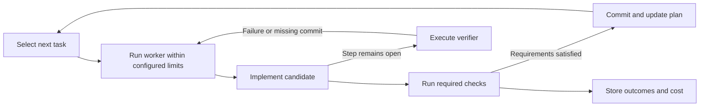

# Overgo

Overgo runs, trains, evaluates, and composes AI models in Go and CUDA.
Its browser workbench, command-line tools, and HTTP APIs share one execution
system and one artifact store.

The intent is recursive self-improvement (RSI): use measured outcomes to
improve both task capability and the process that proposes, executes, and
evaluates later work. Operators set goals, budgets, and constraints. Humans
or models propose changes; executable policy controls admission and activation.


[Editable SVG](docs/assets/overgo-platform-technical-architecture.svg) · [Figure definition](docs/assets/overgo_graphic.json)

## The improvement loop

Each iteration follows the same cycle:

1. **Propose** a falsifiable change and its expected benefit.
2. **Admit** it after checking dependencies, authority, and resource limits.
3. **Realize** the candidate through training, composition, or a code,
   recipe, data, or policy change.
4. **Evaluate** it on fixed tasks against a matched baseline, measuring
   quality and resource cost and using ablations to isolate its effect.
5. **Decide** whether to promote it, reject it, or request further work.
6. **Observe** outcomes and regressions, with quarantine and rollback when
   required.

The recursive step is the feedback into later iterations. Results can change
models and adapters, prompts and recipes, data and retrieval, routing, and
the policies used to plan, execute, and evaluate work. Rejected candidates
and failed runs remain part of that record.

Budgets, stop conditions, and recorded operator decisions bound the loop.
The [development plan](docs/plan.json) defines the current work.

## Current skill automation

[skill.md](skill.md) describes how development should proceed. Go code automates
the parts that can be checked directly: selecting the next task, running required
tests, checking whether previous results can be reused, limiting retries, and
recording completion. Agents propose and implement changes. The automation checks
those changes against the task's requirements before committing them and marking
the task complete.



| Skill behavior | Deterministic implementation |
| --- | --- |
| Select the next task | [Plan selection](internal/plan/dispatch.go) uses the plan, worker role, and recorded completion results to return the next task as structured data. |
| Check implementation requirements | The [verification code](internal/gate/verification.go) checks which files changed, magic-number policy, architecture rules, formatting, compilation, task acceptance criteria, and applicable tests. Required checks must succeed before the commit step runs. |
| Reuse valid test results | Verification selects checks based on affected code and associates results with the inputs checked. It reuses previous results when their inputs and reuse conditions match, recording executed, reused, and skipped checks separately. |
| Limit retries and record failures | [cmd/loop](cmd/loop/main.go) limits worker execution time. The [loop implementation](internal/loop/driver.go) rereads the plan after each attempt. If the task remains open, it runs the task's verification command and supplies its output for the next attempt. Reaching the attempt limit records a finding. |
| Respect limits and operator stops | A stored [strategy configuration](internal/loop/strategy.go), selected by `strategy_id`, sets attempt and invocation limits and the allowed number of consecutive proposals that exhaust their attempts. The loop checks `docs/.loop_pause` and recorded plan stops between iterations. |
| Record completion after verification | [Pre-commit checks](internal/gate/admission.go) confirm that the requested task is current and the changed files match the declared scope. The [commit code](internal/gate/commit.go) commits the changes and updates the plan after required checks succeed. Running the task's verification command alone does not mark it complete. |
| Summarize results for later decisions | [Attempt history](cmd/plan/history.go) summarizes outcomes, elapsed time, code changes, recoveries, and the strategy used. It identifies repeated unsuccessful changes and reports when to reconsider the approach. |
| Add the next prepared proposal | When enabled and no task remains, the loop reads proposal files from `docs/proposals`. The [plan command](cmd/plan/history.go) checks that the proposal's stored approval can be reproduced by the candidate validation code before adding a task. |

Further automation should implement repeatable checks in the responsible Go
packages, reducing the need for agents to inspect results and track process state.
The next step is to generate proposals from recorded outcomes, with code checking
for duplicates, validating proposals, tracking resource use against limits, and
resuming interrupted work. Agent reasoning remains useful for choosing hypotheses
and designing changes.

## Capabilities

| Area | Implementation |
| --- | --- |
| Serving | Chat and text generation, embeddings, reranking, sequence scoring, streaming, constrained output, prompt caching, and live model switching |
| Media and structured data | Image generation, speech and transcription, video generation and editing, vision QA, time-series, and tabular execution paths |
| Model lifecycle | GGUF and safetensors intake, Hugging Face integration, conversion, quantization, inspection, model construction, adapters, and composition |
| Training | Token prediction, DPO, GRPO, host and CUDA execution, Muon optimization, and checkpoint/resume |
| Evaluation | Benchmark suites, reference comparisons, long-context checks, retrieval evaluation, ablations, and quality, throughput, and memory measurements |
| Agents and workflows | Registered tools, typed workflow graphs, authorization and receipts, scheduled jobs, remote peers, and recovery after interruption |

Architecture profiles bind model tensors to shared execution primitives for
dense, mixture-of-experts, recurrent, hybrid, encoder, diffusion, and
multimodal programs.

## Training and Muon

Training takes a model, data, objective, and budget. Overgo uses a shared Muon
optimizer for matrices, vectors, and scalars, including embeddings,
normalization parameters, and adapters. The training recipe binds the optimizer
policy; the trainer resolves its settings without per-model optimizer controls.

For each parameter group, Muon forms a Nesterov momentum direction, normalizes
it, and applies Newton–Schulz orthogonalization. For an $m\times n$ group,
the update scales the resulting direction by

$$
\eta_t\sqrt{\max(m,n)}\sqrt{1-\mu^2},
$$

where $\eta_t$ is the learning rate and $\mu$ is momentum. This compensates
for matrix dimensions and momentum in the update scale. Host and CUDA paths
use the same parameter-group and portable-state contracts.

The [built-in policy](internal/trainingprogram/optimizer_policy.json) uses a
constant learning rate of $P^{-1/2}$, where $P$ is the parameter count passed
to the policy. Increasing $P$ by a factor of four therefore halves the base
learning rate. The rate stays constant across training steps; the group-size
and momentum factors above determine the scale applied to each group's direction.

The policy expresses momentum through an effective sample count $N$:

$$
\mu=\frac{N-1}{N+1},\qquad N=30\;\Rightarrow\;\mu=\frac{29}{31}\approx0.9355.
$$

The choice of 30 follows the established central limit theorem (CLT) sample-size
heuristic discussed in statistical literature and simulation studies, including
[Brussolo (2018)](https://www.mdpi.com/2504-3900/2/21/1322). For many distributions,
averaging roughly 30 independent observations gives a useful normal approximation
to the distribution of the mean. The appropriate sample size depends on the
underlying distribution; strongly skewed distributions can require more
observations. Overgo uses this heuristic to set an effective gradient sample
count of 30, with the intent of reducing variation between updates while retaining
responsiveness to changes in gradient direction. The CLT motivates the choice of
$N$; the exponential-average variance formula below determines $\mu$ from $N$.

The implementation accumulates gradients as $b_t=\mu b_{t-1}+g_t$.
Rescaling this accumulator as $a_t=(1-\mu)b_t$ gives an exponentially weighted
average, $a_t=\mu a_{t-1}+(1-\mu)g_t$. This makes the effect of $N$ explicit:

| Effect of $N=30$ | Value and meaning |
| --- | --- |
| Weight of the newest gradient in the normalized average | $1-\mu=2/31\approx6.45\%$; the previous average retains about 93.55% weight. |
| Decay of an individual gradient's contribution | Its weight halves after $\log(0.5)/\log(\mu)\approx10.4$ updates to that parameter group. |
| Average age of contributions after the initial transient | $\mu/(1-\mu)=14.5$ updates; older gradients continue to contribute with decreasing weight. |
| Momentum factor in the final update scale | $\sqrt{1-\mu^2}=2\sqrt{N}/(N+1)\approx0.3534$, before multiplying by the learning rate and group-size factor. |

The effective sample count follows from the variance of an exponentially weighted
average. For independent gradient observations with a constant mean and common
finite variance $\sigma^2$, its long-run variance is
$\sigma^2(1-\mu)/(1+\mu)=\sigma^2/N$. Thus $N=30$ gives the same variance as
an equally weighted average of 30 such observations. This is the
[standard exponential-average variance relation](https://www.itl.nist.gov/div898/handbook/pmc/section3/pmc324.htm)
with smoothing coefficient $1-\mu$. This variance calculation does not require
normally distributed gradients. It describes the normalized accumulator;
correlated or changing gradients need not have that variance reduction.

Choosing $N=30$ specifies a tradeoff between smoothing gradient variation and
responding to a change in gradient direction. Larger $N$ retains older gradients
longer and reduces the update-scale factor; smaller $N$ responds more quickly
and increases that factor. The current policy fixes $N$ at 30 rather than
estimating it from gradient measurements. Its CLT rationale is a statistical
heuristic whose applicability depends on the gradient distribution and dependence
between updates. Here, $N$ describes effective averaging, rather than a fixed
30-step window or a batch size. Muon uses the Nesterov direction $g_t+\mu b_t$
and then orthogonalizes it, so the accumulator's variance relation does not
directly describe the final parameter update. The recipe records the policy
identity, and optimizer state records the resolved settings.

Checkpoints retain model and recipe identity, optimizer progress and momentum,
random state, and data-stream position. Resume checks these bindings before
continuing. See the [optimizer implementation](internal/optimizer/optimizer.go)
and [training compatibility](docs/TRAINING_COMPATIBILITY.md) for execution details.

## Recipes and durable state

A **recipe** binds an exact model and task to its components and execution
policy. Validation and activation are separate steps; serving resolves an
active recipe for the requested capability. The workbench derives its
available modes from these declarations.

**OvergoDB** records content identities, lineage, recipes, runs, tool receipts,
measurements, decisions, checkpoints, and active versions. Its journal,
snapshots, and backup and recovery tools preserve the state needed to compare
attempts, resume work, and restore a predecessor.

Agent tools use registered, typed manuals that declare their arguments,
effects, and transport. Mutation authorization includes prior inspection,
applicable approvals, and a durable receipt before execution. Human-directed
work, agents, and automation use the same backend controls.

## Workbench and APIs

The server embeds a browser workbench with no separate client build step.
Its controls come from the server's capability declarations and active recipes,
so the page reflects the model and services currently available.

| Workspace | What you can do |
| --- | --- |
| Chat and Generate | Switch models, resume conversations, attach media, and run the image, video, speech, or other generation modes declared by active recipes |
| Library and Datasets | Search and download from Hugging Face, register and validate local models, declare hosted providers, and inspect registered datasets |
| Train and Runs | Start recipe-bound training, inspect progress and run records, and review the session's measurements and checkpoints |
| Evaluations | Run registered suites and compare recorded quality and resource results |
| Agent and Automations | Work with agent sessions, registered tools, approvals, schedules, and execution history |
| Runtime and Activity | Inspect running operations, resource state, and terminal outcomes, and cancel operations that expose cancellation |
| Model analysis | Inspect model properties, vocabulary, logits, hidden states, attention, and tensors through the available analysis controls |
| Recipes and Artifacts | Inspect recipe definitions, compositions, stored outputs, and their lineage |

Conversations and operation records live on the server. Reloading the page
reattaches to retained state, and generated outputs remain linked to the runs
that produced them. Human direction, agent actions, and automation use the same
backend admission and recording paths.

Local models and declared remote providers appear in the model catalog.
Remote providers use a hosted chat relay; local models run through the
Go and CUDA runtime. The model picker switches the served model through the
swap proxy, and the composer updates to its declared capabilities.

Training and model construction are enabled on the direct server with
`-training` and `-model-builder`, respectively, and require their registered
inputs and recipes. Evaluation uses the store's benchmark catalog or explicit
suite files and binds results to a source commit. Unavailable controls show
their reason in the workbench.

HTTP interfaces include native routes and OpenAI- and Anthropic-compatible
surfaces. The [API manifest](docs/API_MANIFEST.md) lists commands, routes,
authentication requirements, and document contracts.

## Quick start

The current runtime target is Windows amd64 with Go 1.26 and an NVIDIA CUDA
driver. Bundled kernels target compute capability 8.9 or newer; see the
[kernel documentation](kernels/README.md) for build details.

From the repository directory, launch the workbench:

```powershell
.\overgo_gui.bat
```

The launcher builds the server and model-swap proxy, opens the browser, and
lets you select a model from the catalog. Use the Library to register local
models or declare a remote provider.

To launch with a supported GGUF model:

```powershell
.\overgo_gui.bat "D:\models\model.gguf"
```

Or run the server directly:

```powershell
go run ./cmd/server -listen 127.0.0.1:8080 D:/models/model.gguf
```

Open [the workbench](http://127.0.0.1:8080/). The server binds to loopback by
default. Authentication and network configuration are described in the
[security policy](SECURITY.md).

## Verification

Run the compatibility check and hermetic test lane:

```powershell
go run ./cmd/compatibility -check
go run ./cmd/test-lane ./...
```

Device, installed-model, race, and browser checks have separate lanes:
`cmd/device-lane`, `cmd/smoke-lane`, `cmd/race-lane`, and `cmd/webui-lane`.

Repository changes use the plan and commit gate to select checks, record
results, and advance work. See the [development workflow](skill.md).

## Technical references

- [API manifest](docs/API_MANIFEST.md) — commands, routes, and typed contracts
- [Benchmark report](docs/BENCHMARK.md) — evaluation and performance results
- [Model catalog](docs/model_compatibility.json) — prototypes and model-specific records
- [Media report](docs/MEDIA_REPORT.md) — media recipes, runs, and outputs
- [Training compatibility](docs/TRAINING_COMPATIBILITY.md) — training paths and recorded runs
- [Compatibility matrix](docs/COMPATIBILITY.md) — features and their verification references
- [Development plan](docs/plan.json) — current work and completion checks
- [License](LICENSE) and [software bill of materials](SBOM.cdx.json)

Current release: **v0.1.1**.
