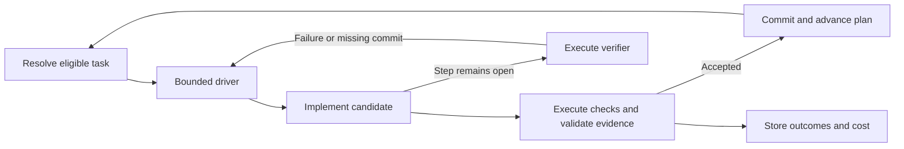

# Overgo

Overgo runs, trains, evaluates, and composes AI models in Go and CUDA.
Its browser workbench, command-line tools, and HTTP APIs share one execution
system and one artifact store.

The intent is recursive self-improvement (RSI): use measured outcomes to
improve both task capability and the process that proposes, executes, and
evaluates later work. Operators set goals, budgets, and constraints. Humans
or models propose changes; executable policy controls admission and activation.


[Editable SVG](docs/assets/overgo-platform-technical-architecture.svg) · [Figure definition](docs/assets/overgo_graphic.json)

## The improvement loop

Each iteration follows the same cycle:

1. **Propose** a falsifiable change and its expected benefit.
2. **Admit** it after checking dependencies, authority, and resource limits.
3. **Realize** the candidate through training, composition, or a code,
   recipe, data, or policy change.
4. **Evaluate** it on fixed tasks against a matched baseline, measuring
   quality and resource cost and using ablations to isolate its effect.
5. **Decide** whether to promote it, reject it, or request further work.
6. **Observe** outcomes and regressions, with quarantine and rollback when
   required.

The recursive step is the feedback into later iterations. Results can change
models and adapters, prompts and recipes, data and retrieval, routing, and
the policies used to plan, execute, and evaluate work. Rejected candidates
and failed runs remain part of that record.

Budgets, stop conditions, and recorded operator decisions bound the loop.
The [development plan](docs/plan.json) defines the current work.

## Current skill automation

[skill.md](skill.md) describes the intended behavior; deterministic Go code
implements its mechanically verifiable parts. Code resolves task eligibility,
runs checks, validates evidence, enforces budgets, and advances accepted work.
This reduces repeated agent reasoning and makes the same rules apply across
attempts. Agents contribute hypotheses and implementation changes; executable
contracts determine their admission and completion.



| Skill behavior | Deterministic implementation |
| --- | --- |
| Work on the next eligible task | [Plan dispatch](internal/plan/dispatch.go) resolves the task from plan state, role, and stored completion authority, returning structured data to the driver. |
| Verify requirements mechanically | The [gate pipeline](internal/gate/verification.go) executes scope, magic-number policy, architecture, formatting, build, acceptance, and applicable test checks. Check dependencies and recorded results determine whether execution can proceed. |
| Avoid repeated verification work | The same pipeline derives check selection from affected code and binds evidence to candidate inputs. It reuses eligible matching results and records executed, reused, and skipped checks separately. |
| Bound retries and preserve failures | [cmd/loop](cmd/loop/main.go) enforces worker timeouts. The [driver](internal/loop/driver.go) rereads plan state after each invocation, runs the verifier when the step stays open, and supplies concrete feedback for a bounded retry. Exhausted attempts become findings. |
| Respect budgets and operator stops | A published [strategy profile](internal/loop/strategy.go), selected by `strategy_id`, supplies retry, invocation, and saturation limits. The driver checks `docs/.loop_pause` and recorded plan stops between iterations. |
| Advance only accepted work | [Gate admission](internal/gate/admission.go) checks plan binding and change scope; the [commit path](internal/gate/commit.go) owns committing and plan advancement. A passing standalone verifier does not confer completion. |
| Retain feedback for improvement | [Attempt history](cmd/plan/history.go) aggregates stored outcomes, wall time, change churn, recovery counts, and strategy identities; repeated unsuccessful directions trigger computed pivot recommendations. |
| Continue with admitted proposals | When proposal intake is enabled and dispatch is complete, the driver consumes prepared JSON specs from `docs/proposals`. The plan command replays the cited candidate admission before adding the next task. |

The implementation direction is to move each repeatable, mechanically decidable
requirement into its existing code owner. Agent reasoning remains useful for
choosing hypotheses and designing changes. The next integration connects
observations and stored history to proposal generation inside the driver, with
code owning duplicate suppression, admission, budget accounting, and resumption.

## Capabilities

| Area | Implementation |
| --- | --- |
| Serving | Chat and text generation, embeddings, reranking, sequence scoring, streaming, constrained output, prompt caching, and live model switching |
| Media and structured data | Image generation, speech and transcription, video generation and editing, vision QA, time-series, and tabular execution paths |
| Model lifecycle | GGUF and safetensors intake, Hugging Face integration, conversion, quantization, inspection, model construction, adapters, and composition |
| Training | Token prediction, DPO, GRPO, host and CUDA execution, Muon optimization, and checkpoint/resume |
| Evaluation | Benchmark suites, reference comparisons, long-context checks, retrieval evaluation, ablations, and quality, throughput, and memory measurements |
| Agents and workflows | Registered tools, typed workflow graphs, authorization and receipts, scheduled jobs, remote peers, and recovery after interruption |

Architecture profiles bind model tensors to shared execution primitives for
dense, mixture-of-experts, recurrent, hybrid, encoder, diffusion, and
multimodal programs.

## Training and Muon

Training takes a model, data, objective, and budget. Overgo uses a shared Muon
optimizer for matrices, vectors, and scalars, including embeddings,
normalization parameters, and adapters. The training recipe binds the optimizer
policy; the trainer resolves its settings without per-model optimizer controls.

For each parameter group, Muon forms a Nesterov momentum direction, normalizes
it, and applies Newton–Schulz orthogonalization. For an $m\times n$ group,
the update scales the resulting direction by

$$
\eta_t\sqrt{\max(m,n)}\sqrt{1-\mu^2},
$$

where $\eta_t$ is the learning rate and $\mu$ is momentum. This compensates
for matrix dimensions and momentum in the update scale. Host and CUDA paths
use the same parameter-group and portable-state contracts.

The [built-in policy](internal/trainingprogram/optimizer_policy.json) uses a
constant learning rate of $P^{-1/2}$, where $P$ is the parameter count passed
to the policy, and derives momentum as $(N-1)/(N+1)$ from its declared
effective-sample horizon $N=30$. These policy choices are recorded with the
recipe and resolved optimizer state.

Checkpoints retain model and recipe identity, optimizer progress and momentum,
random state, and data-stream position. Resume checks these bindings before
continuing. See the [optimizer implementation](internal/optimizer/optimizer.go)
and [training compatibility](docs/TRAINING_COMPATIBILITY.md) for execution details.

## Recipes and durable state

A **recipe** binds an exact model and task to its components and execution
policy. Validation and activation are separate steps; serving resolves an
active recipe for the requested capability. The workbench derives its
available modes from these declarations.

**OvergoDB** records content identities, lineage, recipes, runs, tool receipts,
measurements, decisions, checkpoints, and active versions. Its journal,
snapshots, and backup and recovery tools preserve the state needed to compare
attempts, resume work, and restore a predecessor.

Agent tools use registered, typed manuals that declare their arguments,
effects, and transport. Mutation authorization includes prior inspection,
applicable approvals, and a durable receipt before execution. Human-directed
work, agents, and automation use the same backend controls.

## Workbench and APIs

The server embeds a browser workbench with no separate client build step.
Its controls come from the server's capability declarations and active recipes,
so the page reflects the model and services currently available.

| Workspace | What you can do |
| --- | --- |
| Chat and Generate | Switch models, resume conversations, attach media, and run the image, video, speech, or other generation modes declared by active recipes |
| Library and Datasets | Search and download from Hugging Face, register and validate local models, declare hosted providers, and inspect registered datasets |
| Train and Runs | Start recipe-bound training, inspect progress and run records, and review the session's measurements and checkpoints |
| Evaluations | Run registered suites and compare recorded quality and resource results |
| Agent and Automations | Work with agent sessions, registered tools, approvals, schedules, and execution history |
| Runtime and Activity | Inspect running operations, resource state, and terminal outcomes, and cancel operations that expose cancellation |
| Model analysis | Inspect model properties, vocabulary, logits, hidden states, attention, and tensors through the available analysis controls |
| Recipes and Artifacts | Inspect recipe definitions, compositions, stored outputs, and their lineage |

Conversations and operation records live on the server. Reloading the page
reattaches to retained state, and generated outputs remain linked to the runs
that produced them. Human direction, agent actions, and automation use the same
backend admission and recording paths.

Local models and declared remote providers appear in the model catalog.
Remote providers use a hosted chat relay; local models run through the
Go and CUDA runtime. The model picker switches the served model through the
swap proxy, and the composer updates to its declared capabilities.

Training and model construction are enabled on the direct server with
`-training` and `-model-builder`, respectively, and require their registered
inputs and recipes. Evaluation uses the store's benchmark catalog or explicit
suite files and binds results to a source commit. Unavailable controls show
their reason in the workbench.

HTTP interfaces include native routes and OpenAI- and Anthropic-compatible
surfaces. The [API manifest](docs/API_MANIFEST.md) lists commands, routes,
authentication requirements, and document contracts.

## Quick start

The current runtime target is Windows amd64 with Go 1.26 and an NVIDIA CUDA
driver. Bundled kernels target compute capability 8.9 or newer; see the
[kernel documentation](kernels/README.md) for build details.

From the repository directory, launch the workbench:

```powershell
.\overgo_gui.bat
```

The launcher builds the server and model-swap proxy, opens the browser, and
lets you select a model from the catalog. Use the Library to register local
models or declare a remote provider.

To launch with a supported GGUF model:

```powershell
.\overgo_gui.bat "D:\models\model.gguf"
```

Or run the server directly:

```powershell
go run ./cmd/server -listen 127.0.0.1:8080 D:/models/model.gguf
```

Open [the workbench](http://127.0.0.1:8080/). The server binds to loopback by
default. Authentication and network configuration are described in the
[security policy](SECURITY.md).

## Verification

Run the compatibility check and hermetic test lane:

```powershell
go run ./cmd/compatibility -check
go run ./cmd/test-lane ./...
```

Device, installed-model, race, and browser checks have separate lanes:
`cmd/device-lane`, `cmd/smoke-lane`, `cmd/race-lane`, and `cmd/webui-lane`.

Repository changes use the plan and commit gate to select checks, record
results, and advance work. See the [development workflow](skill.md).

## Technical references

- [API manifest](docs/API_MANIFEST.md) — commands, routes, and typed contracts
- [Benchmark report](docs/BENCHMARK.md) — evaluation and performance results
- [Model catalog](docs/model_compatibility.json) — prototypes and model-specific records
- [Media report](docs/MEDIA_REPORT.md) — media recipes, runs, and outputs
- [Training compatibility](docs/TRAINING_COMPATIBILITY.md) — training paths and recorded runs
- [Compatibility matrix](docs/COMPATIBILITY.md) — features and their verification references
- [Development plan](docs/plan.json) — current work and completion checks
- [License](LICENSE) and [software bill of materials](SBOM.cdx.json)

Current release: **v0.1.1**.
