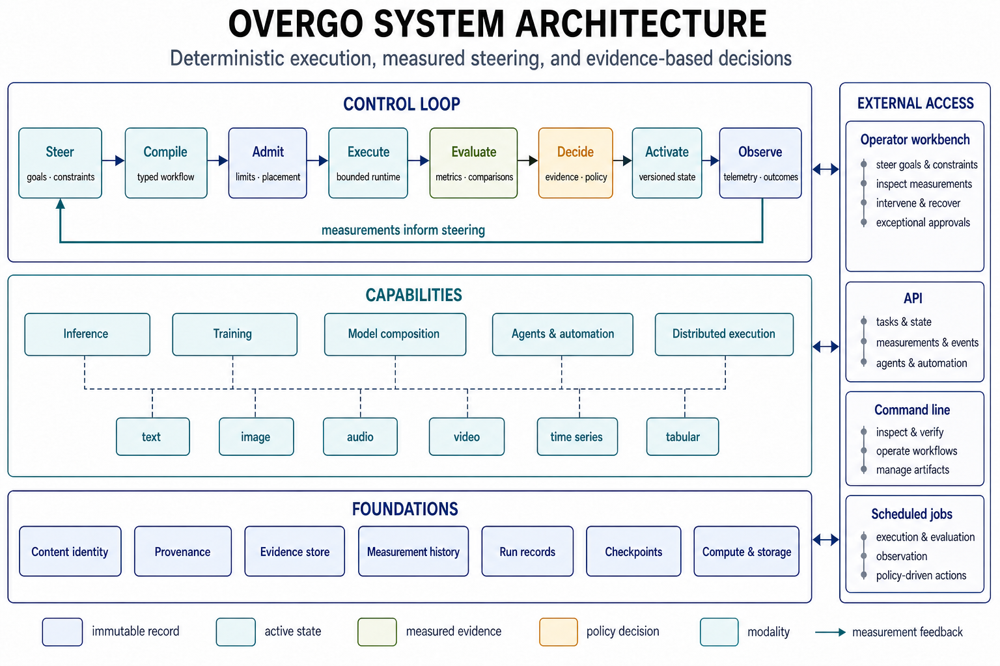

# Overgo

Overgo is an experimental systems platform for reliable recursive
self-improvement (RSI) of model-driven software agents.

It has two permanent uses:

- provide the deterministic framework needed to build and study RSI;
- expose the same model, agent, training, evaluation, and automation framework
  to people for useful work through the operator workbench, APIs, and command
  line.

The central design rule is that model cognition proposes work while
deterministic code controls state, authority, execution, verification, and
recovery. A model may interpret a problem or generate a candidate patch, but
acceptance still depends on measured evidence and executable policy.

An operator can steer the framework by supplying goals, constraints,
priorities, and decisions about what to investigate next. The graphical
workbench is an external interface for steering and observation; it is not the
RSI controller. The RSI path adds model-directed steering from durable
measurements and state alongside human-directed work. Both paths use the same
deterministic control plane to admit, evaluate, activate, reject, or recover
work.

Overgo is not a complete RSI system. It currently provides much of the model,
agent, automation, and evidence infrastructure required to build and study one.



[Structured figure definition](docs/assets/overgo_graphic.json)

## Objectives

Reliable RSI requires more than repeatedly asking a model to modify its own
code. The surrounding system must make each attempt reproducible, bounded, and
falsifiable. Human-directed use needs the same properties so useful work can be
inspected, resumed, compared, and trusted.

```text
steering: operator or model
      -> typed task and bounded context
      -> deterministic admission and execution
      -> independent tests and evaluations
      -> evidence-and-policy decision
      -> activate, reject, or roll back
      -> durable measurements and state
      -> next steering proposal
```

The same mechanism must also evaluate changes to the automation itself. An
improved prompt, planning policy, retrieval method, gate selector, or repair
strategy is only an improvement when repeated measurements show a better
result under the same constraints.

## What exists

Overgo already combines the following components in one codebase:

| Area | Current implementation |
| --- | --- |
| Model execution | Shared Go and CUDA execution for dense, mixture-of-experts, recurrent, hybrid, encoder, diffusion, and multimodal programs |
| Modalities | Text, image, audio, video, time-series, and tabular input or output paths |
| Model lifecycle | GGUF and safetensors intake, conversion, quantization, model construction, training, evaluation, serving, and rollback |
| Agent definitions | Immutable bindings among prompts, model configurations, tools, datasets, automations, and policies |
| Workflow control | Typed dependency graphs, bounded admission, resource placement, scheduled execution, restart recovery, and remote peers |
| Mutation safety | Exact tool identity, persistent executable policy, inspection before mutation, argument-bound approval, and a durable receipt before a side effect |
| Reproducibility | Content identities, provenance, run records, stage receipts, checkpoints, exact resume checks, and versioned activation |
| Verification | Plan-driven gates with manifest-derived check selection, structural source analysis, host/device comparisons, model-specific evidence, and compatibility records |
| Benchmarks and evaluation | Store-derived benchmark catalogs, native lm_eval-family suites, per-model prompt templates, domain-routed evaluation, and measured capability claims |
| Human-directed work | External workbench for goals, chat and media, agent sessions, model and data operations, measurement review, intervention, and rollback |
| RSI steering | Bounded steering interface shared with human-directed work; model-directed selection from accumulated evidence remains incomplete |
| Interfaces | Command line, HTTP APIs, scheduled jobs, and an external operator workbench over shared backend state |

## Operator workbench

The graphical workbench is the human interface to the same control plane the
automation uses. It is a self-contained browser client embedded in the server
binary: `cmd/server` serves it at the listen address under a same-origin
content-security policy, with no external assets or build step. The browser
projects backend records and submits bounded actions; it does not own
execution state or participate in the autonomous decision loop. Every panel
reads the same store the command line and the automation read, so a result
shown in the workbench is the same durable record a gate or a script would
see.

### Surfaces

- **Chat and media.** Multimodal conversation against the served model:
  text, image, and audio attachments flow through the same bounded media
  policy the APIs enforce, projected media and token counts survive in
  earlier turns of the formatted history, and conversations continue across
  server restarts because the interaction record — not the browser — owns
  the state. Dedicated image, video, and speech generation workspaces drive
  the corresponding model recipes.
- **Agent sessions.** Agent definitions bind a prompt, model configuration,
  tools, and policies immutably; sessions execute with native tool calling
  against the typed tool catalog. Layered authority maps bound what each
  session may touch, and every past interaction replays from its durable
  record for inspection.
- **Approvals inbox.** Exceptional mutations — actions outside a session's
  standing authority — queue as argument-bound approval requests. The
  operator sees the exact tool identity and arguments that will run; a
  durable receipt precedes the side effect, and nothing executes on a stale
  approval.
- **Models and data.** The model catalog is derived from the store: every
  locally present model with its active recipe, verified capability tier,
  and measured evidence — benchmark throughput and evaluation scores appear
  beside each entry in the picker, so choosing a model is choosing from
  evidence rather than filenames. Dataset browsing reads the active catalog
  without payload access, and the model builder and recipe inspector expose
  construction and activation records.
- **Analysis.** Structure, tensor, attention, logit, hidden-state, and
  vocabulary inspectors over the loaded artifact. The attention view replays
  bounded plain-causal attention on the host and refuses compiled score
  policies it cannot reproduce exactly — the displayed weights are recomputed
  evidence, not a screenshot of runtime state.
- **Training.** Session-supervised training: a session is leased, observed,
  and recorded; the observer captures a pre-training evaluation bracket on
  admission and publishes the post-training deltas on finish, so every
  session's measured effect is attributed to it in the store.
- **Evaluation.** Suites derive from the benchmark catalog in the store —
  no suite files — and route by each model's declared evaluation domains,
  so a DNA model never meets English multiple choice. Results publish back
  through the campaign ledger and reappear as the evidence beside the model
  in the picker.
- **Workflows and runtime.** Typed workflow graphs with bounded admission,
  scheduled jobs, run browsing over the store's phased run records, media
  compositions, live runtime activity, and remote peers for distributed
  execution.
- **Artifacts and provenance.** The artifact gallery and the provenance
  records behind every displayed result, down to the content identities a
  claim cites.

### Usage

Launch the server with a model (see Quick start) and open the listen
address; the workbench is the default page. A typical serving session:
pick a model in the catalog — the evidence line under each entry shows its
measured throughput and evaluation scores — then chat, attach media, or
open a generation workspace. A typical measurement session: open the
evaluation workspace, run the store-derived suites for the served model,
and watch the results land in the picker as published evidence. A typical
training session: start a supervised session from the training workspace
and read its bracket when it finishes — the pre/post deltas are the
session's measured effect, not an impression.

Interventions follow the same shape everywhere: inspect the record first,
act through a bounded control, and find the durable receipt in the store
afterward. Steering from the workbench — goals, priorities, interventions,
approvals, rollback — enters through the same bounded interface the RSI
path uses. Nothing is reachable from the browser that is not equally
reachable, and equally checked, from the deterministic control plane.

## Current state

The deterministic harness is substantially implemented, but evidence maturity
varies by capability.

| Requirement | State |
| --- | --- |
| Exact identities for code, models, data, tools, policies, and runs | Implemented |
| Bounded and recoverable workflow execution | Implemented |
| Durable authorization and mutation receipts | Implemented |
| Independent host, CUDA, integration, and model verification lanes | Implemented; artifact coverage varies |
| Verification derived from exact code manifests, fail-closed on unproven independence | Implemented |
| Exact training checkpoints and fail-closed resume | Implemented for supported training paths |
| Agent and automation lifecycle management | Implemented |
| Measurement of automation effectiveness | Partial |
| Durable cross-run measurement history for steering | Partial |
| Controlled comparison of competing automation strategies | Not complete |
| Evidence-gated promotion of automation policies | Not complete |
| Model-proposed steering from accumulated evidence | Not complete |
| Closed recursive policy-improvement loop | Not complete |

Architecture support and artifact verification are separate claims. Shared
components can express more model types than are installed and tested on the
current hardware. Compatibility records therefore identify the exact artifact,
configuration, environment, and verification command behind each claim.

## What remains before RSI

### 1. Close the harness

- Keep one deterministic authority for planning, execution, policy decisions,
  evidence, and recovery.
- Bound retrieval construction and search as well as request execution.
- Maintain mutation tests for the automation itself.
- Finish race, restart, browser, device, and release verification across the
  integrated agent and automation paths.

Verification is now derived from exact code manifests: the gate selects checks
from the symbol-level delta of the candidate snapshot, proves each exclusion
against declared ownership, and runs by default when independence cannot be
proven. A false-negative corpus pins the selector's boundaries, and the same
manifest authority projects bounded planning context to agents.

### 2. Measure the automation

Every attempt needs an exact identity for its model, prompt, context,
retrieval, tools, strategy, source state, resource budget, and expected result.
The durable evidence store must compare prediction with outcome: defects
found, tests added, regressions introduced, code removed, coverage changed,
elapsed time, and compute used. Measurements must remain queryable across runs,
strategies, and code revisions rather than existing only as logs.

### 3. Run controlled strategy experiments

Competing strategies should operate in isolated worktrees against the same
task and baseline. Independent evaluations should select among the candidates.
Failures and counterexamples must remain durable inputs so later attempts do
not repeat known mistakes.

### 4. Promote better policies

Planning, retrieval, repair, verification, and stopping policies need a staged
lifecycle: declared, experimentally useful, repeatedly verified, and active.
Promotion must reference measured evidence and retain a rollback target.

### 5. Add autonomous steering and close the recursive loop

Human steering remains a supported operating mode. Autonomous RSI adds a model
as another steering source only when the measurement history can support
comparable retrieval, predicted benefit and cost, explicit uncertainty, and a
falsifiable next experiment. Human and model steering submit goals and
constraints through the same bounded interface; deterministic policy retains
admission, evaluation, activation, rollback, resource budgets, saturation
detection, and stop conditions.

## Scope

Overgo includes a broad model-engineering runtime because an RSI harness must
be able to execute and evaluate the systems it changes. The same inference,
training, evaluation, multimodal processing, agent, automation, and distributed
execution capabilities are also exposed for direct human use. These are two
consumers of one control and evidence system, not separate platforms.

The current host target is Windows amd64 with Go 1.26 and an NVIDIA CUDA
driver. The runtime uses the Windows ABI without cgo. Public interfaces may
change while the control and evidence model is tightened.

Current release designation: **v0.1.1**.

## Quick start

Requirements:

- Windows amd64
- Go 1.26
- NVIDIA CUDA driver
- A model artifact supported by an available configuration

Start the operator workbench:

```bat
overgo_gui.bat "D:\models\model.gguf"
```

Or start the server directly:

```bash
go run ./cmd/server -listen 127.0.0.1:8080 D:/models/model.gguf
```

Open `http://127.0.0.1:8080/`.

Run the hermetic verification lane:

```bash
go run ./cmd/compatibility -check
go run ./cmd/test-lane ./...
```

Real-device and installed-model checks are separate:

```bash
go run ./cmd/device-lane
go run ./cmd/smoke-lane
go run ./cmd/race-lane
```

An unavailable model or device is not counted as a successful verification.

## References

- [Model prototypes with verified models, nested](docs/model_compatibility.json) —
  structured JSON: each specific model's inference and training verification
  summaries inside the prototype it belongs to; regenerate with
  `go run ./cmd/compatibility -update-models`
- [Compatibility and verified capabilities](docs/COMPATIBILITY.md)
- [Training compatibility](docs/TRAINING_COMPATIBILITY.md)
- [Machine-readable compatibility data](compatibility.json)
- [Current development plan](docs/plan.json)
- [Development and verification doctrine](skill.md)
- [Software bill of materials](SBOM.cdx.json)

Completed development history is retained in Git. The active plan is intended
to contain future work and verification requirements rather than duplicate the
commit history.
