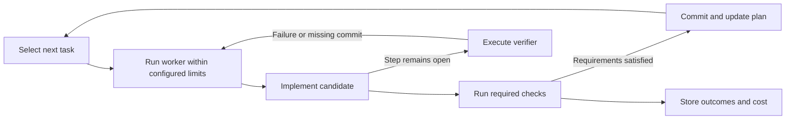

# Overgo

Overgo runs, trains, evaluates, and composes AI models in Go and CUDA.
Its browser workbench, command-line tools, and HTTP APIs share one execution
system and one artifact store.

Overgo improves task capability, robustness, and efficiency through recursive 
self-improvement (RSI). It uses measured outcomes to improve models and the 
processes that propose, execute, and evaluate changes. Operators set goals, 
budgets, and constraints; code checks proposals and controls activation.

Overgo is implemented through its own improvement loop. The
[development plan](docs/plan.json) selects each task, agents implement it,
and the [gate](internal/gate/verification.go) verifies the change against
the task's acceptance and commits it with its plan binding recorded in the
commit trailers; no change reaches master by another route.

Overgo was built from [llama.cpp](https://github.com/ggml-org/llama.cpp),
audio.cpp, and
[Hugging Face Transformers](https://github.com/huggingface/transformers) as
verified reference implementations. Their model-specific code paths were
replaced by common inference and training components in Go and CUDA; a
recipe declares each model's architecture, tensors, and execution policy,
and the components read those declarations, so no model has its own code
path.


[Editable SVG](docs/assets/overgo-platform-technical-architecture.svg) · [Figure definition](docs/assets/overgo_graphic.json)

## The improvement loop

1. **Propose** a change, its expected benefit, and a test of that expectation.
2. **Admit** it after checking dependencies, permissions, and resource limits.
3. **Realize** the change through training, composition, or a code,
   recipe, data, or policy change.
4. **Evaluate** it on fixed tasks against a matched baseline, measuring
   quality and resource cost and using ablations to isolate its effect.
5. **Decide** whether to promote it, reject it, or request further work.
6. **Observe** outcomes, detect regressions, and quarantine or roll back
   changes when required.

Use successful, rejected, and failed attempts to identify the next improvement
in models, data, prompts, routing, or the improvement process itself. Derive
implementation values, justify data and geometry assumptions, and adapt execution
to available RAM, VRAM, CPU, and GPU resources. The [development plan](docs/plan.json)
defines current work; operator budgets and stop conditions limit execution.

## Current skill automation

[skill.md](skill.md) defines development goals and practices. Go code selects
tasks, checks changes, reuses valid results, limits retries, and records completion.
Agents propose and implement changes; code verifies the task requirements before
committing changes and updating the plan.



| Skill behavior | Deterministic implementation |
| --- | --- |
| Select tasks | [Plan selection](internal/plan/dispatch.go) uses plan state, worker role, and recorded completion results. |
| Verify and commit | The [gate](internal/gate/verification.go) checks change scope, implementation rules, build results, and task acceptance. It commits changes and updates the plan after required checks succeed. |
| Reuse results | Verification selects affected checks and preserves eligible package results across failures and restarts. It checks input identities and records executed, reused, and skipped checks separately. |
| Control execution | [cmd/loop](cmd/loop/main.go) enforces worker timeouts, supplies verification feedback, and records exhausted attempts. The [strategy configuration](internal/loop/strategy.go) sets attempt and invocation limits; the loop checks operator stops between iterations. |
| Summarize outcomes | [Attempt history](cmd/plan/history.go) reports outcomes, elapsed time, changes, and recoveries, and identifies repeated unsuccessful approaches. |
| Add prepared proposals | When enabled and no task remains, the loop reads `docs/proposals`. The [plan command](cmd/plan/history.go) repeats candidate validation against the stored decision before adding a task. |

The next step is to generate proposals from recorded outcomes. Code should
check duplicates, validate proposals, track budgets, and resume interrupted work.

## Capabilities

| Area | Implementation |
| --- | --- |
| Serving | Chat and text generation, embeddings, reranking, sequence scoring, streaming, constrained output, prompt caching, and live model switching |
| Media and structured data | Image generation, speech and transcription, video generation and editing, vision QA, time-series, and tabular execution paths |
| Model lifecycle | GGUF and safetensors intake, Hugging Face integration, conversion, quantization, inspection, model construction, adapters, and composition |
| Training | Token prediction, DPO, GRPO, host and CUDA execution, Muon optimization, and checkpoint/resume |
| Evaluation | Benchmark suites, reference comparisons, long-context checks, retrieval evaluation, ablations, and quality, throughput, and memory measurements |
| Agents and workflows | Registered tools, typed workflow graphs, authorization and receipts, scheduled jobs, remote peers, and recovery after interruption |

Architecture profiles map model tensors to shared operations for
dense, mixture-of-experts, recurrent, hybrid, encoder, diffusion, and
multimodal programs.

The resident diffusion sampler keeps intermediate state and updates on the GPU.
Evaluation retains responses and their original protocols so scoring repairs can
reuse compatible results. Reference-specific scorers implement IFEval instruction
checks and MuSR/BBH likelihood normalization.

## Training and Muon

Overgo uses one Muon optimizer for matrices, vectors, and scalars, including
embeddings, normalization parameters, and adapters. **The shared optimizer policy
requires no model-specific hyperparameter tuning.** The trainer derives settings
from the recipe's policy and parameter dimensions.

The [built-in policy](internal/trainingprogram/optimizer_policy.json) sets:

- **Learning rate:** $\eta=P^{-1/2}$, where $P$ is the parameter count supplied
  to the policy. The rate stays constant across training steps.
- **Momentum:** $\mu=(N-1)/(N+1)=29/31\approx0.9355$, using the shared effective
  sample count $N=30$, based on rule of thumb from Cochran’s confidence-interval
  criterion.
- **Update scale:** $\eta\sqrt{\max(m,n)}\sqrt{1-\mu^2}$ for each $m\times n$
  parameter group.

Muon combines the current gradient with momentum, normalizes the Nesterov
direction, and applies Newton–Schulz orthogonalization before scaling the update.
The recipe identifies the optimizer policy; optimizer state retains the resolved
settings, update count, and momentum for resume.

Hybrid training keeps matrix gradients in GPU optimizer buffers and reuses
forward-pass caches. Its continuation API preserves momentum and update progress
between training calls; callers manage model, dataset, and random-state persistence.
See the [implementation](internal/hostoptimizer/optimizer.go) and
[training compatibility](docs/TRAINING_COMPATIBILITY.md) for backend and checkpoint details.

## Recipes and durable state

A **recipe** specifies the model, task, components, and execution policy.
The runtime validates recipes before activation and uses active recipes to
determine available capabilities.

**OvergoDB** stores artifacts, recipes, runs, measurements, decisions, checkpoints,
and active versions. Content identities and lineage connect results to their
inputs. Journaling, snapshots, and recovery tools support comparison, resume,
and rollback.

Registered tools declare their arguments, effects, and transport. Shared backend
controls check prior inspection and required approvals, and record authorization
before executing mutations.

## Agent tool calling

Overgo agents call tools the way the Universal Tool Calling Protocol
(UTCP) prescribes: a tool is described by a manual, and the caller invokes
the tool's native endpoint from that manual directly, with no wrapper
server between the agent and the tool.

- A [manual](internal/agenttool/manual.go) declares the tool name, its
  description, its effect class (inspection reads state; mutation changes
  it), its typed arguments, and its transport binding: an in-process Go
  function, a strict-JSON HTTP endpoint, a fixed program with argument
  words and no shell, one exact MCP tool over HTTP JSON-RPC, or a sequenced
  JSON stream over one HTTP response.
- Manuals are published to the artifact store under registered aliases by
  [cmd/agent-tool](cmd/agent-tool/main.go). Orchestration resolves tools
  from the store, never from code alone, and an unregistered tool is not
  callable. Remote peers and recipe capabilities derive their manuals from
  their published capability identities.
- The [agent loop](internal/agentloop/coordinator.go) admits every step:
  an unregistered tool is refused, a mutation must follow a completed
  inspection and carry an exact approval, a mutation records a durable
  receipt before it executes, and a session cannot step without a bound.
  Each step is one durable interaction chained on the previous one.
- The serving executor refuses loopback, private, and link-local
  destinations and redirects at dial time; the operator executor admits
  private destinations.
- The workbench exposes the same authority through `/agent/tools`,
  `/agent/step`, `/agent/approval`, `/agent/provenance`, and
  `/agent/sessions`, and the Agent tab shows effect classes, mutation
  approvals, and the step timeline.

## Workbench and APIs

The server embeds the browser workbench; it requires no separate client build.
Active recipes and server capability declarations determine available controls.

| Workspace | What you can do |
| --- | --- |
| Chat and Generate | Switch models, resume conversations, attach media, and use generation modes supported by active recipes |
| Library and Datasets | Download from Hugging Face, register local models or hosted providers, validate models, and inspect datasets |
| Train and Runs | Start training from recipes and inspect progress, measurements, and checkpoints |
| Evaluations | Run registered suites and compare recorded quality and resource results |
| Agent and Automations | Manage agent sessions, tools, approvals, schedules, and execution history |
| Runtime and Activity | Inspect operations, resources, and outcomes; cancel supported operations |
| Model analysis | Inspect supported model properties, vocabulary, logits, hidden states, attention, and tensors |
| Recipes and Artifacts | Inspect recipes, compositions, outputs, and lineage |

The server retains conversations and operation records across page reloads and
links outputs to their runs. The model picker switches local models through the
swap proxy; remote providers use a hosted chat relay. The workbench refreshes
controls for the selected model and explains unavailable functions.

Enable training and model construction with `-training` and `-model-builder`,
on the direct server or on the swap proxy, which forwards the declaration to
every served child so a model swap keeps the tabs. Both require registered
inputs and recipes. Evaluation uses the benchmark catalog or explicit suite
files and records the source commit; the Evaluations tab appears whenever the
launch opened that workspace.

The server provides native, OpenAI-compatible, and Anthropic-compatible APIs.
The [API manifest](docs/api_manifest.json) lists commands, routes, authentication
requirements, and document formats.

## Quick start

The current runtime target is Windows amd64 with Go 1.26 and an NVIDIA CUDA
driver. Bundled kernels target compute capability 8.9 or newer; see the
[kernel documentation](kernels/README.md) for build details.

From the repository directory, launch the workbench:

```powershell
.\overgo_gui.bat
```

The launcher builds the server and model-swap proxy, opens the browser, and
lets you select a model from the catalog. Use the Library to register local
models or declare a remote provider.

To launch with a supported GGUF model:

```powershell
.\overgo_gui.bat "D:\models\model.gguf"
```

Arguments after the model reach every served child; `.\overgo_gui.bat ""
-training -model-builder` opens the Train and Model Builder tabs without a
default model.

Or run the server directly:

```powershell
go run ./cmd/server -listen 127.0.0.1:8080 D:/models/model.gguf
```

Open [the workbench](http://127.0.0.1:8080/). The server binds to loopback by
default. See the [security policy](SECURITY.md) for authentication and network settings.

## Verification

Run the compatibility check and hermetic test lane:

```powershell
go run ./cmd/compatibility -check
go run ./cmd/test-lane ./...
```

Device, installed-model, race, and browser checks have separate lanes:
`cmd/device-lane`, `cmd/smoke-lane`, `cmd/race-lane`, and `cmd/webui-lane`.

The commit gate stops new tests in a failed package and preserves eligible
independent results for retries. It runs document checks for ordinary README,
skill, and top-level documentation edits, and checks dependent code for embedded
documents and declared runtime inputs. Plan changes retain their required
validation. See the [development workflow](skill.md).

## Technical references

- [API manifest](docs/api_manifest.json) — commands, routes, and typed contracts
- [Benchmark report](docs/BENCHMARK.md) — evaluation and performance results
- [Model catalog](docs/model_compatibility.json) — prototypes and model-specific records
- [Media report](docs/MEDIA_REPORT.md) — media recipes, runs, and outputs
- [Training compatibility](docs/TRAINING_COMPATIBILITY.md) — training paths and recorded runs
- [Compatibility matrix](docs/COMPATIBILITY.md) — features and their verification references
- [Development plan](docs/plan.json) — current work and completion checks
- [License](LICENSE) and [software bill of materials](SBOM.cdx.json)

Current release: **v0.1.1**.
