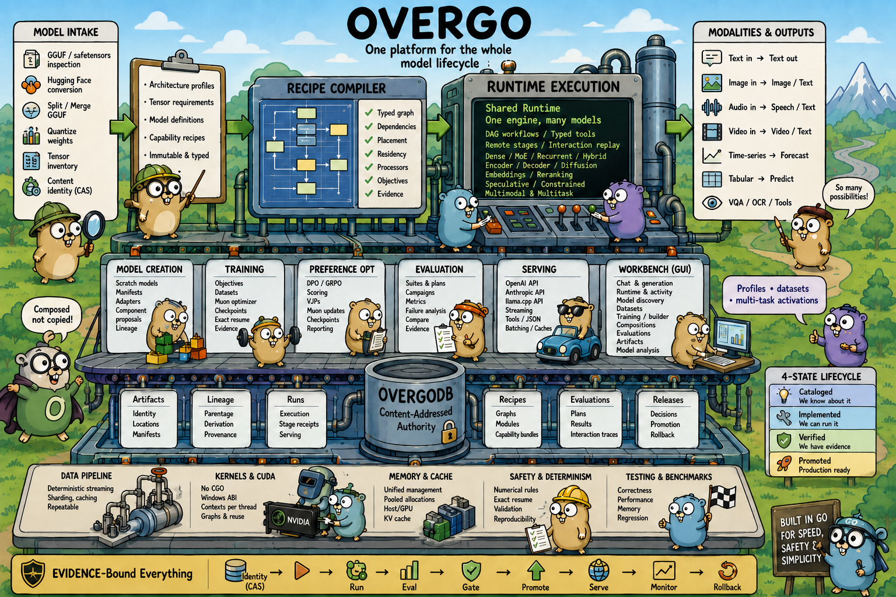

# Overgo

Overgo is a Go runtime and workbench for running, building, training,
evaluating, and serving models on consumer NVIDIA hardware. It handles text,
images, audio, video, time series, and tables in one system.

Model names do not own execution. Architecture profiles describe tensor layouts
and numerical rules. Typed recipes bind a profile and exact content-addressed
artifacts to reusable operators, processors, training objectives, device
placement, memory lifetime, and evidence. The runtime compiles those records
into host and CUDA programs.

That runtime also backs the command line, the workbench, native training and
evaluation, and OpenAI-, Anthropic-, and llama.cpp-compatible APIs. RepoDB
records artifact identity, lineage, runs, verification, promotion, and
rollback. The repository therefore keeps four different facts separate: a
model can be listed in the catalog, supported by the code, verified with a
specific artifact, or approved for production.

The code ports selected formats, numerical rules, quantization behavior, and
kernel ideas from llama.cpp. The larger design is different. Overgo adds a
recipe compiler, shared execution for several input and output types, native
training, compiled evaluation campaigns, model construction, recorded release
decisions, and a GUI that covers the complete workflow.

**Current host:** Windows amd64, Go 1.26, NVIDIA CUDA driver,
`CGO_ENABLED=0`. `github.com/dlclark/regexp2/v2` is the sole third-party Go
runtime dependency. Public interfaces may change while the platform is under
active development.

**Release:** v0.1.1

## 1. What Overgo is

Overgo puts these jobs behind one runtime:

| Area | Capabilities |
| --- | --- |
| Model intake | Inspect GGUF and safetensors, convert Hugging Face repositories, split and merge GGUF files, quantize weights, inventory tensors, and assign content identity |
| Model definition | Bind immutable architecture profiles, tensor requirements, model definitions, and capability recipes |
| Model execution | Run dense, MoE, recurrent, hybrid, encoder, encoder-decoder, diffusion, embedding, reranking, speculative, and constrained-generation programs |
| Modalities | Process text, image, audio, and video inputs; generate text, images, video, and speech; forecast series; predict tabular values; run VQA and OCR workflows |
| Model creation | Construct deterministic scratch models, initialize parameter manifests, build adapters, propose components, and preserve derived-model lineage |
| Training | Compile objectives, stream datasets, execute Muon updates on host or CUDA, checkpoint, resume exactly, and record training evidence |
| Preference optimization | Run DPO and GRPO with shared scoring, VJPs, Muon updates, checkpoints, evaluation, and GUI reporting |
| Model composition | Compile promoted cross-model representation bridges, external cross-attention, device-resident component sessions, immutable transformed-representation caches, and exact-lineage offline artifacts |
| Evaluation | Compile suites, run campaigns, inspect failures, compare metrics, and bind results to model, recipe, data, code, and environment identities |
| Serving | Expose native llama.cpp-style, OpenAI-compatible, and Anthropic-compatible HTTP APIs with streaming, tools, structured output, media, batching, and caches |
| Workbench | Use one embedded GUI for chat, generation, runtime telemetry, datasets, training, model building, export, evaluations, artifacts, and model analysis |
| Evidence | Record artifact identities, lineage, runs, recipes, gates, evaluations, promotion, rollback, and release checks in RepoDB and generated compatibility records |

A new model name does not require a new top-level executor. If the model's
tensor layout and behavior fit existing profiles, operators, processors, and
recipe modules, it reuses the same compiled paths. Model-specific code is only
needed for a new tensor convention, operator, processor, codec, numerical rule,
or execution topology.

Overgo tracks code support and artifact verification as different claims:

- **Implemented** means tested shared components and a valid recipe can express
  and execute the behavior.
- **Verified** means exact model bytes passed a named check with a fixed recipe,
  inputs, environment, and expected result.

Generic component tests establish the first claim. RepoDB records the second
claim for each artifact.



## 2. How Overgo works

### Shared components instead of model-family executors

Model behavior is split among reusable packages:

- Architecture profiles define dimensions, tensor layout, attention,
  recurrence, experts, normalization, position encoding, and operator rules.
- Tensor and graph packages describe computation without depending on model
  names.
- Host operators provide numerical references. CUDA operators run compiled
  inference and training graphs.
- Processors, projectors, tokenizers, schedulers, and codecs convert typed
  inputs and outputs.
- Training programs specify objectives, backward traversal, parameter groups,
  and optimizer order.
- Runtime adapters connect compiled recipe modules to their implementations.
- RepoDB stores identity, lineage, evidence, and activation decisions.

Execution consumes a compiled plan. It does not enter a model-family switch to
reconstruct model behavior at run time.

### Profiles, definitions, and recipes

A runnable task is assembled from immutable records:

1. **Model artifact:** content-hashed model bytes and known locations.
2. **Architecture profile:** model structure and operator policy with fact
   provenance.
3. **Model definition:** the exact model, profile, tensor inventory,
   dimensions, and validated tensor facts.
4. **Capability recipe:** typed modules for one task, including dependencies,
   inputs, outputs, ordering, placement, session lifetime, and residency.
5. **Compiled program:** validated stages and indexed bindings consumed by the
   runtime.
6. **Run and evaluation records:** exact inputs, outputs, environment, outcome,
   and evidence associated with execution.

The compiler rejects unknown modules, bad ordering, incompatible data kinds,
unbound ports, wrong cardinality, graph cycles, unreachable nodes, missing
dependencies, and conflicts in device placement or memory lifetime.

### Execution and evidence loop

```text
model bytes + tensor facts + architecture profile
                         |
                         v
               typed capability recipe
                         |
                         v
                  compiled program
                         |
                         v
          reusable host/device model session
                         |
                         v
             shared Go and CUDA operators
                         |
                         v
          output artifacts + run observations
                         |
                         v
            evaluation + gate + decision
                         |
                         v
              promoted active recipe
```

Inference and production commands resolve the active recipe from the model
artifact's content hash. Command flags cannot silently choose another memory
mode or model-family path. Activation requires successful evidence for the
exact model and recipe identities. A change to model bytes, tensor facts,
profiles, or recipe content creates a new identity and needs new evidence.

RepoDB can retain several candidates for the same model and task. Production
entry points use only the promoted active recipe. Missing evidence is an error,
not permission to fall back to another execution path.

Composition follows the same rule. Runtime entry points resolve an active
source-model, target-model, and task binding from RepoDB, then compile the
bridge, boundaries, component sessions, placement, lifetimes, cache identity,
training policy, and promotion evidence into one immutable execution plan.

## 3. System architecture

### Typed execution runtime

Recipes are executable data. A versioned recipe names one task, its artifact
dependencies, typed modules, host or device placement, ports, ordered edges,
inputs, outputs, memory policy, and session lifetime.

Supported task classes include inference, token generation, embedding,
reranking, projection, training, forecasting, tabular prediction,
sequence-to-sequence generation, speech synthesis, image generation, video
generation, VQA, and cross-model representation composition.

Opening a model builds one indexed weight catalog. Compiled requirement schemas
check allowed shapes, storage, and relations between tensors. Layer programs
carry indexed bindings, so execution does not search tensor names or reapply
family rules on every call.

### Host and CUDA execution

The runtime uses no cgo. It loads installed NVIDIA DLLs through the Windows ABI
and keeps each CUDA driver context on a worker locked to one operating-system
thread. Go memory stays pinned while its address crosses a DLL boundary. Device
copies are checked against live driver allocations.

Compiled graphs reuse checked topology, BLAS selection, memory-arena plans,
indexed operands, fusion descriptors, and replay state. The CUDA and PTX files
listed in the kernel manifest are the only non-Go runtime components kept in
the repository.

Preloaded decoding keeps weights, KV state, recurrent state, and graph outputs
on the GPU. Only sampling inputs return to Go. When a recipe allows it, media
sessions keep branch graphs, conditioning, prefix KV, hidden state, and latent
state between generation steps.

Sessions are keyed by model artifact, recipe, compiled resources, device, and
execution policy. Recipes state how long sessions and components live.
Capacity-bound sessions may be reused. Request-bound components are retired
after their lease. Separate session locks let independent models or tasks run
at the same time.

### Artifacts and RepoDB

RepoDB is a hash-chained artifact catalog and evidence ledger. It stores:

- content-addressed descriptors and optional payloads;
- model, tokenizer, projector, dataset, checkpoint, output, report, and
  evidence artifacts;
- construction, derivation, evaluation, and production lineage;
- aliases with compare-and-set activation semantics;
- artifact locations without copying large model or dataset bytes into Git;
- run, gate, evaluation, finding, decision, promotion, and rollback records.

RepoDB rejects conflicting artifact facts, reused batch keys with different
content, invalid aliases, unknown lineage endpoints, and lineage cycles. A
cancelled or failed operation still writes an execution record. Missing output
cannot erase the attempted run.

### Dataset and training architecture

Dataset documents are immutable, content-addressed records:

| Document | Meaning |
| --- | --- |
| `version` | Named external assets, artifact identities, and record counts |
| `view` | A source dataset plus an immutable selector or selected fields |
| `split` | Named partition views over one source dataset |
| `mixture` | Canonically ordered datasets with normalized integer weights |

The training materializer resolves documents, selectors, memberships,
processors, and external assets. It checks sizes and content, removes exact
duplicates, and builds a deterministic stream. Dataset identity, mixture order,
shuffle order, epoch, seed, and stream position are part of the resume
contract.

A training objective binds its objective type, input and output data types,
dataset and split, processors, optional projectors or codecs, loss, evaluation,
and evidence. A compiled `TrainingProgram` defines ordered forward, backward,
and Muon operations plus the exact trainable parameter plan. A
`TrainingRunPlan` adds model construction, checkpoints, the data stream,
precision, placement, memory, evaluation, and promotion rules.

Resume is refused when the program, model, dataset, split, stream, processor,
projector, codec, or other authority differs from the checkpoint.

### Repository map

| Path | Purpose |
| --- | --- |
| `cmd/` | Thin command entry points for user workflows, verification, and development automation |
| `internal/model`, `internal/inference` | Model profiles, compiled programs, inference runners, caches, and session behavior |
| `internal/recipe`, `internal/modelrecipe` | Typed capability schemas, compilation, lifecycle, and model bindings |
| `internal/workflowrecipe`, `internal/workflowruntime` | Cross-capability recipe modules and execution |
| `internal/cuda`, `kernels/` | CUDA driver interface, executor, generated bindings, and manifested assets |
| `internal/tensor`, `internal/graphruntime` | Typed tensor graphs, planners, host references, and compiled graph execution |
| `internal/projector`, `internal/media` | Image, audio, and video decoding and projection |
| `internal/latentimage`, `internal/latentvideo`, `internal/oscillatorimage` | Generative image and video programs |
| `internal/densecausal`, `internal/hybridtrain`, `internal/adaptertrain` | Shared training and backward implementations |
| `internal/optimizer` | Muon parameter plans, state, host reference, and CUDA updates |
| `internal/dataset`, `internal/trainingdata` | Dataset documents, splits, mixtures, deterministic streams, and typed processors |
| `internal/trainingprogram`, `internal/trainingworkflow` | Compiled objectives, run plans, DPO/GRPO, checkpointing, and resume |
| `internal/scratchmodel`, `internal/modelbuilder`, `internal/composition` | Model construction, component synthesis, and derived lineage |
| `internal/evaluation` | Compiled evaluation suites, records, reports, and comparisons |
| `internal/artifact`, `internal/repodb`, `internal/runrecord` | Identity, storage, lineage, runs, observations, and decisions |
| `internal/server`, `internal/server/webui` | HTTP protocols and the embedded model engineering workbench |
| `compatibility.json` | Machine-checked feature and model claims |
| `docs/plan.json` | Current unfinished campaign work and verification commands |

## 4. Models, inputs, and outputs

### Model formats and construction

Overgo inspects and checks GGUF and safetensors repositories, streams Hugging
Face conversion, merges and splits GGUF files, quantizes tensors, computes
content identity, reads model metadata, and measures tensor statistics.

The model builder also creates models. Its workflows cover deterministic
scratch construction, parameter manifests, initialization profiles, adapters,
grafts, component proposals, derived-model lineage, evaluation, and promotion
decisions.

### Runtime model classes

The architecture catalog covers shared execution policies for representative
families in these groups:

| Runtime group | Representative profiles |
| --- | --- |
| Dense causal decoders | Llama, Gemma, Qwen, Mistral, GPT-2/J/NeoX, MPT, Phi, Falcon, Cohere, Granite, OLMo, StableLM, StarCoder |
| Mixture-of-experts | DeepSeek, Qwen MoE, DBRX, Arctic, Grok, Granite MoE, Hunyuan MoE, Exaone MoE, Ernie MoE |
| Recurrent and hybrid | Mamba, Mamba2, RWKV6/7, Jamba, Qwen3Next/Qwen3.5, Kimi Linear, GraniteHybrid, Falcon-H1, LFM2 |
| Encoders and embeddings | BERT, T5 encoder, ModernBERT, NeoBERT, Nomic BERT, Jina BERT, Gemma and Llama embedding profiles |
| Encoder-decoder and structured tasks | T5, Needle sequence-to-sequence, TimesFM forecasting, TabFM prediction, OCR, and reranking paths |
| Multimodal language | Gemma3/3n/4, Qwen2-VL/Qwen3-VL, Hunyuan VL, CogVLM, Chameleon, DeepSeek OCR, PaddleOCR |
| Diffusion and discrete generation | LLaDA, LLaDA-MoE, Dream, RND1, SimpleDiffusion, and latent or oscillator image/video programs |
| Media systems | Pocket-TTS, Krea and SenseNova image generation, Wan and LiveEdit video, Un-0 oscillator image/video |

Catalog entries define profiles and requirements. A catalog entry does not
claim that every matching checkpoint has been installed or executed.
`docs/COMPATIBILITY.md` reports artifact-specific status.

### Inference and structured generation

The common inference runtime handles dense, MoE, recurrent, hybrid, encoder,
encoder-decoder, diffusion-text, embedding, reranking, speculative, and
constrained token generation. Sampling provides probability filters,
penalties, grammar and JSON-schema constraints, prompt caching, context
editing, and continuous multi-sequence execution when the active recipe allows
it.

### Multimodal input

Typed processors and projectors accept image, audio, and video inputs, including
ordered mixed-media conversation history. Local media has size and geometry
limits. Remote media stays disabled until a policy lists its allowed schemes,
hosts, ports, redirects, timeouts, concurrency, private-network access, and
response sizes.

### Image and video generation

Image generation uses typed conditioning and compiled denoising or integration
programs. Supported recipes can keep CUDA sessions resident, and every output
can be published as an artifact. Implemented routes include latent diffusion,
routed image transformers, and oscillator-based generation.

Video generation uses typed conditioning, temporal programs, resident latent
state, VAE encoding and decoding, and GIF or external encoding. Implemented
routes include oscillator video, Wan-style latent video, and LiveEdit-style
source-conditioned generation.

### Speech, forecasting, tabular, and sequence-to-sequence

Pocket-TTS workflows provide text tokenization, latent generation, decoding,
and waveform publication. TimesFM-style programs produce quantile forecasts.
Tabular ICL programs produce row predictions. Encoder-decoder programs support
grounded sequence generation and structured tool-call output.

### HTTP protocols

The server implements:

- OpenAI-compatible completions, chat completions, embeddings, Responses,
  image generation, speech, reranking, input-token counting, streaming,
  structured output, and function tools;
- Anthropic-compatible Messages and token counting;
- llama.cpp-style completion, infill, embedding, tokenization,
  detokenization, template application, slots, LoRA controls, model
  properties, health, metrics, and discovery;
- native generation, training, model-builder, export, evaluation, artifact,
  dataset, run, recipe, operation, telemetry, and analysis endpoints.

An unsupported projector, executor, tool, or recipe capability returns an
explicit error. The server does not substitute an unrelated path.

## 5. Model creation, training, and composition

### Model creation routes

Overgo has three construction routes:

1. Import or convert existing weights, derive a tensor inventory, bind an
   architecture profile, and compile task recipes.
2. Construct a model deterministically from dataset-derived topology,
   parameter manifests, initialization profiles, and named random streams.
3. Derive a model from adapters, grafts, or component proposals while
   retaining parent, construction, evidence, and decision lineage.

`cmd/model-build` and the web workbench expose the model-builder workflow.
Import and conversion remain separate format workflows. A newly constructed
model must be exported in a form supported by a serving profile before it can
be served.

### Shared Muon training

Muon is the production optimizer. Matrix, vector, and scalar groups use one
compiled parameter plan. Host code provides the numerical reference. Resident
CUDA implementations perform device updates and store checkpoint state.

Dense causal, scratch, encoder-decoder, speech, diffusion-image, adapter,
recurrent, and hybrid training use the same infrastructure when their forward
and VJP components exist. Every compiled program identifies its objective and
the exact parameters it may update.

Checkpoints bind:

- weights and Muon momentum;
- update step and random-number stream counters;
- dataset identity and stream position;
- processor, projector, and codec identities;
- compiled training program and run-plan identities;
- model, parent, and RepoDB lineage;
- evaluation and promotion policy where applicable.

Checkpoint publication is atomic and refuses an existing target. A resumed run
must write to a new target and match every recorded authority.

### Preference optimization and RL

DPO and GRPO use the same recipe, data, execution, optimizer, checkpoint,
resume, evaluation, evidence, and GUI contracts as the other training
workflows.

DPO checks the shared prompt prefix, derives completion masks, scores chosen and
rejected responses with policy and frozen reference models, computes the
relative margin and loss, executes score VJPs, and applies Muon updates.

GRPO reads candidate groups with evaluator-bound rewards, centers and
RMS-normalizes rewards within each group, scores completions, accumulates VJPs,
and applies the common update path. Equal-reward groups produce zero objective
gradient without an artificial threshold.

### Component composition

Composition records bind source and target models, representation contracts,
bridge graph and weights, execution recipe, component lifetimes, training
policy, promotion policy, and exact evidence. Runtime compilation is allowed
only through the active alias for the source-model, target-model, and task
tuple. Direct bridge construction cannot bypass activation.

The compiled plan validates capture and injection boundaries, bridge operator
order, model slots, artifact extents, device placement, residency, and session
lifetime. Its cache identity includes every transformation authority. A cached
source representation therefore cannot be reused with different bridge
weights, contracts, models, placement, or lifetime policy. External
cross-attention has separate source state and cache ownership from the target
model's KV cache.

Promotion evidence is recipe-owned and fail-closed. Every independent seed
must clear the declared held-out gain, source-dependence, regression,
seed-spread, latency, and device-memory bounds. Cheap baselines, dropped-source
and shuffled-source ablations, and target-only regression controls are part of
the evidence envelope; an average-only win cannot activate a composition.

Compatible offline composition remains separate from runtime representation
bridging. Passthrough and task-arithmetic plans require exact model-definition,
architecture-profile, tensor-inventory, format, and lineage compatibility
before producing a derived artifact.

Recursive or self-improving trials do not authorize their own promotion.
Admission, development data, promotion data, evaluator, evaluation run,
decision authority, and rollback target are separate recorded facts.

The server exposes composition inventory and compare-and-set activation at
`/compositions` and `/compositions/activate`. The Compositions workbench tab
shows compatibility refusals, the source-to-target graph, declared bridge
training controls, multi-seed promotion results, active status, compiled
session residency, cache identity, and runtime resource evidence.

## 6. Evaluation system

Evaluation runs inside Overgo. It is not a set of external scripts or an
imported report. Suites, cases, scorers, execution policy, acceptance
contracts, evaluators, reports, and results all have typed, content-addressed
identities. Evaluation uses the same model sessions, recipes, artifact store,
operation manager, CLI, HTTP server, and GUI as the rest of the system.

### Compiled suites and plans

Suite JSON is strictly decoded and compiled before model execution begins. The
compiler checks the suite kind, cases, scorer configuration, grouping, metric
contract, and referenced data. The resulting plan binds the suite to:

- the exact model definition and runtime recipe;
- dataset and immutable split identities;
- case-profile and scorer identities;
- isolated or resident execution lifecycle;
- source commit and execution environment.

A change to any of these records produces a different evaluation-plan
identity. Two results with the same display name are still different
experiments when their plans differ.

The campaign runner supports these compiled suite classes:

| Suite class | Evaluation behavior |
| --- | --- |
| Exact generation | Generate from fixed cases and require the declared exact result |
| Multiple choice | Score candidate continuations and report aggregate and grouped accuracy |
| Generated answer | Generate free-form answers and apply the suite's answer scorer |
| MMLU-Pro | Score multiple-choice cases with category-level metrics |
| Grouped choice | Evaluate demonstrated choices and report named-group accuracy |
| Probability mass | Measure the probability mass assigned to declared positive outcomes |
| Structured generation | Generate typed structured output and score validity and expected content by group |
| Instruction rules | Evaluate strict and loose prompt- and instruction-level compliance |

Training and model-building workflows reuse the same typed target scorers:

- normalized text targets with exact, named, or verifier-backed scoring;
- numeric targets with explicit assumptions, tolerances, and per-record
  results;
- media targets with named oracles, verifiers, and artifact observations;
- preference targets for chosen and rejected outputs;
- supervised-fine-tuning views bound to immutable dataset splits.

A new model can use an existing scorer without copying its evaluation logic.

### Metrics, acceptance, and evaluators

Every compiled suite creates an acceptance contract before execution. A metric
contract names the metric, its optional unit, and whether lower or higher is
better. A report cannot add, remove, rename, or reverse metrics after the run.

An evaluator binds an evaluation plan to its acceptance contract. Before
promotion, it can be tested against a sealed set of known outcomes. The
candidate must rank those outcomes consistently with every metric's declared
direction. The promotion decision must name the same evaluator and sealed
evidence. A scorer cannot be adopted solely because it favors the current
candidate.

Reports contain overall metrics, group or category metrics, per-record
observations, explicit failures, and typed output artifacts. Failed records
remain available for inspection instead of disappearing into an aggregate.

### Campaign execution and publication

An evaluation campaign runs one or more compiled suites against the same bound
model runtime. A successful campaign publishes:

1. the compiled evaluation plan;
2. the suite report and its individual observations;
3. a bound run record with code, environment, timing, inputs, and outputs;
4. an evaluation record containing the declared metrics;
5. an evidence document connecting the plan, acceptance policy, evaluator,
   report, run, and evaluation.

Failed and cancelled campaigns still publish terminal run evidence.
Cancellation uses a separate finalization context, so the cancelled request
cannot erase its own execution history.

Exact-generation suites can run in deterministic shards and then combine under
the same plan. Campaign history can be queried by model. Comparisons show the
baseline, current value, delta, direction, and improvement result for each
metric.

### Evaluation interfaces

`cmd/evaluate` runs compiled suites. `cmd/eval-lane` runs the repository's
evidence-aware evaluation lane. The server accepts repeatable
`-evaluation-suite <suite.json>` arguments and binds source identity through
`-evaluation-commit <commit>`.

The HTTP API exposes capability discovery, asynchronous campaign execution,
history, reports, failures, and comparisons. The Evaluations tab uses those
endpoints to select suites, report progress, cancel work, inspect records and
failures, browse model history, and compare two runs against an explicit
baseline.

## 7. Evidence and lifecycle management

### Evidence-bound lifecycle

RepoDB separates several lifecycle states:

```text
candidate recipe
      |
      v
compiled and contract-checked
      |
      v
artifact-specific run and evaluation
      |
      v
gate and independent decision
      |
      v
promoted active recipe
      |
      +----> observation and regression evidence
      |
      +----> rollback to recorded prior recipe
```

Activation uses compare-and-set against the expected current binding. A failed
candidate cannot overwrite the active recipe. A rollback names the prior
artifact and its evidence. It does not reconstruct old state from mutable
configuration.

### Development and release evidence

The repository's Go automation connects code changes to the current campaign
plan and affected tests. The gate derives package ownership from imports and
`go:embed` files. It also checks formatting and vetting, builds commands,
verifies generated compatibility and SBOM data, inspects kernel manifests, and
records results in RepoDB.

CI, release, and local automation use the same short hermetic test owner. Tests
excluded from short mode are listed and do not count as passes. Model, GPU,
smoke, and race lanes remain separate commands because they need different
hardware, artifacts, and evidence.

Independent SQA records can bind separate development and review worktrees,
candidate and evaluator revisions, finding resolutions, target commits, and
results. A human or external authority decides whether a candidate may be
merged or activated.

## 8. Capability and verification levels

Overgo uses explicit status terms:

| Level | Meaning |
| --- | --- |
| **Cataloged** | Metadata, tensor requirements, and graph policy compile. This does not claim that every matching checkpoint runs correctly. |
| **Implemented** | Source code and a test or verification command establish a checked component or contract claim. |
| **Verified** | A named fixture or model artifact passed its stated contract, reference-output, numerical, or device test. |
| **Promoted** | A recipe tied to an exact artifact has successful gate and run evidence and may be selected by production entry points. |

Each claim names its artifact, input, execution lifecycle, precision,
environment, and verification level. A profile may be cataloged without local
model weights. A shared component may be implemented and tested without
rerunning every model that uses it. Promotion still requires new evidence for
the exact model artifact, even when its components have passed independent
tests.

Tests are organized around distinct behavior: operators, tensor conventions,
topology classes, quantization formats, processors, codecs, schedulers, and
package boundaries. Different model brands that compile to the same components
do not need duplicate unit tests. Their exact artifacts still need deployment
evidence.

`docs/plan.json` and the generated compatibility matrix list known gaps. These
include model artifacts that are not locally available, incomplete full-stack
training for some large profiles, untested input and output combinations,
incomplete comparable memory measurements, and features whose source or
reference artifacts are absent.

## 9. Quick start

### Requirements

- Windows amd64
- Go 1.26
- an NVIDIA CUDA driver visible to the installed DLL loader
- model artifacts compatible with a compiled Overgo profile and recipe

FFmpeg is optional for encoded video other than native GIF. Select it with
`-ffmpeg`, `OVERGO_FFMPEG`, `PATH`, or a detected Windows installation.

### Prebuilt release

The Windows amd64 release archive places every executable under `bin/` and
keeps configuration and reference documents at the archive root. Examples:

```bash
bin/cuda-info.exe
bin/server.exe -listen 127.0.0.1:8080 D:/models/model.gguf
```

Source builds use the same output directory. The release command builds the
curated executable set into `bin/`, creates a versioned archive under `dist/`,
and can rebuild it to check byte-for-byte reproducibility:

```bash
go run ./cmd/release -out dist -verify-reproducible
```

### Configure data roots

Model and workflow commands resolve data in this order:

1. `OVERGO_DATA_ROOT`, containing `repodb-store/`, `models/`, `datasets/`, and
   `checkpoints/`;
2. machine-local `local-models.json` in the working directory;
3. those four directories directly under the working directory.

Example `local-models.json`:

```json
{
  "store": "D:/overgo-data/repodb-store",
  "models": "D:/overgo-data/models",
  "datasets": "D:/overgo-data/datasets",
  "checkpoints": "D:/overgo-data/checkpoints"
}
```

Large model, dataset, and checkpoint bytes stay outside Git. RepoDB records
their identities and locations.

RepoDB stores also stay outside Git and release archives. A store contains
machine-local locations and append-only run, gate, evaluation, and decision
history; committing its log would make the source repository machine-specific
and exceed normal GitHub file limits. Preserve or transfer a store with a
replay-verified backup instead:

```bash
go run ./cmd/repodb-backup \
  -repo D:/overgo-data/repodb-store \
  -dest E:/overgo-backups/repodb-2026-08-22
```

Configuring these roots does not scan or register every file. Intake commands
hash artifact bytes and commit a descriptor plus a file or directory location
to RepoDB. External model and dataset manifests can be imported atomically:

```bash
go run ./cmd/repodb-import \
  -repo D:/overgo-data/repodb-store \
  -root D:/artifact-export \
  < export.jsonl
```

The import stream can declare files, inline documents, model manifests,
lineage, and aliases. Relative file paths are resolved under `-root`, hashed,
and recorded without copying their bytes into RepoDB. Training also requires a
dataset identity, split, processors, objective, and active recipe; a path alone
does not grant training authority.

The GUI dataset browser reads `datasets/manifest.json` from the configured
dataset root. That browse manifest supplies names and metadata only. Training
still resolves the selected dataset through its RepoDB identity and recorded
location.

### Verify the checkout

```bash
go run ./cmd/cuda-info
go run ./cmd/kernel-manifest
go run ./cmd/compatibility -check
go run ./cmd/test-lane ./...
```

The common lane is hermetic and reports every classified short-mode skip. Real
GPU and model-artifact checks run separately:

```bash
go run ./cmd/device-lane
go run ./cmd/smoke-lane
go run ./cmd/race-lane
```

`UNAVAILABLE` does not count as a pass when a claim requires that artifact or
device.

### Inspect a model

```bash
go run ./cmd/inspect-gguf -metadata -tensors D:/models/model.gguf
go run ./cmd/model-info D:/models/model.gguf
go run ./cmd/recipe status -task inference D:/models/model.gguf
```

### Verify and activate a recipe

Candidate verification accepts typed JSON. `-input -` reads standard input and
avoids shell quoting limits:

```bash
echo '{"text":"Weather in San Francisco?","max_tokens":64}' | \
  go run ./cmd/recipe verify -task seq2seq -input - needle
```

Verification prints recipe-bound gate and run identities. Activation uses
those immutable records:

```bash
go run ./cmd/recipe activate \
  -task inference \
  -reason "validated artifact and execution policy" \
  -gate evidence:sha256:<gate-id> \
  -run-id run:sha256:<run-id> \
  D:/models/model.gguf
```

Generate through the active recipe:

```bash
go run ./cmd/generate -n 32 D:/models/model.gguf "Hello"
```

The recipe controls device placement, memory lifetime, and quantized execution.
Generation flags cannot override them.

### Start the server and GUI

```bash
go run ./cmd/server \
  -listen 127.0.0.1:8080 \
  D:/models/model.gguf
```

Open `http://127.0.0.1:8080/`. Add `-mmproj <projector.gguf>
-mmproj-cuda` for supported image, audio, or video requests. Set
`OVERGO_API_KEY` or use `-api-key-file` to protect model execution and
state-changing endpoints.

Enable additional workspaces when their dependencies are configured:

```bash
go run ./cmd/server \
  -listen 127.0.0.1:8080 \
  -training \
  -model-builder \
  -evaluation-suite D:/overgo-data/evaluations/core.json \
  D:/models/model.gguf
```

### Train and resume

Train a compatible dense safetensors model:

```bash
go run ./cmd/train \
  -model D:/models/carbon \
  -dataset D:/datasets/train.txt \
  -out D:/checkpoints/carbon-run \
  -steps 4 -freeze-lexical
```

Resume into a new atomic checkpoint target:

```bash
go run ./cmd/train \
  -resume D:/checkpoints/carbon-run \
  -dataset D:/datasets/train.txt \
  -out D:/checkpoints/carbon-run-2 \
  -steps 4 -freeze-lexical
```

Run `go run ./cmd/<name> -h` for command flags. Subcommand help follows the
subcommand, for example `go run ./cmd/recipe status -h`.

## 10. CLI catalog and commands

### Model inspection, formats, and conversion

| Command | Purpose |
| --- | --- |
| `cmd/inspect-gguf` | Inspect GGUF metadata, tensors, and storage |
| `cmd/inspect-safetensors` | Inspect safetensors repositories and tensor catalogs |
| `cmd/model-info` | Report compiled model and architecture information |
| `cmd/model-characterize` | Compute bounded tensor and model characterization records |
| `cmd/hf-gguf-convert` | Stream supported Hugging Face repositories into GGUF |
| `cmd/gemma4-gguf-convert` | Convert Gemma 4 model and multimodal artifacts |
| `cmd/gguf-hash` | Compute GGUF content identity |
| `cmd/gguf-merge` | Merge validated split GGUF artifacts |
| `cmd/gguf-split` | Split GGUF artifacts while preserving validated structure |
| `cmd/gguf-quantize` | Quantize GGUF tensors through manifested encoders |
| `cmd/tokenize` | Inspect tokenizer encoding and decoding |
| `cmd/json-schema-grammar` | Compile JSON Schema into constrained-generation grammar |
| `cmd/gen-iq-tables` | Generate checked integer-quantization tables |

### Inference, generation, and serving

| Command | Purpose |
| --- | --- |
| `cmd/generate` | Run text or admitted multimodal generation through an active recipe |
| `cmd/server` | Start HTTP protocols and the embedded workbench |
| `cmd/embedding` | Produce encoder embeddings with pooling and normalization |
| `cmd/rerank` | Score and rank query-document pairs |
| `cmd/diffusion` | Run supported diffusion-text programs |
| `cmd/latentvideo-run` | Execute resident latent-video generation and verification |
| `cmd/perplexity` | Measure next-token or disjoint-window perplexity |

### Recipes, models, training, and composition

| Command | Purpose |
| --- | --- |
| `cmd/recipe` | Inspect, verify, activate, and execute capability recipes |
| `cmd/train` | Run compiled Muon, DPO, or GRPO training with checkpoint resume |
| `cmd/model-build` | Construct, evaluate, and record new models |
| `cmd/adapter-train-probe` | Verify adapter training paths |
| `cmd/flow-organ-train-probe` | Verify flow-head component training |
| `cmd/mixture-train-probe` | Verify mixture and routed-component training |
| `cmd/graft-probe` | Verify component graft and synthesis paths |
| `cmd/oscillatorimage-train-probe` | Verify oscillator-image training |
| `cmd/seriesforecast-train-probe` | Verify forecasting training |
| `cmd/tabular-train-probe` | Verify tabular training |
| `cmd/controller-action` | Compile and execute repository-controller actions, including active composition and exact-lineage offline-artifact plans |

### Evaluation, evidence, and repository data

| Command | Purpose |
| --- | --- |
| `cmd/evaluate` | Execute compiled evaluation suites and write records |
| `cmd/eval-lane` | Run the repository evaluation lane |
| `cmd/benchmark` | Record elapsed time, throughput, memory, launches, synchronization, and transfers |
| `cmd/perf-sweep` | Execute bounded performance sweeps |
| `cmd/compatibility` | Check claims and training specifications or regenerate their compatibility matrices |
| `cmd/repodb-query` | Query artifacts, recipes, runs, evaluations, findings, and decisions |
| `cmd/repodb-import` | Import validated external records into RepoDB |
| `cmd/repodb-backup` | Create and verify RepoDB backups |
| `cmd/finding` | Create and inspect structured review findings |
| `cmd/advisories` | Inspect repository and dependency advisories |
| `cmd/sbom` | Generate or verify the CycloneDX software bill of materials |

### CUDA, kernels, parity, and diagnostics

| Command | Purpose |
| --- | --- |
| `cmd/cuda-info` | Inspect CUDA driver and device capabilities |
| `cmd/cuda-smoke` | Run focused CUDA smoke execution |
| `cmd/device-lane` | Run real-device verification selected by repository evidence |
| `cmd/block-check` | Compare a model block between host reference and CUDA execution |
| `cmd/build-kernels` | Build maintained CUDA assets |
| `cmd/kernel-bindings` | Generate or verify Go bindings for kernel interfaces |
| `cmd/kernel-manifest` | Verify the allowed CUDA and PTX asset manifest |
| `cmd/sealed-authority` | Verify compiled runtime authority boundaries |
| `cmd/vqaparity` | Run VQA reference and parity checks |
| `cmd/sensenovaparity` | Run SenseNova image-generation parity checks |
| `cmd/smoke-lane` | Run model and capability smoke checks |
| `cmd/race-lane` | Run race and synchronization verification |

### Planning, gates, and release automation

| Command | Purpose |
| --- | --- |
| `cmd/plan` | Inspect and verify the current campaign plan and worktree context |
| `cmd/gate` | Validate a planned change, commit it, and record evidence |
| `cmd/guard` | Protect shell execution and durable data roots |
| `cmd/test-lane` | Run the classified hermetic Go test lane |
| `cmd/release` | Build releases and verify reproducibility |
| `cmd/closure-scan` | Scan code and evidence closure requirements |
| `cmd/admission` | Evaluate bounded admission records |
| `cmd/loop` | Run the repository's plan-driven iteration loop |
| `cmd/loophook` | Execute validated loop lifecycle hooks |

The gate associates staged paths with the current plan step, derives affected
tests, checks structural and generated records, and writes preparation and
result evidence to RepoDB. These commands repair result recording after a Git
commit:

```bash
go run ./cmd/gate -watchdog
go run ./cmd/gate -reconcile
```

Additional release checks:

```bash
go vet ./...
go vet -tags modeltest ./...
go vet -tags integration ./...
go run ./cmd/release -out dist -verify-reproducible
```

## 11. GUI features and usage

The server embeds an HTML, CSS, and JavaScript workbench at
`http://127.0.0.1:8080/`. The browser stores presentation state only. The Go
server and RepoDB own models, recipes, datasets, operations, sessions, runs,
and artifacts.

The workbench has four sections and nineteen tabs:

| Section | Tabs | Primary use |
| --- | --- | --- |
| Inference | Chat, Generate, Runtime, Activity | Run streaming conversations and recipe-driven generation; inspect sessions, throughput, transfers, and serving evidence |
| Datasets | Datasets | Filter registered datasets and inspect bounded typed previews |
| Training | Train, Model Builder, Export, Runs | Train or construct models, export artifacts, control operations, inspect checkpoints, and compare run evidence |
| Workbench | Recipe, Compositions, Artifacts, Evaluations, Model, Vocabulary, Logit lens, Hidden states, Attention, Tensors | Inspect compiled authority, composition graphs and promotion, outputs, evaluation campaigns, model structure, tokens, activations, attention, and tensor statistics |

### Capability-driven forms

Generate, Train, Model Builder, and Export read their operations and typed
controls from the server. Their forms follow active recipes and configured
workspaces. The browser does not keep a separate model catalog.

When a capability is unavailable, the tab names the missing recipe, dataset,
projector, model-builder, training, evaluation, or export record. It does not
choose a fallback model or execution policy.

### Common operation lifecycle

Long-running jobs follow one lifecycle:

1. Read admitted capabilities and controls from the server.
2. Submit a typed request and receive an operation identity.
3. Poll common status, progress, metrics, and outputs.
4. Cancel through the same operation manager when necessary.
5. Inspect the resulting run, checkpoint, report, trace, media, and lineage
   artifacts.

Runs display outcome, recipe and commit identity, wall time, phases, inputs,
outputs, and linked artifacts. Training plots include DPO or GRPO measurements
when those objectives are active. A selected run can serve as the explicit
comparison baseline.

### Chat and generation

Chat supports system prompts, multi-turn history, streaming, stop, reset,
Markdown rendering, token counting, prompt-cache reporting, and response
copying. During execution, it reports context use, cached and generated tokens,
prefill and decode throughput, and elapsed time.

Generate builds its controls from active generation recipes and can publish
text, image, audio, or video artifacts when those tasks are configured.

### Runtime and activity

Runtime shows active model sessions, slot state, task, device, context use,
prompt and cached tokens, generated tokens, throughput, and elapsed time.
Activity reads bounded serving observations from RepoDB, including model and
recipe identity, outcome, duration, token counts, and host/device transfer
measurements. Raw request and response bodies are not displayed.

### Datasets, training, and model building

Dataset filtering covers name, family, data type, and language. Bounded
previews show processor-produced roles, input and output types, text,
encodings, and byte counts without loading the complete dataset into the
browser.

Training resolves active recipes and exposes only the dataset, checkpoint,
optimizer, objective, and output controls those recipes allow. Model Builder
runs corpus-derived construction through the same operation and evidence
contracts. Export publishes supported durable forms without putting
model-family rules in the UI.

Compositions reads published recipes from RepoDB. Each card shows source and
target contracts, bridge weights and operator, training policy, held-out and
regression evidence, seed spread, latency and device-memory change, compiled
session residency, cache identity, and completion state. Activation is an
atomic compare-and-set transition; incompatible or incomplete recipes remain
visible with their refusal reason.

### Evaluations and artifacts

Evaluations selects configured suites, runs campaigns, displays progress and
failures, browses per-model history, and compares metrics with an explicit
baseline. Artifacts provides kind filtering, paging, producer identity, and
inline display of image, audio, and video outputs.

### Model analysis

The workbench includes:

- model architecture and execution dimensions;
- paged vocabulary and token search;
- logit probabilities, selected-token probability, and entropy;
- hidden-state distance, nearest-neighbor, and nonmetric MDS views;
- exact captured Q/K attention replay where the active policy permits it;
- bounded tensor location, scale, L-moment, sparsity, energy-entropy, and
  effective-rank analysis;
- nearest-tensor lookup over comparable catalog measurements.

Tensor similarity is descriptive. It neither proves that two tensors are
interchangeable nor authorizes their composition.

## 12. Compatibility and benchmark references

Model support, verification, and performance claims apply to specific
artifacts. They change as recipes and evidence are recorded. The full result
ledger stays outside the README.

- [Compatibility matrix](docs/COMPATIBILITY.md) contains model profiles,
  capabilities, verification levels, known gaps, and reproduction commands.
- [Training compatibility](docs/TRAINING_COMPATIBILITY.md) derives the strongest
  artifact training claims, observed spans, wall times, device peaks, and
  verifying commits from the typed specifications under `docs/verification`.
- [Machine-readable compatibility data](compatibility.json) contains checked
  claims, evidence tiers, source identities, and verification commands.
- RepoDB run and evaluation records contain exact artifact, recipe, input,
  environment, output, timing, memory, transfer, and decision provenance.
- [Current plan](docs/plan.json) contains unfinished campaign work and its
  verification commands.
- [RepoDB import contract](docs/REPODB_IMPORT.md) describes validated store
  import behavior.
- [Iteration doctrine](skill.md) describes architecture, porting,
  verification, and development workflow rules.
- [SBOM](SBOM.cdx.json) records dependency and binary provenance.

Cross-system performance comparisons apply only to the stated artifact, input,
seed, precision, expected output, loading and cache state, measurement scope,
and hardware. The retained run record is the authority; a summary number is
not a portable guarantee.
