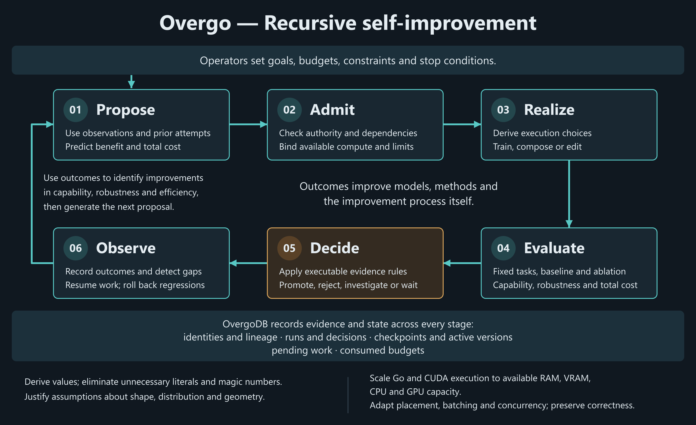

# Overgo

Overgo runs, trains, evaluates, and composes AI models in Go and CUDA.
Its browser workbench, command-line tools, and HTTP APIs share execution
components and an artifact store. Recipes bind models, tasks, and execution
policy; OvergoDB retains inputs, results, and lineage.

The goal is recursive self-improvement: use measured outcomes to improve model
capability and the process that develops it. Operators set goals, budgets, and
stop conditions. Agents propose changes; executable policy checks admission,
verification, and activation.

[Quick start](#quick-start) · [Capabilities](#capabilities) ·
[Development](#development-and-verification) · [References](#references)

## Quick start

The current runtime target is Windows amd64 with Go 1.26. GPU execution requires
an NVIDIA CUDA driver; bundled kernels target compute capability 8.9 or newer.
See the [kernel documentation](kernels/README.md) for build requirements.

From the repository directory:

```powershell
.\overgo_gui.bat
```

The launcher builds the server and model-swap proxy and opens
[the workbench](http://localhost:8080/). Select a registered model in the model
picker, or use Library to register local models or configure a hosted provider.

To start with a supported GGUF model:

```powershell
.\overgo_gui.bat "D:\models\model.gguf"
```

To enable training and model construction without a default model:

```powershell
.\overgo_gui.bat "" -training -model-builder
```

These flags reach each served child, so the workspaces remain enabled after
model switches. Training and construction require their registered inputs and
recipes.

To run one model directly:

```powershell
go run ./cmd/server -listen 127.0.0.1:8080 D:/models/model.gguf
```

Open [the workbench](http://127.0.0.1:8080/). The server binds to loopback by
default. See [SECURITY.md](SECURITY.md) for authentication and network settings.

## Capabilities

The table summarizes implementation areas. Available operations depend on the
active model, recipe, backend, and workspace. The [compatibility matrix](docs/COMPATIBILITY.md)
and [model catalog](docs/model_compatibility.json) record verification scope;
the [training report](docs/TRAINING_COMPATIBILITY.md) distinguishes bounded
smoke runs from broader training claims.

| Area | Operations |
| --- | --- |
| Serving | Chat, text generation, embeddings, reranking, sequence scoring, streaming, constrained output, prompt caching, and model switching |
| Media and structured data | Image and video generation, video editing, speech synthesis, transcription, vision QA, time-series, and tabular execution |
| Model lifecycle | GGUF and safetensors intake, Hugging Face integration, conversion, quantization, inspection, construction, adapters, and composition |
| Training | Token prediction, DPO, GRPO, host and CUDA execution, Muon optimization, and checkpoint/resume |
| Evaluation | Benchmarks, reference comparisons, long-context and retrieval checks, ablations, and quality, throughput, and memory measurements |
| Agents and workflows | Registered tools, typed workflows, authorization, receipts, schedules, peers, and recovery |

The server embeds the workbench; no separate client build is required. Its
workspaces expose chat and generation, model and dataset registration, training,
evaluation, agents, operations, recipes, and artifacts. Controls reflect the
selected model and enabled capabilities. Conversations and operation records
persist across page reloads, and outputs link to their runs.

Native, OpenAI-compatible, and Anthropic-compatible APIs use the same server.
The generated [API manifest](docs/api_manifest.json) inventories commands,
routes, authentication requirements, and document contracts.

## Architecture and state

Recipes declare architecture, tensors, components, and execution policy.
Shared inference and training components execute those declarations. Architecture
profiles cover dense, mixture-of-experts, recurrent, hybrid, encoder, diffusion,
and multimodal programs. Pinned reference implementations include
[llama.cpp](https://github.com/ggml-org/llama.cpp), audio.cpp, and
[Transformers](https://github.com/huggingface/transformers); provenance and license
records accompany ported capabilities.

OvergoDB retains artifacts, recipes, runs, measurements, decisions, checkpoints,
and active versions. Content identities and lineage bind results to their inputs
for reuse, comparison, resume, and rollback. Evaluation retains responses and
protocols so compatible acquisitions can survive scoring repairs.



[Editable SVG](docs/assets/overgo-platform-technical-architecture.svg) ·
[Figure definition](docs/assets/overgo_graphic.json)

## Training

A shared Muon optimizer handles matrices, vectors, scalars, embeddings,
normalization parameters, and adapters. The recipe binds the optimizer policy;
parameter dimensions determine its resolved settings.

The [built-in policy](internal/trainingprogram/optimizer_policy.json) specifies:

- **Learning rate:** $\eta=P^{-1/2}$, where $P$ is the parameter count supplied
  to the policy; the schedule is constant.
- **Momentum:** $\mu=(N-1)/(N+1)=29/31\approx0.9355$, with configured $N=30$.
- **Update scale:** $\eta\sqrt{\max(m,n)}\sqrt{1-\mu^2}$ for each $m\times n$
  parameter group.

These are shared policy settings; their suitability is assessed through the
training evidence for each task. Muon combines gradients with momentum,
normalizes the Nesterov direction, and applies Newton–Schulz orthogonalization.
Optimizer state preserves resolved settings, update count, and momentum.

`cmd/train` is the one training entry point. A registered recipe trains a
checkpoint; `-objective <alias>` trains on a registered objective's training
split and publishes its held-out verdict, choosing the trainer from the
objective's kind; `-route <trainer>`, ahead of other flags, runs a bounded
family trainer by name:

```powershell
go run ./cmd/train -route oscillatorimage -model Un-0 -steps 2
```

Hybrid training retains matrix gradients in GPU buffers and reuses forward
caches. Its continuation API preserves optimizer progress; callers manage model,
dataset, and random-state persistence. See the
[optimizer](internal/hostoptimizer/optimizer.go) and
[training compatibility](docs/TRAINING_COMPATIBILITY.md) for implementation and
recorded runs.

## Agent tools

A [tool manual](internal/agenttool/manual.go) declares a tool's arguments,
effect class, and transport. Bindings cover Go functions, HTTP endpoints,
fixed programs without a shell, MCP tools, and sequenced JSON streams.
[cmd/agent-tool](cmd/agent-tool/main.go) publishes manuals to the store;
orchestration resolves registered tools through those identities.

The [agent loop](internal/agentloop/coordinator.go) checks registration and
execution bounds. Mutations require a completed inspection and exact approval,
and record a durable receipt before execution. Interactions retain their causal
chain. The workbench exposes tools, sessions, approvals, and provenance through
the same authority.

The serving executor rejects loopback, private, and link-local destinations and
redirects at dial time. The operator executor admits private destinations.

## Development and verification

[skill.md](skill.md) defines development practices; [docs/plan.json](docs/plan.json)
records priorities, dependencies, owners, and acceptance. The working cycle is:

1. Take the next eligible row (`go run ./cmd/plan -next`) and implement a
   bounded change.
2. Land it with `go run ./cmd/loop -land <item>/<step> -message-file -`, which
   runs the required checks through the [gate](internal/gate/verification.go),
   commits accepted work with its plan binding, and awaits the deferred lanes.
3. Retain results and cost in the store.
4. Use outcomes and remaining obligations to select the next row.

The [loop driver](cmd/loop/main.go) supervises workers under configured limits
and operator stops. [Attempt history](cmd/plan/history.go) reports outcomes,
cost, and recovery. Prepared proposals can enter the plan when configured;
automatically generating the next useful proposal from observations remains
part of the [development plan](docs/plan.json).

The broader improvement cycle is **propose → admit → execute → evaluate →
decide → observe**. Compare candidates with matched baselines and fixed task
criteria. Retain rejected and failed attempts as evidence for later decisions.

Development priorities are fewer components, facts classified once through
existing owners, and less repeated work. Rules that matter are enforced by the
gate rather than by convention. AST/type information, parsed commands,
declared capabilities, and typed results drive admission, verification, reuse,
recovery, and reporting. Scheduling must preserve dependencies, resource
limits, cancellation, and operator stops while allowing independent work to proceed.

For local feedback, run the hermetic lane on the affected packages, for example:

```powershell
go run ./cmd/test-lane ./internal/recipe
```

Device, installed-model, race, and browser checks use `cmd/device-lane`,
`cmd/smoke-lane`, `cmd/race-lane`, and `cmd/webui-lane`. The gate selects required
checks from the change and its acceptance contract and reuses evidence whose
relevant inputs still match. Ordinary documentation edits receive document
checks; embedded documents and runtime inputs retain their dependent checks.
Plan changes retain their acceptance requirements.

## References

- [API manifest](docs/api_manifest.json) — commands, routes, and typed contracts
- [Benchmark report](docs/BENCHMARK.md) — evaluation and performance results
- [Model catalog](docs/model_compatibility.json) — model-specific records
- [Media report](docs/MEDIA_REPORT.md) — media recipes, runs, and outputs
- [Training compatibility](docs/TRAINING_COMPATIBILITY.md) — training evidence and scope
- [Compatibility matrix](docs/COMPATIBILITY.md) — features and verification references
- [Development plan](docs/plan.json) — current work and completion checks
- [License](LICENSE) and [software bill of materials](SBOM.cdx.json)

Current release: **v0.1.1**.
