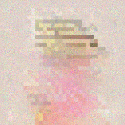
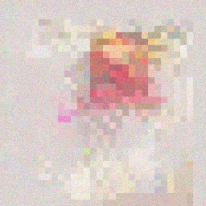

# Media capability report

Generated by `go run ./cmd/compatibility -update-media` from OvergoDB and the typed verification specifications. Do not edit this file directly.

Activation records identify available recipes. Verification records identify the source and measurements they actually captured. Neither establishes visual quality or a matched optimization comparison by itself. Missing evidence remains unavailable.

## Current validation checkpoint

The [validation index](image_video_validation.json) records each acquisition's source base and changed component hashes. The default base is `84c5059b3171302c09ba10b52b04976ed1b9a5dc`; individual checks can identify a later base. Historical failures retain their original outcomes. This checkpoint does not complete the campaign.

Acquired September 12-13, 2026 on Windows with Go 1.26, Ryzen 9950X (16 cores/32 threads), 93.6 GiB installed RAM and RTX 4090 D (48 GiB VRAM), driver 616.64. Correctness checks use existing shared resource admission. Explicitly profiled GPU measurements use the exclusive measurement-process owner; each acquisition retains its scope. OVERGO_DATA_ROOT pointed to the private image_video_gen worktree; OVERGO_CUDA_TEST=1 enabled device checks. Model artifacts and native references remained immutable.

The [assertion contracts](image_video_assertions.json) bind required test names to their packages. Passing these assertions alone does not establish current source, environment or model-quality acceptance.

### Acquisition notes (historical)

Current code generates images with SenseNova, Krea, SimpleDiffusion and Un-0, and video with Wan, LiveEdit and Un-0 through their active recipes. The frozen corpus now accounts for all eight image and seven video requests through new execution or explicitly source-compatible retained results. Numerical, visual and resource limits remain specific to each workload. Public workflows, capacity optimization and final publication remain open.

The SenseNova exact-output regression is corrected. A later shared attention optimization admitted strict-causal prefixes to batched SGEMM, changing accumulation order and BF16-rounded prefix states. Selecting the existing per-query attention option for those reference-bound prefixes restores both small-image hashes and the full-resolution reviewed PNG. No model weights, prompts, seeds, reference hashes or quality limits changed.

The freshly generated [SenseNova full-size image](media_samples/5f3a56dff6b7a4a9e96d3d129082fdc349717357ff48d54454ff9535fb0cce68.png) is byte-identical to the retained reviewed image. Visual inspection confirms readable main headings and a coherent layout; the first-day marker resembles a caret and small text/icon defects remain features of that reference output.

The prior checkpoint fixed shared GIF timing and external JSON-array oracle handling. The [cost profile](image_video_costs.json) maps all seven active model/task pairs, common owners, memory lifetimes and CPU/GPU transfers. Its byte estimates remain predictions rather than measured optimization gains.

Full Wan generation, complete frame-sequence visual review, the frozen image/video cases, and the declared loader/transfer/memory comparisons are accounted for. Remaining work covers public workflows, capacity optimization and final publication. Native-rate playback was not part of the recorded frame-sequence reviews.

The previous checkpoint index, including every original acquisition and failure description, is retained as evidence:sha256:8ed25de9a01b1ac7aac9237c97749935697b0b13221a461906e078462acdca9a. New checks declare their later source base separately; historical failures are not relabeled as passes.

The [shared-loader baseline](image_video_baseline.json) retains complete Wan denoiser and projection loading measurements, exact tensor identities and acceptance criteria frozen before refactoring. Initial timings overlapped another worktree's gate and remain diagnostic only; the accepted cohort was acquired after those test processes exited. That checkpoint records the unchanged loaders before the following comparison.

Wan now returns initialization errors without a cleanup panic, releases session resources after request cancellation, and stops decoding when the request is canceled. The G4 recovery check stops after one frame and then reproduces all five frames exactly on the same generator. The unchanged G3 reference and changed-negative fresh-session comparison also pass. Original failures, the skipped setup attempt, isolation probes and both corrected cohorts remain in OvergoDB as evidence:sha256:4ead158b1a90b0c5b13e17cf09049508f80fdf0d80592c9996f49c29b6ec15b2. These small lifecycle cases do not replace the remaining full-resolution video validation.

The [shared decoder comparison](image_video_shared_components.json) retains both actual loader acquisitions, exact output hashes, source snapshots, malformed-input regression and unchanged Wan reference results. Both consumers meet the frozen host-allocation, process-peak and complete-loader wall requirements in both load states; the shared implementation removes the two independent decoding loops. Observed CPU load was 39%/40% before/after this cohort, versus 6%/1% for the baseline; the timing observations are not an isolated causal or population estimate. GPU transfer and full-generation claims remain open.

The preceding lifecycle acquisition, including its passing output and exact source hashes, remains evidence:sha256:d389b255d50abf529557b3ad8a2df7f78ef16e5c3bfad5f0e7babc5aaa76631d. The preceding lifecycle acquisition, including its passing output and exact source hashes, remains evidence:sha256:060e251d5e4ddd767ae7a2b4601b83ea65702f911abc93bd3291fd2c389c29b6.

Guidance-pair ownership and fresh full-video baseline: history evidence:sha256:68184f017f8d75e51292a3209770210c5413315393eda51dfbf98ae5cf78ed56 retains the failing handle assertion, the first repair's excess retained projection, the final source snapshots, the disabled-timing control and a 20-minute exclusive-admission timeout. The grouped acquisition subsequently completed. Visual inspection of the first, middle and last full-resolution frames shows a consistent fox, snowy forest and facial motion; it does not establish smoothness across every transition. The following comparison rejects the transfer candidate and retains the conditioning repairs.

The [Wan transfer comparison](image_video_transfers.json) retains the frozen acceptance, baseline/candidate/ablation source snapshots, raw request measurements and quality checks. Both candidate requests preserve exact output and reduce uploads, but their observed complete-request times exceed the baseline. Current code restores the original step uploads and keeps the independently tested conditioning ownership repairs. Ordinary host activity and file cache remain uncontrolled; driver copy timers measure host API duration, and component memory peaks are separate, not a combined GPU peak. This closes the declared transfer experiment with rejection; the remaining image/video campaign work stays open.

The [Wan memory comparison](image_video_memory.json) preserves its frozen protocol, source snapshots, raw measurements and allocation-lifetime ablation. Request-local layout reuse reduced host allocation by about 1.23 GB per full request but failed the declared first-request timing requirement; current code retains the baseline allocation behavior. This single paired acquisition does not establish a population timing effect. Separate driver peaks remained 7,725,035,776 bytes for the denoiser and 10,329,897,932 bytes for the decoder. Post-request snapshots record 591,470,592 bytes of denoiser pool storage (545,259,520 live and 46,211,072 free), a 3,555,901,440-byte arena, and 10,036,715,520 bytes in 69 decoder workspace buffers. These ownership scopes are not additive whole-device peaks. Both driver instances report zero owned bytes after close.

The [master integration record](image_video_merged.json) binds retained media capabilities to merge ee78f361 and master a9de6d29. This worktree retains its own image/video plan. Incoming changes separate generic CLI options from model loading, attribute verification costs, and improve retained evaluation and backup behavior; the declared image/video runtime scope is unchanged.

The [processing comparison](image_video_processing.json) records an accepted candidate that reuses the existing file-identity memo in report generation and sample export. First/repeat preparation fell from 194.586/366.660 seconds to 14.948/8.880 seconds in this acquisition. Candidate Go allocation fell by about 47.7/111.6 MB, while process lifetime peak increased from 651.1 to 715.8 MB. The frozen rule allowed only the measured memo allocation overhead and required available host capacity; this is a latency improvement with a higher observed process peak. Memo validity assumes immutable model artifacts and matching file size/modification time; missing or unreadable memo evidence falls back to hashing. The ablation restores hashing without changing outputs. Filesystem cache state and background load varied, so these observations do not establish a population speedup or a generation-kernel improvement.

The [Krea and SimpleDiffusion image bundle](image_video_latent_images.json) completes acquisition and review of the three frozen cases on source 4b9e8697. Krea produces a coherent prompt-matching image. SimpleDiffusion's two unconditioned 256x256 samples remain visibly noisy; numerical correctness within the existing smaller native checks does not establish useful image quality. Each new image has a source/environment-bound run and measured model lifetime, with original requests and policy defaults preserved. Public transport, broader lifecycle, remaining models and video coverage are still open.

Current sample [Krea-2-Turbo/image-gen/1](media_samples/4508f19a532591c01d1c9c5b1e783b21f593484e7debf93e104e3f0df41ccb44.png): validation run `run:sha256:4efc558f87ef63b732b712ea09b67215649270f15f058f40595540c58d988c22`; source `4b9e86972fa6a3e8f24754c5b7f1d96fe2dd7e19`; environment `evidence:sha256:6f8bdad8be5737d4275e1a915d2e87ea81d14e18b7d963a0284d813100989742`. The gallery may show the original workflow record for the same bytes; use this bound validation record and the image bundle for current execution provenance.

Current sample [SimpleDiffusion-TensorProductAttentionRope/image-gen/1](media_samples/939df8925ae33a2064243a201d85659fae13ab700799f4796df2241aedcbda78.png): validation run `run:sha256:09150155593f97f3f61bcba2e902bd260f33450f8b873c88616b2112c6b06711`; source `4b9e86972fa6a3e8f24754c5b7f1d96fe2dd7e19`; environment `evidence:sha256:6f8bdad8be5737d4275e1a915d2e87ea81d14e18b7d963a0284d813100989742`. The gallery may show the original workflow record for the same bytes; use this bound validation record and the image bundle for current execution provenance.

Current sample [SimpleDiffusion-TensorProductAttentionRope/image-gen/2](media_samples/e5b51b334d49a1fb74d4169c3f832c874fc7221f820fae6a7f6d127566880aef.png): validation run `run:sha256:a2a817b8a1084e91add8ebfef51d1fea96318b1d0a7e23e1704b39f1c74f1249`; source `4b9e86972fa6a3e8f24754c5b7f1d96fe2dd7e19`; environment `evidence:sha256:6f8bdad8be5737d4275e1a915d2e87ea81d14e18b7d963a0284d813100989742`. The gallery may show the original workflow record for the same bytes; use this bound validation record and the image bundle for current execution provenance.

Decoded historical/current PNG comparison: SimpleDiffusion seeds 5/105 differ in two/one RGBA channels, each by one 8-bit level. Krea differs in 474,150 channels, with maximum difference 165 levels, while retaining the requested scene. These comparisons describe output changes, not native numerical acceptance. Raw comparison `evidence:sha256:1f31ebccece67f4c0c9dfe69431d683ef1b2b531c272430d7344e330afbfedb8`; comparison source `evidence:sha256:8eda686e940375d5bd508c14396228d3d02a93e24c95e3f6fa45c46751bd3bda`.

The [SenseNova and Un-0 image bundle](image_video_routed_images.json) accounts for five frozen cases. The two newly executed SenseNova 512x512 requests and two Un-0 CPU images exactly reproduce retained PNGs. The full-size 1536x2720 SenseNova result reuses the existing exact-output recovery, source dependencies and visual review; it was not regenerated. Semantic limits remain explicit: SenseNova smoke labels/marks have defects, and Un-0's 8x8 output is only a smoke capability.

Initial model-load timing covers the constructor call. Krea's 22.815-second first request includes 21.186 seconds of preparation, including deferred generation-weight setup, followed by 1.433 seconds of integration and 0.142 seconds of decode. SenseNova similarly rebuilds resident request state during preparation, even for a seed-only change; its two requests each allocate about 33.1 GB cumulatively. These costs are distinct from peak live memory and identify an existing-owner reuse candidate for capacity analysis, not an accepted optimization.

Current sample [SenseNova-U1-8B-MoT-Infographic-V3/image-gen/1](media_samples/e652ebc738f538475c2ce188ac4b2f4daca3e00fd0f9b1ee0b322d603c9c9a7d.png): validation run `run:sha256:1b5d9694f11155d4d42a27b7845ef482c28cf0508df19b3bdbae1289c3ff5b42`; source `f20d54190d8591d721bb38eb9cc9005d828cd86e`; environment `evidence:sha256:6f8bdad8be5737d4275e1a915d2e87ea81d14e18b7d963a0284d813100989742`. These records bind current execution to the unchanged sample bytes; the gallery's first historical run may have less provenance.

Current sample [SenseNova-U1-8B-MoT-Infographic-V3/image-gen/3](media_samples/e8bf6ac4f2f33364f1852d807d7953acbe348c196cc76943552a8963a1811637.png): validation run `run:sha256:c40dd951984329bb3db5be28f1ac20fca3e6c115f346241987614bfafbfe25c6`; source `f20d54190d8591d721bb38eb9cc9005d828cd86e`; environment `evidence:sha256:6f8bdad8be5737d4275e1a915d2e87ea81d14e18b7d963a0284d813100989742`. These records bind current execution to the unchanged sample bytes; the gallery's first historical run may have less provenance.

Current sample [Un-0/image-gen/1](media_samples/cf5dcb195503d8c9ce318a0fc8997441466c0aa3f911ae772f0ab82c13448e28.png): validation run `run:sha256:454185fd57242a50ff4b5e9e9d39fad4f4af101a56c4e4e145b3922426ff87c0`; source `f20d54190d8591d721bb38eb9cc9005d828cd86e`; environment `evidence:sha256:18e4c275afe3d4fc3b301935b782451745e33d66a63da9f4bd3cb9afc594fb75`. These records bind current execution to the unchanged sample bytes; the gallery's first historical run may have less provenance.

Current sample [Un-0/image-gen/2](media_samples/a8bc7f12cb9a537b40bf150493a002251bbbc59620a69944e19778dd463da6f3.png): validation run `run:sha256:312b0523aa65904a015efbbdace877fed093260ed657abcb0ec1bfd73e79c343`; source `f20d54190d8591d721bb38eb9cc9005d828cd86e`; environment `evidence:sha256:18e4c275afe3d4fc3b301935b782451745e33d66a63da9f4bd3cb9afc594fb75`. These records bind current execution to the unchanged sample bytes; the gallery's first historical run may have less provenance.

The [Wan validation bundle](image_video_wan.json) accounts for the three frozen Wan requests. Two new small compiled-recipe clips validate execution and timing; the existing full production acquisition provides the complete 81-frame sample. Both are tensor-conditioned paths. The full clip depicts a fox in snow but omits the requested ice-cream cone; this remains a prompt-adherence limitation. Small two-step clips contain colored patterns rather than recognizable subjects.

Full Wan sample [81 frames at 832x480](media_samples/d5c72f13e0bf07a1fb8268917b4da15f53e1343bfcdb3093a309591bb08f8ff9.gif): run `run:sha256:ab252bb624d3ca3535fba2e862febd01a5df44823d6fca2012c43181a8a30066`, original source `fcda318afa6edecd9cdeed8b2d4a65f9be66c237`, reuse binding `evidence:sha256:23d0b7123d24102f860baececabab4f9f61fe8c6c10c0f1c9c6564a185f898d2`. Publication retains the original measurements and instrumentation. Host name was not recorded; GPU UUID, driver and Go runtime are retained. A metadata-only publication failure used unsupported phase names; it was corrected to the existing generate/postprocess phases without rerunning generation. Failure receipt `evidence:sha256:6855bfcc8bd73e0baaea0baf3ee13aee2ffe98c1bc918d1d83739ab58a440f12`.

Wan memory scopes remain separate: the full acquisition's denoiser and decoder Library peaks are 7,725,035,776 and 10,329,897,932 bytes, not an observed simultaneous total. Its process lifetime host peak was 10,263,068,672 bytes and includes the earlier G4 case in the acquisition group. Full first/repeat Go allocations were 2,494,283,640 and 2,467,036,840 bytes. The earlier transfer and host-layout candidates remain rejected under their original latency criteria.

Current Wan small sample `Wan2.1-T2V-1.3B/video-gen/1`: output `output:sha256:31ee8f128572912a720e68296c646f3dc0e3e0e413ef48392872e713e6152240`; bound validation run `run:sha256:27acd2d8d987d15a6dd68cb964cdfd2905f31a8dc74e7fb00ce24deebce399ed`; source `cfcc9a405a3055c8666cc21892877024c4d0ef58`; environment `evidence:sha256:6f8bdad8be5737d4275e1a915d2e87ea81d14e18b7d963a0284d813100989742`. Complete GIF timing is 31 centiseconds at 16 fps.

Current Wan small sample `Wan2.1-T2V-1.3B/video-gen/2`: output `output:sha256:c733846c0bcf7d0cfa24a43d06665f609f2ac399fe384e1cfe0ced8bb5c41b99`; bound validation run `run:sha256:1ad233f05b73a4157e43c9e19e39e5628ee3158c8b121f3c3b097112f7276b47`; source `cfcc9a405a3055c8666cc21892877024c4d0ef58`; environment `evidence:sha256:6f8bdad8be5737d4275e1a915d2e87ea81d14e18b7d963a0284d813100989742`. Complete GIF timing is 31 centiseconds at 16 fps.

The [LiveEdit and Un-0 video bundle](image_video_conditioned_videos.json) includes an encoding correctness repair: LiveEdit now maps its signed VAE output to bytes correctly. Its earlier black GIFs resulted from using a [0,1] encoder for [-1,1] floats. The corrected [five-frame clip](media_samples/a7b319f0c798b2ed42bbd68e4376c81c6dec00d33f9f78a7051704ded8c7fa21.gif) retains native float frames and restores dark color/texture; its 32x16 smoke scale still does not establish semantic editing or natural motion.

LiveEdit's frozen source contains moving crops of one retained still frame. Both requests use the same source, text context and initial latent arrays with one denoising timestep. Changing the seed makes no subsequent noise draw in that schedule, so the exact same output is expected. The corrected clips remain coarse and do not establish pixel-level source preservation or the requested fox interaction. No text encoder, mask or edit-strength control was exercised. Un-0 video generates independent class-conditioned images at consecutive seeds, with no temporal model.

Current sample [Un-0/video-gen/1](media_samples/bbae395b6153b0f2581e72ba32f9c4b77c120ec04d47c8a127efb78fa8ed7448.gif): output `output:sha256:8998678c48f16a2d4e73a63e764c030acf022775ea8744836cdd6b1ec2cd4024`, bound run `run:sha256:a9dc9487b4428fb7ed5bdf12747473984254a0726d9f1d326054d1b499ae1091`, source base `23e0128b16654d64925c2fbd72af30a79fe82bce`, environment `evidence:sha256:18e4c275afe3d4fc3b301935b782451745e33d66a63da9f4bd3cb9afc594fb75`. Corrected LiveEdit runs additionally require the exact production repair and instrumentation identities in the conditioned-video bundle.

Current sample [Un-0/video-gen/2](media_samples/4869d07c17d398a6c5081b00c96a5a99402fbd4504980e659d81d68c6ef7c658.gif): output `output:sha256:5ce8cb116444a2bfbafbe9c8700a898c2e98ae1a20b7b6ca6ba7bcde0b954aee`, bound run `run:sha256:f5b8b33864e3746916a6d6e1aef33c94958883d3c281886c77564e37076ed523`, source base `23e0128b16654d64925c2fbd72af30a79fe82bce`, environment `evidence:sha256:18e4c275afe3d4fc3b301935b782451745e33d66a63da9f4bd3cb9afc594fb75`. Corrected LiveEdit runs additionally require the exact production repair and instrumentation identities in the conditioned-video bundle.

Current sample [LiveEdit/video-gen/1](media_samples/a7b319f0c798b2ed42bbd68e4376c81c6dec00d33f9f78a7051704ded8c7fa21.gif): output `output:sha256:a7b319f0c798b2ed42bbd68e4376c81c6dec00d33f9f78a7051704ded8c7fa21`, bound run `run:sha256:f9f453c777286cd04d7e6b9cdfa2715debb92d1d32a8d9e59b73a210b0cb6ab1`, source base `23e0128b16654d64925c2fbd72af30a79fe82bce`, environment `evidence:sha256:6f8bdad8be5737d4275e1a915d2e87ea81d14e18b7d963a0284d813100989742`. Corrected LiveEdit runs additionally require the exact production repair and instrumentation identities in the conditioned-video bundle.

Current sample [LiveEdit/video-gen/2](media_samples/a7b319f0c798b2ed42bbd68e4376c81c6dec00d33f9f78a7051704ded8c7fa21.gif): output `output:sha256:a7b319f0c798b2ed42bbd68e4376c81c6dec00d33f9f78a7051704ded8c7fa21`, bound run `run:sha256:2e3e28ec5b8d18cadd189f7cf4bb03dc67019c0cfa12158386f1d5a83f222ae0`, source base `23e0128b16654d64925c2fbd72af30a79fe82bce`, environment `evidence:sha256:6f8bdad8be5737d4275e1a915d2e87ea81d14e18b7d963a0284d813100989742`. Corrected LiveEdit runs additionally require the exact production repair and instrumentation identities in the conditioned-video bundle.

The [composition bundle](image_video_composition.json) validates Krea's native text-encoder, transformer and VAE bindings. Its direct native execution and composed recipe produce the exact same PNG for the frozen request. The other six recipes use a single model binding. These recipes contain no learned representation bridge or component replacement; the separate Wan bridge experiment is outside this frozen inventory. The comparison establishes routing equivalence and preserves the image bundle's quality limitations; it does not establish a speedup or arbitrary component compatibility.

The [lifecycle bundle](image_video_lifecycle.json) verifies cancellation and recovery across the image/video backends and their shared runtime owners. Requests stop at explicit checks between bounded operations; an already submitted synchronous kernel or file read may finish first. Cleanup completes independently of request cancellation. SenseNova ends prefix staging ownership before later generation phases, and LiveEdit now carries request cancellation into denoising and decoding. Successful retries preserve the tested native outputs and reusable memory. A retry regenerates from the request or repeats decode; this does not provide an arbitrary denoising checkpoint. Existing visual limitations remain unchanged. The capacity bundle below records subsequent resource checks; public API/browser coverage remains a separate plan step.

The [capacity bundle](image_video_capacity.json) combines the accepted shared Wan loader and report/export memo with the current cancellation and cleanup implementation. New native checks preserve SenseNova's original 256x256 PNG, repeat a changed 512x256 request exactly, match a fresh session, retain stable reusable memory after the larger request, and release all owned device bytes on close. Un-0 preserves the existing image/video reference bytes and changed clip outputs with one and all 32 detected Go execution threads. These are resource and output-consistency checks; earlier visual limitations remain unchanged.

SenseNova request measurements span 11.01-21.62 s and about 33 GB of Go allocations per request. Larger requests retain about 77 MiB of library-owned device memory between uses; this remains stable on repetition. Current complete Wan denoiser loading allocates about 5.64 GB per load with exact retained tensor values. Report/export first and repeat observations take 12.70 s and 11.42 s with identical report and sample bytes. These describe different operations and measurement scopes; current store contents differ from the original matched performance experiment, so the new timings establish no additional speedup.

Resource checks cover session queues, waiting cancellation, process ownership and recovery. The backends do not expose a general whole-request hard RAM/VRAM budget or capacity-derived media execution planner. GOMAXPROCS limits Go scheduling, not CPU affinity or host-memory consumption. Physical allocation refusal does not establish a successful lower-memory fallback. SenseNova's repeated construction remains a separate optimization opportunity requiring a cache policy and measurements of retained VRAM, changing inputs and multi-model pressure.

| Check | Recorded result | Scope and observations | Evidence |
| --- | --- | --- | --- |
| Wan cancellation, cleanup and reuse | Passed declared assertions (historical; current scope unbound) | Current source passes partial initialization without a panic, the unchanged G3 production reference, changed-negative conditioning against a fresh session, and cleanup after request cancellation. G4 decode stops after the first frame; the next request reproduces all five decoded frames exactly. G3 uses one 32x16 frame and four steps; G4 uses five 32x16 frames and two steps. This is lifecycle and reference coverage, not a new full-resolution clip or a performance comparison. | `evidence:sha256:ed239680eb5ad0b1d4be3179b10b5123075d40ffae34885ea73c06340b55c938` |
| SenseNova exact-output recovery | Passed declared assertions (historical; current scope unbound) | The production and independent native-intermediate trajectories both pass their unchanged exact PNG hashes: 6ef4065018d328c2945e6de0a8b87fe3eb2aec44039b43207398969712446de0 and bc7dabb6526beee13200a1b421e080c5015354bfee66fba75d4dbf1dc44c8617. The fix selects the existing per-query F32 attention path for strict-causal routed prefixes. | `evidence:sha256:9b9ff5101c1a11fe4ead51c4d1a9a8e1ec39cfff735b0b71f493fe0ed43f1527` |
| SenseNova full-resolution recovery | Passed declared assertions (historical; current scope unbound) | 1536x2720, 50 steps, seed 42: the generated PNG exactly matches the reviewed reference 5f3a56dff6b7a4a9e96d3d129082fdc349717357ff48d54454ff9535fb0cce68. Existing quality and performance limits pass: wall 139.180 s, worker-tracked device peak 17.100 GiB. The retained native measurements are 206.010 s and 18.162 GiB; this is a correctness repair, not a matched optimization claim. | `evidence:sha256:e2ee03e661c7f3bbb8ce736c6143fe69836f2f0208c38725372beb856e5081c3` |
| SenseNova causal-attention isolation probe | Passed declared assertions (historical; current scope unbound) | Diagnostic only: disabling the newer causal SGEMM admission in an overlay restored both original small-image hashes before the targeted fix. The broad executor change was not adopted; production changes only the reference-bound prefix graph. | `evidence:sha256:27aad4439178d79ee6219190e008d7cd6698f7c837b3442cc8c1a5de51073b97` |
| Un-0 image and video references (before timing fix) | Passed declared assertions (historical; current scope unbound) | Six tests passed: artifact-derived dimensions, native PNG and GIF bytes, deterministic repeat, class sensitivity, and Torch dynamics/generator parity. The original 6-frame, 8-fps GIF byte oracle passed before the timing correction. | `evidence:sha256:1b76ebf297818aec6b26dce434375cedaa0ee7bc4b7fa980775c853fdf7856de` |
| Wan denoiser and temporal VAE | Passed declared assertions (historical; current scope unbound) | G3 F32/BF16 and G4 F32 denoiser golden comparisons passed; G3/G4 temporal VAE decode comparisons passed. These small reference trajectories do not validate a newly generated 81-frame full-resolution clip. | `evidence:sha256:4c147dfaa703e01d75ed7ea35368baaa34990408e7b0aa2626da133764c0e57a` |
| Krea generation and cancellation recovery | Passed declared assertions (historical; current scope unbound) | 256x256, 8 steps, seed 42: real generation, in-flight decoder cancellation and subsequent decode passed. Owned storage stayed at 25,997,788,492 bytes and 496 allocations across cancellation; observed decoder peak was 26,925,269,372 bytes. Recovered PNG SHA-256: 3bf4ea50f7cfa6991dcd7ef76de20e67a5928f974c5f7279508ad7a1cf180da2. This lifecycle check is not full-resolution visual parity. | `evidence:sha256:dbbffc09e070acd8c1d3507b443ed25af28edd93d5bc3270e5faf0da2782df0e` |
| SimpleDiffusion host/CUDA comparison | Passed declared assertions (historical; current scope unbound) | 64x64, 2 steps, seed 7: warm CUDA median 22.3562 ms versus host 325.7646 ms across the existing three-call comparison. Float maximum error 2.265e-6; one PNG channel differed by one byte level, within the unchanged bounds. This measures warm generation, excluding cold loading. | `evidence:sha256:a9605a631c21bf1d48ac1f321dfdade6ac4121fa3ae454621841e16aa62ae745` |
| LiveEdit device runtime | Passed declared assertions (historical; current scope unbound) | Two requests passed exact latent/frame identities for a real-weight, 5-frame 16x32 source crop with explicit conditioning and noise. Observed walls: 0.534 s and 0.100 s. Context projections remained at one. Component peaks are separate ownership measurements, not a combined process peak. This does not establish full-size video-edit quality. | `evidence:sha256:e2538f05d33e5fb2b58270cdf2711beb05b4f73e11c6c4904bbd7e6495465428` |
| Historical: SenseNova production and full-resolution quality | Not accepted: overgo/internal/sensenovarecipe: TestMediaCurrentSenseNovaValidation failed | The 256x256, 2-step production PNG hash check FAILED: expected 6ef4065018d328c2945e6de0a8b87fe3eb2aec44039b43207398969712446de0, observed 03a5a657b1a9c4690dad0673a730a379a4d579a6d46ae8079b5f9218fc3c179c. Separately, the 1536x2720, 50-step quality/performance test passed its unchanged signature bounds: wall 140.804 s and device peak 17.100 GiB. Its PNG differs from the reviewed reference; the whole acquisition remains failed. | `evidence:sha256:974857c7279e1e3e149fd001d546654e7c0e5278ff97f88891ee07ce0eb76ade` |
| Historical: SenseNova native diagnostic | Not accepted: overgo/internal/sensenovarecipe: TestMediaSenseNovaDiagnosis failed | Native source/input identity and all sampled latent, layer, boundary and velocity comparisons passed their existing bounds. The final PNG hash check still FAILED: expected bc7dabb6526beee13200a1b421e080c5015354bfee66fba75d4dbf1dc44c8617, observed 1b63ee276369cf58735ac90ccaf3656faf5696214380bf16a3526cbac20d8640. This historical failure is resolved by the prefix correction recorded above; neither exact reference was changed. | `evidence:sha256:a0d1acb69623ea35be8bde2ce15f11cda2f9962c1bf4d62b419e9a90628cc8f4` |
| Shared GIF timing correction | Passed declared assertions (historical; current scope unbound) | All representable positive integer GIF frame rates (1-100 fps), large frame indices, frame ordering, and migrated consumers passed. Cumulative timing now stays within half a centisecond: 81 frames at 16 fps encode as 5.06 s rather than 4.86 s. Un-0 native frame pixels, order, palette and other metadata remain exact; six frames at 8 fps now total 0.75 s. Original retained exports remain unchanged. | `evidence:sha256:cda3894fe09d2e3ff22bb181445f08e9c7e1d6a5cd0b50d038445bfcce33c1d5` |
| Wan denoiser loader baseline | Passed declared assertions (historical; current scope unbound) | Complete CPU denoiser loading: first/repeat wall 2.245044/2.315935 s, total allocations 11285633280/11285638528 bytes, process lifetime peaks 7560736768/7560753152 bytes; selected source payload 5641371904 bytes. Exact named F32 hashes agree across states. This is the unchanged-loader baseline, not an optimization result. GPU transfers are zero because this acquisition uses no GPU. | `evidence:sha256:b2a91b8acf922b33c70c06d0455c14b036f8fec83a69302dedd06e899e1545b0` |
| Wan projection loader baseline | Passed declared assertions (historical; current scope unbound) | Complete CPU projection loading: first/repeat wall 0.020232/0.014561 s, total allocations 71320568/71325608 bytes, process lifetime peaks 76722176/77131776 bytes; selected source payload 34615296 bytes. Exact named F32 hashes agree across states. This is the unchanged-loader baseline, not an optimization result. GPU transfers are zero because this acquisition uses no GPU. | `evidence:sha256:3b40bb2f46ac23a81e508f661ca5ced9c29739446b8f41e0516e6301f06fc2fc` |
| Wan denoiser shared decoder | Passed declared assertions (historical; current scope unbound) | Shared decoder, complete CPU denoiser loading: first/repeat wall 1.263982/1.220275 s (baseline 2.245044/2.315935 s); allocated bytes 5643961432/5643956208 (baseline 11285633280/11285638528); process lifetime peak bytes 5706309632/5706661888 (baseline 7560736768/7560753152). Both named F32 hashes match the baseline exactly. These are observed host-loading costs, not generation or GPU transfer measurements. | `evidence:sha256:9ed20e4eaf4f90e5f590916dc788272c1c30c52d422a67c5fda9c458a91de138` |
| Wan projection shared decoder | Passed declared assertions (historical; current scope unbound) | Shared decoder, complete CPU projection loading: first/repeat wall 0.012819/0.011039 s (baseline 0.020232/0.014561 s); allocated bytes 36700400/36700296 (baseline 71320568/71325608); process lifetime peak bytes 51392512/51924992 (baseline 76722176/77131776). Both named F32 hashes match the baseline exactly. These are observed host-loading costs, not generation or GPU transfer measurements. | `evidence:sha256:278ee3949291345d0e66d602d4a4f0a76b32db5fb0464e928eb7a90b3eee6089` |
| Wan references after shared decoding | Passed declared assertions (historical; current scope unbound) | Full text conditioning, G3 F32/BF16 and G4 F32 denoising, every G3/G4 decoded frame, partial initialization, changed-negative reuse, cancellation and exact five-frame recovery pass unchanged references. The G3/G4 clips use small fixture geometry; this is not a new full-resolution video result. | `evidence:sha256:8a4f58b470631e9d2629644d2bb3accd7cca6aa019ffa6e940c8567a3753623a` |
| Wan guidance-pair ownership | Passed declared assertions (historical; current scope unbound) | Preparing a changed negative context previously released the cached positive handle after returning it to the request. The generator now replaces the pair before returning either handle and publishes the cache only after both projections succeed. Changed conditioning retains two live projections; identical conditioning retains one; malformed conditioning releases partial work; cancellation and exact five-frame recovery pass. The initial numerical comparison did not detect the lifetime defect; a retained-handle assertion did. | `evidence:sha256:4ee2f3f2f05360c4ac5e1fa11231b7e88a3858f33af2c928e0391f3ee4b1cee6` |
| Wan full-video transfer baseline | Passed declared assertions (historical; current scope unbound) | Fresh 81-frame, 832x480, 50-step BF16 video generation using the frozen conditioning tensors and explicit noise plan passed first/repeat exact latent, all pre-quantization frame and GIF hashes. Both GIFs contain 506 centiseconds at 16 fps. Complete Generate plus GIF finalization took 377.028205/379.221847 seconds, including frame auditing, encoding and progress writes. Both component driver owners released all allocations on close. The grouped exclusive measurement took 926.989 seconds including admission, the small G4 prerequisite, initialization, output verification and cleanup. This baseline precedes step-input upload changes; it is not an optimization result or a fresh text-encoder run. | `evidence:sha256:5f7c24d262db587f70598b52484980a918cf6113f91e7d516d5c0535e4264653` |
| Wan current conditioning-handle validation | Passed declared assertions (historical; current scope unbound) | Current code retains pair-level conditioning ownership and the original per-branch step uploads. A new session/retained-handle check rejects foreign, released and closed-session handles before device work. The released-handle regression failed on the earlier single-branch implementation and now passes; cancellation and exact recovery, G3 F32/BF16, G4 F32, production reuse and partial initialization also pass. Final native acquisition: 27.369 seconds. Complete-video timings below belong to their earlier, explicitly recorded source snapshots; these handle checks were validated separately. | `evidence:sha256:52d4e8887e849425ce49cb81d332ed83807d0025b598c4fa366833ca550e5515` |
| Wan transfer candidate: complete output parity | Passed declared assertions (historical; current scope unbound) | The candidate uploaded patch tokens, block conditioning and head conditioning once per step through existing pooled device buffers, then executed both guidance branches in order. Both complete 81-frame requests exactly match the baseline latent, all pre-quantization frames and GIF. It removed 421,478,400 HtoD bytes and 150 copies per request, but complete-request time increased from 377.028205/379.221847 to 377.891453/379.700269 seconds. The frozen no-regression criterion rejected adoption; the transfer change has been removed. The group took 1316.085 seconds including admission, its G4 prerequisite, initialization, checking and cleanup. | `evidence:sha256:411905808902a03e365f36cd7e5fc63c07e0da520d24642ddf123e6684039973` |
| Wan transfer decision and causal ablation | Passed declared assertions (historical; current scope unbound) | The retained comparison verifies both lifetime states, source snapshots, exact output, measured transfer counts, required DtoH/DtoD copies, resource peaks, copy API timers, cleanup and the rejection decision. The small G4 ablation preserves output and restores exactly 88,064 HtoD bytes and six copies in each request. This passes the experiment's evidence and decision checks; it does not adopt the optimization or establish a generation speedup. | `evidence:sha256:52b91f3bc0b99c38036e680b4ba6f1ee1709a6f7e6acc5ebaf68f2b841ebe16d` |
| Wan current implementation: full video and memory baseline | Passed declared assertions (historical; current scope unbound) | The current implementation completed two 81-frame, 832x480, 50-step requests after the G4 prerequisite. First/repeat request times were 373.920021/376.232408 seconds; Go allocated 2,494,283,640/2,467,036,840 bytes. Process lifetime peak host memory was 10,263,068,672 bytes. Both requests produced identical latents, all float frames and GIF bytes with 506 centiseconds of total GIF delay. These are complete generation and numerical checks; full temporal visual review remains open. The group took 1341.514 seconds including admission, initialization, validation and cleanup. | `evidence:sha256:228280de772c84e74a9a851a871df6f48f54c888e7a4125ada2d0bf32843d07f` |
| Wan layout reuse experiment: exact output with lower host allocation | Passed declared assertions (historical; current scope unbound) | The candidate reused three request-local host layout arrays, preserving independent public and traced outputs. First/repeat Go allocation fell to 1,261,102,280/1,233,807,424 bytes; process lifetime peak fell to 9,020,514,304 bytes. Outputs and all GPU transfer/synchronization counts matched the baseline. First/repeat request times were 376.367281/375.827959 seconds. The first request exceeded its baseline, so the frozen timing rule rejected adoption and the original implementation was restored. The group took 763.750 seconds including admission, initialization, validation and cleanup; this is not a production memory-reduction claim. | `evidence:sha256:2cd3722898858e2881306751204d44df7c69ede7e880cf59344c1181e433aa33` |
| Wan memory comparison and allocation-lifetime ablation | Passed declared assertions (historical; current scope unbound) | The retained comparison verifies source and instrumentation identities, exact outputs, unchanged GPU transfers and synchronization, both request states, cleanup, storage accounting and rejection. The CPU lifetime ablation restores exactly nine allocations/1728 bytes without tracing and three allocations/576 bytes with tracing while preserving outputs. Synthetic durations were below clock resolution and provide no speed estimate. Native G3 F32/BF16, G4, cancellation/recovery and foreign/stale context-handle checks passed on the candidate; the existing device pool capacity-refusal and idle-reclamation test also passed. | `evidence:sha256:a3f6b501ed2095fbe403fbd95b6baf65046f9cee58139b3f37a8daa81ecb0d0f` |
| Wan current host layout ownership | Passed declared assertions (historical; current scope unbound) | After restoring the baseline implementation, the new CPU test passes across three nonsquare temporal/spatial shapes. It verifies independent public arrays and conditional step traces, rejects malformed input lengths, preserves the borrowed initial sample and confirms exact traced/untraced final latents. | `evidence:sha256:91aac5abd1c169d750230091bc45adca6f823076795ee6660a441fc5748b6d70` |
| Master integration and retained media capability coverage | Passed declared assertions (historical; current scope unbound) | Master a9de6d29 was merged at ee78f361 while preserving this lane's plan. The named generation implementation directories and kernel/module identities match the local parent, so existing numerical outputs remain reusable within that scope. All seven frozen active media cells retain their model/recipe/input bindings. Separate retained CLI and active-test deadline checks passed. Memo validity, file change handling, scoped catalog coverage, report truth and sample validation checks passed; these checks do not acquire new model quality results. | `evidence:sha256:f56fb019bfc7c26f56dcc727a82e9f5f46894d02898b28d6c0995b44f88ef156` |
| Report and sample preparation: baseline | Passed declared assertions (historical; current scope unbound) | Complete report generation plus sample export took 194.585892/366.660168 seconds for first/repeated use. Go allocated 7941017040/8055850792 bytes in 73293550/73335203 calls; process lifetime peak was 651067392 bytes. The complete acquisition process took 577.260 seconds including input setup, store-head checks, output hashing and teardown; compilation is outside that process. Both states preserved the complete report and all 14 exported samples byte for byte, with unchanged store head. Each variant used a separate process; OS caches were not reset. No model generation or GPU work occurred. Exact variant source snapshots and the unchanged harness are retained in the processing comparison. | `evidence:sha256:1dfe8341ccf3f61f24a968c36ea103aa249236ffeb894e62d64887bc701e6663` |
| Report and sample preparation: candidate | Passed declared assertions (historical; current scope unbound) | Complete report generation plus sample export took 14.948463/8.880287 seconds for first/repeated use. Go allocated 7893347928/7944231584 bytes in 73298434/73339827 calls; process lifetime peak was 715808768 bytes. The complete acquisition process took 38.306 seconds including input setup, store-head checks, output hashing and teardown; compilation is outside that process. Both states preserved the complete report and all 14 exported samples byte for byte, with unchanged store head. Each variant used a separate process; OS caches were not reset. No model generation or GPU work occurred. Exact variant source snapshots and the unchanged harness are retained in the processing comparison. | `evidence:sha256:625b65b1ce46796c6243ff81018e12ea23f0429a49700b9fb351a7814993a0f4` |
| Report and sample preparation: ablation | Passed declared assertions (historical; current scope unbound) | Complete report generation plus sample export took 200.286504/180.711376 seconds for first/repeated use. Go allocated 7962946776/8039484688 bytes in 73298983/73340480 calls; process lifetime peak was 638566400 bytes. The complete acquisition process took 390.774 seconds including input setup, store-head checks, output hashing and teardown; compilation is outside that process. Both states preserved the complete report and all 14 exported samples byte for byte, with unchanged store head. Each variant used a separate process; OS caches were not reset. No model generation or GPU work occurred. Exact variant source snapshots and the unchanged harness are retained in the processing comparison. | `evidence:sha256:a64ff4b2689bfd7df94ed07dcac0dd79e3874f69ae1c175ff6263e85e5c06936` |
| Frozen processing optimization decision | Passed declared assertions (historical; current scope unbound) | The acceptance reads retained acquisition logs, checks exact report/sample/store identities, both request lifetimes, the frozen allocation allowance and source snapshots, then derives the recorded decision. It rejects changed output bytes and loss of latency benefit. The candidate decision is accepted; neither publication latency nor sample decoding establishes generation quality. | `evidence:sha256:cc1b79ded6cc27398f3e3fa7e41cc3677fd335c122b8f70425ff7af3d84a4df6` |
| Krea frozen 512x512 image acquisition | Passed declared assertions (historical; current scope unbound) | Original prompt, 4 steps and seed 143 through the active compiled recipe. Load 4.697724 s, request 22.815049 s, close 0.269029 s. Process peak 3445284864 bytes; tracked device peak 26925272444 bytes; owned device bytes after close zero. Go allocated 34982717616 bytes over load through close, distinct from peak live memory. The 997.253-second test process includes exclusive GPU admission waiting; that delay is outside generation timing. Output output:sha256:4508f19a532591c01d1c9c5b1e783b21f593484e7debf93e104e3f0df41ccb44 is finite before PNG quantization, matches requested geometry, and was visually reviewed as a fox licking vanilla ice cream in snow. Encoded bytes differ from the historical sample. Full native pixel equivalence and a matched speed comparison are not established. | `evidence:sha256:d2c37e873d84215a9b41d4c927e892454ad103494185da25b4227eda26693f54` |
| SimpleDiffusion frozen 256x256 image acquisitions | Passed declared assertions (historical; current scope unbound) | Seeds 5 and 105, 8 steps each, share one loaded resident generator and use original compiled recipe inputs. Load 0.397596 s; requests 1.817956/1.428821 s; close 0.066332 s. Process peak 1650343936 bytes and tracked device peak 559451660 bytes; owned device bytes after close zero. Request Go allocations 10171592/8026712 bytes. Both outputs are finite, decode at 256x256 and retain new source-bound runs. Both differ from historical encoded bytes and were reviewed anew: dense colored noise and coarse blocks remain, with no clear semantic subject. The unconditioned smoke requests do not establish useful image quality. The native 64x64 comparison is separate. Two failed instrumentation attempts cost 5.363 and 5.264 seconds; the successful process took 7.141 seconds. Zero-duration preparation remains in raw timing evidence and is omitted only from the positive-duration run phase list. These are individual observations, not matched speed comparisons. | `evidence:sha256:82485b14717574d34e84212866e27544220c119151a624ac0bc8b9ae76c9c536` |
| Krea schedule and artifact geometry | Passed declared assertions (historical; current scope unbound) | Preserve the owner's existing numerical criteria and native fixtures. Krea G2 covers real-weight intermediate distributions, shape, finiteness and deterministic replay with synthetic conditioning at 256x256; it does not compare full native pixels. SimpleDiffusion compares the tiny forward graph to Torch and the real 64x64 seed-7 two-step PNG exactly to its pinned reference. These checks complement, rather than replace, the three full frozen review cases. | `evidence:sha256:c44d45f058e9384ed029cb7c7e6ad9eed5452bd87f56222118fb9d6bdf2774cd` |
| Krea G2 intermediate distribution and determinism | Passed declared assertions (historical; current scope unbound) | Preserve the owner's existing numerical criteria and native fixtures. Krea G2 covers real-weight intermediate distributions, shape, finiteness and deterministic replay with synthetic conditioning at 256x256; it does not compare full native pixels. SimpleDiffusion compares the tiny forward graph to Torch and the real 64x64 seed-7 two-step PNG exactly to its pinned reference. These checks complement, rather than replace, the three full frozen review cases. | `evidence:sha256:0f0a1902a4abce80893acba71c43047ccae63271ba3278d630b4f8940e9902cf` |
| SimpleDiffusion native owners | Passed declared assertions (historical; current scope unbound) | Preserve the owner's existing numerical criteria and native fixtures. Krea G2 covers real-weight intermediate distributions, shape, finiteness and deterministic replay with synthetic conditioning at 256x256; it does not compare full native pixels. SimpleDiffusion compares the tiny forward graph to Torch and the real 64x64 seed-7 two-step PNG exactly to its pinned reference. These checks complement, rather than replace, the three full frozen review cases. | `evidence:sha256:c6c44930847a4e9cbe2954d5fc2e6fbacb8bf04c83eb6e626f8ef20f7c82ea41` |
| Frozen Krea and SimpleDiffusion bundle acceptance | Passed declared assertions (historical; current scope unbound) | Read-only acceptance verifies frozen three-case coverage, source-compatible numerical receipts, actual recipe/input/output lineage, environment, finite output, decoding, raw GPU work and transfer counters, memory cleanup, instrumentation identity and image-specific reviews. It rejects omitted cases, changed output/recipe and failed finiteness. Failed instrumentation attempts remain retained. No model acquisition occurs in this check. | `evidence:sha256:f15b491eca289679bdfb1993dfd88154a4327597dca52976fcde851f34ae0554` |
| SenseNova frozen 512x512 requests | Passed declared assertions (historical; current scope unbound) | Original infographic prompt, seeds 42/142, four steps, CFG 4.5 and shift 3 through the active compiled recipe. Both PNGs exactly match retained outputs. Requests took 21.092110/11.885268 seconds; initial model setup 0.740504 seconds and close 0.067570 seconds. Request preparation includes resident weight setup/rebuilding, so these are not warm denoising timings. Request Go allocations 33128765512/33126759568 bytes, process peak 2357964800 bytes and tracked device peak 16786499844 bytes. Closing releases all tracked GPU bytes. Raw observations retain node timing, generation stages and actual CPU/GPU copies. The seed42 image has unreadable labels; seed142 has readable labels but stray marks. No source image is supplied. This 37.413-second acquisition reused no completed full-size generation and makes no matched speedup claim. | `evidence:sha256:b6d245944f70201f84b1236b2e3f9997f19957d0851ff47a36960e92751534f3` |
| Un-0 frozen CPU image requests | Passed declared assertions (historical; current scope unbound) | Class 1, seeds 111/11, artifact-derived 8x8 output. Both PNGs match their retained bytes exactly. Initial load 0.010221 seconds; requests 0.035606/0.036167 seconds. Process peak 479653888 bytes; per-request Go allocations 1394144/1354160 bytes. CPU execution uses no GPU reservation or fabricated GPU metrics. The output is a low-contrast color tile without recognizable semantic detail. The 3.228-second successful process follows a 3.367-second environment-metadata failure that loaded no model. New bound runs retain original recipe/input/output identities. | `evidence:sha256:d749dd9ac22308ba2d71e1a089ac77ebbf172783ffc5f613a54f9d9e2a14218b` |
| Current Un-0 native image and converter checks | Passed declared assertions (historical; current scope unbound) | Artifact-derived dimensions, exact native seed42 PNG pixels, deterministic generation, class sensitivity, Torch dynamics and generator comparisons pass. Shared F32 promotion and malformed-input checks pass after the existing early dtype guard change. These current CPU checks preserve the original numerical criteria and do not establish meaningful semantic image quality at 8x8. | `evidence:sha256:5c3b99531b837e4f06f907cc28384a3197ef8bdd19d806f48b89fa0f66633db8` |
| Frozen SenseNova and Un-0 image bundle acceptance | Passed declared assertions (historical; current scope unbound) | Accounts for all five frozen cases: four new source/environment-bound runs and one explicitly reused full-size SenseNova result. Checks raw execution, exact request/output lineage, dimensions, finiteness, CPU/GPU resource scopes, cleanup and visual reviews. Reused full-size input parameters and prompt hash match the unchanged native fixture; the exact reviewed PNG and original test receipt remain bound to their original acquisition. Dependency identities are unchanged except the explicitly checked supported-dtype-preserving converter guard. Missing cases, changed inputs, nonfinite outputs and mislabeled historical runs are rejected. | `evidence:sha256:c7ab78023e273eed3b0c8a5adb95c462f4f0f48ebd2a4f25ed863cd822a0bb20` |
| Wan frozen small compiled-recipe clips | Passed declared assertions (historical; current scope unbound) | Two frozen five-frame 64x64, two-step clips, noise seeds 131 and 31. One loaded WanRuntime executes both active compiled-recipe requests. Load 3.409330 seconds, request walls 0.879840 and 0.323130 seconds, close 0.111697 seconds; successful acquisition process 8.493 seconds. Request Go allocation 414,367,248 and 292,663,856 bytes; process lifetime peak 8,893,042,688 bytes. Separate denoiser/decoder Library peaks are 3,527,123,200 and 376,261,580 bytes; both close with zero owned bytes. Raw transfer counters and direct/captured graph launches establish actual GPU work. Outputs preserve every historical decoded pixel and all metadata except total GIF duration corrected from 30 to 31 centiseconds. The two-step clips show colored patterns with no recognizable prompt subject. A preceding 112.262-second attempt generated the clips but failed a measurement assertion that omitted captured graph launches; its incomplete telemetry required reacquisition. Production code and frozen inputs did not change. | `evidence:sha256:bef98ebec4b32b7c5ddd9c3b5ad7d39bb8b5808e5d75f287f179c2125e1c8487` |
| Current Wan schedule, request, bounds, layout and GIF owners | Passed declared assertions (historical; current scope unbound) | Current CPU checks cover stride-derived supported controls, prompt-or-tensor request form, declared text pipeline, native UniPC and timestep conditioning references, layout ownership and cumulative GIF cadence. Existing source-compatible CUDA G1/G3/G4, VAE, cancellation and context-lifetime evidence is reused rather than loading the model again. | `evidence:sha256:3b37a839f8e06a8d7b2a4937bd61ac1e2481bc3bdcac0f89ae4bb890e72611a5` |
| Wan frozen full clip publication and bundle acceptance | Passed declared assertions (historical; current scope unbound) | Read-only acceptance accounts for all three frozen cases, complete stored lineage, actual acquired GPU work, corrected timing, visual review, retained native checks and original full-acquisition source/environment. Mutation cases reject truncation, reordered frames, changed pixels and wrong duration. The reused 81-frame 832x480, 50-step production requests took 373.920021 and 376.232408 seconds including frame audit/encoding; no new full generation ran. The retained full GIF has 506 centiseconds of duration and exactly preserves the historical 486-centisecond clip's pixels and other metadata. All 81 frames were inspected as a storyboard, with original-resolution frames 0, 40 and 80 retained; review is not native-rate playback. The fox and snowy forest are visible, with limited head/mouth movement and palette dithering, but the requested ice-cream cone is absent. Supplied conditioning arrays exactly match the native G1 fixture; these tensor-form requests did not run a text encoder. First streamed-frame latency was not measured. | `evidence:sha256:e4de9fff127fd3ff73035e8d17ae78434f0850ed608e039e92f7239044358afd` |
| Un-0 frozen CPU video requests | Passed declared assertions (historical; current scope unbound) | Two class-1 requests, seeds 11/111, twelve frames and scale 2 produce 16x16 clips at 8 fps. A transparent hook hashes and checks finite decoded float frames immediately before existing quantization. Load took 0.000891 seconds, requests 0.106756/0.115700 seconds, and load through release 0.234181 seconds. Per-request Go allocation was 2,258,792/2,262,944 bytes; process lifetime peak 442,519,552 bytes. CPU only, with no GPU reservation or fabricated GPU metrics. Both GIFs retain historical pixels and frame metadata while duration changes from 144 to 150 centiseconds. Frames are independent images at consecutive seeds and show low-contrast gray/color patterns, not coherent semantic motion. A 3.498-second reference-reading failure is retained; the corrected acquisition process passed in 3.651 seconds. Production replay already supports JSON envelopes through its existing fallback. | `evidence:sha256:be97063dd90ee55ec3501b585b61b3963fe6499b42cc868c25ce91a72a6cd82b` |
| LiveEdit signed-pixel encoding correction and frozen clips | Passed declared assertions (historical; current scope unbound) | The VAE emits signed-unit floats, but LiveEdit selected unit-range GIF encoding. Changing that one argument fixes entirely black clips without changing the native frame aggregate 19b2104b562a8fc93848aecf65737b58e9b50e0534dc96f85ffb1beb780061b1. All 7,680 values are negative, between -0.981542 and -0.274297; corrected encoding restores 2,480 of 2,560 pixels as nonblack. Both old and corrected encodings reconstruct exactly from the same captured raw frames. Each seed-specific session loads and closes separately: loads 4.119502/3.997097 seconds, requests 0.714855/0.372293 seconds, closes 0.126644/0.150960 seconds. Request Go allocations 243,039,112/241,559,888 bytes; process lifetime peaks 9,236,320,256/9,950,199,808 bytes. Separate encoder/denoiser/decoder Library peaks are 221,938,688/3,260,313,344/303,567,308 bytes; all close with zero owned bytes. The 429.335-second process includes resource admission and setup; request timing is not complete attempt time. The earlier old-range acquisition passed in 342.454 seconds and remains the encoding-defect baseline. This is a correctness repair with observed costs, not a matched speedup claim. Source identity is the declared base plus the exact recorded repair and observation overlay. | `evidence:sha256:ab2a281f2db64359c3d8b589397b4d04dab435c459742a45a8b15e7d3db16619` |
| Conditioned video and current-source bundle acceptance | Passed declared assertions (historical; current scope unbound) | All four frozen source-conditioned/oscillator cases have actual compiled-recipe execution, complete input/output/source/environment lineage, resource observations and content-specific visual review. Acceptance checks current working source and permits exactly the documented one-line LiveEdit correction; every other generation file and every other byte of that file must match the prior source. Raw float artifacts reconstruct both faulty and corrected encodings and retain native frame order/hash. Existing image, Wan and rejected-optimization evidence remains valid in its original scope. Un-0 cadence and current source/request/sampler/codec/native reference checks pass. The full frozen corpus now accounts for eight image and seven video cases; public workflows, broader lifecycle, composition, capacity and final publication remain separate. | `evidence:sha256:990ac1126d185870f34c83adba34438797f1895ff1466a94ca9c3b56a0b62717` |
| Current source-conditioned request, sampler, codec and native Un-0 GIF owners | Passed declared assertions (historical; current scope unbound) | Existing numerical, request-form, source-codec and encoding owners retain their original criteria. These CPU checks establish their declared mechanics and reference comparisons, not full semantic editing quality. | `evidence:sha256:44ab708cc4e2abcb33abf67375d5d6c45f1470498c0419d510780cf69415a6a1` |
| Existing signed/unit pixel mapping and GIF boundary checks | Passed declared assertions (historical; current scope unbound) | Existing numerical, request-form, source-codec and encoding owners retain their original criteria. These CPU checks establish their declared mechanics and reference comparisons, not full semantic editing quality. | `evidence:sha256:857b6a8dc64120c5465fd068c3e683762c325919cac3753d52ed8414e00be8fd` |
| Krea native component chain: identical-request routing comparison | Passed declared assertions (historical; current scope unbound) | One direct native prepare/integrate/decode acquisition on the same frozen 512x512, four-step, seed-143 request exactly matches the complete retained compiled-recipe PNG. Native parent/profile and component file identities are unchanged. Load 4.897838 seconds, generation 23.443009 seconds, close 0.253088 seconds, load through close 28.594077 seconds; process receipt 155.287 seconds includes admission and harness work. Go allocation 34,976,031,192 bytes across load through close; process peak 3,179,003,904 bytes; GPU owner peak 26,925,272,444 bytes and zero retained after close. This is routing equivalence using the same numerical implementation, not an independent full-model oracle or a performance comparison. | `evidence:sha256:860dbcbf3a5e26376d5cc32a3a848d74f3dbcabfe5d8a687029e341be8f1fa2e` |
| Native component recipe construction and inventory owners | Passed declared assertions (historical; current scope unbound) | Existing CPU checks compile component slots, retain composite identity and reject duplicate or unknown stage bindings; validate inventory shards, typed runtime selection and profile ownership. Packages with no matching tests provide no additional coverage. | `evidence:sha256:c2dccde41f12a8e3ffbd586fa7e60826489ed474ecfdff19392dfee03641c85f` |
| Frozen media composition coverage and evidence acceptance | Passed declared assertions (historical; current scope unbound) | Checks every frozen recipe against active definitions: six single-model recipes and the Krea native component chain. Reconstructs exact text-encoder, transformer and VAE manifests with two, five and two file members; verifies typed stage order, model selection and profile identity. Binds the identical-request native PNG comparison, measurements, source compatibility and retained failures. Rejects omitted cells, components, retained run or native acquisition. Two verification defects were corrected without regenerating the image. | `evidence:sha256:18ee83fce1a5d0fd0e1902527c88e403cff728932c603c7dfe2858d0bf230d81` |
| Image/video cancellation, cleanup and native recovery | Passed declared assertions (historical; current scope unbound) | The lifecycle bundle binds native image/video recovery, shared request cancellation, process/resource admission, failed-run persistence and atomic publication to the exact source patch. SenseNova now releases abandoned prefix outputs and its 201,326,592-byte prefix weight-staging allocation, preserves its native PNG, returns to 80,068,736 idle device bytes after cancellation and closes to zero. LiveEdit cancels source encoding, denoising, decoding and frame publication, then reproduces its native latent and all five frames with stable per-owner device memory; each owner closes to zero. Wan, Krea, SimpleDiffusion and Un-0 retain their bounded reference and recovery criteria. Physical allocation refusal and unavailable-device recovery are checked separately from model capacity. Earlier failed attempts and source identities remain retained; no sampling checkpoint, speedup or visual quality gain is claimed. See docs/image_video_lifecycle.json for the individual executions, source protocols, limits and test sources. | `evidence:sha256:5b937a02ba2a7aa60b6ff66375f56f5773be04b4b71514909eece5039c9a08ba` |
| Combined image/video capacity validation | Passed declared assertions (historical; current scope unbound) | All existing image/video acceptance checks pass with the capacity bundle: retained frozen corpus, accepted shared loader and report/export changes, unchanged rejected-candidate decisions, and cancellation/recovery evidence. This verifies the current implementation against retained acquisitions; it does not rerun every full model or establish a new combined speedup. | `evidence:sha256:d9f0af865015efe35ef7d639241f337e00acbb0d68f644b80ebaf0ef59ced705` |
| Capacity evidence identity and altered-evidence rejection | Passed declared assertions (historical; current scope unbound) | Capacity acceptance, missing evidence-field counterexamples and split Go test output reconstruction pass. The bundle retains exact source identities, original failed attempts, native measurements and prior comparison decisions. | `evidence:sha256:1db74dddf9dde842e108bc35625ff68ca6f9f4bf9c7fbbd9c5f7033e3ca0ab67` |

Results describe the selected tests, including failures, rather than all supported requests. Commands and retained overlay sources in the index identify each acquisition. Test output is stored by content identity in OvergoDB.

Samples below retain their original producing-run metadata. A newer validation can reproduce the same content, as noted above. Historical GIFs retain their original timing; they have not been regenerated by this checkpoint.

## Campaign requirements

The [quality protocol](image_video_protocol.json), [resource protocol](image_video_resources.json), and [execution plan](plan.json) define the required comparisons. This projection of activation and run records remains incomplete as a campaign result until those checks and their exact evidence are joined.

| Area | Required report evidence |
| --- | --- |
| Identity | Model, recipe, reference, criteria, complete request, source revision, environment, run, and output identities |
| Correctness and quality | Separate numerical, structural, visual and temporal outcomes; retain failures, unavailable checks and reference limitations |
| Processing | Matched cold/warm preparation, integration, decode, serialization, export, cleanup and total wall; include waiting and failed attempts |
| Transfers | HtoD, DtoH and DtoD bytes and calls by weight, conditioning, latent, intermediate, output and diagnostic boundary; synchronization and wait observations |
| Memory | Process host peak, Go allocations, pinned host storage, driver-owned live/peak bytes, retained session memory and current capacity as distinct scopes |
| Shared code | Original and replacement owners, real migrated consumers, removed duplicate paths, and added code |
| Reliability and workflows | Cancellation, release, repeated and changed shapes, restart/reuse, API and workbench receipts |
| Decision | Matched baseline/candidate measurements and protocol identities, accepted or rejected changes, tradeoffs, and combined validation |

Missing measurements remain unavailable; a reported zero requires an observation. Historical verifier timings and separate generation outputs do not form a matched performance result without an execution-specific link.

## Verdict

The selected tasks (speech, image-gen, video-gen, vqa) have 9 activations; 0 are stale and 9 healthy activations cite a readable measured verifier run. Measurements retain their original scope and source revision.

[Typed projection](media_report.json) contains the same totals, exact integer measurements and original source identities. Activation and historical verification do not establish current generation acceptance.

## Public media surface

Every media capability is exercised through the same task-generic recipe lifecycle; requests are typed JSON on standard input and outputs are typed store artifacts.

| Operation | Command |
| --- | --- |
| Verify (candidate execution + gate/run evidence) | `go run ./cmd/recipe verify -task <task> -repo <overgodb> -input - <model-path> < request.json` |
| Activate (bind verified evidence to the active alias) | `go run ./cmd/recipe activate -task <task> -repo <overgodb> -gate <id> -run-id <id> -reason <why> <model-path>` |
| Run (serve through the active recipe) | `go run ./cmd/recipe run -task <task> -repo <overgodb> -input - <model-path> < request.json` |
| Report (this document) | `go run ./cmd/compatibility -update-media` |
| Sample export (recorded generation outputs) | `go run ./cmd/compatibility -export-samples` |

The report includes only the selected tasks and the recipes actually declared by their active records. Reference-guided video editing is a `video-gen` recipe with a source input.

## Media activations

| Model | Task | Activation tier | Stale | Measured claim |
| --- | --- | --- | --- | --- |
| `Hy-Embodied-RxBrain-1.0` | `vqa` | parity | - | - |
| `Krea-2-Turbo` | `image-gen` | verified | - | - |
| `LiveEdit` | `video-gen` | verified | - | - |
| `SenseNova-U1-8B-MoT-Infographic-V3` | `image-gen` | verified | - | - |
| `SimpleDiffusion-TensorProductAttentionRope` | `image-gen` | verified | - | - |
| `Un-0` | `image-gen` | verified | - | - |
| `Un-0` | `video-gen` | verified | - | - |
| `Wan2.1-T2V-1.3B` | `video-gen` | verified | - | - |
| `pocket-tts` | `speech` | verified | - | - |

The matrix reports activation and evidence scope, not general model-family support: an activation means the recipe lifecycle admitted the model for the task at the stated tier, and a measured claim binds that capability to real execution evidence at its commit.

## Function inventory

The executable surface behind each healthy activation: every recipe node with its module and placement, from the activation's own stored definition. Modules are the native Go implementations the workflow runtime binds.

| Model | Task | Node | Module | Placement | Session | Component model |
| --- | --- | --- | --- | --- | --- | --- |
| `Hy-Embodied-RxBrain-1.0` | `vqa` | `generate` | `model.vqa-generate` | device | - | composite |
| `Hy-Embodied-RxBrain-1.0` | `vqa` | `prepare` | `model.vqa-prepare` | host | - | composite |
| `Krea-2-Turbo` | `image-gen` | `decode` | `model.latent-image-decode` | hybrid | - | `model:sha256:1b7acc66c8e9c396e08` |
| `Krea-2-Turbo` | `image-gen` | `integrate` | `model.latent-image-integrate` | hybrid | - | `model:sha256:8f2e2c875364a9c71ba` |
| `Krea-2-Turbo` | `image-gen` | `prepare` | `model.latent-image-prepare` | hybrid | capacity | `model:sha256:f56d447bad2b83262f8` |
| `LiveEdit` | `video-gen` | `decode` | `model.reference-video-decode` | hybrid | - | composite |
| `LiveEdit` | `video-gen` | `integrate` | `model.reference-video-integrate` | hybrid | - | composite |
| `LiveEdit` | `video-gen` | `prepare` | `model.reference-video-prepare` | hybrid | capacity | composite |
| `SenseNova-U1-8B-MoT-Infographic-V3` | `image-gen` | `decode` | `model.routed-image-decode` | hybrid | - | composite |
| `SenseNova-U1-8B-MoT-Infographic-V3` | `image-gen` | `integrate` | `model.routed-image-integrate` | hybrid | - | composite |
| `SenseNova-U1-8B-MoT-Infographic-V3` | `image-gen` | `prepare` | `model.routed-image-prepare` | hybrid | capacity | composite |
| `SimpleDiffusion-TensorProductAttentionRope` | `image-gen` | `decode` | `model.diffusion-image-decode` | host | - | composite |
| `SimpleDiffusion-TensorProductAttentionRope` | `image-gen` | `integrate` | `model.diffusion-image-integrate` | host | - | composite |
| `SimpleDiffusion-TensorProductAttentionRope` | `image-gen` | `prepare` | `model.diffusion-image-prepare` | host | capacity | composite |
| `Un-0` | `image-gen` | `decode` | `model.oscillator-image-decode` | host | - | composite |
| `Un-0` | `image-gen` | `integrate` | `model.oscillator-image-integrate` | host | - | composite |
| `Un-0` | `image-gen` | `prepare` | `model.oscillator-image-prepare` | host | capacity | composite |
| `Un-0` | `video-gen` | `decode` | `model.oscillator-video-decode` | host | - | composite |
| `Un-0` | `video-gen` | `integrate` | `model.oscillator-video-integrate` | host | - | composite |
| `Un-0` | `video-gen` | `prepare` | `model.oscillator-video-prepare` | host | capacity | composite |
| `Wan2.1-T2V-1.3B` | `video-gen` | `decode` | `model.latent-video-decode` | hybrid | - | composite |
| `Wan2.1-T2V-1.3B` | `video-gen` | `integrate` | `model.latent-video-integrate` | hybrid | - | composite |
| `Wan2.1-T2V-1.3B` | `video-gen` | `prepare` | `model.latent-video-prepare` | hybrid | capacity | composite |
| `pocket-tts` | `speech` | `decode` | `model.speech-decode` | host | - | composite |
| `pocket-tts` | `speech` | `generate` | `model.speech-generate` | host | capacity | composite |
| `pocket-tts` | `speech` | `tokenize` | `model.speech-tokenize` | host | - | composite |

## Recipe inventory

One row per healthy activation: the recipe artifact the active alias resolves, its evidence tier, and its non-model dependencies.

| Model | Task | Recipe | Evidence tier | Dependencies |
| --- | --- | --- | --- | --- |
| `Hy-Embodied-RxBrain-1.0` | `vqa` | `recipe:sha256:97d121be90fba86b42` | parity | - |
| `Krea-2-Turbo` | `image-gen` | `recipe:sha256:0b1bcc2fb9cf5f42cd` | verified | profile `profile:sha256:4dedf632a6744df0c` |
| `LiveEdit` | `video-gen` | `recipe:sha256:7cd66ed08ebee5e566` | verified | profile `profile:sha256:5dff72b6d581a9d1d` |
| `SenseNova-U1-8B-MoT-Infographic-V3` | `image-gen` | `recipe:sha256:5a729e98ef825033d4` | verified | flow-profile `profile:sha256:307706b480209dc49` |
| `SimpleDiffusion-TensorProductAttentionRope` | `image-gen` | `recipe:sha256:4f0b3b9dbad2427851` | verified | - |
| `Un-0` | `image-gen` | `recipe:sha256:213d890a8988e995e5` | verified | - |
| `Un-0` | `video-gen` | `recipe:sha256:4f6267a0ddb44c1357` | verified | - |
| `Wan2.1-T2V-1.3B` | `video-gen` | `recipe:sha256:bff12bb8946afe0d8c` | verified | profile `profile:sha256:5dff72b6d581a9d1d` |
| `pocket-tts` | `speech` | `recipe:sha256:353213be1a91a29530` | verified | - |

## Measured results

One row per healthy activation: the verifier run the activation cites, exactly as recorded -- wall, measured phase decomposition, peak device bytes, verifying commit, and the output artifacts the run published. A dash means the activation stands without that measurement.

| Model | Task | Verifier wall | Phases | Maximum step device peak | Commit | Run outputs |
| --- | --- | --- | --- | --- | --- | --- |
| `Hy-Embodied-RxBrain-1.0` | `vqa` | 10.113s | generate 10.668s, prepare 135ms | - | `6da9e6329fe7` | `evidence:sha256:da6e3efbd0aedc45` |
| `Krea-2-Turbo` | `image-gen` | 14.581s | decode 162ms, integrate 1.417s, prepare 9.729s | - | `05faa01ef333` | `evidence:sha256:5b3a1c4bb7981dba` |
| `LiveEdit` | `video-gen` | 5.409s | integrate 671ms | 3260313344 B (3109.277 MiB; 3.036 GiB) | `f313f43d6c57` | `evidence:sha256:9962cef18a9b42ed` |
| `SenseNova-U1-8B-MoT-Infographic-V3` | `image-gen` | 2m17.156s | decode 939ms, integrate 2m2.434s, prepare 13.187s | - | `73414af5ea9b` | `evidence:sha256:3d0bc88bed1aadcc` |
| `SimpleDiffusion-TensorProductAttentionRope` | `image-gen` | 1.845s | decode 8ms, integrate 1.413s | - | `f313f43d6c57` | `evidence:sha256:710bb24341b1d20a` |
| `Un-0` | `image-gen` | 54ms | decode 2ms, integrate 1ms | - | `f313f43d6c57` | `evidence:sha256:033e4554d122101e` |
| `Un-0` | `video-gen` | 41ms | decode 18ms | - | `f313f43d6c57` | `evidence:sha256:30d089f92a60ec23` |
| `Wan2.1-T2V-1.3B` | `video-gen` | 6m22.361s | decode 5ms, integrate 6m16.764s | 10329897932 B (9851.358 MiB; 9.620 GiB) | `b862f3c902fb` | `evidence:sha256:d137ace0d95df805` |
| `pocket-tts` | `speech` | 2.088s | decode 1.07s, generate 774ms | - | `1f6efd8b7cda` | `evidence:sha256:9d1085218ce3b99d` |

## Recorded run outcomes

These counts include generation and verification records for the selected recipes. They are not counts of images or quality passes. Failed and cancelled attempts remain visible.

### Hy-Embodied-RxBrain-1.0 (vqa)

Succeeded: 3; failed: 0; cancelled: 0.

### Krea-2-Turbo (image-gen)

Succeeded: 4; failed: 0; cancelled: 0.

### LiveEdit (video-gen)

Succeeded: 12; failed: 0; cancelled: 0.

### SenseNova-U1-8B-MoT-Infographic-V3 (image-gen)

Succeeded: 8; failed: 0; cancelled: 0.

### SimpleDiffusion-TensorProductAttentionRope (image-gen)

Succeeded: 8; failed: 0; cancelled: 0.

### Un-0 (image-gen)

Succeeded: 248; failed: 2; cancelled: 0.

- `run:sha256:155d0923368a0afba994faa203d4d32a0fc18b8cac6919e84851544b712da9f2`: failed; execution_failed. Source: unavailable. Environment: unavailable.
- `run:sha256:22d16a199eb8c2373fccb4e8bcf64e85878a2b67ce3fb86bcf83160e6da52d9c`: failed; execution_failed. Source: unavailable. Environment: unavailable.

### Un-0 (video-gen)

Succeeded: 168; failed: 0; cancelled: 0.

### Wan2.1-T2V-1.3B (video-gen)

Succeeded: 11; failed: 0; cancelled: 0.

### pocket-tts (speech)

Succeeded: 179; failed: 1; cancelled: 0.

- `run:sha256:6e48f32b83d8284d55f65df32da2cd37643c3b718a5a1787abef58ae28f5e89b`: failed; execution_failed. Source: unavailable. Environment: unavailable.

## Samples

Outputs from recorded successful generation runs, exported by `go run ./cmd/compatibility -export-samples` and named by content SHA-256. A successful run does not by itself establish visual quality. Use `-media-scope image-video` with sample export to select the frozen image/video requests. Repeated identical output bytes share one file; each sample cites a producing run.

### Krea-2-Turbo (`image-gen`)

- Image: [4508f19a532591c01d1c9c5b1e783b21f593484e7debf93e104e3f0df41ccb44.png](media_samples/4508f19a532591c01d1c9c5b1e783b21f593484e7debf93e104e3f0df41ccb44.png)

  

  Request: `{"height":512,"prompt":"a red fox licking a vanilla ice cream cone in snow","seed":143,"steps":4,"width":512}`

  Run: `run:sha256:105d539cb418989c207375e7fc654ac5e9dd0d476c9af40b7ac011bf917c82f3`; output: `output:sha256:4508f19a532591c01d1c9c5b1e783b21f593484e7debf93e104e3f0df41ccb44`. Source: unavailable. Environment: unavailable.

  Input artifacts: `file:sha256:1d840594046f2981e9fb7c335808a4f3399101072ab0a8ab2768492642f9b6e2`.
- Image: [4044fbe3e2590fbc01436e93d2f9e396f94dc53b5fdf705c86f40fca74a4d2ee.png](media_samples/4044fbe3e2590fbc01436e93d2f9e396f94dc53b5fdf705c86f40fca74a4d2ee.png)

  

  Request: `{"height":512,"prompt":"a red fox licking a vanilla ice cream cone in snow","seed":143,"steps":4,"width":512}`

  Run: `run:sha256:584d90be78cff48db34d9dbfb0112dcacef7464772b731c35766ea223b4ff120`; output: `output:sha256:4044fbe3e2590fbc01436e93d2f9e396f94dc53b5fdf705c86f40fca74a4d2ee`. Source: unavailable. Environment: unavailable.

  Input artifacts: `file:sha256:1d840594046f2981e9fb7c335808a4f3399101072ab0a8ab2768492642f9b6e2`.

### LiveEdit (`video-gen`)

- Video clip: [a7b319f0c798b2ed42bbd68e4376c81c6dec00d33f9f78a7051704ded8c7fa21.gif](media_samples/a7b319f0c798b2ed42bbd68e4376c81c6dec00d33f9f78a7051704ded8c7fa21.gif)

  

  Request: `{"context_timestep":0,"frames_per_chunk":1,"initial_noise":"[256 values]","local_attention_frames":1,"seed":100,"sigmas":[0.8333333],"text_context":"[786432 values]","timesteps":[900]}`

  Run: `run:sha256:2e3e28ec5b8d18cadd189f7cf4bb03dc67019c0cfa12158386f1d5a83f222ae0`; output: `output:sha256:a7b319f0c798b2ed42bbd68e4376c81c6dec00d33f9f78a7051704ded8c7fa21`. Source: `23e0128b16654d64925c2fbd72af30a79fe82bce`. Environment: `evidence:sha256:6f8bdad8be5737d4275e1a915d2e87ea81d14e18b7d963a0284d813100989742`.

  Input artifacts: `file:sha256:35121e6f6d23f5d51b5438029d637dd3fb43d9efa3d59adc5f12bd7c0059bf78`, `file:sha256:e14e51433c7ccd5111ee3e176a4da64342f7d24412979eb1faa406836ff39e91`.
- Video clip: [6f8c4271f3acb7ebf96fed67575e18a42e6bb850db04cbb899a041b85652dd33.gif](media_samples/6f8c4271f3acb7ebf96fed67575e18a42e6bb850db04cbb899a041b85652dd33.gif)

  

  Request: `{"context_timestep":0,"frames_per_chunk":1,"initial_noise":"[256 values]","local_attention_frames":1,"seed":0,"sigmas":[0.8333333],"text_context":"[786432 values]","timesteps":[900]}`

  Run: `run:sha256:923dc7ca901c00a9c03522df9fbe34a73b4484621d0531f632298464a7c753d1`; output: `output:sha256:6f8c4271f3acb7ebf96fed67575e18a42e6bb850db04cbb899a041b85652dd33`. Source: unavailable. Environment: unavailable.

  Input artifacts: `file:sha256:13d22d58fe9d17432757def7ec1cdcb170f07358c6ccaf0a5d4dcfdeec1e95ca`, `file:sha256:e14e51433c7ccd5111ee3e176a4da64342f7d24412979eb1faa406836ff39e91`.
- Video clip: [c79e6f65fce2fcaa739061ec17f077ae801ca55dbddde0fa17a3912297225efb.gif](media_samples/c79e6f65fce2fcaa739061ec17f077ae801ca55dbddde0fa17a3912297225efb.gif)

  

  Request: `{"context_timestep":0,"frames_per_chunk":1,"initial_noise":"[256 values]","local_attention_frames":1,"seed":0,"sigmas":[0.8333333],"text_context":"[786432 values]","timesteps":[900]}`

  Run: `run:sha256:9d4a0c8a6447dc3f28b711536dcce76466c899cfaabcd90c795de8cc921c11da`; output: `output:sha256:c79e6f65fce2fcaa739061ec17f077ae801ca55dbddde0fa17a3912297225efb`. Source: `23e0128b16654d64925c2fbd72af30a79fe82bce`. Environment: `evidence:sha256:6f8bdad8be5737d4275e1a915d2e87ea81d14e18b7d963a0284d813100989742`.

  Input artifacts: `file:sha256:13d22d58fe9d17432757def7ec1cdcb170f07358c6ccaf0a5d4dcfdeec1e95ca`, `file:sha256:e14e51433c7ccd5111ee3e176a4da64342f7d24412979eb1faa406836ff39e91`.

### SenseNova-U1-8B-MoT-Infographic-V3 (`image-gen`)

- Image: [e652ebc738f538475c2ce188ac4b2f4daca3e00fd0f9b1ee0b322d603c9c9a7d.png](media_samples/e652ebc738f538475c2ce188ac4b2f4daca3e00fd0f9b1ee0b322d603c9c9a7d.png)

  

  Request: `{"cfg_scale":4.5,"height":512,"prompt":"a minimal infographic of three rising bars labeled A B C","seed":42,"steps":4,"timestep_shift":3,"width":512}`

  Run: `run:sha256:09fd4e16a87335eab349fdc801d768f4627e73c1268bf697b9465f84036d8ff4`; output: `output:sha256:e652ebc738f538475c2ce188ac4b2f4daca3e00fd0f9b1ee0b322d603c9c9a7d`. Source: unavailable. Environment: unavailable.

  Input artifacts: `file:sha256:818cf1f980c17a498039c0efa4f007e630877424592b5c2013255c36f0223f43`.
- Image: [e8bf6ac4f2f33364f1852d807d7953acbe348c196cc76943552a8963a1811637.png](media_samples/e8bf6ac4f2f33364f1852d807d7953acbe348c196cc76943552a8963a1811637.png)

  

  Request: `{"cfg_scale":4.5,"height":512,"prompt":"a minimal infographic of three rising bars labeled A B C","seed":142,"steps":4,"timestep_shift":3,"width":512}`

  Run: `run:sha256:c40dd951984329bb3db5be28f1ac20fca3e6c115f346241987614bfafbfe25c6`; output: `output:sha256:e8bf6ac4f2f33364f1852d807d7953acbe348c196cc76943552a8963a1811637`. Source: `f20d54190d8591d721bb38eb9cc9005d828cd86e`. Environment: `evidence:sha256:6f8bdad8be5737d4275e1a915d2e87ea81d14e18b7d963a0284d813100989742`.

  Input artifacts: `file:sha256:44ae255ebc22b8ab3adea63bde557ce5b85b6020aa993a015c411dd06b18fc42`.
- Image: [5f3a56dff6b7a4a9e96d3d129082fdc349717357ff48d54454ff9535fb0cce68.png](media_samples/5f3a56dff6b7a4a9e96d3d129082fdc349717357ff48d54454ff9535fb0cce68.png)

  

  Request: `{"cfg_scale":4,"height":2720,"prompt":"该信息图以明亮蓝色、活力橙、白色与浅灰色为主色调，主题为\"顺利开局：新员工第一周生存手册\"，突出展示入职准备、每日任务、沟通规范、会议礼…","seed":42,"steps":50,"timestep_shift":3,"width":1536}`

  Run: `run:sha256:c71ee19cbc2dc5bfdba69ee809e0d072f8dd662d5e445454a766cb0daf8e98eb`; output: `output:sha256:5f3a56dff6b7a4a9e96d3d129082fdc349717357ff48d54454ff9535fb0cce68`. Source: unavailable. Environment: unavailable.

  Input artifacts: `file:sha256:f3caa7db1e6aef43ec9a0caddff9971ab23e94a6e9a8b316eea6d2debcc59e10`.

### SimpleDiffusion-TensorProductAttentionRope (`image-gen`)

- Image: [939df8925ae33a2064243a201d85659fae13ab700799f4796df2241aedcbda78.png](media_samples/939df8925ae33a2064243a201d85659fae13ab700799f4796df2241aedcbda78.png)

  

  Request: `{"height":256,"seed":5,"steps":8,"width":256}`

  Run: `run:sha256:09150155593f97f3f61bcba2e902bd260f33450f8b873c88616b2112c6b06711`; output: `output:sha256:939df8925ae33a2064243a201d85659fae13ab700799f4796df2241aedcbda78`. Source: `4b9e86972fa6a3e8f24754c5b7f1d96fe2dd7e19`. Environment: `evidence:sha256:6f8bdad8be5737d4275e1a915d2e87ea81d14e18b7d963a0284d813100989742`.

  Input artifacts: `file:sha256:ab444aa99af1a85d3b6a2b64fb7459892048e244112cc4e3f88101d797c377ea`.
- Image: [43cb008447732762135bf0dd0d0c106f10277785d460b5481d8a7dfe40599319.png](media_samples/43cb008447732762135bf0dd0d0c106f10277785d460b5481d8a7dfe40599319.png)

  

  Request: `{"height":256,"seed":5,"steps":8,"width":256}`

  Run: `run:sha256:788066c95ff799e0e2989ddf90e6baf8850b5d4cf724c1113d31f96250355f6c`; output: `output:sha256:43cb008447732762135bf0dd0d0c106f10277785d460b5481d8a7dfe40599319`. Source: unavailable. Environment: unavailable.

  Input artifacts: `file:sha256:ab444aa99af1a85d3b6a2b64fb7459892048e244112cc4e3f88101d797c377ea`.
- Image: [e5b51b334d49a1fb74d4169c3f832c874fc7221f820fae6a7f6d127566880aef.png](media_samples/e5b51b334d49a1fb74d4169c3f832c874fc7221f820fae6a7f6d127566880aef.png)

  

  Request: `{"height":256,"seed":105,"steps":8,"width":256}`

  Run: `run:sha256:87b6318a5e252a7de1cf71300439448ec9378f2e25edd797aabaf67b8626d77c`; output: `output:sha256:e5b51b334d49a1fb74d4169c3f832c874fc7221f820fae6a7f6d127566880aef`. Source: unavailable. Environment: unavailable.

  Input artifacts: `file:sha256:2b9ae1a1da5bce737b548e20c27223dab9a351ba6e45dcd81c813fc63fc119dd`.
- Image: [0313903cf4506b5beeb9d04c7aad008a44cc37a96ca2abcdb3b02cca8c0c679e.png](media_samples/0313903cf4506b5beeb9d04c7aad008a44cc37a96ca2abcdb3b02cca8c0c679e.png)

  

  Request: `{"height":256,"seed":105,"steps":8,"width":256}`

  Run: `run:sha256:fe5a68fb780fc092cf5c9505862e5c8584218ea5d9ad042fec9224e7250199ce`; output: `output:sha256:0313903cf4506b5beeb9d04c7aad008a44cc37a96ca2abcdb3b02cca8c0c679e`. Source: unavailable. Environment: unavailable.

  Input artifacts: `file:sha256:2b9ae1a1da5bce737b548e20c27223dab9a351ba6e45dcd81c813fc63fc119dd`.

Unavailable or invalid export `c6ff9bbc1dbd17ba8f2eb8ce6c0bf5f62f5e20b8032f65a16dd055b715366762.png`: open docs\media_samples\c6ff9bbc1dbd17ba8f2eb8ce6c0bf5f62f5e20b8032f65a16dd055b715366762.png: The system cannot find the file specified.. Run `run:sha256:0007683c110114cb492bc134ac55b6e713c338d778052d09b56608693b076d98`; output `output:sha256:c6ff9bbc1dbd17ba8f2eb8ce6c0bf5f62f5e20b8032f65a16dd055b715366762`.

Unavailable or invalid export `8f045929deae67b4f3ae9bdad3540683c55029bf48f1a264c9223aed794ec47d.png`: open docs\media_samples\8f045929deae67b4f3ae9bdad3540683c55029bf48f1a264c9223aed794ec47d.png: The system cannot find the file specified.. Run `run:sha256:00cc602c6e820ada8535d68638ae330e0a2e9b9d84acd6f3004aadb7ccc5ce97`; output `output:sha256:8f045929deae67b4f3ae9bdad3540683c55029bf48f1a264c9223aed794ec47d`.

Unavailable or invalid export `8a899cf57bc13b1f63c5ec6aa1a46309e91b55b1469ef4a967d182c296cab61b.png`: open docs\media_samples\8a899cf57bc13b1f63c5ec6aa1a46309e91b55b1469ef4a967d182c296cab61b.png: The system cannot find the file specified.. Run `run:sha256:018383308d4af7d676cefb56d4ff5ead50b002f1497488a58d102d1779ebe65c`; output `output:sha256:8a899cf57bc13b1f63c5ec6aa1a46309e91b55b1469ef4a967d182c296cab61b`.

Unavailable or invalid export `2d65e21386fc4867261101cbdd5328d027fdd75af4707406ecffaca51776732a.png`: open docs\media_samples\2d65e21386fc4867261101cbdd5328d027fdd75af4707406ecffaca51776732a.png: The system cannot find the file specified.. Run `run:sha256:0253a0cd9976c0e1bbeb945ba876912cb0c90461b38f4ef90bd0f0452dedb02e`; output `output:sha256:2d65e21386fc4867261101cbdd5328d027fdd75af4707406ecffaca51776732a`.

Unavailable or invalid export `6391b8d5f7e1d15d383ef49e2262e7a4f6c10ec6a0847555a8c2628713c1ae95.png`: open docs\media_samples\6391b8d5f7e1d15d383ef49e2262e7a4f6c10ec6a0847555a8c2628713c1ae95.png: The system cannot find the file specified.. Run `run:sha256:034a640e52e2e8756132fdcd35b31626c47d48b9b7ea87ab054922b5df957b33`; output `output:sha256:6391b8d5f7e1d15d383ef49e2262e7a4f6c10ec6a0847555a8c2628713c1ae95`.

Unavailable or invalid export `2b05438fba8cbbfd607437343206a06f1162959b44dda8a38a3f3a06a8d32d68.png`: open docs\media_samples\2b05438fba8cbbfd607437343206a06f1162959b44dda8a38a3f3a06a8d32d68.png: The system cannot find the file specified.. Run `run:sha256:0416c496a94d048ce75e806d3eec97f74ef23862bdd31092975ea9437b3fcd41`; output `output:sha256:2b05438fba8cbbfd607437343206a06f1162959b44dda8a38a3f3a06a8d32d68`.

Unavailable or invalid export `35ccacf44e58f12dd447c53ababc6240d81d26076f8fd196e26c137422e60220.png`: open docs\media_samples\35ccacf44e58f12dd447c53ababc6240d81d26076f8fd196e26c137422e60220.png: The system cannot find the file specified.. Run `run:sha256:0528b3e359c3df2bc3fa5b7194b59d19aa04e5df0ec2a9d1c0d2a914bc7d75ea`; output `output:sha256:35ccacf44e58f12dd447c53ababc6240d81d26076f8fd196e26c137422e60220`.

Unavailable or invalid export `20a2fb91bbc736263634a4182fb6b462a3e9b128520e4601c132685216ba3307.png`: open docs\media_samples\20a2fb91bbc736263634a4182fb6b462a3e9b128520e4601c132685216ba3307.png: The system cannot find the file specified.. Run `run:sha256:0589840bda67e6ce41553986492c814e0f9346e9f8b4dfc36542d844a35a26ab`; output `output:sha256:20a2fb91bbc736263634a4182fb6b462a3e9b128520e4601c132685216ba3307`.

Unavailable or invalid export `b2e31cbfd3cf5ba60b9e7c6eb6d4ec1450f02be9ad4d16683b06ae5e39f19653.png`: open docs\media_samples\b2e31cbfd3cf5ba60b9e7c6eb6d4ec1450f02be9ad4d16683b06ae5e39f19653.png: The system cannot find the file specified.. Run `run:sha256:0640c4569c777b1eebc32276c95256ad49b5f1e10fe2156fe727f5b27380729c`; output `output:sha256:b2e31cbfd3cf5ba60b9e7c6eb6d4ec1450f02be9ad4d16683b06ae5e39f19653`.

Unavailable or invalid export `4fa80d63fba056c1584ab6d80a3d33d17823bd384473809a5e9d9cd1ba22f3f4.png`: open docs\media_samples\4fa80d63fba056c1584ab6d80a3d33d17823bd384473809a5e9d9cd1ba22f3f4.png: The system cannot find the file specified.. Run `run:sha256:09227dfe227db32fb525662f70eb3f799b8639569f5c2d9fce1efef27563e23c`; output `output:sha256:4fa80d63fba056c1584ab6d80a3d33d17823bd384473809a5e9d9cd1ba22f3f4`.

Unavailable or invalid export `000458c1d00da141f40c8813009eb682db536b5d8e6da89551c5e445fe499415.png`: open docs\media_samples\000458c1d00da141f40c8813009eb682db536b5d8e6da89551c5e445fe499415.png: The system cannot find the file specified.. Run `run:sha256:0b1e51201184c1a6b88d95a4adb0b3cd7f9d3c6f1dba653efa15048172d779da`; output `output:sha256:000458c1d00da141f40c8813009eb682db536b5d8e6da89551c5e445fe499415`.

Unavailable or invalid export `0ce385cea053883b0ae55e03ace4d32d7b9d6ec06cb7457d7abb6472a8ebf39b.png`: open docs\media_samples\0ce385cea053883b0ae55e03ace4d32d7b9d6ec06cb7457d7abb6472a8ebf39b.png: The system cannot find the file specified.. Run `run:sha256:0b9ca9c697f3ee5479d62db542d6305201476eb5e8a6bae72c8a5282a23e8ae2`; output `output:sha256:0ce385cea053883b0ae55e03ace4d32d7b9d6ec06cb7457d7abb6472a8ebf39b`.

Unavailable or invalid export `8c703955e3e5b10b40e7ca3b9937cea23696a5bfc7838d96edfcc7d5097b217a.png`: open docs\media_samples\8c703955e3e5b10b40e7ca3b9937cea23696a5bfc7838d96edfcc7d5097b217a.png: The system cannot find the file specified.. Run `run:sha256:0c82507df3cbd53ae70e0aebdcc44aefccf380bb37b5a7b10e98616112e3869c`; output `output:sha256:8c703955e3e5b10b40e7ca3b9937cea23696a5bfc7838d96edfcc7d5097b217a`.

Unavailable or invalid export `161a0bb06b143161da922cb3467d6ebf9fe4da16b5fb4727d2c20549f2479a2d.png`: open docs\media_samples\161a0bb06b143161da922cb3467d6ebf9fe4da16b5fb4727d2c20549f2479a2d.png: The system cannot find the file specified.. Run `run:sha256:0cacf1017634d87e0541f26d41b0cfb6063d5dd0e93b8f7590adbd1fb6ceb29d`; output `output:sha256:161a0bb06b143161da922cb3467d6ebf9fe4da16b5fb4727d2c20549f2479a2d`.

Unavailable or invalid export `9f106ee982ca41e073adb4cbec1f3c63f431ef31c1ec3c0934eddd091a0079e3.png`: open docs\media_samples\9f106ee982ca41e073adb4cbec1f3c63f431ef31c1ec3c0934eddd091a0079e3.png: The system cannot find the file specified.. Run `run:sha256:0cee0f547663c4be45cfb7d1d545fd9dad87b6f17bfd240afdb995bbd2c78b92`; output `output:sha256:9f106ee982ca41e073adb4cbec1f3c63f431ef31c1ec3c0934eddd091a0079e3`.

Unavailable or invalid export `fb860707fd1c8026dfb96643404f707f272da9c3f1c0b20aca31be1a0ffd6c67.png`: open docs\media_samples\fb860707fd1c8026dfb96643404f707f272da9c3f1c0b20aca31be1a0ffd6c67.png: The system cannot find the file specified.. Run `run:sha256:0d627a4a8e888f8a385dc4ea3895b6f832ab92b1445f9512903e0d2c00119e28`; output `output:sha256:fb860707fd1c8026dfb96643404f707f272da9c3f1c0b20aca31be1a0ffd6c67`.

Unavailable or invalid export `663c75ef4171656032c1bc69b616c5245a5b51164f9ea47fffdea50768efa575.png`: open docs\media_samples\663c75ef4171656032c1bc69b616c5245a5b51164f9ea47fffdea50768efa575.png: The system cannot find the file specified.. Run `run:sha256:0dcd738e715a3adcbde3e685148fd0671bc256ac7aba7f41c3a328058e95646e`; output `output:sha256:663c75ef4171656032c1bc69b616c5245a5b51164f9ea47fffdea50768efa575`.

Unavailable or invalid export `fd44634f034e977fbb3f9e4dae41ea38f4163a9593a518f0fec393cb914da4e8.png`: open docs\media_samples\fd44634f034e977fbb3f9e4dae41ea38f4163a9593a518f0fec393cb914da4e8.png: The system cannot find the file specified.. Run `run:sha256:0df83b0365ca78f85ae2a77cc1a2b579ae843a56e52e340c2e709e5b72f6c902`; output `output:sha256:fd44634f034e977fbb3f9e4dae41ea38f4163a9593a518f0fec393cb914da4e8`.

Unavailable or invalid export `3f5c466f1dc337d78a042b7ba4aa2e55329dd562931764d5b757ddf546e8a43c.png`: open docs\media_samples\3f5c466f1dc337d78a042b7ba4aa2e55329dd562931764d5b757ddf546e8a43c.png: The system cannot find the file specified.. Run `run:sha256:0ea291c0c1f28bd95078ef1a738c1af54a55dcfbf63675eb5ac99c5bb8fbca88`; output `output:sha256:3f5c466f1dc337d78a042b7ba4aa2e55329dd562931764d5b757ddf546e8a43c`.

Unavailable or invalid export `fb2f622d9b34a9c7ca86e7c922f0b98a74e7516fa577bb08f17c339b12b325e5.png`: open docs\media_samples\fb2f622d9b34a9c7ca86e7c922f0b98a74e7516fa577bb08f17c339b12b325e5.png: The system cannot find the file specified.. Run `run:sha256:0ed903b34b33747c1c4ee81bdc0201dd51a39496b77c4e285ff2ac735e18e69f`; output `output:sha256:fb2f622d9b34a9c7ca86e7c922f0b98a74e7516fa577bb08f17c339b12b325e5`.

Unavailable or invalid export `efe9145ff2493768d5a17dbfb38383c34707aed7b0688c24f90dfb6c07da15fa.png`: open docs\media_samples\efe9145ff2493768d5a17dbfb38383c34707aed7b0688c24f90dfb6c07da15fa.png: The system cannot find the file specified.. Run `run:sha256:0f0d76ee997265f6cdaaf24894cce0ddbd3f9ba7db77cc2c6d3c088d3f72c0f9`; output `output:sha256:efe9145ff2493768d5a17dbfb38383c34707aed7b0688c24f90dfb6c07da15fa`.

Unavailable or invalid export `78555175c59c1fbe269c087c9591d4c50d98083c4612455e2302a8a5983daa42.png`: open docs\media_samples\78555175c59c1fbe269c087c9591d4c50d98083c4612455e2302a8a5983daa42.png: The system cannot find the file specified.. Run `run:sha256:0f5b87a1793b8c5b25caa3dfb01b0c877bbe28542f4a1c7bafcb68a938e79c86`; output `output:sha256:78555175c59c1fbe269c087c9591d4c50d98083c4612455e2302a8a5983daa42`.

Unavailable or invalid export `84aeac698407c15ce58c9a5e1f229e278883f397e14802beb4c8eae9b8400c9c.png`: open docs\media_samples\84aeac698407c15ce58c9a5e1f229e278883f397e14802beb4c8eae9b8400c9c.png: The system cannot find the file specified.. Run `run:sha256:0f9631028fa1e4208657d9171a4f5d71b7f1a8b83257a61a22ed97367b6bd511`; output `output:sha256:84aeac698407c15ce58c9a5e1f229e278883f397e14802beb4c8eae9b8400c9c`.

Unavailable or invalid export `76ae92bc19ef1a6ac912d084133f339a5aa3d1ab1de56231a42ef7a6b894fd82.png`: open docs\media_samples\76ae92bc19ef1a6ac912d084133f339a5aa3d1ab1de56231a42ef7a6b894fd82.png: The system cannot find the file specified.. Run `run:sha256:10a6e9e85d32284582fea7d7b99bb29c42edda01bbaa8f0bc860f8b960a89a21`; output `output:sha256:76ae92bc19ef1a6ac912d084133f339a5aa3d1ab1de56231a42ef7a6b894fd82`.

Unavailable or invalid export `138823df68a89981b377c3e029882f801c9da7d2319095b808c96725c3e97016.png`: open docs\media_samples\138823df68a89981b377c3e029882f801c9da7d2319095b808c96725c3e97016.png: The system cannot find the file specified.. Run `run:sha256:1516af218af81e3d50e148f13ae8e85c8ed5362a659e15713d492e1cd1e8310d`; output `output:sha256:138823df68a89981b377c3e029882f801c9da7d2319095b808c96725c3e97016`.

Unavailable or invalid export `3592c1762dfc52e468646a31b6e24eeffaccdfc776f91824d51599ad242c1a45.png`: open docs\media_samples\3592c1762dfc52e468646a31b6e24eeffaccdfc776f91824d51599ad242c1a45.png: The system cannot find the file specified.. Run `run:sha256:171955c9121a80ef3a73d631db0725e40b0ed8fa65d27282e15e615440651093`; output `output:sha256:3592c1762dfc52e468646a31b6e24eeffaccdfc776f91824d51599ad242c1a45`.

Unavailable or invalid export `4c744d92aea19d3c54ef2cf749a12f279f07ab43321f00297e208e9e713e3b4f.png`: open docs\media_samples\4c744d92aea19d3c54ef2cf749a12f279f07ab43321f00297e208e9e713e3b4f.png: The system cannot find the file specified.. Run `run:sha256:18aabd5859dae72520f72efe31c43178cf0a7459a7deb1e2f166c5e6a0c445c3`; output `output:sha256:4c744d92aea19d3c54ef2cf749a12f279f07ab43321f00297e208e9e713e3b4f`.

Unavailable or invalid export `66870880a38df94b6feea82e8fc9f4bfe2e9027c5de47cbdb83bdeafe7e9f635.png`: open docs\media_samples\66870880a38df94b6feea82e8fc9f4bfe2e9027c5de47cbdb83bdeafe7e9f635.png: The system cannot find the file specified.. Run `run:sha256:197e1188703e1cbccdfb34d863bd1cc1d63e4c61ed2a24254fe80ccc28bd1bb8`; output `output:sha256:66870880a38df94b6feea82e8fc9f4bfe2e9027c5de47cbdb83bdeafe7e9f635`.

Unavailable or invalid export `4cde0da3909b0e705901d3fa79221746b24f2c974364985fae3ad1d70a62564e.png`: open docs\media_samples\4cde0da3909b0e705901d3fa79221746b24f2c974364985fae3ad1d70a62564e.png: The system cannot find the file specified.. Run `run:sha256:1a18fe2188462962d1a9abf91a55d15cf5c86dc4ffa07bd3d63102c05d76f576`; output `output:sha256:4cde0da3909b0e705901d3fa79221746b24f2c974364985fae3ad1d70a62564e`.

Unavailable or invalid export `afd9e370099344b13e9c216a400a33cb84acab7cf76b61895a9e0d5fb7a30d89.png`: open docs\media_samples\afd9e370099344b13e9c216a400a33cb84acab7cf76b61895a9e0d5fb7a30d89.png: The system cannot find the file specified.. Run `run:sha256:1b768e88a2b87bd62fcb2c6d23ac6dd2fbda9468e6db8c7f840c6060ca1a8b35`; output `output:sha256:afd9e370099344b13e9c216a400a33cb84acab7cf76b61895a9e0d5fb7a30d89`.

Unavailable or invalid export `5a0c0d1747972c93444b60866d7a77bb428e3d8cf1e04e5367d6092c58d7fe23.png`: open docs\media_samples\5a0c0d1747972c93444b60866d7a77bb428e3d8cf1e04e5367d6092c58d7fe23.png: The system cannot find the file specified.. Run `run:sha256:1d96c2e2d265d1327046c11be42a7ed3e96ef9335a5c6a749eeef3d92081e8ef`; output `output:sha256:5a0c0d1747972c93444b60866d7a77bb428e3d8cf1e04e5367d6092c58d7fe23`.

Unavailable or invalid export `f06b8bcc9bb603e38523d716591ca708613a5cd49735dd379d9912b6b2cb3afc.png`: open docs\media_samples\f06b8bcc9bb603e38523d716591ca708613a5cd49735dd379d9912b6b2cb3afc.png: The system cannot find the file specified.. Run `run:sha256:1f6abbb1e11792b5d849e483b937a9426edd6ac060d0316e47b453fb71c063da`; output `output:sha256:f06b8bcc9bb603e38523d716591ca708613a5cd49735dd379d9912b6b2cb3afc`.

Unavailable or invalid export `07d03ef2d069db8e63befdffaafc7946dfcf0acfa36640e5f7863819af0e528b.png`: open docs\media_samples\07d03ef2d069db8e63befdffaafc7946dfcf0acfa36640e5f7863819af0e528b.png: The system cannot find the file specified.. Run `run:sha256:2119819dcd93e7e26199d5c4ac4300da15c99b946b5d4b4464d49ab97d3a7405`; output `output:sha256:07d03ef2d069db8e63befdffaafc7946dfcf0acfa36640e5f7863819af0e528b`.

Unavailable or invalid export `4b3c92b3c29deb371b70f3e236765fa605ca46105522b168eb04e5ce02d8f4db.png`: open docs\media_samples\4b3c92b3c29deb371b70f3e236765fa605ca46105522b168eb04e5ce02d8f4db.png: The system cannot find the file specified.. Run `run:sha256:21e6b74a68f10eeb85b16696f2b6564d825dc40bcc19873d9a308dda9bf49c54`; output `output:sha256:4b3c92b3c29deb371b70f3e236765fa605ca46105522b168eb04e5ce02d8f4db`.

Unavailable or invalid export `9620529fe21945527d2268aae1d12db2f596d4c8d6313aa7f49ca64d922e5355.png`: open docs\media_samples\9620529fe21945527d2268aae1d12db2f596d4c8d6313aa7f49ca64d922e5355.png: The system cannot find the file specified.. Run `run:sha256:247f82910925fb9a05a2a8e4950e15ae9459491cc277ca66e128cd9a65796bea`; output `output:sha256:9620529fe21945527d2268aae1d12db2f596d4c8d6313aa7f49ca64d922e5355`.

Unavailable or invalid export `56947b3b1a83da2db9ad7802e68f13e2161c536e88fb5aab3af6b95e345cc664.png`: open docs\media_samples\56947b3b1a83da2db9ad7802e68f13e2161c536e88fb5aab3af6b95e345cc664.png: The system cannot find the file specified.. Run `run:sha256:24ae169efa286dc3c9608d8507b84e268bff13bcadd3392a07b1f7cfccff04bc`; output `output:sha256:56947b3b1a83da2db9ad7802e68f13e2161c536e88fb5aab3af6b95e345cc664`.

Unavailable or invalid export `00eb65a7ca384b5c91490d0c5c4306e174eecac2bda9fb16a4b4861b91ca83fe.png`: open docs\media_samples\00eb65a7ca384b5c91490d0c5c4306e174eecac2bda9fb16a4b4861b91ca83fe.png: The system cannot find the file specified.. Run `run:sha256:2500e3fd6d68d1564b427ccdc88501585ef287a34356153be653769e90f22e1a`; output `output:sha256:00eb65a7ca384b5c91490d0c5c4306e174eecac2bda9fb16a4b4861b91ca83fe`.

Unavailable or invalid export `86b84d428efb959a99c8765f64971cf8afe35f393098cbc636c5a9627d045f90.png`: open docs\media_samples\86b84d428efb959a99c8765f64971cf8afe35f393098cbc636c5a9627d045f90.png: The system cannot find the file specified.. Run `run:sha256:252a7cb1c540e135d09fba246f8a2750977a7e4ddf410c2d742a28f3f778f17c`; output `output:sha256:86b84d428efb959a99c8765f64971cf8afe35f393098cbc636c5a9627d045f90`.

Unavailable or invalid export `b9b74dec13a804d92c23e0ddbd5cdd246dd3841a03482ed8d9e2a317acad150e.png`: open docs\media_samples\b9b74dec13a804d92c23e0ddbd5cdd246dd3841a03482ed8d9e2a317acad150e.png: The system cannot find the file specified.. Run `run:sha256:25ae48e05bc7868fa1307ddf301637c8265aa4ca2c27a809926b105a871d47d9`; output `output:sha256:b9b74dec13a804d92c23e0ddbd5cdd246dd3841a03482ed8d9e2a317acad150e`.

Unavailable or invalid export `2b7c483d30b96a82737b86ac3c75f69c413b6a3bdf5e74053768706b8dac2ec9.png`: open docs\media_samples\2b7c483d30b96a82737b86ac3c75f69c413b6a3bdf5e74053768706b8dac2ec9.png: The system cannot find the file specified.. Run `run:sha256:284b465555d4e9b1ad1fcd6074b39b221bf748d9662c2dc595edba06642ef4eb`; output `output:sha256:2b7c483d30b96a82737b86ac3c75f69c413b6a3bdf5e74053768706b8dac2ec9`.

Unavailable or invalid export `bb5c6dca5bdd839740d04fc9a7f40629180441ce021470589326bde3dbc56daf.png`: open docs\media_samples\bb5c6dca5bdd839740d04fc9a7f40629180441ce021470589326bde3dbc56daf.png: The system cannot find the file specified.. Run `run:sha256:28c1d369a2010a0a4f42533e7f07e1269919dc9abba42a042f45075ebb433a85`; output `output:sha256:bb5c6dca5bdd839740d04fc9a7f40629180441ce021470589326bde3dbc56daf`.

Unavailable or invalid export `5c670cc32d6ac7076beefee7c013ea6b91341318f8ecc4687f459555ed1a9a36.png`: open docs\media_samples\5c670cc32d6ac7076beefee7c013ea6b91341318f8ecc4687f459555ed1a9a36.png: The system cannot find the file specified.. Run `run:sha256:28e6de3d9e1339c35fef36595e54ceda1456890ffd8dfc00c1d2a7a3c7699005`; output `output:sha256:5c670cc32d6ac7076beefee7c013ea6b91341318f8ecc4687f459555ed1a9a36`.

Unavailable or invalid export `0b09e533c617951311b66d27b61766f742affce80eee036b09d2bd20874d7f2b.png`: open docs\media_samples\0b09e533c617951311b66d27b61766f742affce80eee036b09d2bd20874d7f2b.png: The system cannot find the file specified.. Run `run:sha256:29015d43f992a2651cfa6c9a5adf6e552fc1475256fb6fe3028cccd73bc8d64d`; output `output:sha256:0b09e533c617951311b66d27b61766f742affce80eee036b09d2bd20874d7f2b`.

Unavailable or invalid export `ed5d92f021b494ad43df096cc3d7f013a625a562677fda135263bb218282f9bc.png`: open docs\media_samples\ed5d92f021b494ad43df096cc3d7f013a625a562677fda135263bb218282f9bc.png: The system cannot find the file specified.. Run `run:sha256:2a244cea8010f4892bcc2b18b6ec1dfb9622ad972581277a9d54e9858ada9a0c`; output `output:sha256:ed5d92f021b494ad43df096cc3d7f013a625a562677fda135263bb218282f9bc`.

Unavailable or invalid export `ddf0e890185be713a1e6c620a9da0018c67d61f51aa685bbbd78f50f4a572f04.png`: open docs\media_samples\ddf0e890185be713a1e6c620a9da0018c67d61f51aa685bbbd78f50f4a572f04.png: The system cannot find the file specified.. Run `run:sha256:2af054f0eaa98c797dda63312b14610e8e6f24fb780ea2b69b1de1467126a769`; output `output:sha256:ddf0e890185be713a1e6c620a9da0018c67d61f51aa685bbbd78f50f4a572f04`.

Unavailable or invalid export `42d324aca8fdabf89884cf8e65160d5a641d502eb94f2b15cd68978cac8fb021.png`: open docs\media_samples\42d324aca8fdabf89884cf8e65160d5a641d502eb94f2b15cd68978cac8fb021.png: The system cannot find the file specified.. Run `run:sha256:3350673679f91796f9ec0bbb5dd4eb33ac79ceae7b11d0af55eab4216538bde1`; output `output:sha256:42d324aca8fdabf89884cf8e65160d5a641d502eb94f2b15cd68978cac8fb021`.

Unavailable or invalid export `ac6f883d0013494d3cfe11ca307a5fbc9b466ba337bc37a615dfa5d04c40074b.png`: open docs\media_samples\ac6f883d0013494d3cfe11ca307a5fbc9b466ba337bc37a615dfa5d04c40074b.png: The system cannot find the file specified.. Run `run:sha256:346469799cf58c1ae5871d63c4d3b03f81b30fe6ba028af4083abb59bd58ff3c`; output `output:sha256:ac6f883d0013494d3cfe11ca307a5fbc9b466ba337bc37a615dfa5d04c40074b`.

Unavailable or invalid export `c07af7465636711921889f4e52b0ac7394ce90e2b41dbc41d6a04bed790a1310.png`: open docs\media_samples\c07af7465636711921889f4e52b0ac7394ce90e2b41dbc41d6a04bed790a1310.png: The system cannot find the file specified.. Run `run:sha256:3619c97938bc7cfdd7b0838996456a14666bc85946c376ef2e6b7855eba33019`; output `output:sha256:c07af7465636711921889f4e52b0ac7394ce90e2b41dbc41d6a04bed790a1310`.

Unavailable or invalid export `2807821daa53ba80f6701a8abda177e0bdd014a8e5bfc57f75726771562e72a7.png`: open docs\media_samples\2807821daa53ba80f6701a8abda177e0bdd014a8e5bfc57f75726771562e72a7.png: The system cannot find the file specified.. Run `run:sha256:36aca214d551667589bfa090732394d828d2a790ee4db5c1eaa8b58fe1dd39f6`; output `output:sha256:2807821daa53ba80f6701a8abda177e0bdd014a8e5bfc57f75726771562e72a7`.

Unavailable or invalid export `b2207a8beabae2611548491c9ef8d94acb1f58686cfb0f9d0ffbf0a4a4c67721.png`: open docs\media_samples\b2207a8beabae2611548491c9ef8d94acb1f58686cfb0f9d0ffbf0a4a4c67721.png: The system cannot find the file specified.. Run `run:sha256:379ef9776f50f883fd019ff74b71e5fb1b5224760d668fa524274a44a3ccd82b`; output `output:sha256:b2207a8beabae2611548491c9ef8d94acb1f58686cfb0f9d0ffbf0a4a4c67721`.

Unavailable or invalid export `ffd04c5c956e04fdf69431c55be455bdadd748a38c8110af3238d86b82a42b8d.png`: open docs\media_samples\ffd04c5c956e04fdf69431c55be455bdadd748a38c8110af3238d86b82a42b8d.png: The system cannot find the file specified.. Run `run:sha256:3865f70035ae10a64c33fd7148eea921b973c59861c41ec41c6e8268ce13d335`; output `output:sha256:ffd04c5c956e04fdf69431c55be455bdadd748a38c8110af3238d86b82a42b8d`.

Unavailable or invalid export `ca0c7b93ecdae0cc41463ed9ff03df989867b25345ebfb199ea77a0759b17254.png`: open docs\media_samples\ca0c7b93ecdae0cc41463ed9ff03df989867b25345ebfb199ea77a0759b17254.png: The system cannot find the file specified.. Run `run:sha256:38feb0a87cefa7fa3709e1a2db98318976eaf42b2b894e2b16376a1b32195d2e`; output `output:sha256:ca0c7b93ecdae0cc41463ed9ff03df989867b25345ebfb199ea77a0759b17254`.

Unavailable or invalid export `144dbb2da3e9b21d59d4605ea7cd9adc4c09ca6a542c0592f8265afa8fa4a269.png`: open docs\media_samples\144dbb2da3e9b21d59d4605ea7cd9adc4c09ca6a542c0592f8265afa8fa4a269.png: The system cannot find the file specified.. Run `run:sha256:391e6072f1d9ab0149a02bf0242e6f20abea224798b69c7f876991f73e29be96`; output `output:sha256:144dbb2da3e9b21d59d4605ea7cd9adc4c09ca6a542c0592f8265afa8fa4a269`.

Unavailable or invalid export `89b8a4a08e30dc5b9f45e16ff5d80e29eccae3b9cd6f1c1be4fc3eb9fbb36c9c.png`: open docs\media_samples\89b8a4a08e30dc5b9f45e16ff5d80e29eccae3b9cd6f1c1be4fc3eb9fbb36c9c.png: The system cannot find the file specified.. Run `run:sha256:3a1d917976cc34cfeba103c2e2d4d1fa8c08fea56ab6ebd60a1b8ec776d2cb6d`; output `output:sha256:89b8a4a08e30dc5b9f45e16ff5d80e29eccae3b9cd6f1c1be4fc3eb9fbb36c9c`.

Unavailable or invalid export `659514522bbf1c62e8290c9457bc0ebcae09538e146f5687e1a47591dfa7a497.png`: open docs\media_samples\659514522bbf1c62e8290c9457bc0ebcae09538e146f5687e1a47591dfa7a497.png: The system cannot find the file specified.. Run `run:sha256:3a8078ebd0bdbdbfe2ab9e07c42a3da3c214e275cf1beff4a22f9b03fcf2cd62`; output `output:sha256:659514522bbf1c62e8290c9457bc0ebcae09538e146f5687e1a47591dfa7a497`.

Unavailable or invalid export `674f04175d130bd3a224091ce68feb9cfb8e996a47f9fcb3f2a89bf728355aa4.png`: open docs\media_samples\674f04175d130bd3a224091ce68feb9cfb8e996a47f9fcb3f2a89bf728355aa4.png: The system cannot find the file specified.. Run `run:sha256:3b767a2bb74f729d63e1f57b9962905b3805483e198e776c2cc0089807a19779`; output `output:sha256:674f04175d130bd3a224091ce68feb9cfb8e996a47f9fcb3f2a89bf728355aa4`.

Unavailable or invalid export `300f6dd7e02f984db11c9eecb889a2a07ab5976132240d0b25f77d9278328309.png`: open docs\media_samples\300f6dd7e02f984db11c9eecb889a2a07ab5976132240d0b25f77d9278328309.png: The system cannot find the file specified.. Run `run:sha256:3f3a25292f018311e9727788f61c6f8905625bbfcb98e7c3e738da732d847729`; output `output:sha256:300f6dd7e02f984db11c9eecb889a2a07ab5976132240d0b25f77d9278328309`.

Unavailable or invalid export `54b4db63ca9ab4be85849a9628df99f776952fee9bcb06564cdc7d6a6a8eda2f.png`: open docs\media_samples\54b4db63ca9ab4be85849a9628df99f776952fee9bcb06564cdc7d6a6a8eda2f.png: The system cannot find the file specified.. Run `run:sha256:3f7be8ad799ce9816664ff74cd7568b55326739fd4cce9fbd38e87901012eb0d`; output `output:sha256:54b4db63ca9ab4be85849a9628df99f776952fee9bcb06564cdc7d6a6a8eda2f`.

Unavailable or invalid export `3f6e06d50ea126e287072e20f266546ae3529246df0ac86c118b2b76ae493ba7.png`: open docs\media_samples\3f6e06d50ea126e287072e20f266546ae3529246df0ac86c118b2b76ae493ba7.png: The system cannot find the file specified.. Run `run:sha256:3f891ec34d740a5d029e734bf65074bcac964cd0d28783cb354c5d5c8c224dec`; output `output:sha256:3f6e06d50ea126e287072e20f266546ae3529246df0ac86c118b2b76ae493ba7`.

Unavailable or invalid export `79ab1c41459c0e6aff0f50adb1517c9ede98ddfc11a170a623e110edef759f14.png`: open docs\media_samples\79ab1c41459c0e6aff0f50adb1517c9ede98ddfc11a170a623e110edef759f14.png: The system cannot find the file specified.. Run `run:sha256:3f895c09836cc6122e8c6c1725412768f15195855b77bfaee25ec208aac51acc`; output `output:sha256:79ab1c41459c0e6aff0f50adb1517c9ede98ddfc11a170a623e110edef759f14`.

Unavailable or invalid export `7f410d1a1a0ab2a1c513c9897f462807797159ad600268a619c137caa3477475.png`: open docs\media_samples\7f410d1a1a0ab2a1c513c9897f462807797159ad600268a619c137caa3477475.png: The system cannot find the file specified.. Run `run:sha256:40bd43e49fad10a67e78f1abc990c2fd834add3ade55ccdd96963aae456f8867`; output `output:sha256:7f410d1a1a0ab2a1c513c9897f462807797159ad600268a619c137caa3477475`.

Unavailable or invalid export `b16bb4fcaf8a381d4ea2b8e69effec48c25c8d08eec2d9ac6bda5fdd9685aa93.png`: open docs\media_samples\b16bb4fcaf8a381d4ea2b8e69effec48c25c8d08eec2d9ac6bda5fdd9685aa93.png: The system cannot find the file specified.. Run `run:sha256:425aba0369189f35ed3021b20a6c96bb1e9aa3998620ce2f9c6fd7db0245f110`; output `output:sha256:b16bb4fcaf8a381d4ea2b8e69effec48c25c8d08eec2d9ac6bda5fdd9685aa93`.

Unavailable or invalid export `4360dc23a36f5f2d4c25e0db8ce7b93451a4c583d2e3c14c5ec42695772572db.png`: open docs\media_samples\4360dc23a36f5f2d4c25e0db8ce7b93451a4c583d2e3c14c5ec42695772572db.png: The system cannot find the file specified.. Run `run:sha256:437fbd163acf60a3a9633b836815c3f8b3a7878b2b21c2fe65a6d29ec3601120`; output `output:sha256:4360dc23a36f5f2d4c25e0db8ce7b93451a4c583d2e3c14c5ec42695772572db`.

Unavailable or invalid export `0bedc9eaae7d557bbbe8439c63dfa319d9a0ab3a6f4a2eb29d962fd4ed498a57.png`: open docs\media_samples\0bedc9eaae7d557bbbe8439c63dfa319d9a0ab3a6f4a2eb29d962fd4ed498a57.png: The system cannot find the file specified.. Run `run:sha256:43afe914c0b28417dc543b3ae4bf06a5b60fdc649e4bfc31e78e4b447322f3fe`; output `output:sha256:0bedc9eaae7d557bbbe8439c63dfa319d9a0ab3a6f4a2eb29d962fd4ed498a57`.

Unavailable or invalid export `e7bb28f464bfb6a31b38784a80f3b1b8b6ee55d2db36eb9f3b6a3b291479816e.png`: open docs\media_samples\e7bb28f464bfb6a31b38784a80f3b1b8b6ee55d2db36eb9f3b6a3b291479816e.png: The system cannot find the file specified.. Run `run:sha256:49cc9d226b9412d05e6df6f2601c7c79ed8a134ee895bcb4eaf3747799b31bfc`; output `output:sha256:e7bb28f464bfb6a31b38784a80f3b1b8b6ee55d2db36eb9f3b6a3b291479816e`.

Unavailable or invalid export `63bba1778aca787d59cb65f657412045de529d550e29358c654551b4083e22d4.png`: open docs\media_samples\63bba1778aca787d59cb65f657412045de529d550e29358c654551b4083e22d4.png: The system cannot find the file specified.. Run `run:sha256:4a2bded61b4a4da55169d49b2b47c6e2365749aeeca4a1d104e64294ecf185fc`; output `output:sha256:63bba1778aca787d59cb65f657412045de529d550e29358c654551b4083e22d4`.

Unavailable or invalid export `7f7aeaabfbe1d03a021944e3ede3ee3e44ca779711d79d7952d8cb3da48f7c1a.png`: open docs\media_samples\7f7aeaabfbe1d03a021944e3ede3ee3e44ca779711d79d7952d8cb3da48f7c1a.png: The system cannot find the file specified.. Run `run:sha256:4aa2996b92642cc2fd92e9e7dae53a4417d01629f1df15a2920d34c8a342f79e`; output `output:sha256:7f7aeaabfbe1d03a021944e3ede3ee3e44ca779711d79d7952d8cb3da48f7c1a`.

Unavailable or invalid export `588f0e14511327b3283fbae5469b351cd4658c8c2a0134f5c274e2b22c811b98.png`: open docs\media_samples\588f0e14511327b3283fbae5469b351cd4658c8c2a0134f5c274e2b22c811b98.png: The system cannot find the file specified.. Run `run:sha256:4b4dbe3f174a4c39329b3862ec4c8c3fc93b2185cdf2ba39a7c0e87e3d4438b1`; output `output:sha256:588f0e14511327b3283fbae5469b351cd4658c8c2a0134f5c274e2b22c811b98`.

Unavailable or invalid export `c6c607d9f15de7f1d6f6b91d486994a58008ba134b3a489cf00f86686581bf35.png`: open docs\media_samples\c6c607d9f15de7f1d6f6b91d486994a58008ba134b3a489cf00f86686581bf35.png: The system cannot find the file specified.. Run `run:sha256:4d7651d0b8457d73c951662bfff252f237ce81e1a675834b0ef122b66cdc93c0`; output `output:sha256:c6c607d9f15de7f1d6f6b91d486994a58008ba134b3a489cf00f86686581bf35`.

Unavailable or invalid export `fb84beb157e9a2000b63af0063c7e9e749810f55b7c3a11b18264612f02933d9.png`: open docs\media_samples\fb84beb157e9a2000b63af0063c7e9e749810f55b7c3a11b18264612f02933d9.png: The system cannot find the file specified.. Run `run:sha256:4e72f33ebad895824ce0395c06b8e63be950427004fb9a27d0130a3154eb4357`; output `output:sha256:fb84beb157e9a2000b63af0063c7e9e749810f55b7c3a11b18264612f02933d9`.

Unavailable or invalid export `f2956406aa101e3db523526aa50ae6152b43eccb2211c502ad16dfa0365017a7.png`: open docs\media_samples\f2956406aa101e3db523526aa50ae6152b43eccb2211c502ad16dfa0365017a7.png: The system cannot find the file specified.. Run `run:sha256:4eca7c39d2c98cbcc4a50b5e8e80963ad2567b9ef59cc41d44f56294b5a3ed0a`; output `output:sha256:f2956406aa101e3db523526aa50ae6152b43eccb2211c502ad16dfa0365017a7`.

Unavailable or invalid export `d228f9e4de21e2b53782afa44c43c9da8cbc798cc476d0cbc0701d7b3eac7f35.png`: open docs\media_samples\d228f9e4de21e2b53782afa44c43c9da8cbc798cc476d0cbc0701d7b3eac7f35.png: The system cannot find the file specified.. Run `run:sha256:50b6e4b2d0ea92d1f09cc6ee93ddc7b7df8c02bfba4f786ce07213383fcfb812`; output `output:sha256:d228f9e4de21e2b53782afa44c43c9da8cbc798cc476d0cbc0701d7b3eac7f35`.

Unavailable or invalid export `cae03dc9f9e6ba6f06c9fed24c9a9670ce13f06bcb7995a1e4404675f80e33f0.png`: open docs\media_samples\cae03dc9f9e6ba6f06c9fed24c9a9670ce13f06bcb7995a1e4404675f80e33f0.png: The system cannot find the file specified.. Run `run:sha256:510cea285f5596a27e83bbe73c7cf203f416d803cf617ffcf96e7be24a1be48b`; output `output:sha256:cae03dc9f9e6ba6f06c9fed24c9a9670ce13f06bcb7995a1e4404675f80e33f0`.

Unavailable or invalid export `8c1de154cd02e963d9875f15152d2915dc01d4674ab8a6384ec9d30da6fe36c0.png`: open docs\media_samples\8c1de154cd02e963d9875f15152d2915dc01d4674ab8a6384ec9d30da6fe36c0.png: The system cannot find the file specified.. Run `run:sha256:512a9b39372a5b5a1e878648d0e07822d0b9c52ba99787bf42a1232cb73f4879`; output `output:sha256:8c1de154cd02e963d9875f15152d2915dc01d4674ab8a6384ec9d30da6fe36c0`.

Unavailable or invalid export `d824a939920a3836e46c0bfe9338d29be85402ae4e3a5d1a246f223243b52a47.png`: open docs\media_samples\d824a939920a3836e46c0bfe9338d29be85402ae4e3a5d1a246f223243b52a47.png: The system cannot find the file specified.. Run `run:sha256:52d973de3a5c074e1639fe84de53ba641ff493fc79177799cb97f9bb33a64b9b`; output `output:sha256:d824a939920a3836e46c0bfe9338d29be85402ae4e3a5d1a246f223243b52a47`.

Unavailable or invalid export `a82f6cb2f8a79cd490215f2d358f98448e83b34307af209c2fa5335b49fc70f8.png`: open docs\media_samples\a82f6cb2f8a79cd490215f2d358f98448e83b34307af209c2fa5335b49fc70f8.png: The system cannot find the file specified.. Run `run:sha256:53c8ef8bcf1efeb9f27dad5d263e9a793f211b463f0643b4e60a86e2b8a1364f`; output `output:sha256:a82f6cb2f8a79cd490215f2d358f98448e83b34307af209c2fa5335b49fc70f8`.

Unavailable or invalid export `71d00861b6399bac3c8e06fd94bd48d61a411d1d78310d0a1e93b43ff2811eb6.png`: open docs\media_samples\71d00861b6399bac3c8e06fd94bd48d61a411d1d78310d0a1e93b43ff2811eb6.png: The system cannot find the file specified.. Run `run:sha256:555a42fd7cb5404b0b58bee4d0e287b013ea39004ae8cbc2117170ffa7b45448`; output `output:sha256:71d00861b6399bac3c8e06fd94bd48d61a411d1d78310d0a1e93b43ff2811eb6`.

Unavailable or invalid export `f9940a19abd84c6218f86967c43cc295bc0d27c287c504f586f12b03cf4b6c62.png`: open docs\media_samples\f9940a19abd84c6218f86967c43cc295bc0d27c287c504f586f12b03cf4b6c62.png: The system cannot find the file specified.. Run `run:sha256:5a28fd954c2acd65135431a9c34c25cad69190d03d762d95a6d7706eb1c11558`; output `output:sha256:f9940a19abd84c6218f86967c43cc295bc0d27c287c504f586f12b03cf4b6c62`.

Unavailable or invalid export `ddf2a0e893c8298827a6b9e6fa3d195b9fb876311274f63da74143f3607ab8dc.png`: open docs\media_samples\ddf2a0e893c8298827a6b9e6fa3d195b9fb876311274f63da74143f3607ab8dc.png: The system cannot find the file specified.. Run `run:sha256:5cf9624e7f6d02be83c51de38501e8d2d45e4d463740fdeee6fcda89e4d4c1c2`; output `output:sha256:ddf2a0e893c8298827a6b9e6fa3d195b9fb876311274f63da74143f3607ab8dc`.

Unavailable or invalid export `59bd9533d4eed1500487210fc01000b2a0ed0916e8115072a06d85a42b05b811.png`: open docs\media_samples\59bd9533d4eed1500487210fc01000b2a0ed0916e8115072a06d85a42b05b811.png: The system cannot find the file specified.. Run `run:sha256:5e9bc086e9e41b11135d5a84b3d2077d1a96068b6a39c26afcd40ff56eb04525`; output `output:sha256:59bd9533d4eed1500487210fc01000b2a0ed0916e8115072a06d85a42b05b811`.

Unavailable or invalid export `281161f34c102aab0823715c7b6bfc5d0a292fec84293602895c3e2d7f2850eb.png`: open docs\media_samples\281161f34c102aab0823715c7b6bfc5d0a292fec84293602895c3e2d7f2850eb.png: The system cannot find the file specified.. Run `run:sha256:5fc8e0736b8f49169fc3a8305eafcef0a7667c4bc999ec862d4d46125e582350`; output `output:sha256:281161f34c102aab0823715c7b6bfc5d0a292fec84293602895c3e2d7f2850eb`.

Unavailable or invalid export `a1981765dbdff405267e1bf2d98713100f543ea446cdd7284a07a0514977465a.png`: open docs\media_samples\a1981765dbdff405267e1bf2d98713100f543ea446cdd7284a07a0514977465a.png: The system cannot find the file specified.. Run `run:sha256:608265b6e20332284b997ae8a5ebdd8ca2845c534bdb9665169c1f6d72323d91`; output `output:sha256:a1981765dbdff405267e1bf2d98713100f543ea446cdd7284a07a0514977465a`.

Unavailable or invalid export `463c439500c23b2eec3bb17df4d921fe7913f0d11660187681c38b9d5e7f5485.png`: open docs\media_samples\463c439500c23b2eec3bb17df4d921fe7913f0d11660187681c38b9d5e7f5485.png: The system cannot find the file specified.. Run `run:sha256:60fca133a7e519add7d7e38d91bd93d5a49dda5622bf18c0b094ef3374ef9a49`; output `output:sha256:463c439500c23b2eec3bb17df4d921fe7913f0d11660187681c38b9d5e7f5485`.

Unavailable or invalid export `584eaa654f4a1033ca6cae258a452d38a8a3ebdf6b6e6ce0ae06b247a7fc863b.png`: open docs\media_samples\584eaa654f4a1033ca6cae258a452d38a8a3ebdf6b6e6ce0ae06b247a7fc863b.png: The system cannot find the file specified.. Run `run:sha256:611f28caf014aee971458987d4d020eede709584dcafda8db860046c952cebdc`; output `output:sha256:584eaa654f4a1033ca6cae258a452d38a8a3ebdf6b6e6ce0ae06b247a7fc863b`.

Unavailable or invalid export `84418bc0c88203bdcb986f9e4bdb1cbbd18a19c1c24cebabcc1ffd5d899753f8.png`: open docs\media_samples\84418bc0c88203bdcb986f9e4bdb1cbbd18a19c1c24cebabcc1ffd5d899753f8.png: The system cannot find the file specified.. Run `run:sha256:6256eeae91afeed39a5b683aeb08c237a829d81e092391e4e89647803f6bfa57`; output `output:sha256:84418bc0c88203bdcb986f9e4bdb1cbbd18a19c1c24cebabcc1ffd5d899753f8`.

Unavailable or invalid export `d9f75c5711221f01f3650bd51c36c86fb1a15fd0686d2ed4ad64c94999a68deb.png`: open docs\media_samples\d9f75c5711221f01f3650bd51c36c86fb1a15fd0686d2ed4ad64c94999a68deb.png: The system cannot find the file specified.. Run `run:sha256:6445338b7b757a5e618107906626bad34ce29c8d64a17928c1e1159e4cef048e`; output `output:sha256:d9f75c5711221f01f3650bd51c36c86fb1a15fd0686d2ed4ad64c94999a68deb`.

Unavailable or invalid export `5b75e430cce40c0dced4149a65af3efadb2ed44e46a2a4f5f3bd4ac7cff68f3e.png`: open docs\media_samples\5b75e430cce40c0dced4149a65af3efadb2ed44e46a2a4f5f3bd4ac7cff68f3e.png: The system cannot find the file specified.. Run `run:sha256:650a5789df1f96c2e3537734cbcbe58d8e95ec89ae47a27851aba991895fc292`; output `output:sha256:5b75e430cce40c0dced4149a65af3efadb2ed44e46a2a4f5f3bd4ac7cff68f3e`.

Unavailable or invalid export `0f563ed01a13524b6997fee7ebe430fd56a6599a7356849cb002d4c1dc6833d4.png`: open docs\media_samples\0f563ed01a13524b6997fee7ebe430fd56a6599a7356849cb002d4c1dc6833d4.png: The system cannot find the file specified.. Run `run:sha256:651fc71430c7f853ee725ed6e4e29af9a508148f2002bb3deeddb9fa8d7fc499`; output `output:sha256:0f563ed01a13524b6997fee7ebe430fd56a6599a7356849cb002d4c1dc6833d4`.

Unavailable or invalid export `4f5d948edef7df989b5adcdfd8078568226eb4b3053e8adf5cb1e591865f22c4.png`: open docs\media_samples\4f5d948edef7df989b5adcdfd8078568226eb4b3053e8adf5cb1e591865f22c4.png: The system cannot find the file specified.. Run `run:sha256:6cc4c43638c265efc13c1fe1c013b6727b3415561de9fa408644760447d813ae`; output `output:sha256:4f5d948edef7df989b5adcdfd8078568226eb4b3053e8adf5cb1e591865f22c4`.

Unavailable or invalid export `cca109b862329b1b3fbdb6a86e66e8ec40e0868be81a5aa2fa8f4b73ce54ec04.png`: open docs\media_samples\cca109b862329b1b3fbdb6a86e66e8ec40e0868be81a5aa2fa8f4b73ce54ec04.png: The system cannot find the file specified.. Run `run:sha256:6d362277993ad9045ee0c8a0537981d45f49695d8227ca2098da80540b0d24c0`; output `output:sha256:cca109b862329b1b3fbdb6a86e66e8ec40e0868be81a5aa2fa8f4b73ce54ec04`.

Unavailable or invalid export `b618256d57c2b71c833ae0463fad02f79d84a9f765bef0f39f973045ffdcc75e.png`: open docs\media_samples\b618256d57c2b71c833ae0463fad02f79d84a9f765bef0f39f973045ffdcc75e.png: The system cannot find the file specified.. Run `run:sha256:7114865704dfc5de7d97ea85252713dd6cb7b75431bb93e4e63bcb997996a5e0`; output `output:sha256:b618256d57c2b71c833ae0463fad02f79d84a9f765bef0f39f973045ffdcc75e`.

Unavailable or invalid export `d9a5a51b94edae06cf8d2258b0cc67f494190f22ed6c0f3020fdc8bb490229e5.png`: open docs\media_samples\d9a5a51b94edae06cf8d2258b0cc67f494190f22ed6c0f3020fdc8bb490229e5.png: The system cannot find the file specified.. Run `run:sha256:725db7cabe2204da4bb12b3bf9530bb850150f78e419764c1878ae734335d1cc`; output `output:sha256:d9a5a51b94edae06cf8d2258b0cc67f494190f22ed6c0f3020fdc8bb490229e5`.

Unavailable or invalid export `a2d9a4216f845559ec78989110fe7053ff2ca933436f9722e6957e7817a57dff.png`: open docs\media_samples\a2d9a4216f845559ec78989110fe7053ff2ca933436f9722e6957e7817a57dff.png: The system cannot find the file specified.. Run `run:sha256:74a4867f8483774aabb3b99ce47ae5079252005ad3c0de5107e74b53e25909a9`; output `output:sha256:a2d9a4216f845559ec78989110fe7053ff2ca933436f9722e6957e7817a57dff`.

Unavailable or invalid export `8fd0eb4d339fced55d731b48d09b4760cdb32b4da9ee70f2eefde7fd7c76ddfd.png`: open docs\media_samples\8fd0eb4d339fced55d731b48d09b4760cdb32b4da9ee70f2eefde7fd7c76ddfd.png: The system cannot find the file specified.. Run `run:sha256:75b3ad3bade96431aded509ec0422920560e203dd094fc674d97bd679cfab19c`; output `output:sha256:8fd0eb4d339fced55d731b48d09b4760cdb32b4da9ee70f2eefde7fd7c76ddfd`.

Unavailable or invalid export `386d79078a0ecddc29989db11a7a0fb73ea898e6e8a00269f381ce216add1000.png`: open docs\media_samples\386d79078a0ecddc29989db11a7a0fb73ea898e6e8a00269f381ce216add1000.png: The system cannot find the file specified.. Run `run:sha256:75d421c30b326715c633865ece7b00b7ef05d4f5b797ec4893ad2f23682ccbde`; output `output:sha256:386d79078a0ecddc29989db11a7a0fb73ea898e6e8a00269f381ce216add1000`.

Unavailable or invalid export `c305ef15e8fde67b91a753a8496b83ec251b0602a237c25bf3818c53c240d947.png`: open docs\media_samples\c305ef15e8fde67b91a753a8496b83ec251b0602a237c25bf3818c53c240d947.png: The system cannot find the file specified.. Run `run:sha256:78bb6a647143e580d608c29b8c095a0eed5dd8f3886c54ffa9aa3f52d64b782a`; output `output:sha256:c305ef15e8fde67b91a753a8496b83ec251b0602a237c25bf3818c53c240d947`.

Unavailable or invalid export `e8f144543a42306053152ed93c1ccf31e456d2f31b1eee678ec458449357e7bb.png`: open docs\media_samples\e8f144543a42306053152ed93c1ccf31e456d2f31b1eee678ec458449357e7bb.png: The system cannot find the file specified.. Run `run:sha256:7b30e490c3ab08d93f99163bc61b8f27b70d88eb720741ebf3d87a2409d352be`; output `output:sha256:e8f144543a42306053152ed93c1ccf31e456d2f31b1eee678ec458449357e7bb`.

Unavailable or invalid export `eaf4375067bb64e3c8493a4657219dba65e2bfe8f744aef84525e499ecf8906c.png`: open docs\media_samples\eaf4375067bb64e3c8493a4657219dba65e2bfe8f744aef84525e499ecf8906c.png: The system cannot find the file specified.. Run `run:sha256:7c42491548fd3ca4a247ce0d969a72fd42ab7b4d3c7afc3218cda461ff85b5d7`; output `output:sha256:eaf4375067bb64e3c8493a4657219dba65e2bfe8f744aef84525e499ecf8906c`.

Unavailable or invalid export `8333f8776227acc5b0bcc653774aeac8f806621e014b57ab294c18e481a56dd7.png`: open docs\media_samples\8333f8776227acc5b0bcc653774aeac8f806621e014b57ab294c18e481a56dd7.png: The system cannot find the file specified.. Run `run:sha256:7d81debf619de8a6dbfb9f7577ae1e8d5afb02af6e9c167919db17f535fcb623`; output `output:sha256:8333f8776227acc5b0bcc653774aeac8f806621e014b57ab294c18e481a56dd7`.

Unavailable or invalid export `febe04d6f255e6836f8484fed6b0310c0bf15f712a82c5866f6fea75a580dc29.png`: open docs\media_samples\febe04d6f255e6836f8484fed6b0310c0bf15f712a82c5866f6fea75a580dc29.png: The system cannot find the file specified.. Run `run:sha256:7fcaccc0039b693b39eca48129cc895a21d209f5aeba49adb790922e054c3d68`; output `output:sha256:febe04d6f255e6836f8484fed6b0310c0bf15f712a82c5866f6fea75a580dc29`.

Unavailable or invalid export `e805316b4291539578778ff1c2093ed41689a8c8855188cb674b23367a7f22f3.png`: open docs\media_samples\e805316b4291539578778ff1c2093ed41689a8c8855188cb674b23367a7f22f3.png: The system cannot find the file specified.. Run `run:sha256:810a4a279c15a49801740e953b04e6e61e2a0e2e92be825e68d51e9af269a0d3`; output `output:sha256:e805316b4291539578778ff1c2093ed41689a8c8855188cb674b23367a7f22f3`.

Unavailable or invalid export `8808a5bb3db80f457aaf1d1edd879ba0ca2d1ad983c7fae64c2d8e8cf684a719.png`: open docs\media_samples\8808a5bb3db80f457aaf1d1edd879ba0ca2d1ad983c7fae64c2d8e8cf684a719.png: The system cannot find the file specified.. Run `run:sha256:81840a617b228e80fa0fd9ddde6d872e4814f5b18511395266c3ae463f667b51`; output `output:sha256:8808a5bb3db80f457aaf1d1edd879ba0ca2d1ad983c7fae64c2d8e8cf684a719`.

Unavailable or invalid export `e5e85e16567d6e0c8104b6e42176222eca0bc409d31990484c7fcb9d258c56b5.png`: open docs\media_samples\e5e85e16567d6e0c8104b6e42176222eca0bc409d31990484c7fcb9d258c56b5.png: The system cannot find the file specified.. Run `run:sha256:84830879b1a9355804c097e368e4dbadd5a116abf9f0353deba69131f6f3c910`; output `output:sha256:e5e85e16567d6e0c8104b6e42176222eca0bc409d31990484c7fcb9d258c56b5`.

Unavailable or invalid export `1ae61a41c4d7aa52a09755459c7fb71bc5bf5ef1fab1ae04e17d88e1f17a54a2.png`: open docs\media_samples\1ae61a41c4d7aa52a09755459c7fb71bc5bf5ef1fab1ae04e17d88e1f17a54a2.png: The system cannot find the file specified.. Run `run:sha256:8b15ef532f049a4b1a5463960ac99dff523500e2714447a0876e2a81c13223e2`; output `output:sha256:1ae61a41c4d7aa52a09755459c7fb71bc5bf5ef1fab1ae04e17d88e1f17a54a2`.

Unavailable or invalid export `f7c2817c3334be113a25fcc422215f8f07d2e05569bd43731abd4c8033a50497.png`: open docs\media_samples\f7c2817c3334be113a25fcc422215f8f07d2e05569bd43731abd4c8033a50497.png: The system cannot find the file specified.. Run `run:sha256:8c00ece7ddd1d1690ed0edac4398328de6d4de133a78bb74a0b4885d0403536d`; output `output:sha256:f7c2817c3334be113a25fcc422215f8f07d2e05569bd43731abd4c8033a50497`.

Unavailable or invalid export `c313f90b5050267c195222290e82d1095abd90568d20fc9c39ea663eb8cf3c34.png`: open docs\media_samples\c313f90b5050267c195222290e82d1095abd90568d20fc9c39ea663eb8cf3c34.png: The system cannot find the file specified.. Run `run:sha256:8c382649aead212dc5fa21b1023683467fb740a5d3a93b0f7ac4f76061ff2438`; output `output:sha256:c313f90b5050267c195222290e82d1095abd90568d20fc9c39ea663eb8cf3c34`.

Unavailable or invalid export `d7a8303bb7ce2e45d7d942ed8de6530fd81813a06ac4f495eba09de1a171109d.png`: open docs\media_samples\d7a8303bb7ce2e45d7d942ed8de6530fd81813a06ac4f495eba09de1a171109d.png: The system cannot find the file specified.. Run `run:sha256:8ce85a54f252a43248afba5ec753319fea6ea7640d8088cd109f77330bdd645e`; output `output:sha256:d7a8303bb7ce2e45d7d942ed8de6530fd81813a06ac4f495eba09de1a171109d`.

Unavailable or invalid export `9dbbb38a69850a1d27e4d6e79e143ce8060103a86318aaec92bdeab2ad91b03f.png`: open docs\media_samples\9dbbb38a69850a1d27e4d6e79e143ce8060103a86318aaec92bdeab2ad91b03f.png: The system cannot find the file specified.. Run `run:sha256:8d4da5784215c9d5dab14c8db000a752f4778fc5af0abda5f077afb4961a635a`; output `output:sha256:9dbbb38a69850a1d27e4d6e79e143ce8060103a86318aaec92bdeab2ad91b03f`.

Unavailable or invalid export `db1d33c79b7b86fc6b10aade09441b9fe37882192b94d1b78dd77223bfc353ae.png`: open docs\media_samples\db1d33c79b7b86fc6b10aade09441b9fe37882192b94d1b78dd77223bfc353ae.png: The system cannot find the file specified.. Run `run:sha256:8df9e7ba7a3f5666dbdbd5401c0268c6214dc7f5ad2a2373324ecf109a115a23`; output `output:sha256:db1d33c79b7b86fc6b10aade09441b9fe37882192b94d1b78dd77223bfc353ae`.

Unavailable or invalid export `dd265659a31bf6ab7be4b7423ea6f14106e6196e5948c0de247665d29ba93cef.png`: open docs\media_samples\dd265659a31bf6ab7be4b7423ea6f14106e6196e5948c0de247665d29ba93cef.png: The system cannot find the file specified.. Run `run:sha256:8eb2de310567593857e4c4fa8fa3a7f5b149eedc8bef202fdc97ebf16cb86b6d`; output `output:sha256:dd265659a31bf6ab7be4b7423ea6f14106e6196e5948c0de247665d29ba93cef`.

Unavailable or invalid export `93f499c2a1e5694cb34c6e03b499bae8980abfe253a5cde5e57021c23515e58a.png`: open docs\media_samples\93f499c2a1e5694cb34c6e03b499bae8980abfe253a5cde5e57021c23515e58a.png: The system cannot find the file specified.. Run `run:sha256:8f6b8bbfcb5c9c2eee02591098fc8bb04f93c6d0ac21a2ecee185d39e336c00e`; output `output:sha256:93f499c2a1e5694cb34c6e03b499bae8980abfe253a5cde5e57021c23515e58a`.

Unavailable or invalid export `ae9f1037c3cd8360d52b7da5df7ce359ccde8be38a6c18965a2670a4ea77d35d.png`: open docs\media_samples\ae9f1037c3cd8360d52b7da5df7ce359ccde8be38a6c18965a2670a4ea77d35d.png: The system cannot find the file specified.. Run `run:sha256:8fd067766d98598895b774a85c4d0d6b60c7f4ec3b0c4ff2bfff75a4c0ba4519`; output `output:sha256:ae9f1037c3cd8360d52b7da5df7ce359ccde8be38a6c18965a2670a4ea77d35d`.

Unavailable or invalid export `e4a7f58d989b7e8a06ef10a9ad6c8b3faeb9a491bf03368824b72c57577dfc76.png`: open docs\media_samples\e4a7f58d989b7e8a06ef10a9ad6c8b3faeb9a491bf03368824b72c57577dfc76.png: The system cannot find the file specified.. Run `run:sha256:909d85d59366990bed10b98900daa02acd7a05d91c3eba73f50eac503d745dfa`; output `output:sha256:e4a7f58d989b7e8a06ef10a9ad6c8b3faeb9a491bf03368824b72c57577dfc76`.

Unavailable or invalid export `4b75703b98395b83e458d5b7e8e239e76d55faaf4bc4356e5b6e1dbd2547a5c3.png`: open docs\media_samples\4b75703b98395b83e458d5b7e8e239e76d55faaf4bc4356e5b6e1dbd2547a5c3.png: The system cannot find the file specified.. Run `run:sha256:9229d9b07d26dca5ba61512426a6c45764cc20ad6b31530ea2611b037a6b3353`; output `output:sha256:4b75703b98395b83e458d5b7e8e239e76d55faaf4bc4356e5b6e1dbd2547a5c3`.

Unavailable or invalid export `17fa9f68b92a055ca449d57b74c49a26a9acb02d41ed7fea621b69c1960fcf92.png`: open docs\media_samples\17fa9f68b92a055ca449d57b74c49a26a9acb02d41ed7fea621b69c1960fcf92.png: The system cannot find the file specified.. Run `run:sha256:92315815d5abf4b6a66f17ddcc00065b63b4ebc1345cfbfe098e67290e0ca72a`; output `output:sha256:17fa9f68b92a055ca449d57b74c49a26a9acb02d41ed7fea621b69c1960fcf92`.

Unavailable or invalid export `6161b21cd44247c1104e7d75a015c5be7e4b50a0314c85773a38dea4ea9707be.png`: open docs\media_samples\6161b21cd44247c1104e7d75a015c5be7e4b50a0314c85773a38dea4ea9707be.png: The system cannot find the file specified.. Run `run:sha256:933fd8a7300bf382abce1fe2db8a76713eaa8f71a182804f6508415aa95b2293`; output `output:sha256:6161b21cd44247c1104e7d75a015c5be7e4b50a0314c85773a38dea4ea9707be`.

Unavailable or invalid export `3293acf3cef90bbcbc43b4c772efd1a2b06d22a642d2c60dad7210fe832d692a.png`: open docs\media_samples\3293acf3cef90bbcbc43b4c772efd1a2b06d22a642d2c60dad7210fe832d692a.png: The system cannot find the file specified.. Run `run:sha256:95a841b8ca80b3309fb6989e0eaaad019e65323aa6a1fdf505d52f7d0873a429`; output `output:sha256:3293acf3cef90bbcbc43b4c772efd1a2b06d22a642d2c60dad7210fe832d692a`.

Unavailable or invalid export `4f074523649060490563435e5f703325f077d7332abcfb00ddb8b1c6bd830f95.png`: open docs\media_samples\4f074523649060490563435e5f703325f077d7332abcfb00ddb8b1c6bd830f95.png: The system cannot find the file specified.. Run `run:sha256:9f69d934f41e656151f7096e4f399512caeb3540e1fe1611d2917b597b6b5d83`; output `output:sha256:4f074523649060490563435e5f703325f077d7332abcfb00ddb8b1c6bd830f95`.

Unavailable or invalid export `b145d197e58951ba63e63bb978b10a3ae755d5ee0eb59ab1a050a2af818bcc24.png`: open docs\media_samples\b145d197e58951ba63e63bb978b10a3ae755d5ee0eb59ab1a050a2af818bcc24.png: The system cannot find the file specified.. Run `run:sha256:9fb223929d64a8b6e1232ebc5610c20da9bccfb36ade2c5983051333f47bc142`; output `output:sha256:b145d197e58951ba63e63bb978b10a3ae755d5ee0eb59ab1a050a2af818bcc24`.

Unavailable or invalid export `051c54d8e3097e03fdd124cd56c0dac0b66da5404e1c3a86590fd5586903865b.png`: open docs\media_samples\051c54d8e3097e03fdd124cd56c0dac0b66da5404e1c3a86590fd5586903865b.png: The system cannot find the file specified.. Run `run:sha256:a512cb4a5ab49d2a5ff17425fecce8c1491f4b0c3cecf0ad25e3b9cf50394024`; output `output:sha256:051c54d8e3097e03fdd124cd56c0dac0b66da5404e1c3a86590fd5586903865b`.

Unavailable or invalid export `d64cb2589913f946117c86105ac9ac9d6db4862a13f17d301899c743f5a28ce3.png`: open docs\media_samples\d64cb2589913f946117c86105ac9ac9d6db4862a13f17d301899c743f5a28ce3.png: The system cannot find the file specified.. Run `run:sha256:a5fc50b85866972feca446b78d8998f2e9c762b5c3547ec888c7ed71964b365c`; output `output:sha256:d64cb2589913f946117c86105ac9ac9d6db4862a13f17d301899c743f5a28ce3`.

Unavailable or invalid export `7b5b0c4cdc13784cf19c560f0494ea620e0bf07f3ba283da75d194246024b223.png`: open docs\media_samples\7b5b0c4cdc13784cf19c560f0494ea620e0bf07f3ba283da75d194246024b223.png: The system cannot find the file specified.. Run `run:sha256:a629500e935731543f8e1fc1c6d82481a657ef066056027a64c0b2d1b217bcdf`; output `output:sha256:7b5b0c4cdc13784cf19c560f0494ea620e0bf07f3ba283da75d194246024b223`.

Unavailable or invalid export `6bed08428decb2b00034f1092fb783b119c92273a44425db937c345df2ef0b9a.png`: open docs\media_samples\6bed08428decb2b00034f1092fb783b119c92273a44425db937c345df2ef0b9a.png: The system cannot find the file specified.. Run `run:sha256:a751e13b51709621258514d851e446cb99384932326c51f92a8c43c5425b723c`; output `output:sha256:6bed08428decb2b00034f1092fb783b119c92273a44425db937c345df2ef0b9a`.

Unavailable or invalid export `b7f68031b5747e86fef142a94c4c17f3b75061aa71333a1b488ed36e582b31fa.png`: open docs\media_samples\b7f68031b5747e86fef142a94c4c17f3b75061aa71333a1b488ed36e582b31fa.png: The system cannot find the file specified.. Run `run:sha256:ac19ffbb549c057ac7416a2f4df92ccf798a008513544a6e1f95d1765fc41756`; output `output:sha256:b7f68031b5747e86fef142a94c4c17f3b75061aa71333a1b488ed36e582b31fa`.

Unavailable or invalid export `77a2853fb75e73b28153cc65270bd4f62a555d88398cd2d686ac50321e2d3c5a.png`: open docs\media_samples\77a2853fb75e73b28153cc65270bd4f62a555d88398cd2d686ac50321e2d3c5a.png: The system cannot find the file specified.. Run `run:sha256:ad8e6054523cfc4f325400d4690ee3b60089ff2a3ddd6d98a57cd9616465de56`; output `output:sha256:77a2853fb75e73b28153cc65270bd4f62a555d88398cd2d686ac50321e2d3c5a`.

Unavailable or invalid export `0c56b80edaa169bff9cdc90b524f70373cc67682bb2ffce5a4d8947d7d2c771c.png`: open docs\media_samples\0c56b80edaa169bff9cdc90b524f70373cc67682bb2ffce5a4d8947d7d2c771c.png: The system cannot find the file specified.. Run `run:sha256:b0f90e6cf46634219d5b715fc889e8edfb1d3cffe8adefbb90d132c45f3b2634`; output `output:sha256:0c56b80edaa169bff9cdc90b524f70373cc67682bb2ffce5a4d8947d7d2c771c`.

Unavailable or invalid export `266c63a6bc22239a884d4fb5c3da10c3b58f721d7dab397c1dce4823d1231647.png`: open docs\media_samples\266c63a6bc22239a884d4fb5c3da10c3b58f721d7dab397c1dce4823d1231647.png: The system cannot find the file specified.. Run `run:sha256:b6095741583fc2728745b2801db8c2b6b9041bed8939ee7436fe4f6e6eb1b7e9`; output `output:sha256:266c63a6bc22239a884d4fb5c3da10c3b58f721d7dab397c1dce4823d1231647`.

Unavailable or invalid export `1770f09d3c08b22884481fdffb56ebda6ac5d3246f7ec9e99cd60d6b598829dd.png`: open docs\media_samples\1770f09d3c08b22884481fdffb56ebda6ac5d3246f7ec9e99cd60d6b598829dd.png: The system cannot find the file specified.. Run `run:sha256:b8546d4681a7cddf29e4641d34644c95c3ec0993754af6ba2e815bc7b5d3c8bf`; output `output:sha256:1770f09d3c08b22884481fdffb56ebda6ac5d3246f7ec9e99cd60d6b598829dd`.

Unavailable or invalid export `045bade153e67f1440c7e533667bf895f26adef3672ac3a2179dc82983a43b00.png`: open docs\media_samples\045bade153e67f1440c7e533667bf895f26adef3672ac3a2179dc82983a43b00.png: The system cannot find the file specified.. Run `run:sha256:b96d0cca328a644204e845e6e18862a9539e884850d90e360531926d913c9065`; output `output:sha256:045bade153e67f1440c7e533667bf895f26adef3672ac3a2179dc82983a43b00`.

Unavailable or invalid export `fe5720a7b73821f4addce19da960247bdcafc98b59aa915f241f57cc4e4b1471.png`: open docs\media_samples\fe5720a7b73821f4addce19da960247bdcafc98b59aa915f241f57cc4e4b1471.png: The system cannot find the file specified.. Run `run:sha256:b98843c62591752e9704cb21df6ea911fa0263d17d7d18d7c6e751b967b3a7df`; output `output:sha256:fe5720a7b73821f4addce19da960247bdcafc98b59aa915f241f57cc4e4b1471`.

Unavailable or invalid export `670fa9524a54de0897f73edab0dd4d231a3aedc1eb8164c25df55df814ee36f9.png`: open docs\media_samples\670fa9524a54de0897f73edab0dd4d231a3aedc1eb8164c25df55df814ee36f9.png: The system cannot find the file specified.. Run `run:sha256:bcfa694b7f7946f439e8bc58633aad10e2f79e8815a43f482b1a2a7edbb69fc4`; output `output:sha256:670fa9524a54de0897f73edab0dd4d231a3aedc1eb8164c25df55df814ee36f9`.

Unavailable or invalid export `123595c73785eaa872fdbabf30480e642dda6625a24713fc56ea029808ba1243.png`: open docs\media_samples\123595c73785eaa872fdbabf30480e642dda6625a24713fc56ea029808ba1243.png: The system cannot find the file specified.. Run `run:sha256:be0a3a9b367ce56d16d4a09101b1b32462e2e1dad1c88ae574ce10b1d37f9b3d`; output `output:sha256:123595c73785eaa872fdbabf30480e642dda6625a24713fc56ea029808ba1243`.

Unavailable or invalid export `75a29bda3d6cf29e35d54f7ca93c5d9cce5498982a8a1bb07caa0eb9c319e422.png`: open docs\media_samples\75a29bda3d6cf29e35d54f7ca93c5d9cce5498982a8a1bb07caa0eb9c319e422.png: The system cannot find the file specified.. Run `run:sha256:c086213f770b60764782fe684cc98ea70262c17772bf63cb04e8f50fdcbd767d`; output `output:sha256:75a29bda3d6cf29e35d54f7ca93c5d9cce5498982a8a1bb07caa0eb9c319e422`.

Unavailable or invalid export `dbbcc0dfb8630511ac1c6092592d356638e5d188e38a9cfd866634f785251de6.png`: open docs\media_samples\dbbcc0dfb8630511ac1c6092592d356638e5d188e38a9cfd866634f785251de6.png: The system cannot find the file specified.. Run `run:sha256:c21ba97b55ff9491dc63066feec114449e85c798f85505d1b3dc81c44b5fc71a`; output `output:sha256:dbbcc0dfb8630511ac1c6092592d356638e5d188e38a9cfd866634f785251de6`.

Unavailable or invalid export `786649c68993ea450450922c0fe41208a1a6dcd1cec3be3ac66a2a8b422da171.png`: open docs\media_samples\786649c68993ea450450922c0fe41208a1a6dcd1cec3be3ac66a2a8b422da171.png: The system cannot find the file specified.. Run `run:sha256:c21ce47fd279153aef39491da08bc720fa5db4426a5e9e92508e4719a88ccf81`; output `output:sha256:786649c68993ea450450922c0fe41208a1a6dcd1cec3be3ac66a2a8b422da171`.

Unavailable or invalid export `dc34124dac348cdf637f1b537a804d0d21b181bf33ff48c0e29d92ab91becfec.png`: open docs\media_samples\dc34124dac348cdf637f1b537a804d0d21b181bf33ff48c0e29d92ab91becfec.png: The system cannot find the file specified.. Run `run:sha256:c2938a192f542188b87c8ec4dce3714d41f11db93cf96bf63eb603450105b926`; output `output:sha256:dc34124dac348cdf637f1b537a804d0d21b181bf33ff48c0e29d92ab91becfec`.

Unavailable or invalid export `5a5aea4555501effdc02d339cf8975565e9a4f7ad5bd606cca6a57df5a0d937f.png`: open docs\media_samples\5a5aea4555501effdc02d339cf8975565e9a4f7ad5bd606cca6a57df5a0d937f.png: The system cannot find the file specified.. Run `run:sha256:c3a1852958c6c4c349ab008bd272a4848b3694453906f4a6ffcfb736d4b6e9c8`; output `output:sha256:5a5aea4555501effdc02d339cf8975565e9a4f7ad5bd606cca6a57df5a0d937f`.

Unavailable or invalid export `cecdf8123e9254959e26c0ec457ebcd68914c1b48e17aed51b66031af01bda01.png`: open docs\media_samples\cecdf8123e9254959e26c0ec457ebcd68914c1b48e17aed51b66031af01bda01.png: The system cannot find the file specified.. Run `run:sha256:c6064fcbcb911e62da6cdd318c9d2e95806d8dadb8f5232f56298d174a2bd2f5`; output `output:sha256:cecdf8123e9254959e26c0ec457ebcd68914c1b48e17aed51b66031af01bda01`.

Unavailable or invalid export `cd7ae5470dd798c9d9abc76d7680990fa6dbc1e36d0da091ba7fe098f1c75163.png`: open docs\media_samples\cd7ae5470dd798c9d9abc76d7680990fa6dbc1e36d0da091ba7fe098f1c75163.png: The system cannot find the file specified.. Run `run:sha256:c6e4eb8d837c084a27e74983938308520d29d346ea5e75ea2b81a993cfff1a86`; output `output:sha256:cd7ae5470dd798c9d9abc76d7680990fa6dbc1e36d0da091ba7fe098f1c75163`.

Unavailable or invalid export `12d4b2aac13ddd27380a166e5e064e40d2e4ec2e1be96e8339db0186e56b6bed.png`: open docs\media_samples\12d4b2aac13ddd27380a166e5e064e40d2e4ec2e1be96e8339db0186e56b6bed.png: The system cannot find the file specified.. Run `run:sha256:c8bbe9c1d01ba0b01a3334f07541c1a8583ff442c9948f8afbd7f08afef0ffcf`; output `output:sha256:12d4b2aac13ddd27380a166e5e064e40d2e4ec2e1be96e8339db0186e56b6bed`.

Unavailable or invalid export `594b2ec2d3cbac1c5c34f7e035332c6e6a75b4443c1f23ca3627c85d236e0607.png`: open docs\media_samples\594b2ec2d3cbac1c5c34f7e035332c6e6a75b4443c1f23ca3627c85d236e0607.png: The system cannot find the file specified.. Run `run:sha256:cee1669bc6c0f88a1e86e06077946777ffe2fd18d6bcd350f7812ee7314a05e5`; output `output:sha256:594b2ec2d3cbac1c5c34f7e035332c6e6a75b4443c1f23ca3627c85d236e0607`.

Unavailable or invalid export `580d73762e8ff910c54055552514a2ae2d3b916057d1c586cb1bac05f4e17c03.png`: open docs\media_samples\580d73762e8ff910c54055552514a2ae2d3b916057d1c586cb1bac05f4e17c03.png: The system cannot find the file specified.. Run `run:sha256:d3211bf18a1fdc447dc24b7ee85b43a9e511b291afdbb71f9b294aaed4faeae7`; output `output:sha256:580d73762e8ff910c54055552514a2ae2d3b916057d1c586cb1bac05f4e17c03`.

Unavailable or invalid export `2e2328899fc94e78e7351fd3f3ff42f8b9d47e215674abe3757cfabf26462e80.png`: open docs\media_samples\2e2328899fc94e78e7351fd3f3ff42f8b9d47e215674abe3757cfabf26462e80.png: The system cannot find the file specified.. Run `run:sha256:db47945798db3deaab174d7288c4be5e43061696a81f2389c0a7d6bf41adf9dd`; output `output:sha256:2e2328899fc94e78e7351fd3f3ff42f8b9d47e215674abe3757cfabf26462e80`.

Unavailable or invalid export `a298a1ceb959eaa9ecdeffd9dc3cdfa89171c37852a50a051d1d7aadf4d845a9.png`: open docs\media_samples\a298a1ceb959eaa9ecdeffd9dc3cdfa89171c37852a50a051d1d7aadf4d845a9.png: The system cannot find the file specified.. Run `run:sha256:db8e1789acdca320335bb333e3fb2333277d580e668027e645469b0f99d3c471`; output `output:sha256:a298a1ceb959eaa9ecdeffd9dc3cdfa89171c37852a50a051d1d7aadf4d845a9`.

Unavailable or invalid export `831618a980ec9172488ab563a8719650bc4e3f7c083858a55c73a2fb05f081f8.png`: open docs\media_samples\831618a980ec9172488ab563a8719650bc4e3f7c083858a55c73a2fb05f081f8.png: The system cannot find the file specified.. Run `run:sha256:dbd95337080738a82d6fd8da24c9798c8c390db0aa9ea443deb844b23b4a7f32`; output `output:sha256:831618a980ec9172488ab563a8719650bc4e3f7c083858a55c73a2fb05f081f8`.

Unavailable or invalid export `2ce34545308e5c837904b54fa542f39de0b44abe48d502bbea7c1bd1136aa2a0.png`: open docs\media_samples\2ce34545308e5c837904b54fa542f39de0b44abe48d502bbea7c1bd1136aa2a0.png: The system cannot find the file specified.. Run `run:sha256:de0d34c790733f4476e8559242f802298f92d1ab8d827a1447ab30b9f5d64309`; output `output:sha256:2ce34545308e5c837904b54fa542f39de0b44abe48d502bbea7c1bd1136aa2a0`.

Unavailable or invalid export `db635001bd06341752125443af3e95f8280cba229e2745b257d7d4f68f066f06.png`: open docs\media_samples\db635001bd06341752125443af3e95f8280cba229e2745b257d7d4f68f066f06.png: The system cannot find the file specified.. Run `run:sha256:e0e5e0831c04749044773471e11e6c65a935455e3c1fe0081b18aaac87c438f2`; output `output:sha256:db635001bd06341752125443af3e95f8280cba229e2745b257d7d4f68f066f06`.

Unavailable or invalid export `875c9b32de08540f59be96ffb3f9743429f50a6141f3f90e70d6a39549a23ce7.png`: open docs\media_samples\875c9b32de08540f59be96ffb3f9743429f50a6141f3f90e70d6a39549a23ce7.png: The system cannot find the file specified.. Run `run:sha256:e2409d0262dd500fbf551afd5f91aed62aafa2dcb41dc8f52970fad61953b91e`; output `output:sha256:875c9b32de08540f59be96ffb3f9743429f50a6141f3f90e70d6a39549a23ce7`.

Unavailable or invalid export `791004e490ab64d8a0d8c9758bbd55dda23b0621d64ceec9ce700fbe87e28861.png`: open docs\media_samples\791004e490ab64d8a0d8c9758bbd55dda23b0621d64ceec9ce700fbe87e28861.png: The system cannot find the file specified.. Run `run:sha256:e603f0f4cb394fddea95234a37912627640be058e8a6d7dd1545160a3e864bf3`; output `output:sha256:791004e490ab64d8a0d8c9758bbd55dda23b0621d64ceec9ce700fbe87e28861`.

Unavailable or invalid export `6945584a66fa1b565bfd68945080de5bd10194cfbeb0a74c4286b52c3c6030d9.png`: open docs\media_samples\6945584a66fa1b565bfd68945080de5bd10194cfbeb0a74c4286b52c3c6030d9.png: The system cannot find the file specified.. Run `run:sha256:e8e2f08bad621362cea58cdb09cbc5b1b121b9b137a85a90501b59bcf81b17dd`; output `output:sha256:6945584a66fa1b565bfd68945080de5bd10194cfbeb0a74c4286b52c3c6030d9`.

Unavailable or invalid export `eccd6642cda9ccb2c1e8ed733f3a37e0b009f6b4d599866e9e63fb10d56e83a1.png`: open docs\media_samples\eccd6642cda9ccb2c1e8ed733f3a37e0b009f6b4d599866e9e63fb10d56e83a1.png: The system cannot find the file specified.. Run `run:sha256:eca8a7ca6636f47e5a4009ea389bbfdaeff29e27fa77c59ea3df02bf52b6e786`; output `output:sha256:eccd6642cda9ccb2c1e8ed733f3a37e0b009f6b4d599866e9e63fb10d56e83a1`.

Unavailable or invalid export `588d92d82a29077df9364ab3d2d40d0578246c7b00f6144fc6feb3637243997d.png`: open docs\media_samples\588d92d82a29077df9364ab3d2d40d0578246c7b00f6144fc6feb3637243997d.png: The system cannot find the file specified.. Run `run:sha256:f0c4ad9640b202bfd3513b010d9c77e1e149a682b13210ec2401f85cdfc2b08e`; output `output:sha256:588d92d82a29077df9364ab3d2d40d0578246c7b00f6144fc6feb3637243997d`.

Unavailable or invalid export `f2b12a0415bec84642e956de9cbdd88296b3ba9037ad08a78420b5638e21e0b3.png`: open docs\media_samples\f2b12a0415bec84642e956de9cbdd88296b3ba9037ad08a78420b5638e21e0b3.png: The system cannot find the file specified.. Run `run:sha256:f6d5a6b66bf8252ab554b54e7fe794de99f98828106a6e00fa934b58e6197325`; output `output:sha256:f2b12a0415bec84642e956de9cbdd88296b3ba9037ad08a78420b5638e21e0b3`.

Unavailable or invalid export `e24af8c24f5f9d20a5c2fc359c15f726b44ffac4d473e9bd1e2ec506125b31d0.png`: open docs\media_samples\e24af8c24f5f9d20a5c2fc359c15f726b44ffac4d473e9bd1e2ec506125b31d0.png: The system cannot find the file specified.. Run `run:sha256:f9a6ba3d77ead5adc3442be3dbf77867214ecdfa9a4abc4a88aa0778403ac949`; output `output:sha256:e24af8c24f5f9d20a5c2fc359c15f726b44ffac4d473e9bd1e2ec506125b31d0`.

Unavailable or invalid export `b2841015501fa2a203cf378a3320f2a6127007e6c04f4df608ec1209257e011d.png`: open docs\media_samples\b2841015501fa2a203cf378a3320f2a6127007e6c04f4df608ec1209257e011d.png: The system cannot find the file specified.. Run `run:sha256:fbea86bb41c59d05bb2fe0c16d12ee38f3e0ba018aa75f6e08de001744587e77`; output `output:sha256:b2841015501fa2a203cf378a3320f2a6127007e6c04f4df608ec1209257e011d`.

Unavailable or invalid export `3a4cfad8f7a2dbaaf12336f8ca438da3438cec45f7f4f805bb6ff5f7f5758cde.png`: open docs\media_samples\3a4cfad8f7a2dbaaf12336f8ca438da3438cec45f7f4f805bb6ff5f7f5758cde.png: The system cannot find the file specified.. Run `run:sha256:ff12a1f3f7efafef31f74cb1247771c9e1f04df44e332fda829028c2301750d9`; output `output:sha256:3a4cfad8f7a2dbaaf12336f8ca438da3438cec45f7f4f805bb6ff5f7f5758cde`.

### Un-0 (`image-gen`)

- Image: [a8bc7f12cb9a537b40bf150493a002251bbbc59620a69944e19778dd463da6f3.png](media_samples/a8bc7f12cb9a537b40bf150493a002251bbbc59620a69944e19778dd463da6f3.png)

  

  Request: `{"class":1,"seed":11}`

  Run: `run:sha256:312b0523aa65904a015efbbdace877fed093260ed657abcb0ec1bfd73e79c343`; output: `output:sha256:a8bc7f12cb9a537b40bf150493a002251bbbc59620a69944e19778dd463da6f3`. Source: `f20d54190d8591d721bb38eb9cc9005d828cd86e`. Environment: `evidence:sha256:18e4c275afe3d4fc3b301935b782451745e33d66a63da9f4bd3cb9afc594fb75`.

  Input artifacts: `file:sha256:82b9edbba80bbd74c5f6e3df94b3a7af504d2ffce8e690e91cca7da6a454172a`.
- Image: [cf5dcb195503d8c9ce318a0fc8997441466c0aa3f911ae772f0ab82c13448e28.png](media_samples/cf5dcb195503d8c9ce318a0fc8997441466c0aa3f911ae772f0ab82c13448e28.png)

  

  Request: `{"class":1,"seed":111}`

  Run: `run:sha256:454185fd57242a50ff4b5e9e9d39fad4f4af101a56c4e4e145b3922426ff87c0`; output: `output:sha256:cf5dcb195503d8c9ce318a0fc8997441466c0aa3f911ae772f0ab82c13448e28`. Source: `f20d54190d8591d721bb38eb9cc9005d828cd86e`. Environment: `evidence:sha256:18e4c275afe3d4fc3b301935b782451745e33d66a63da9f4bd3cb9afc594fb75`.

  Input artifacts: `file:sha256:8e601d036e88e152f15809ac993be461f9835d6241e54d851a42946195f3fbfb`.

Unavailable or invalid export `02c0d5c6e5bc4209221c42926fe79df36b52c264dab0d4ddede0d8c76e54e517.gif`: open docs\media_samples\02c0d5c6e5bc4209221c42926fe79df36b52c264dab0d4ddede0d8c76e54e517.gif: The system cannot find the file specified.. Run `run:sha256:01cd745c6a34716529ecb81ce7d49ba555bd08240d963e0f46682f288d42a895`; output `output:sha256:02c0d5c6e5bc4209221c42926fe79df36b52c264dab0d4ddede0d8c76e54e517`.

Unavailable or invalid export `b51fce7392694d6471243f80f4185484a3f55adc10d0acc239718cdd5740397b.gif`: open docs\media_samples\b51fce7392694d6471243f80f4185484a3f55adc10d0acc239718cdd5740397b.gif: The system cannot find the file specified.. Run `run:sha256:025124aa75d236a3bd11d0489c1f0c340579793932ebac9b967284301335562c`; output `output:sha256:b51fce7392694d6471243f80f4185484a3f55adc10d0acc239718cdd5740397b`.

Unavailable or invalid export `a001a39bd49825eb3cba9c404f8c1af38de61885bd811b4486a03f480c7cb61b.gif`: open docs\media_samples\a001a39bd49825eb3cba9c404f8c1af38de61885bd811b4486a03f480c7cb61b.gif: The system cannot find the file specified.. Run `run:sha256:03535a91dfbc6d1289bfd5e8a12e5c8ebc2503f8f53e9522eff86fc91458aea5`; output `output:sha256:a001a39bd49825eb3cba9c404f8c1af38de61885bd811b4486a03f480c7cb61b`.

Unavailable or invalid export `edef4f216135f9787ce70bba498715c183535d8ec531ac4ecc815ee5b3fa9098.gif`: open docs\media_samples\edef4f216135f9787ce70bba498715c183535d8ec531ac4ecc815ee5b3fa9098.gif: The system cannot find the file specified.. Run `run:sha256:046be1a6c15fe75d7f8ea25f4f4f7b679366e18f4af57d44922c811e9e87648c`; output `output:sha256:05e1a5fbfa6cdfdaba4a736620a0e117d618ab6e0eed1c8a83af8427a3d2dd52`.

Unavailable or invalid export `8bdb4b190d0644b20d8ca14dbb6f55647179332ddb7a6c9e65f151bc290236ba.gif`: open docs\media_samples\8bdb4b190d0644b20d8ca14dbb6f55647179332ddb7a6c9e65f151bc290236ba.gif: The system cannot find the file specified.. Run `run:sha256:054d448215e1b7fbc1d73cc669b7ab499d4fb31e992a53140bc40402eea64168`; output `output:sha256:0e26933243d722be5175cf0924d3583360661a94ded33ee18853e5ef3feff38e`.

Unavailable or invalid export `8891475f4bf64b1371cc4cfd6e374183fa6451c9b0ea32271182840e8b2f8045.gif`: open docs\media_samples\8891475f4bf64b1371cc4cfd6e374183fa6451c9b0ea32271182840e8b2f8045.gif: The system cannot find the file specified.. Run `run:sha256:063741454f3c8705f61d151a81815dd271c2ad2759c44a4e84805b45873d6f4f`; output `output:sha256:0051c08ea870fd66addc121d81e9008874a6b4e156bec13e1682d3bde0c74f74`.

Unavailable or invalid export `ba356448ad5b8d11e03f5aa0aad526efaa76928a5b4d267829d10ecba06e955a.gif`: open docs\media_samples\ba356448ad5b8d11e03f5aa0aad526efaa76928a5b4d267829d10ecba06e955a.gif: The system cannot find the file specified.. Run `run:sha256:07695d09d1969eff4685f841831d2bf4c9ea394474bbd42e5c0ff62b85db6763`; output `output:sha256:ba356448ad5b8d11e03f5aa0aad526efaa76928a5b4d267829d10ecba06e955a`.

Unavailable or invalid export `ea61c6df40a2144bdb2019d432152b59fee21c14cf67c3e333b0bc8561d89042.gif`: open docs\media_samples\ea61c6df40a2144bdb2019d432152b59fee21c14cf67c3e333b0bc8561d89042.gif: The system cannot find the file specified.. Run `run:sha256:09d4938a2362b3c156bfa1a84470c716caf7802df956a06b89cb00fb1322656f`; output `output:sha256:693d8170ca6a06869fc4710ff85029847d959902ff5e2b69062680ef58aa9c6f`.

Unavailable or invalid export `9768db5ec3ae890a310629206790b6c9f79628ff711aa5f0d75b8747f6191e51.gif`: open docs\media_samples\9768db5ec3ae890a310629206790b6c9f79628ff711aa5f0d75b8747f6191e51.gif: The system cannot find the file specified.. Run `run:sha256:0d6d3c129c958dd5fab715420fa1ae0120855f605c7da0ebea2b4294e4f5d328`; output `output:sha256:528cd9eed243de40ec37a220f9ff3cc6906211ea5e0c1955d0ebc668ade8d848`.

Unavailable or invalid export `91712c6fc29c93f9d633519bf59f88e1b98cecdb310410aaa8552fb2effb8216.gif`: open docs\media_samples\91712c6fc29c93f9d633519bf59f88e1b98cecdb310410aaa8552fb2effb8216.gif: The system cannot find the file specified.. Run `run:sha256:0e037ee56569c2b9664213b8477182c2d36aa0ce082512a389e8af7e0289925b`; output `output:sha256:91712c6fc29c93f9d633519bf59f88e1b98cecdb310410aaa8552fb2effb8216`.

Unavailable or invalid export `73231d967ce1f1488a534fc29dd1e9d647d9186ef98e1d5b07d5d90203b4a73a.gif`: open docs\media_samples\73231d967ce1f1488a534fc29dd1e9d647d9186ef98e1d5b07d5d90203b4a73a.gif: The system cannot find the file specified.. Run `run:sha256:14d60557fc419647981b8942d9610178ddedba97dd2b3e578a5e7c216915d780`; output `output:sha256:6d69757f208d084c8358adbf58090e2617d6aa60337b3b0f652902107d34e636`.

Unavailable or invalid export `5848cdfa7b5429529bd263acb9dde2e871bc0cd21d079d36d8166968927f3f5b.gif`: open docs\media_samples\5848cdfa7b5429529bd263acb9dde2e871bc0cd21d079d36d8166968927f3f5b.gif: The system cannot find the file specified.. Run `run:sha256:15a960d6e3cc14ab4a6200df114743d90ae36462c6e1c9ff7f1678ce334159eb`; output `output:sha256:8ac666edaf5b39f42f125c8469e0afcb68dc7d905dfac943910e05cb448b94e8`.

Unavailable or invalid export `d3890dac1ccb94d2b94509e29d65565910357ecec7a295a675c6090cc4298c36.gif`: open docs\media_samples\d3890dac1ccb94d2b94509e29d65565910357ecec7a295a675c6090cc4298c36.gif: The system cannot find the file specified.. Run `run:sha256:15f2cf2dcb41e50df954cd9898727147cd8e42b33ec7fe3ef531e0d249545ae9`; output `output:sha256:81ce7af7db45e07498a4a48075eac3e9a8f64522522ac0f16b6462b2a156a117`.

Unavailable or invalid export `69285038960a72c693ddfbfe2cc677b6c3caf6f54d1db9f07d402d14c61f7298.gif`: open docs\media_samples\69285038960a72c693ddfbfe2cc677b6c3caf6f54d1db9f07d402d14c61f7298.gif: The system cannot find the file specified.. Run `run:sha256:1603e60265e24c585a8a077614490a9fa09e532613fbf770588d6fd1d14ef2a9`; output `output:sha256:69285038960a72c693ddfbfe2cc677b6c3caf6f54d1db9f07d402d14c61f7298`.

Unavailable or invalid export `abf0beb13f59d5e2f62901c03e53b5e20d46fa333365e552603432f84d630a58.gif`: open docs\media_samples\abf0beb13f59d5e2f62901c03e53b5e20d46fa333365e552603432f84d630a58.gif: The system cannot find the file specified.. Run `run:sha256:160cf496f62b2bb222c280b339b725b2c9b8356b35c11ee891e71008e766934e`; output `output:sha256:abf0beb13f59d5e2f62901c03e53b5e20d46fa333365e552603432f84d630a58`.

Unavailable or invalid export `8782bc624b38c52ec0a46457449d679009c9a4c61c86c4842ef8550f1931a5eb.gif`: open docs\media_samples\8782bc624b38c52ec0a46457449d679009c9a4c61c86c4842ef8550f1931a5eb.gif: The system cannot find the file specified.. Run `run:sha256:16609accae9e8f8d385b502fb859550564082a069dd2b896bbaa678799a0e5f0`; output `output:sha256:8782bc624b38c52ec0a46457449d679009c9a4c61c86c4842ef8550f1931a5eb`.

Unavailable or invalid export `fb60549fcf8346681768202e92358c8d34e2e63c6852a09d53b1b74f72f04d18.gif`: open docs\media_samples\fb60549fcf8346681768202e92358c8d34e2e63c6852a09d53b1b74f72f04d18.gif: The system cannot find the file specified.. Run `run:sha256:16b95cf310dd1166d6d85d6a135d02686af898a01fa7e3f082ad47546f45cfcc`; output `output:sha256:fb60549fcf8346681768202e92358c8d34e2e63c6852a09d53b1b74f72f04d18`.

Unavailable or invalid export `da66b005fa1c969abfa075ae3a4683af2294b9e61596de12f7946f2b3e2e0721.gif`: open docs\media_samples\da66b005fa1c969abfa075ae3a4683af2294b9e61596de12f7946f2b3e2e0721.gif: The system cannot find the file specified.. Run `run:sha256:1793c010ca33d4ec264577eea9f4b7850bfa2880d1248e8daf77ab058acd5f59`; output `output:sha256:9f41697db0d6e9d7abc237b824ecb55269ecd95edeaffc83bb37652e3b7d8a4c`.

Unavailable or invalid export `dbdf938a62dc1d8ad4b222d14450a342c50242e52b3d9a92cdf65f2bef5b3023.gif`: open docs\media_samples\dbdf938a62dc1d8ad4b222d14450a342c50242e52b3d9a92cdf65f2bef5b3023.gif: The system cannot find the file specified.. Run `run:sha256:19bcec7ceffaf3f36f888f13222c7dbe0b3a357c857d45433fba8b67b1cb7933`; output `output:sha256:ee69b41332a747b79ba4a6a671f264373682bd35e901ab2cb6cad15a84ff0052`.

Unavailable or invalid export `f56ad6b2f8fa57b50bc1cb5cc68d46402228f9a5ab493c886398f3bee1cba45e.gif`: open docs\media_samples\f56ad6b2f8fa57b50bc1cb5cc68d46402228f9a5ab493c886398f3bee1cba45e.gif: The system cannot find the file specified.. Run `run:sha256:1ce4958fd60638ffaa2bd42d018658c5392be12198c827123e2e7ccd672620ad`; output `output:sha256:f56ad6b2f8fa57b50bc1cb5cc68d46402228f9a5ab493c886398f3bee1cba45e`.

Unavailable or invalid export `c05af055e6d8c6bc911192d794a513e80e7950fabedef9e0242ce40485e3bd69.gif`: open docs\media_samples\c05af055e6d8c6bc911192d794a513e80e7950fabedef9e0242ce40485e3bd69.gif: The system cannot find the file specified.. Run `run:sha256:1fe10ec8fd3ed973bcc2b114867d4b8367c88107743096962f29e2a7ed0a5d33`; output `output:sha256:93e2bd57efe7877a69caa5367e4b65b39f57b401c5542c8acd1d8c16dead090d`.

Unavailable or invalid export `21e06dd37f532f7d2ebddc3d84eb82ce63270a38925b7fd545be9bc38291ec40.gif`: open docs\media_samples\21e06dd37f532f7d2ebddc3d84eb82ce63270a38925b7fd545be9bc38291ec40.gif: The system cannot find the file specified.. Run `run:sha256:21cd42de40e533db2ea68fec0f98c0544c3e704ff4dfe8907a47719ad3d06ad6`; output `output:sha256:57a556b1dab6d18169e738a80677cde46e78784978f4cce817efc775e4724d95`.

Unavailable or invalid export `da3d61c8bee5d1c7eabb8e62fd34e5fb9cf4b44cca043ea18e851b9b04d16a82.gif`: open docs\media_samples\da3d61c8bee5d1c7eabb8e62fd34e5fb9cf4b44cca043ea18e851b9b04d16a82.gif: The system cannot find the file specified.. Run `run:sha256:243660dbbd679c8808e58d1d9709231e2f3eca6d0ea43f8163d245f602e1525f`; output `output:sha256:ad986b785d20845214685f07362bf001d823c1308f3f29d8c3502ed5afcfe30e`.

Unavailable or invalid export `b08865c6417c05b683b41845c9b3c2951322dfbea812e7c62a0f999f856fac89.gif`: open docs\media_samples\b08865c6417c05b683b41845c9b3c2951322dfbea812e7c62a0f999f856fac89.gif: The system cannot find the file specified.. Run `run:sha256:2464fd15d39ec9d3979c2b82ad5ff805d26f11b3ca5f9f05ea8711c0f7eee326`; output `output:sha256:f301752edbb154a9d78041191bc553d2d8bd0b0d498094f24b1d44df18fb0210`.

Unavailable or invalid export `2e91b976b6775877d162399da2980b9316eaba5a4bad39aa2097b6cca74771fd.gif`: open docs\media_samples\2e91b976b6775877d162399da2980b9316eaba5a4bad39aa2097b6cca74771fd.gif: The system cannot find the file specified.. Run `run:sha256:24a7990a12d9c006472beda38f552c83fb32fbee133f116113a2b2cfca2d8450`; output `output:sha256:78a771e6c9f465817b63da634288903cdb0868d5f87ddf59050a5558c549ace5`.

Unavailable or invalid export `105622293d719207717afd901bc64a076bc3744cfdc38185a1071411fe2ae6b4.gif`: open docs\media_samples\105622293d719207717afd901bc64a076bc3744cfdc38185a1071411fe2ae6b4.gif: The system cannot find the file specified.. Run `run:sha256:293ebb59e914fb50650859cbae60fa0558aa29f455911554870b013971aafe76`; output `output:sha256:2cee2f70f5284c50e3f7c0295ccfb9dd58984e17774a3dbf86297fbd4ef79e26`.

Unavailable or invalid export `af526da9c82903a0abe3210ed2fae9a07d432e49ab2056b545342dfc5b94a0a0.gif`: open docs\media_samples\af526da9c82903a0abe3210ed2fae9a07d432e49ab2056b545342dfc5b94a0a0.gif: The system cannot find the file specified.. Run `run:sha256:2ab9da65f9b701292d3d14f50e0c69ab0f8d0fe341c7971b783ad7c6829e95c5`; output `output:sha256:af526da9c82903a0abe3210ed2fae9a07d432e49ab2056b545342dfc5b94a0a0`.

Unavailable or invalid export `80041e3a90a395685e4fa9f0ef368aca78f652767fc4d771fc5c414cdc8554a0.gif`: open docs\media_samples\80041e3a90a395685e4fa9f0ef368aca78f652767fc4d771fc5c414cdc8554a0.gif: The system cannot find the file specified.. Run `run:sha256:2c264fc87bc369479a37e725e6047fa4e4fa05b8223f5a35604c8aa578e54f4b`; output `output:sha256:80041e3a90a395685e4fa9f0ef368aca78f652767fc4d771fc5c414cdc8554a0`.

Unavailable or invalid export `aadc551080e74196461d0b1d2567f68899a7e8920178a3e6fb0be70e9f57e908.gif`: open docs\media_samples\aadc551080e74196461d0b1d2567f68899a7e8920178a3e6fb0be70e9f57e908.gif: The system cannot find the file specified.. Run `run:sha256:2c33186256414a680cdbf91cc6bbfe26ff9a9360d020324de197d857b2e764e9`; output `output:sha256:aadc551080e74196461d0b1d2567f68899a7e8920178a3e6fb0be70e9f57e908`.

Unavailable or invalid export `913a141d76fe3a6cbeff1e5d796b3f023e5b5af51c47cd9d3aa97436219f21fb.gif`: open docs\media_samples\913a141d76fe3a6cbeff1e5d796b3f023e5b5af51c47cd9d3aa97436219f21fb.gif: The system cannot find the file specified.. Run `run:sha256:2c7cbb66c4456a9b83be61c88ac83e0258e8a7115fb214c5fc4e63c57d937b37`; output `output:sha256:913a141d76fe3a6cbeff1e5d796b3f023e5b5af51c47cd9d3aa97436219f21fb`.

Unavailable or invalid export `13f008578fe92de2452ba46b9e5ce93e9c89b6e9973682afae3adc201dbf97d9.gif`: open docs\media_samples\13f008578fe92de2452ba46b9e5ce93e9c89b6e9973682afae3adc201dbf97d9.gif: The system cannot find the file specified.. Run `run:sha256:2cc987b20ce998fa1715fb55730ff425f4541dcf53ae8f488fa090702d335718`; output `output:sha256:13f008578fe92de2452ba46b9e5ce93e9c89b6e9973682afae3adc201dbf97d9`.

Unavailable or invalid export `747edfc0d423c84d7f1efb4794dbdc7441e4ce086b0d7950e3e4658553578610.gif`: open docs\media_samples\747edfc0d423c84d7f1efb4794dbdc7441e4ce086b0d7950e3e4658553578610.gif: The system cannot find the file specified.. Run `run:sha256:2ecfe5e1ace0bf0c3e8ab154fd3413d6521b07e83d3b06dc91f985da57ae746b`; output `output:sha256:9fa684a94ae6d0bc6a6e8cb41943a1127b022a538d9df17ac3aad08bfd84c02e`.

Unavailable or invalid export `f438b28c139009030ab633701799de3244706dc45d6cf5ccc959ab7741197b6d.gif`: open docs\media_samples\f438b28c139009030ab633701799de3244706dc45d6cf5ccc959ab7741197b6d.gif: The system cannot find the file specified.. Run `run:sha256:34490473e95897460abab5be0d9ed141b46b1002bda58fcb798499c96915ea67`; output `output:sha256:f438b28c139009030ab633701799de3244706dc45d6cf5ccc959ab7741197b6d`.

Unavailable or invalid export `51dab4da167a330cb5fddbf910b1a9934a7415d0ddd865fac7180e6c620eba8e.gif`: open docs\media_samples\51dab4da167a330cb5fddbf910b1a9934a7415d0ddd865fac7180e6c620eba8e.gif: The system cannot find the file specified.. Run `run:sha256:3565679fa6c59ef1450915e98d7677d9a1343295dd3e1986432d328e83f01993`; output `output:sha256:51dab4da167a330cb5fddbf910b1a9934a7415d0ddd865fac7180e6c620eba8e`.

Unavailable or invalid export `5cb9a402d927e919dcf17d281c466c29b943aea44ac45df4513565fa4060850e.gif`: open docs\media_samples\5cb9a402d927e919dcf17d281c466c29b943aea44ac45df4513565fa4060850e.gif: The system cannot find the file specified.. Run `run:sha256:363769f9ca881c500a066112cfb9b592bd3762c3738f032027fe2de63a0c23c3`; output `output:sha256:5cb9a402d927e919dcf17d281c466c29b943aea44ac45df4513565fa4060850e`.

Unavailable or invalid export `59e68011b724058f3b1016d4bc650cf47bd094837fd18c3aacd778803b5cbb8a.gif`: open docs\media_samples\59e68011b724058f3b1016d4bc650cf47bd094837fd18c3aacd778803b5cbb8a.gif: The system cannot find the file specified.. Run `run:sha256:370e6e04f61313208380d6231af087e88a03f4f8fe6a71f5961998bbf87c3890`; output `output:sha256:59e68011b724058f3b1016d4bc650cf47bd094837fd18c3aacd778803b5cbb8a`.

Unavailable or invalid export `fb1ddad40d89cbe85d0428abd542282f9156efc13f07128786aec15313f5ac37.gif`: open docs\media_samples\fb1ddad40d89cbe85d0428abd542282f9156efc13f07128786aec15313f5ac37.gif: The system cannot find the file specified.. Run `run:sha256:37d3d2cf445879d70db427cda7ba5d79276093eae9906966bb5dc74ea2396b94`; output `output:sha256:5fa157beac0163cf705748ced726e0d3169984140fb5d839e8a93f7a7f6b8718`.

Unavailable or invalid export `a5b13004a43f9489fc6f71498938aef0c04e4cf1266c0b750bbb70459f46b389.gif`: open docs\media_samples\a5b13004a43f9489fc6f71498938aef0c04e4cf1266c0b750bbb70459f46b389.gif: The system cannot find the file specified.. Run `run:sha256:39efab49a994b67ebd8c2fae3fd38eff4706ce09f52a876cb74706043c0fef00`; output `output:sha256:0dde37a15b4a6212da123a5941b0fff343a0b8841738a914a107a34d2b7b6793`.

Unavailable or invalid export `a565065b85331ba9d18f119489c086a31e548bddd21ab8c7cf3cf6a38550cae8.gif`: open docs\media_samples\a565065b85331ba9d18f119489c086a31e548bddd21ab8c7cf3cf6a38550cae8.gif: The system cannot find the file specified.. Run `run:sha256:3ea5d46c1f3ed561e601978ee229bdb4f3aa3e7794157ceb91f0472e06512a2c`; output `output:sha256:a565065b85331ba9d18f119489c086a31e548bddd21ab8c7cf3cf6a38550cae8`.

Unavailable or invalid export `7a058561c2aedbec117f71ab16c973c468cdb94e13cf7766a343e2e333c2723c.gif`: open docs\media_samples\7a058561c2aedbec117f71ab16c973c468cdb94e13cf7766a343e2e333c2723c.gif: The system cannot find the file specified.. Run `run:sha256:3ef048de8d68a600c1d5d9e5c85770c3af06d9caeb12cc76c777379bfb3bf67b`; output `output:sha256:7a058561c2aedbec117f71ab16c973c468cdb94e13cf7766a343e2e333c2723c`.

Unavailable or invalid export `0c37ebb600baef8cd0d915c23aeda12026ef875c3037cb31ae78db8caf6e120e.gif`: open docs\media_samples\0c37ebb600baef8cd0d915c23aeda12026ef875c3037cb31ae78db8caf6e120e.gif: The system cannot find the file specified.. Run `run:sha256:3fbff9a614ee03646efc01ddf90b042d6f2e479ccf9d254114f06c64a6797e8f`; output `output:sha256:e26da9e84b144cbc377bebcd56c1c92542479407ff930cf5b70bf01efdddbaef`.

Unavailable or invalid export `608405873ae83f36720dd10a5d96e7b0161c8b1508bf5b42757cbbf4be239cc3.gif`: open docs\media_samples\608405873ae83f36720dd10a5d96e7b0161c8b1508bf5b42757cbbf4be239cc3.gif: The system cannot find the file specified.. Run `run:sha256:42e3f151e2007de13ab6d004e50fa8e19eb525f86d51ad63f6b480a097048b39`; output `output:sha256:608405873ae83f36720dd10a5d96e7b0161c8b1508bf5b42757cbbf4be239cc3`.

Unavailable or invalid export `20a3054dcbf4101b0786c2cc6394cc33f3598b24e1f49fb11885e43106c0e139.gif`: open docs\media_samples\20a3054dcbf4101b0786c2cc6394cc33f3598b24e1f49fb11885e43106c0e139.gif: The system cannot find the file specified.. Run `run:sha256:49c44fb8f1b31fead7a17294d725ad2d0220ef2afbd51693ed5815451ec33588`; output `output:sha256:86c75093f71fa5ac63aada922e48a0c076ae7485e7cf799a6c52d6a181a7cb0c`.

Unavailable or invalid export `bfdfff7efed6e1ac3596de6ce0cfeb96ee80bf21db8fd96e72df2d1809e8a800.gif`: open docs\media_samples\bfdfff7efed6e1ac3596de6ce0cfeb96ee80bf21db8fd96e72df2d1809e8a800.gif: The system cannot find the file specified.. Run `run:sha256:49c4895bdc29364f253f36ef1c68420a170545a3707fcd4195158bac8f1d60c3`; output `output:sha256:e3c71f6f0678fc0f61fd7c3de40bb4ef0abd79491d6b710048b189c410cfade3`.

Unavailable or invalid export `fb98b791e5761c750851d1b48795bba7529af9d979339566bacee22adf0726b7.gif`: open docs\media_samples\fb98b791e5761c750851d1b48795bba7529af9d979339566bacee22adf0726b7.gif: The system cannot find the file specified.. Run `run:sha256:4e56153a4a553096034f0c543b99ed490366ac45acaa9e8ee4e5c84023bb1108`; output `output:sha256:fb98b791e5761c750851d1b48795bba7529af9d979339566bacee22adf0726b7`.

Unavailable or invalid export `8b59edd37f9dbee2eeb420675093da261e2bd38a6aa121da19f9d8149249dc5f.gif`: open docs\media_samples\8b59edd37f9dbee2eeb420675093da261e2bd38a6aa121da19f9d8149249dc5f.gif: The system cannot find the file specified.. Run `run:sha256:52cfc6b5ebce42bade97ab2b49739d99a476187964c791998525372e735985ea`; output `output:sha256:8b59edd37f9dbee2eeb420675093da261e2bd38a6aa121da19f9d8149249dc5f`.

Unavailable or invalid export `997d6579824c5491a4ea5ab30734240a854613ec7c97d7be7e8e29d597a78353.gif`: open docs\media_samples\997d6579824c5491a4ea5ab30734240a854613ec7c97d7be7e8e29d597a78353.gif: The system cannot find the file specified.. Run `run:sha256:5371a90f0cd47274e4198d9872f22a31b9a2c5833e48eeedc4aab42f93b1df1a`; output `output:sha256:997d6579824c5491a4ea5ab30734240a854613ec7c97d7be7e8e29d597a78353`.

Unavailable or invalid export `cf4d4f3cd86f17a3bc6531d3ffab0d86c8324a98ef4df20ad64049c7fbc70806.gif`: open docs\media_samples\cf4d4f3cd86f17a3bc6531d3ffab0d86c8324a98ef4df20ad64049c7fbc70806.gif: The system cannot find the file specified.. Run `run:sha256:58f70a19cf1770e5c00fbf51f23b09fb04ff409018669a80e6b75743cb2ca54d`; output `output:sha256:cf4d4f3cd86f17a3bc6531d3ffab0d86c8324a98ef4df20ad64049c7fbc70806`.

Unavailable or invalid export `7c150297e7d3fe983673253621ac311ee6cd4fbdb330858c39fdc55889394efd.gif`: open docs\media_samples\7c150297e7d3fe983673253621ac311ee6cd4fbdb330858c39fdc55889394efd.gif: The system cannot find the file specified.. Run `run:sha256:603dceb680143ec8e3274ffa2f24dbf7bbb43ae0aa7490f83d4795fda37dd472`; output `output:sha256:7c150297e7d3fe983673253621ac311ee6cd4fbdb330858c39fdc55889394efd`.

Unavailable or invalid export `c6f89dee52b095a585a326f4397b6c5db1e7a2a1183015fe9f09895317562e24.gif`: open docs\media_samples\c6f89dee52b095a585a326f4397b6c5db1e7a2a1183015fe9f09895317562e24.gif: The system cannot find the file specified.. Run `run:sha256:6449e7e15b3943b2e9efdc3ccf4ca7da0dec26b19f6a603c612de512bca1a84f`; output `output:sha256:49159117638b98d1e23a038f2a55441f73e47612cc3f38fb68649aed4c907b7d`.

Unavailable or invalid export `99251f521434320eef372e88b1e0eb4da251602484183a6fb866d2c36e479102.gif`: open docs\media_samples\99251f521434320eef372e88b1e0eb4da251602484183a6fb866d2c36e479102.gif: The system cannot find the file specified.. Run `run:sha256:69ee012f6e7e1cae91118d25b64e009fdfde61138b2a91c3130374df4bbd7c0c`; output `output:sha256:f935b6821dbfcd2b76f9de72caf0c84ea665fe09c000d39fe22d945c2662979a`.

Unavailable or invalid export `d0156ebf8b85f79347c7d59ea3a9fe8831627102d1b0a8973315df490414a219.gif`: open docs\media_samples\d0156ebf8b85f79347c7d59ea3a9fe8831627102d1b0a8973315df490414a219.gif: The system cannot find the file specified.. Run `run:sha256:6aab1743509f852a6d8d347947c8e008c4b0142bc625ca13263c7fbdaced04a2`; output `output:sha256:dcb70bd1be6d910011ed9805a2f45758c194db2412f80662c27d6590482f06e2`.

Unavailable or invalid export `3014595e169e2ff3ffe6e81989fb54f51bb84a20f7012a3d6bcd15ed7d4f946c.gif`: open docs\media_samples\3014595e169e2ff3ffe6e81989fb54f51bb84a20f7012a3d6bcd15ed7d4f946c.gif: The system cannot find the file specified.. Run `run:sha256:6c34c0d1a7731be0cf1c2785e1b09720c4014f8eaf2c156e5691482427d2a681`; output `output:sha256:e6605bce7ee7b65495439015afb57a6fb1bde43053cb3af8f2c9452263b25826`.

Unavailable or invalid export `8120c5753f600bf185906ae7b13fec400c003ea3c9e3ceec502ec60e1a5a6df5.gif`: open docs\media_samples\8120c5753f600bf185906ae7b13fec400c003ea3c9e3ceec502ec60e1a5a6df5.gif: The system cannot find the file specified.. Run `run:sha256:6cac744b10dfc3cb497fcbe8f4168ca37a021e7bdfdbf52947ff7b34a3009983`; output `output:sha256:8120c5753f600bf185906ae7b13fec400c003ea3c9e3ceec502ec60e1a5a6df5`.

Unavailable or invalid export `3cc7c5580f80b6c84ad732610ab2cb1911f3025101b3f447d366ad77fa74a214.gif`: open docs\media_samples\3cc7c5580f80b6c84ad732610ab2cb1911f3025101b3f447d366ad77fa74a214.gif: The system cannot find the file specified.. Run `run:sha256:6e068a0835e2e308e43febc5d490b47152907924c3c0ed27850d5c3bec2d3d47`; output `output:sha256:5a3393f208d41197817cdfca533629ec38fe180d989ff3597cf3e6ce84950fa7`.

Unavailable or invalid export `d372a94ffb9e7a70f1e78af52055e79bfeeec2cbb90566383d749f887f62d10b.gif`: open docs\media_samples\d372a94ffb9e7a70f1e78af52055e79bfeeec2cbb90566383d749f887f62d10b.gif: The system cannot find the file specified.. Run `run:sha256:720d15d936ebab0bd7ed3eaa4931afe975bf3a446310bef458c77cdbfffa7172`; output `output:sha256:1e08b18a917ae93436d4238af0d1b2836d3c12dd28e03a82f27d753ce0b050f7`.

Unavailable or invalid export `75231e6d5e16e3ffc7b46363bf36a8623eeddc672237a28163c9dc7d24548b41.gif`: open docs\media_samples\75231e6d5e16e3ffc7b46363bf36a8623eeddc672237a28163c9dc7d24548b41.gif: The system cannot find the file specified.. Run `run:sha256:742a3e6befa31fdd3425ef93746afc9ba725b13d331073aedb71db191a05906c`; output `output:sha256:74e8fc6d9f6f6df1844f9d38f37c77cade89826aa6bf075d5bc582c97df4e69a`.

Unavailable or invalid export `c46a771d15dcec3b91fd8f4b0968443ec8cb50d23956a74f937f40233f01e082.gif`: open docs\media_samples\c46a771d15dcec3b91fd8f4b0968443ec8cb50d23956a74f937f40233f01e082.gif: The system cannot find the file specified.. Run `run:sha256:7793b0d9b51fe512679c4461add6385e87e2d7f08e46bbc939a15bec36e1aade`; output `output:sha256:b16dd7adac72518d95a15080b5e541980fcd50262c8c59126d0356c7cd776eec`.

Unavailable or invalid export `375383617cb28e80ebf90cea36bfc3f7d47d4dacf7d23f52551279c57bca43e9.gif`: open docs\media_samples\375383617cb28e80ebf90cea36bfc3f7d47d4dacf7d23f52551279c57bca43e9.gif: The system cannot find the file specified.. Run `run:sha256:7b1c400a74014991758bb5680a162d028227982d87cb5627c7d1fa4fe798e650`; output `output:sha256:a354164a453fffbf724c087a2f43285a07b4f6a38dfbcad015765d961797e5a0`.

Unavailable or invalid export `6a495ef6ef3f5c999d64b6266ef9a7e0b98f9b665bd893f16f3a2b915c5a6a80.gif`: open docs\media_samples\6a495ef6ef3f5c999d64b6266ef9a7e0b98f9b665bd893f16f3a2b915c5a6a80.gif: The system cannot find the file specified.. Run `run:sha256:7f0ba80dbecfa761597f5b6fc14c7383e47119b3130494d348c30147a941b0b9`; output `output:sha256:6a495ef6ef3f5c999d64b6266ef9a7e0b98f9b665bd893f16f3a2b915c5a6a80`.

Unavailable or invalid export `950a42d080a3924ccdf39fd46fc152a053b706acf7dce9f19d3568e67df1e395.gif`: open docs\media_samples\950a42d080a3924ccdf39fd46fc152a053b706acf7dce9f19d3568e67df1e395.gif: The system cannot find the file specified.. Run `run:sha256:8139ceb1e5b1cdce9e8c0c588b4ec42dd6583a6539edcc680021b261bbf13759`; output `output:sha256:950a42d080a3924ccdf39fd46fc152a053b706acf7dce9f19d3568e67df1e395`.

Unavailable or invalid export `43ef73b44bc5d69ea7de81353df4b13a1665cf66f56c4e445b4ff14bd167ce3c.gif`: open docs\media_samples\43ef73b44bc5d69ea7de81353df4b13a1665cf66f56c4e445b4ff14bd167ce3c.gif: The system cannot find the file specified.. Run `run:sha256:881c6f14a7efcdbde6ea1eec7dfcd2f5f1c065917b815e9dd13598ff3f7819dd`; output `output:sha256:b74e6810db155bb20e0ef10412443741a37e448a13751e65531e7277d68113b9`.

Unavailable or invalid export `41ba146b54822dd846db2110d9faff16855151dff7de1aee745e365bfe674c10.gif`: open docs\media_samples\41ba146b54822dd846db2110d9faff16855151dff7de1aee745e365bfe674c10.gif: The system cannot find the file specified.. Run `run:sha256:8f1f405472404674d2b01a17dbcb1ca99a770ffa7ec82fcdd12d6bab56d466b0`; output `output:sha256:1f36e6eca0fca7204fa5ba78f9db4926968d56f0c4a6d46243db2262cbab8a8a`.

Unavailable or invalid export `c52a93db7bbfa31b27ef83c3c681356302ca34ac4de6284b3a879d29b46b3a9a.gif`: open docs\media_samples\c52a93db7bbfa31b27ef83c3c681356302ca34ac4de6284b3a879d29b46b3a9a.gif: The system cannot find the file specified.. Run `run:sha256:92869d9dab05787adab3c5aa7bc276f28a528c7abc5590381f6c96c710d9d3c4`; output `output:sha256:c52a93db7bbfa31b27ef83c3c681356302ca34ac4de6284b3a879d29b46b3a9a`.

Unavailable or invalid export `fb8485335ea79f14ba46466874cda4ed5cf29cfa90e8c02c0ba565940be5b331.gif`: open docs\media_samples\fb8485335ea79f14ba46466874cda4ed5cf29cfa90e8c02c0ba565940be5b331.gif: The system cannot find the file specified.. Run `run:sha256:93e4225a1f0fa1f903e35b62ca06fbec5c93fee382a52ad73bd48ed2d7922fca`; output `output:sha256:f96f9cdb8898b7371487c52c25eba3ff86cbb2adbfaae52ae1a67df859e007ab`.

Unavailable or invalid export `d20106fe6a8b5784914c6aec1397c717c9294fefeb2f2ed3754557f43e9b3418.gif`: open docs\media_samples\d20106fe6a8b5784914c6aec1397c717c9294fefeb2f2ed3754557f43e9b3418.gif: The system cannot find the file specified.. Run `run:sha256:961ee96d113eff367964e0ec1447f8bf6cb7198dcc98b06469df676790515727`; output `output:sha256:a6a5f5e32067979d22966b762a7b3e739c6be9458de630a031054d4642db94d5`.

Unavailable or invalid export `91f66c26722d45402adb8c6e0560e0a5893cb33ccc9427445b1cd1e57eca19b8.gif`: open docs\media_samples\91f66c26722d45402adb8c6e0560e0a5893cb33ccc9427445b1cd1e57eca19b8.gif: The system cannot find the file specified.. Run `run:sha256:97c983bb613dbcbb03e5109fc887f6f30c2621df60f249146264d5ca6be01c76`; output `output:sha256:91f66c26722d45402adb8c6e0560e0a5893cb33ccc9427445b1cd1e57eca19b8`.

Unavailable or invalid export `45649a0a90d9ca2ecf84e1a45369acafdb6c0c1e480aea073acc4f24c91aee68.gif`: open docs\media_samples\45649a0a90d9ca2ecf84e1a45369acafdb6c0c1e480aea073acc4f24c91aee68.gif: The system cannot find the file specified.. Run `run:sha256:98215873c345ec747ab591d0ffb5ee9710f2376fb9d2f68ad752e0a37dc0bf76`; output `output:sha256:ccfed1d26ec373b1e6cc80d04ea778bf3d14060bc42f17db48005a1706f88fd2`.

Unavailable or invalid export `0dd8dc37f3d1bc692d37f25c82b05bf4f49ac282aeb2942c3b0a2652cd046f11.gif`: open docs\media_samples\0dd8dc37f3d1bc692d37f25c82b05bf4f49ac282aeb2942c3b0a2652cd046f11.gif: The system cannot find the file specified.. Run `run:sha256:9a1b111679333846820f9692f2f22b85d9ae1ebfb6761d3c90123e672cad1601`; output `output:sha256:d16fdbe1f5068a7c9fd03ad8e8838cc942ced30d3933444a6d79702c7e643bed`.

Unavailable or invalid export `aecdfd23ad33a0f07c248ad5051385fb2a5ce1db1b4023f58704dd7b515aee0d.gif`: open docs\media_samples\aecdfd23ad33a0f07c248ad5051385fb2a5ce1db1b4023f58704dd7b515aee0d.gif: The system cannot find the file specified.. Run `run:sha256:a6433104adbeda6b7d35cbc570772ac8b13358f5b52cfe09efe718542ce4f68a`; output `output:sha256:aecdfd23ad33a0f07c248ad5051385fb2a5ce1db1b4023f58704dd7b515aee0d`.

Unavailable or invalid export `1ea24e7fd305add0c6ddd1191cb55bf4ce4584597ebebc6f48d9947077b2b14c.gif`: open docs\media_samples\1ea24e7fd305add0c6ddd1191cb55bf4ce4584597ebebc6f48d9947077b2b14c.gif: The system cannot find the file specified.. Run `run:sha256:ab42d5ff0f1748a4bcc06d69e154f9b70b51650a775bcd6a146af41758d46427`; output `output:sha256:1ea24e7fd305add0c6ddd1191cb55bf4ce4584597ebebc6f48d9947077b2b14c`.

Unavailable or invalid export `d83fcc8cfd4216c19adc575bec1066b1b0d9def811ab30acbc4c4de01ae8964d.gif`: open docs\media_samples\d83fcc8cfd4216c19adc575bec1066b1b0d9def811ab30acbc4c4de01ae8964d.gif: The system cannot find the file specified.. Run `run:sha256:b9bdd2aec03af70ebb503210562f743563fe1f083be979bb0ac431dc820387d6`; output `output:sha256:d83fcc8cfd4216c19adc575bec1066b1b0d9def811ab30acbc4c4de01ae8964d`.

Unavailable or invalid export `4b1ec142b94cb5debb97e725f2d73c7429e439f0213b5e8bd17dfb21f4616110.gif`: open docs\media_samples\4b1ec142b94cb5debb97e725f2d73c7429e439f0213b5e8bd17dfb21f4616110.gif: The system cannot find the file specified.. Run `run:sha256:caced26d2f1911e8b6ca1ea61f1bfd1364b87b588d2802bb81131cc37f176753`; output `output:sha256:6e60c6798c291fa052899f901ef5073a4298e2df7d561a5b4fe0aad62d43f13c`.

Unavailable or invalid export `077eee590b5739cc9a5895e4eb8f117b7afc6e0498516b5fa5ed3235a85ade0b.gif`: open docs\media_samples\077eee590b5739cc9a5895e4eb8f117b7afc6e0498516b5fa5ed3235a85ade0b.gif: The system cannot find the file specified.. Run `run:sha256:cbc0e577f460abe561527fee81b91549b272d3861af0b9a83a8f5d1a981bea56`; output `output:sha256:f7fc41be39b6fb8f080cb7e2ae4b0a8772a6f40e0e435b8a0bae1ec186aaa856`.

Unavailable or invalid export `6306cba995b70df5f8c350c63fd33f09cf4bba75981adb02e31fd850ca9f442f.gif`: open docs\media_samples\6306cba995b70df5f8c350c63fd33f09cf4bba75981adb02e31fd850ca9f442f.gif: The system cannot find the file specified.. Run `run:sha256:ce5484540c75de36834c33cf90ba6f4e0974785b4342f5c217a3a8d460dc8c3a`; output `output:sha256:6306cba995b70df5f8c350c63fd33f09cf4bba75981adb02e31fd850ca9f442f`.

Unavailable or invalid export `327f5810fe2b4fab4671fedac4d20449ddddfa495dcfca879140c9ecf0721269.gif`: open docs\media_samples\327f5810fe2b4fab4671fedac4d20449ddddfa495dcfca879140c9ecf0721269.gif: The system cannot find the file specified.. Run `run:sha256:cf9232b68169e84ba40ed4f8539e7f9a0826f3870775b9cdf7d3d567088616b9`; output `output:sha256:0becddc0fe719b06ea36baa9a233a456108e0da4da6ee27d53e88e536b34cbbd`.

Unavailable or invalid export `cbe6f562935c8cac9be348dc48afbe0770b865eb4541d06dcda0b05bda1177c9.gif`: open docs\media_samples\cbe6f562935c8cac9be348dc48afbe0770b865eb4541d06dcda0b05bda1177c9.gif: The system cannot find the file specified.. Run `run:sha256:d2bc4bdaed8fba7758d725db486b395e72a0af4c9a64b7cf9019b178411cd54e`; output `output:sha256:ef3a0f5609448eac6a8c0c977c7a86ff6e2f6ed4be76f65790e047539f19844c`.

Unavailable or invalid export `f6b0290ef391ef536f6159ca1464d8ead72fca1b6f21a7ad9271f1edd9c947cf.gif`: open docs\media_samples\f6b0290ef391ef536f6159ca1464d8ead72fca1b6f21a7ad9271f1edd9c947cf.gif: The system cannot find the file specified.. Run `run:sha256:d617dd4fbee19ec7000e49fdfe977468a2681547c44f6e7eaa45a31e40a0cb69`; output `output:sha256:458c4b7a154ace0904f43eceb7c31eb219df651a29a7953d4d95c680fc73f6de`.

Unavailable or invalid export `82e2a616c08071303bf9fa10765ea6ecabe3ac8343a01c8fc2d5283a39206fcf.gif`: open docs\media_samples\82e2a616c08071303bf9fa10765ea6ecabe3ac8343a01c8fc2d5283a39206fcf.gif: The system cannot find the file specified.. Run `run:sha256:ddeaa9c43aa2cfbed727ac8a7fac108ab1a95c5d5dd20b35de7d3b978dd68258`; output `output:sha256:82e2a616c08071303bf9fa10765ea6ecabe3ac8343a01c8fc2d5283a39206fcf`.

Unavailable or invalid export `086a555486f4fecd4699ffbe941186e5cca231bd640f16198e763294b10044c2.gif`: open docs\media_samples\086a555486f4fecd4699ffbe941186e5cca231bd640f16198e763294b10044c2.gif: The system cannot find the file specified.. Run `run:sha256:dfb001be385fdefb782ecc33236ec03d7b3021b1803459f91b86eab1f7e79d68`; output `output:sha256:8d53964945551573287f8ed9cc492b9fd4bd0123719a50adc1f890003a34500b`.

### Un-0 (`video-gen`)

- Video clip: [bbae395b6153b0f2581e72ba32f9c4b77c120ec04d47c8a127efb78fa8ed7448.gif](media_samples/bbae395b6153b0f2581e72ba32f9c4b77c120ec04d47c8a127efb78fa8ed7448.gif)

  

  Request: `{"class":1,"frames":12,"scale":2,"seed":11}`

  Run: `run:sha256:a9dc9487b4428fb7ed5bdf12747473984254a0726d9f1d326054d1b499ae1091`; output: `output:sha256:8998678c48f16a2d4e73a63e764c030acf022775ea8744836cdd6b1ec2cd4024`. Source: `23e0128b16654d64925c2fbd72af30a79fe82bce`. Environment: `evidence:sha256:18e4c275afe3d4fc3b301935b782451745e33d66a63da9f4bd3cb9afc594fb75`.

  Input artifacts: `file:sha256:1d74176e310fa363bf987866df9d59bf942e301d2d326dbd501ac2b8bc01e80d`.
- Video clip: [9cc39bd74b99db9f50c8db84433c396e55eafedb28336bdc4901bb5b99e3195d.gif](media_samples/9cc39bd74b99db9f50c8db84433c396e55eafedb28336bdc4901bb5b99e3195d.gif)

  

  Request: `{"class":1,"frames":12,"scale":2,"seed":11}`

  Run: `run:sha256:d692839bbd7a3a5cdb53ec725cf8d6fc7a71639e0d1a341ac21e61d6df31048f`; output: `output:sha256:5f90247cb36b1ea021dd840ea30585920796630f39ccde1a3c01a0905a85c9c5`. Source: unavailable. Environment: unavailable.

  Input artifacts: `file:sha256:1d74176e310fa363bf987866df9d59bf942e301d2d326dbd501ac2b8bc01e80d`.
- Video clip: [9b52d1275c56c6006c6707c060dba2dba4cae2ad6c6e2b982c90cf808fc6271a.gif](media_samples/9b52d1275c56c6006c6707c060dba2dba4cae2ad6c6e2b982c90cf808fc6271a.gif)

  

  Request: `{"class":1,"frames":12,"scale":2,"seed":111}`

  Run: `run:sha256:f05af31a8d850834f3124682aa49775e82df0cc204434160ff1813c095623b31`; output: `output:sha256:4dbbb9ab06b2c7f70cd2cf365d9b9edbde3bbef9f421661700e0f9287c5f0826`. Source: unavailable. Environment: unavailable.

  Input artifacts: `file:sha256:0bf08dc9e7fa42a77c7a375466cf0809af3cfc223fe31a027b8efdd064d6e48e`.
- Video clip: [4869d07c17d398a6c5081b00c96a5a99402fbd4504980e659d81d68c6ef7c658.gif](media_samples/4869d07c17d398a6c5081b00c96a5a99402fbd4504980e659d81d68c6ef7c658.gif)

  

  Request: `{"class":1,"frames":12,"scale":2,"seed":111}`

  Run: `run:sha256:f0bec678f07dadb08fb477842e8026edc1b100f60869213e0116b4770331dcb8`; output: `output:sha256:5ce8cb116444a2bfbafbe9c8700a898c2e98ae1a20b7b6ca6ba7bcde0b954aee`. Source: unavailable. Environment: unavailable.

  Input artifacts: `file:sha256:0bf08dc9e7fa42a77c7a375466cf0809af3cfc223fe31a027b8efdd064d6e48e`.

### Wan2.1-T2V-1.3B (`video-gen`)

- Video clip: [c733846c0bcf7d0cfa24a43d06665f609f2ac399fe384e1cfe0ced8bb5c41b99.gif](media_samples/c733846c0bcf7d0cfa24a43d06665f609f2ac399fe384e1cfe0ced8bb5c41b99.gif)

  

  Request: `{"cond_context":"[786432 values]","frames":5,"guide_scale":6,"height":64,"noise":{"Block":256,"Grid":4096,"Offset":0,"Seed":31,"Unroll":4},"shift":5,"steps":2,"uncond_context":"[786432 values]","width":64}`

  Run: `run:sha256:1ad233f05b73a4157e43c9e19e39e5628ee3158c8b121f3c3b097112f7276b47`; output: `output:sha256:c733846c0bcf7d0cfa24a43d06665f609f2ac399fe384e1cfe0ced8bb5c41b99`. Source: `cfcc9a405a3055c8666cc21892877024c4d0ef58`. Environment: `evidence:sha256:6f8bdad8be5737d4275e1a915d2e87ea81d14e18b7d963a0284d813100989742`.

  Input artifacts: `file:sha256:ddb180564d8a0a1fdacff9ce2f3276a3282a00b96af71957eda687646d7b8680`.
- Video clip: [31ee8f128572912a720e68296c646f3dc0e3e0e413ef48392872e713e6152240.gif](media_samples/31ee8f128572912a720e68296c646f3dc0e3e0e413ef48392872e713e6152240.gif)

  

  Request: `{"cond_context":"[786432 values]","frames":5,"guide_scale":6,"height":64,"noise":{"Block":256,"Grid":4096,"Offset":0,"Seed":131,"Unroll":4},"shift":5,"steps":2,"uncond_context":"[786432 values]","width":64}`

  Run: `run:sha256:2556c79e32f120abe2a7e89f63d3c6c9c4d0b98b44906e4cb214c1b08fa6ab0f`; output: `output:sha256:31ee8f128572912a720e68296c646f3dc0e3e0e413ef48392872e713e6152240`. Source: unavailable. Environment: unavailable.

  Input artifacts: `file:sha256:548efce9b4a867734a22f75d4fdb1c00faa9582945fd355f853fdeb71de5ecc9`.
- Video clip: [e4442cf7ee01b00d3f12d238640bb14a48b94e89d2a2c0130e4c2202be69a02e.gif](media_samples/e4442cf7ee01b00d3f12d238640bb14a48b94e89d2a2c0130e4c2202be69a02e.gif)

  

  Request: `{"cond_context":"[786432 values]","frames":5,"guide_scale":6,"height":64,"noise":{"Block":256,"Grid":4096,"Offset":0,"Seed":131,"Unroll":4},"shift":5,"steps":2,"uncond_context":"[786432 values]","width":64}`

  Run: `run:sha256:6d3de950bf9fb97544a04f433a3890d9f134b1af459dc2dfb0d463c8d12085c8`; output: `output:sha256:e4442cf7ee01b00d3f12d238640bb14a48b94e89d2a2c0130e4c2202be69a02e`. Source: unavailable. Environment: unavailable.

  Input artifacts: `file:sha256:548efce9b4a867734a22f75d4fdb1c00faa9582945fd355f853fdeb71de5ecc9`.
- Video clip: [4cc19c2db162f6f0678d4ab026f12229abebbbc39a07a3f6154bfc07f74faaa1.gif](media_samples/4cc19c2db162f6f0678d4ab026f12229abebbbc39a07a3f6154bfc07f74faaa1.gif)

  

  Request: `{"cond_context":"[786432 values]","frames":5,"guide_scale":6,"height":64,"noise":{"Block":256,"Grid":4096,"Offset":0,"Seed":31,"Unroll":4},"shift":5,"steps":2,"uncond_context":"[786432 values]","width":64}`

  Run: `run:sha256:8768bd7df757067c19aaac03c266f28ce397d911a79a58ad831582c7db6ea9ab`; output: `output:sha256:4cc19c2db162f6f0678d4ab026f12229abebbbc39a07a3f6154bfc07f74faaa1`. Source: unavailable. Environment: unavailable.

  Input artifacts: `file:sha256:ddb180564d8a0a1fdacff9ce2f3276a3282a00b96af71957eda687646d7b8680`.
- Video clip: [d5c72f13e0bf07a1fb8268917b4da15f53e1343bfcdb3093a309591bb08f8ff9.gif](media_samples/d5c72f13e0bf07a1fb8268917b4da15f53e1343bfcdb3093a309591bb08f8ff9.gif)

  

  Request: `{"cond_context":"[786432 values]","frames":81,"guide_scale":6,"height":480,"noise":{"Block":256,"Grid":684,"Offset":0,"Seed":31,"Unroll":4},"shift":5,"steps":50,"uncond_context":"[786432 values]","width":832}`

  Run: `run:sha256:ab252bb624d3ca3535fba2e862febd01a5df44823d6fca2012c43181a8a30066`; output: `output:sha256:d5c72f13e0bf07a1fb8268917b4da15f53e1343bfcdb3093a309591bb08f8ff9`. Source: `fcda318afa6edecd9cdeed8b2d4a65f9be66c237`. Environment: `evidence:sha256:e2e64660faa7bd3518cf69cac1091b5fbed7a0d21af2efea913f7f88c6a2240d`.

  Input artifacts: `file:sha256:364be3ce53202ce6b5be13d1265ff1e909f6c232b1796f06c73d451fad326a72`.
- Video clip: [88a27a06c4c724e5d92c6271d793528a8dfe4152fc7750a7a08509b59d39c27f.gif](media_samples/88a27a06c4c724e5d92c6271d793528a8dfe4152fc7750a7a08509b59d39c27f.gif)

  

  Request: `{"cond_context":"[786432 values]","frames":81,"guide_scale":6,"height":480,"noise":{"Block":256,"Grid":684,"Offset":0,"Seed":31,"Unroll":4},"shift":5,"steps":50,"uncond_context":"[786432 values]","width":832}`

  Run: `run:sha256:d95d3deec8bd0da02fc3b653f421572ceea28049bd34d9051583d501e983a9d3`; output: `output:sha256:88a27a06c4c724e5d92c6271d793528a8dfe4152fc7750a7a08509b59d39c27f`. Source: unavailable. Environment: unavailable.

  Input artifacts: `file:sha256:364be3ce53202ce6b5be13d1265ff1e909f6c232b1796f06c73d451fad326a72`.

Unavailable or invalid export `9323dcf85eb09b4e9e3a48aa763f6d5d42c948a04b78837f460da1b0ae9634b6.wav`: open docs\media_samples\9323dcf85eb09b4e9e3a48aa763f6d5d42c948a04b78837f460da1b0ae9634b6.wav: The system cannot find the file specified.. Run `run:sha256:02516bb819699eae10da15f3a82df0b580c944b31549dbc31cb6e0584f9660f3`; output `file:sha256:fdd27555b499603c16c1629565259811ebfdfe07d27f72c338a14dbea85a730b`.

Unavailable or invalid export `8ba36f084b6cdddb408bf15258628fa19b5bfdc2964939a9c4490d4f58aa4a92.wav`: open docs\media_samples\8ba36f084b6cdddb408bf15258628fa19b5bfdc2964939a9c4490d4f58aa4a92.wav: The system cannot find the file specified.. Run `run:sha256:060df46ca1ab888680981dfc4f1fba7e61585e2cc63492488459d86e822e0cb2`; output `file:sha256:1f3f3a6c886dc27a1a8c1dd069395965199ee5d529298dcceb576ce854779d82`.

Unavailable or invalid export `fe397c3d585857f07bbe5ffef7c496ebdeb7169cf8b22ff09ed549b110fd01d3.wav`: open docs\media_samples\fe397c3d585857f07bbe5ffef7c496ebdeb7169cf8b22ff09ed549b110fd01d3.wav: The system cannot find the file specified.. Run `run:sha256:0d0cc28f70c97d6cc4731197a3df653adcd8b96e8aa89af2619a295bdf31035b`; output `file:sha256:adc75cd4a1738007b2a12b92517917d974c2053fa297810e9857f57012e31a9f`.

Unavailable or invalid export `b620a2961cf807a1b36ee3a61100de4e42982b515ad6a368a768383e4e0136a6.wav`: open docs\media_samples\b620a2961cf807a1b36ee3a61100de4e42982b515ad6a368a768383e4e0136a6.wav: The system cannot find the file specified.. Run `run:sha256:0ffafbdd5d3af32bec236354dbbb3a639cdc02d20c3fab0ff5beb4ea5ea4aa33`; output `file:sha256:970410046cdf05ea535bcfa574de30459ec4ae1e66b172ad6241fc7b9d85d7e3`.

Unavailable or invalid export `b5791e78bba30584e8819eb3fa812bf7025224cc815c9337b5c8c56de5abfbdb.wav`: open docs\media_samples\b5791e78bba30584e8819eb3fa812bf7025224cc815c9337b5c8c56de5abfbdb.wav: The system cannot find the file specified.. Run `run:sha256:118a4ec5470ca8cc7887714b1d89d4b20c7e327c91b3682808b99ac36343e8dd`; output `file:sha256:806fbe87f662b56cf6775034768a0e8d95e698301cb38663ea075571f45c05d7`.

Unavailable or invalid export `ced7164c7b4d091102acb58bdfdef7001da45eb2dd7a1304375a6dac3690f72d.wav`: open docs\media_samples\ced7164c7b4d091102acb58bdfdef7001da45eb2dd7a1304375a6dac3690f72d.wav: The system cannot find the file specified.. Run `run:sha256:1b453b3b0388b447b38a21779d97987c08645a42ec21dd84033636523b3c52f6`; output `file:sha256:cd5155441070c0b5695322cbe4cdc75957bfcb5ecbbf13a62ba58bb669d5064d`.

Unavailable or invalid export `7e9fcbe6872e022c003125f13359c2fc8c63b0c9a65cb886af33842d4deb1ac4.wav`: open docs\media_samples\7e9fcbe6872e022c003125f13359c2fc8c63b0c9a65cb886af33842d4deb1ac4.wav: The system cannot find the file specified.. Run `run:sha256:1be5030537c690e236db785f4e3215b45739be1120427fb150060748afb75511`; output `file:sha256:696960e57987282dd6bcb9f4486342995cdf988684a287aafddee1447c790864`.

Unavailable or invalid export `b5a91e9e5d3a25e57c484db8204223d0dfedab2c863d818fbc7c40a12665cb10.wav`: open docs\media_samples\b5a91e9e5d3a25e57c484db8204223d0dfedab2c863d818fbc7c40a12665cb10.wav: The system cannot find the file specified.. Run `run:sha256:1ffffd89bc92cfad3b15000153d0f9cdecdf8b13a5111fa2de51e79432f6d4e4`; output `file:sha256:ec66f2df3af1d19a32c0938752baf968518591c427b3646e450d2ca895ae17b7`.

Unavailable or invalid export `e25f30d2a724f2c78c9f56873e60a320ca66972b6f352562b0389d9ab497b402.wav`: open docs\media_samples\e25f30d2a724f2c78c9f56873e60a320ca66972b6f352562b0389d9ab497b402.wav: The system cannot find the file specified.. Run `run:sha256:23d2c16ee25711b788f58663d6411397cebc9a487feabb18a347fba09dd0ab80`; output `file:sha256:196c6d570320e7a7300561f846f6158c4a030ade8d3c71b0fc5cb512ed1ece7a`.

Unavailable or invalid export `06cb77e5714c7a7b0be8155ab7aee238a663c2debc788abf147e1840d803aea6.wav`: open docs\media_samples\06cb77e5714c7a7b0be8155ab7aee238a663c2debc788abf147e1840d803aea6.wav: The system cannot find the file specified.. Run `run:sha256:29713d35d4d7fd6d4781725e5c222198bdbe77fe48bcf28831a482be0157345e`; output `file:sha256:f3f9d134f7c22dbfd993eafefa77f4dd58f59d8481c00814ea68504eace23628`.

Unavailable or invalid export `e28a592864e621bbd8aab44c5cc0aa3c80cb96fb1e1caebe65f1f5bae91ca079.wav`: open docs\media_samples\e28a592864e621bbd8aab44c5cc0aa3c80cb96fb1e1caebe65f1f5bae91ca079.wav: The system cannot find the file specified.. Run `run:sha256:316134f6a40e8c103f1a0d210e32e2802e17a964489c094d89a9069b3a631cc1`; output `file:sha256:49a63575d1289e9198210045420dcfc3993147c4e006e5ac192e19f491ef8a57`.

Unavailable or invalid export `e5973a6c4ec5d1079fa31bbc5e86862283d7f0c70a2c836ab792045b511f9c38.wav`: open docs\media_samples\e5973a6c4ec5d1079fa31bbc5e86862283d7f0c70a2c836ab792045b511f9c38.wav: The system cannot find the file specified.. Run `run:sha256:32391909e1d8d55727fb401c2fb6854b3665458ce7f427c743344995da71bae8`; output `file:sha256:aafbf22d55c32edcfa7070d8e277c499e23b77e8ea233bea6b470890f58d5bdf`.

Unavailable or invalid export `30d0eb558992024d716b89ef0a2a4b09c163643c5b97e5df07b441963054ac54.wav`: open docs\media_samples\30d0eb558992024d716b89ef0a2a4b09c163643c5b97e5df07b441963054ac54.wav: The system cannot find the file specified.. Run `run:sha256:36166889382d8b392aca60cdd457661f8577e343b83184e10ce750a090a4a0d9`; output `file:sha256:84f0fe0e8258509e3042b39c93d61131d28f5eb262140229dd962dd67ba3ff57`.

Unavailable or invalid export `394d0f3dd83e65ae4898288adad0e6677aae8523294740bf22b5fffc502ca733.wav`: open docs\media_samples\394d0f3dd83e65ae4898288adad0e6677aae8523294740bf22b5fffc502ca733.wav: The system cannot find the file specified.. Run `run:sha256:3d9559e809ec27b6692650349e0110feb96ef09834c7f1e67ad8c7ac3915b5c7`; output `file:sha256:05c45aea400ae246d36ad5cbfbf4fce3db67609874b676d896ce0b28ce5d2608`.

Unavailable or invalid export `be4cf1c28f3a0faea2c22382c51e30c8214471cdc15ee8fa92226f9bc30a0463.wav`: open docs\media_samples\be4cf1c28f3a0faea2c22382c51e30c8214471cdc15ee8fa92226f9bc30a0463.wav: The system cannot find the file specified.. Run `run:sha256:3dd3080500e2079af5495b626e63b2619f6d3c368a8c7c5d714ab364a12ad2db`; output `file:sha256:2b048870d42a5c28ec3110137227e589431f2baff8ea928ebe9b7dcfabc6f329`.

Unavailable or invalid export `08bb8daf5ed9111f18879a65b89cfdf5e91fe45fa8fa7a78d4faecce4974c682.wav`: open docs\media_samples\08bb8daf5ed9111f18879a65b89cfdf5e91fe45fa8fa7a78d4faecce4974c682.wav: The system cannot find the file specified.. Run `run:sha256:3df33a92bb63ca99a5c9b735601cb0fb7df313d75a6294f93389828d5d51551d`; output `file:sha256:43368ad18a02994bbb0f5709b28dfa8706bc748640198427eac45c2fc80c1814`.

Unavailable or invalid export `a42681b1ee8b7130b0137c2f1b5d75fb94a38a4fe688805cea5def43e4efb093.wav`: open docs\media_samples\a42681b1ee8b7130b0137c2f1b5d75fb94a38a4fe688805cea5def43e4efb093.wav: The system cannot find the file specified.. Run `run:sha256:3e1152f6e80e73a7ee0eb6593b6ac014c7ca333136d2fb99a10683d82cc2b805`; output `file:sha256:3512cce6c3ad3aacc183cf641dcdaff969652c07aeeb4185b5c6bc8bdbc6edec`.

Unavailable or invalid export `1bb0a7f7944e4bf248b026e2e3fbfb417f325d614418e2e26419670d4fb5e672.wav`: open docs\media_samples\1bb0a7f7944e4bf248b026e2e3fbfb417f325d614418e2e26419670d4fb5e672.wav: The system cannot find the file specified.. Run `run:sha256:40aa30e14c2342665e181e7ec6168242b75b4248a5d1e28f53a641a55007683d`; output `file:sha256:39efa07c1ec2c805a65abe9ddf31b9039d5b0f8004f900fea1fa14f66779b04d`.

Unavailable or invalid export `c9fbd892f2fcd69c7726ad4e76c17a007ac6629817b9b23fefacdbf05e9fd2c1.wav`: open docs\media_samples\c9fbd892f2fcd69c7726ad4e76c17a007ac6629817b9b23fefacdbf05e9fd2c1.wav: The system cannot find the file specified.. Run `run:sha256:456582b702eabdc5c1dde055ba49298b1b9f9a61ce693789c1b0355b0c542fd9`; output `file:sha256:d95f3be34f1bcc6587e65e4660442b60822e965dea2440e1be8e17286ef26096`.

Unavailable or invalid export `e05d6ce3e4345151d9c8b72f2e29aa9d1199900b44c83166b1647e3ed8d8e1e6.wav`: open docs\media_samples\e05d6ce3e4345151d9c8b72f2e29aa9d1199900b44c83166b1647e3ed8d8e1e6.wav: The system cannot find the file specified.. Run `run:sha256:47087c7c65ab5f510ded353dc98d6ed646597d1dec504fea25e90d71d31721e7`; output `file:sha256:c8ff153e12e34918d476c609533e51e8c0bc51d4ea69d650c4e6b7f030d30e79`.

Unavailable or invalid export `3d12acca4e4a19b32acdb4dc079c0c12c3dfc497638c35879b93dbaa4e956930.wav`: open docs\media_samples\3d12acca4e4a19b32acdb4dc079c0c12c3dfc497638c35879b93dbaa4e956930.wav: The system cannot find the file specified.. Run `run:sha256:4792a48c25f0d3032590ddb0c675367924b4d3cde0d71ba539d52b501b476644`; output `file:sha256:18b153121d788293fc54afb5cdb57da156d5eb896742653a08c492f443dc0e5b`.

Unavailable or invalid export `486c91f594439b164a0ffefa573f0772463fd7414756528975f0af506738bbe2.wav`: open docs\media_samples\486c91f594439b164a0ffefa573f0772463fd7414756528975f0af506738bbe2.wav: The system cannot find the file specified.. Run `run:sha256:4cb3e2c6ba000dc9ead08858a511b4379ab6958b191da6ef4c6244dfdf778e5c`; output `file:sha256:0f2f9e9c298a5dd41171d0b3c99331f973a6cad4b2669506aa229dbc05695519`.

Unavailable or invalid export `fec699d705d6d8fc4b8ca6d380224e29d20dcc07e64522b02b26a459647b98db.wav`: open docs\media_samples\fec699d705d6d8fc4b8ca6d380224e29d20dcc07e64522b02b26a459647b98db.wav: The system cannot find the file specified.. Run `run:sha256:4e821d48e0b16f73b4c089485c830ce3f9fbe17de9acb93fdbe9c48ba8e73a6b`; output `file:sha256:9f74f14873e1bbb3968ed020f3f920c2aa2f298afd174f8344203d0c46967319`.

Unavailable or invalid export `457be2a123d305875fb5b2401aa36e6066eab735fedb2b48649b66bc634e2a20.wav`: open docs\media_samples\457be2a123d305875fb5b2401aa36e6066eab735fedb2b48649b66bc634e2a20.wav: The system cannot find the file specified.. Run `run:sha256:500548d1ce1f7ce41e4d255de1ef05a9d15c3d2ce4af20ac2bcb71e1e4470618`; output `file:sha256:b0ea801f9e84b96d9764b350dc2ca495f7f5382c1a1d25ba7c8ff892f66b96fc`.

Unavailable or invalid export `42798c61b8d6a036d4513ea1c44b7b487955190959cadd64efefee1fa03bba29.wav`: open docs\media_samples\42798c61b8d6a036d4513ea1c44b7b487955190959cadd64efefee1fa03bba29.wav: The system cannot find the file specified.. Run `run:sha256:50fe6dd1dbe91d39051c2f7e785172ba71fb81202dbaad1e66987a445d8bdd38`; output `file:sha256:a8fc7db7ddaa9fe87d0496c606242592218dc2065208eecc43c6d6aeacce827a`.

Unavailable or invalid export `25aabca5415477d3ecaa6927784d8a74496f95f34d99573f2a4cd124343f8c0d.wav`: open docs\media_samples\25aabca5415477d3ecaa6927784d8a74496f95f34d99573f2a4cd124343f8c0d.wav: The system cannot find the file specified.. Run `run:sha256:53edfdc5f1fc4f0089bfa1400eee46e63cef43dbb1b318e2a881af0549ba5e33`; output `file:sha256:aa4ab3e38524ced5b92eea5e1b0fabaa42ca29d18cb108970242d4ccd946b95a`.

Unavailable or invalid export `3021359b2217ebf784cfc3e18a66ddbcc0543e24c9076e903d4b010218e8b643.wav`: open docs\media_samples\3021359b2217ebf784cfc3e18a66ddbcc0543e24c9076e903d4b010218e8b643.wav: The system cannot find the file specified.. Run `run:sha256:548859de59593865feb0781c5f6cf19a75330ab5ae1499cb7357a7fb102a520c`; output `file:sha256:b12ccdd3d103d2edebc2ee0ad6f4989064a2f80d4724b1e669cbf8853035d30c`.

Unavailable or invalid export `382c734c8b0b6ad4a1b3b0b10fc5bd4c83bf507134c32d35a98bb5adf9b96990.wav`: open docs\media_samples\382c734c8b0b6ad4a1b3b0b10fc5bd4c83bf507134c32d35a98bb5adf9b96990.wav: The system cannot find the file specified.. Run `run:sha256:5736514672e70251bce67b1015a046139d433b02a8ce9411bc4280ec73e188d5`; output `file:sha256:442b59a7c0183364f95e4aa32f9b8b2840fe62a1a64d553e3a5999d0cc4ce4eb`.

Unavailable or invalid export `826df49aec84f9a3f8d1d5ddf691b2410ab4ce91fcaa7575128d6037d678f555.wav`: open docs\media_samples\826df49aec84f9a3f8d1d5ddf691b2410ab4ce91fcaa7575128d6037d678f555.wav: The system cannot find the file specified.. Run `run:sha256:5fe0f3635938cf8f8712c52d0a3b524656965c9047d074fe0de27c5413e7f127`; output `file:sha256:f8848fc39ab81ae7807c3dbaa155594a0699051881123eb62e234b67317566cd`.

Unavailable or invalid export `68a3f77c0e4f95b2b1921c6128e31116487d68bf579aaee376fb14524401044b.wav`: open docs\media_samples\68a3f77c0e4f95b2b1921c6128e31116487d68bf579aaee376fb14524401044b.wav: The system cannot find the file specified.. Run `run:sha256:618e867f20a0b5cdc9daeedaccdf2114436d923246b661f533004d86b8401dfa`; output `file:sha256:a4c2958b0fa553054ae3415b6a8c0046f06cd5ceadc264fd481774fdac4dd4dd`.

Unavailable or invalid export `00c92ceaf0252fa8e74ed01012c351f68c8c5bf0d4cb1a8ac9109fbaadb9d22e.wav`: open docs\media_samples\00c92ceaf0252fa8e74ed01012c351f68c8c5bf0d4cb1a8ac9109fbaadb9d22e.wav: The system cannot find the file specified.. Run `run:sha256:675c04134560119b3330826af901544b416a345f81c59164587e0f9418c73442`; output `file:sha256:931f1f2488b3bab2b7ca65eb537d0eef54e307b5d98b8d6a2a3e6dfcf5feb160`.

Unavailable or invalid export `03b31974639066e48ad65cd75f39466c261c4106f40fb0a5a93b674df026d9b4.wav`: open docs\media_samples\03b31974639066e48ad65cd75f39466c261c4106f40fb0a5a93b674df026d9b4.wav: The system cannot find the file specified.. Run `run:sha256:6a904ea3793c5fceec73f0b4a4e2b661c31d601fb2e48df52f0a9edb4d28fc4a`; output `file:sha256:e98c716b930d6ce4fe99432617f081fbb52a55f1d1f2c4fdad14ce6d356af2bd`.

Unavailable or invalid export `c7f40de0cb87babda8270093ba4acad74777e77e1eb394348a7836d03e96fc0e.wav`: open docs\media_samples\c7f40de0cb87babda8270093ba4acad74777e77e1eb394348a7836d03e96fc0e.wav: The system cannot find the file specified.. Run `run:sha256:6bc4f8c8e25f18a35b41259d61b0b1de74428ba34bb968dfcd80a4061d3a2e22`; output `file:sha256:b4a937a592303769d2b926bb7f0cd58012cfff631eeffa54570283a1daa2776a`.

Unavailable or invalid export `ebf45a59627817158d57f56d3961ec4ca23dc9b53781ebb76695e62bc07d3374.wav`: open docs\media_samples\ebf45a59627817158d57f56d3961ec4ca23dc9b53781ebb76695e62bc07d3374.wav: The system cannot find the file specified.. Run `run:sha256:6bdca2fd8453586301e7cd059f6d56fc40f07f17a131c04223ab6474878b7d68`; output `file:sha256:6bce4738ae05009503489f96a222dbf8f9d32d74c88419ff383e348427a184f0`.

Unavailable or invalid export `9bea7d08d2ca2c19128a8b6bb8f1d99c3e95dc7dfef28cee9f89624a39abda39.wav`: open docs\media_samples\9bea7d08d2ca2c19128a8b6bb8f1d99c3e95dc7dfef28cee9f89624a39abda39.wav: The system cannot find the file specified.. Run `run:sha256:6d19feeccad7454d788ccf22490f648157938b592e97a9ab3c0ef84f32c510c6`; output `file:sha256:7d854725f0d55bc843a571d56b333da5c2e4a3255f4a51a204af8e7b5f0e04f4`.

Unavailable or invalid export `703e5e1fe2aef1d40abd9cad4eee50ea80e20d028449123a3967b83e5ec21ddf.wav`: open docs\media_samples\703e5e1fe2aef1d40abd9cad4eee50ea80e20d028449123a3967b83e5ec21ddf.wav: The system cannot find the file specified.. Run `run:sha256:7b408fb37eb389593671003a11bc0f72d63d04d0cc622c7c49f4918cff9557b4`; output `file:sha256:752a30cd04b2ec9dc93f28efde83bec7ef150ce3fe038cd8d645fe0110ad6b00`.

Unavailable or invalid export `745200f366acf7ca7ad0ab7505148632c652cf245493a62ee1d8ead548fe8c02.wav`: open docs\media_samples\745200f366acf7ca7ad0ab7505148632c652cf245493a62ee1d8ead548fe8c02.wav: The system cannot find the file specified.. Run `run:sha256:818625e0bbe65ef61d13927949072f95bc59de97da0e66f9c78107d02b02f427`; output `file:sha256:b1ea31ae280f26bd65ca1db002675e0458673cd0e5b3074d953054caf12f1ad5`.

Unavailable or invalid export `b912dc4183962729f480087c89e0bdda206fbe7bcb1e0d2c6cc04d7998bedaf5.wav`: open docs\media_samples\b912dc4183962729f480087c89e0bdda206fbe7bcb1e0d2c6cc04d7998bedaf5.wav: The system cannot find the file specified.. Run `run:sha256:88ef4801552929e2474723171c8480e9e6b98422df94e10eba2d5d87afab078c`; output `file:sha256:6e4806182c1287f65f20cd45060da0f964007861136e2322d38e48b94c6b173e`.

Unavailable or invalid export `162f0d88d1ee0eafb969307ce32cb3c5d0bca315b68c53b336e0de3127a5b529.wav`: open docs\media_samples\162f0d88d1ee0eafb969307ce32cb3c5d0bca315b68c53b336e0de3127a5b529.wav: The system cannot find the file specified.. Run `run:sha256:8b0d12126cd56db9f25e8a7280831591f805c8630ed4da5029fa9ac76b013bd0`; output `file:sha256:a618e344d622e01a57d1d135a75042e1a5b17235c30f5c5757d13e44c1d1c5c5`.

Unavailable or invalid export `27644157765c70efeb27f34cacb9f147cf46831ea356a97ada98626ab3c76afd.wav`: open docs\media_samples\27644157765c70efeb27f34cacb9f147cf46831ea356a97ada98626ab3c76afd.wav: The system cannot find the file specified.. Run `run:sha256:8c955ceeeddf81839325138d4d004a0b94862325a45ba36063f55aa59d270f4e`; output `file:sha256:72455dda744231bbf5be90a62e6b5e16c8ab4b879a262fbb3df446806602baac`.

Unavailable or invalid export `a2b3e97a3527c06ca2b05f4dcf5bfaa26d21e6886c7bf0aea04ea4fece993d76.wav`: open docs\media_samples\a2b3e97a3527c06ca2b05f4dcf5bfaa26d21e6886c7bf0aea04ea4fece993d76.wav: The system cannot find the file specified.. Run `run:sha256:92d168376c1faa13a8581e2cbe21eeeb836c120ec35c33de6a8d220d4e31cffa`; output `file:sha256:ddf89756edfc116f9b719d11ff3b68493904f1c4b73bd30b629f55e7b244db76`.

Unavailable or invalid export `2e6024ed011f4fdaa0725ae68cc9030004f4a30c86b463a0c23ada43e6b5629e.wav`: open docs\media_samples\2e6024ed011f4fdaa0725ae68cc9030004f4a30c86b463a0c23ada43e6b5629e.wav: The system cannot find the file specified.. Run `run:sha256:96d06fce0f8c6e42ef72114651c0fa03ccaabf7490c0749d9ccda33e0486e549`; output `file:sha256:3764d072dcd0d7aaae46ba04b616136196c2d76799968e3346f2b0df2c45d2c5`.

Unavailable or invalid export `9a65772d07e4597e0cef4de4bf3bae61ee1d13cbce09aabfcf793c65970fd233.wav`: open docs\media_samples\9a65772d07e4597e0cef4de4bf3bae61ee1d13cbce09aabfcf793c65970fd233.wav: The system cannot find the file specified.. Run `run:sha256:990187b7d9a6587ce96456b2be2a1184460c4380652f4a0aaa64bf24629968c6`; output `file:sha256:2c78595dc551f5945ffbffcca514b29a494fac348baeb4a88d50b0e2d331fce7`.

Unavailable or invalid export `09ccc1663b16e08d8ba6ecb8ec5c376abde3c9b520344b88ed5adf5660fd3d1b.wav`: open docs\media_samples\09ccc1663b16e08d8ba6ecb8ec5c376abde3c9b520344b88ed5adf5660fd3d1b.wav: The system cannot find the file specified.. Run `run:sha256:9984986a48e643ddcb4ea77f10af954438d542c92fe6bf3cb82e1cc71e94c693`; output `file:sha256:fd2927b518a437d797afd1aac2da67fff3f803c0371e80b63e0e495c84b8e171`.

Unavailable or invalid export `0b402852dfa665abee88fd2d1bce89b0f6c1097a7a8e1fedc4304a8fe9d6e16e.wav`: open docs\media_samples\0b402852dfa665abee88fd2d1bce89b0f6c1097a7a8e1fedc4304a8fe9d6e16e.wav: The system cannot find the file specified.. Run `run:sha256:99bb0f8c1ed877d53f22548f52b494c4fbdb9dcd47108503d328c97817930213`; output `file:sha256:c1aaaa0e82f17e23f887088493194f3abc1ee94cea471165631ea81e810d1d28`.

Unavailable or invalid export `d7de3560a8881b61a9eb89cf9dab6cef37fb79633ba9584cf9a861023525c108.wav`: open docs\media_samples\d7de3560a8881b61a9eb89cf9dab6cef37fb79633ba9584cf9a861023525c108.wav: The system cannot find the file specified.. Run `run:sha256:9a8e3c6b44bce31f6d01f23382205e77462793db455d18230758c616b8630075`; output `file:sha256:4c823e9634d7077687bfd68c1d061def293a89cf6b8a5f786397da22f8980247`.

Unavailable or invalid export `1a718873667e299c2ff4614c5b05c0a169c16f82bb86d3fceda5e8649fe874ca.wav`: open docs\media_samples\1a718873667e299c2ff4614c5b05c0a169c16f82bb86d3fceda5e8649fe874ca.wav: The system cannot find the file specified.. Run `run:sha256:a15ab65ab9b1c777dfddc6e8298c1d6005520b7469cfec263ccdb55086752732`; output `file:sha256:a0a24c128926cd90582dbef2f776efa0dc228a52b7d9734bd89099ba5107e7ab`.

Unavailable or invalid export `3e2760e8fd38539665a7b765178a81360743103fdd4d253e9abee5677b620853.wav`: open docs\media_samples\3e2760e8fd38539665a7b765178a81360743103fdd4d253e9abee5677b620853.wav: The system cannot find the file specified.. Run `run:sha256:a2595b23c05d68af4f17dc125b38e4597d92c0938da1d0083834afa1b18dce79`; output `file:sha256:37f746c68c4295f0211d1615c138d80da5623adc28f6c2122b4418625dda5bc9`.

Unavailable or invalid export `379926580f3c75f8307a303f65d0bad3de6ee6c0cdca7b8560589014914095cb.wav`: open docs\media_samples\379926580f3c75f8307a303f65d0bad3de6ee6c0cdca7b8560589014914095cb.wav: The system cannot find the file specified.. Run `run:sha256:a3b9a5e25f709b5c68167c086a3bcd8da851b782effd56cae4804d777c85e7eb`; output `file:sha256:70ca1282db06771ee188a6275a83de3b4dc74a62c05494627343925bdafe0af1`.

Unavailable or invalid export `bd904d44880328f792660e51909a747babbfafc9e9ee3557894626bb07f2645c.wav`: open docs\media_samples\bd904d44880328f792660e51909a747babbfafc9e9ee3557894626bb07f2645c.wav: The system cannot find the file specified.. Run `run:sha256:a7b2174ff09cacaf14ba1e7085537a07cd50929137e56f383f489114bc787d95`; output `file:sha256:a7cdd08283ca081a831b409345fc0b4a13bbc188128aaed2fbd00ac6feb4983e`.

Unavailable or invalid export `0b3887f64d182b486f1b07decb6832c0230665689f90bea7e207d791f13b2f15.wav`: open docs\media_samples\0b3887f64d182b486f1b07decb6832c0230665689f90bea7e207d791f13b2f15.wav: The system cannot find the file specified.. Run `run:sha256:aaace11669f0b02734d9e8e9b9fc7489d1ea33eb79ef542833b298a403505f4a`; output `file:sha256:f143aaef7716cb200d19063856fe97d0637ec4583f3c8325b63f2677b39ed963`.

Unavailable or invalid export `0e5be5cd1e0939a845bfc5e4ad38bb1d0fc74ca4bbe5c66dd508807b9fea3699.wav`: open docs\media_samples\0e5be5cd1e0939a845bfc5e4ad38bb1d0fc74ca4bbe5c66dd508807b9fea3699.wav: The system cannot find the file specified.. Run `run:sha256:b06c3078f4978de5a1010a4806288de58a33074feb2e2121d9cb241a575d57bf`; output `file:sha256:270361fb912862eccc7fe5bba8e2ecdbd426a74d402da6fd763bfe0ffeb4dc4e`.

Unavailable or invalid export `fbd8915b976fd2a38d86e9941479f33d1a1afe74b12f359873b004dfd258cc3d.wav`: open docs\media_samples\fbd8915b976fd2a38d86e9941479f33d1a1afe74b12f359873b004dfd258cc3d.wav: The system cannot find the file specified.. Run `run:sha256:b0b356685db915128f35270c1e0e122f8243c31eb06aa92919baa550d4bc9ce0`; output `file:sha256:1e3f051d6d5fc51fd6bb3a0e5c27b19462f7ab312019177751fb05ace1761be1`.

Unavailable or invalid export `f95d2e9f9b34ee16e94411a6df5c8adc872759ee4314d8febfd2071523da96d8.wav`: open docs\media_samples\f95d2e9f9b34ee16e94411a6df5c8adc872759ee4314d8febfd2071523da96d8.wav: The system cannot find the file specified.. Run `run:sha256:b4f6925924ea0a6b749a38332b3759b79a3cd4dbb9e3aeb44f86ef8df4464e6e`; output `file:sha256:aa4bb570b2f940d75757db646266a329e3fb705c81f4fa71d3ccda5b2dde786a`.

Unavailable or invalid export `8bcac94b7eef9621177bb1e0ffebaf6c507496e0070b6ee6a29bc6d4bfaec38a.wav`: open docs\media_samples\8bcac94b7eef9621177bb1e0ffebaf6c507496e0070b6ee6a29bc6d4bfaec38a.wav: The system cannot find the file specified.. Run `run:sha256:bd9880bb68ab2564b23f5e348fed76b65549cd4380ec64d8fe549f9cc0f9b78f`; output `file:sha256:579debf6d845a6f0102ae6b0f47808ad72f93b70d19b557f6de13b5d7ede30d7`.

Unavailable or invalid export `8ba45a491ce0c1c45656e87275ac5c9527454ab82941e8fc4666297379477e74.wav`: open docs\media_samples\8ba45a491ce0c1c45656e87275ac5c9527454ab82941e8fc4666297379477e74.wav: The system cannot find the file specified.. Run `run:sha256:c186ec95f343c52ab11013fa1f2b4f5ee4d8d494d20c52582ba5aa301be581c9`; output `file:sha256:af7ef7325189391075beaa75297800f797fee57b0103c1d9f5011beffac8f4ce`.

Unavailable or invalid export `7a066bb5601c8276f77b6d641681edc3322a9d975492aa0a0731bbebfa351b4c.wav`: open docs\media_samples\7a066bb5601c8276f77b6d641681edc3322a9d975492aa0a0731bbebfa351b4c.wav: The system cannot find the file specified.. Run `run:sha256:c462ec023c7b4b8acc9987c2d1112412f3ffec05a5cc62c895a03475972baae0`; output `file:sha256:ebdfb7ac9f63d4f59cd044c6994fca6b9886841ec6b9e32115da68a22da3f5e2`.

Unavailable or invalid export `3d2250d2abbbfebb86b318816bf97ed47613f082f84366f3fcf16d78602122af.wav`: open docs\media_samples\3d2250d2abbbfebb86b318816bf97ed47613f082f84366f3fcf16d78602122af.wav: The system cannot find the file specified.. Run `run:sha256:c6b4135098faf2d07561dad816b9182833610a68038460c8505c2956c7b76cc7`; output `file:sha256:8e8a8efef05e1121b78c75955c24c983a1ff06efadbad0bdb83c162c219c0f49`.

Unavailable or invalid export `d7cf3794ff1780511d79c0389321bbc55d2e3888d2f8b51f57d9828b08aba05f.wav`: open docs\media_samples\d7cf3794ff1780511d79c0389321bbc55d2e3888d2f8b51f57d9828b08aba05f.wav: The system cannot find the file specified.. Run `run:sha256:c79ad81abba66fea7beaab3ad6c7c17f2971cacfb36291b6e6558e1324df7d4c`; output `file:sha256:d67b5911b00aab0115bd280e8d5886bb6550bffa84fffce29552329dc65b01c5`.

Unavailable or invalid export `ab03da317f889640cc540bd7d84060c3ef95bedd9ab17ee68e12cb96c78fab50.wav`: open docs\media_samples\ab03da317f889640cc540bd7d84060c3ef95bedd9ab17ee68e12cb96c78fab50.wav: The system cannot find the file specified.. Run `run:sha256:c9dd6f9c14acbc5d3775e78801a521ae94bd6a8508b64f606d3c46d9c1ab38a3`; output `file:sha256:9c250c600703b569f7d578c2adf04f5912b8091adbc8893c2250b9cbbcbf1f4a`.

Unavailable or invalid export `3a6bbd941aa5c36f329b6dd6ec8b7538744d7178d262f400177b420a7a1ac942.wav`: open docs\media_samples\3a6bbd941aa5c36f329b6dd6ec8b7538744d7178d262f400177b420a7a1ac942.wav: The system cannot find the file specified.. Run `run:sha256:cb60d013c9ae27ab227956637607da8ac69d528fd2616322dc1092c17e66d42a`; output `file:sha256:d598dfae9baf04797638d669b0a99a61a321d57a6360b019b14373ffd008a19e`.

Unavailable or invalid export `848648c0b58ca09a8e3492163db7bc4a7674f6dbe04a2755dfc212545183eb16.wav`: open docs\media_samples\848648c0b58ca09a8e3492163db7bc4a7674f6dbe04a2755dfc212545183eb16.wav: The system cannot find the file specified.. Run `run:sha256:cc6be01b3be274fcea0dd86b2af1ba08b57585981a27e74a29dab1f5967fb7b8`; output `file:sha256:1e687cf186ac772339acc43fcfa7da770e3a8389153d1371cbe33b32edc538de`.

Unavailable or invalid export `6cc6c54c400e46c07639f1fab06f7b81321534dc816c7299571eef3fb578933f.wav`: open docs\media_samples\6cc6c54c400e46c07639f1fab06f7b81321534dc816c7299571eef3fb578933f.wav: The system cannot find the file specified.. Run `run:sha256:cde86bbb5612d4b9bd8ca8bde614cc6e0c2907b89ffcb173c4489ff3cff848ed`; output `file:sha256:8bb515253842a9db4e0a1b64bbb8c0b6152ee7da2a86e76a6e1bfdccda2067c5`.

Unavailable or invalid export `d3ee8efb3738522187f40aae4baabe81659ea3293f44ad3d885d3c1be08f42d7.wav`: open docs\media_samples\d3ee8efb3738522187f40aae4baabe81659ea3293f44ad3d885d3c1be08f42d7.wav: The system cannot find the file specified.. Run `run:sha256:d0f3afa5f8abfcd17d43e376b83954da0717bfe08a7e8370441dc9c03f2e870e`; output `file:sha256:4ce37ca01a1930a034213e4ce6137105ac930bf9323d74c8a7d1973a6b19f229`.

Unavailable or invalid export `1481f21457010f3354f6ee4afa272b2b748fc87852d221195c1529cbb2fb2a0f.wav`: open docs\media_samples\1481f21457010f3354f6ee4afa272b2b748fc87852d221195c1529cbb2fb2a0f.wav: The system cannot find the file specified.. Run `run:sha256:d1eb7aa3705e2f5029bcba2e733a24efda66bd31e830fb2c651707c85dc65335`; output `file:sha256:a1d5db3fe5050fe11285b91fe79fb8a225eb41d2c04a9a088925213fbca2e6cf`.

Unavailable or invalid export `de813380f50b25d0b227641a2f7523cc8ad0f9adfbf6e6425bf736d7fc707fce.wav`: open docs\media_samples\de813380f50b25d0b227641a2f7523cc8ad0f9adfbf6e6425bf736d7fc707fce.wav: The system cannot find the file specified.. Run `run:sha256:d451900b99860cc1a8d1e4fae2d41e78f0f6df159dbd2ce279b3acd4a765bf18`; output `file:sha256:726a7f41a429bae6baf78a57d7a7a00123628b82eff9e917eb2607cf8365fad8`.

Unavailable or invalid export `c16f1455c81abf25b81dc5970ca70b4cc6ab4a1c935f8c42eff889eff1f5ea01.wav`: open docs\media_samples\c16f1455c81abf25b81dc5970ca70b4cc6ab4a1c935f8c42eff889eff1f5ea01.wav: The system cannot find the file specified.. Run `run:sha256:d451ec5a12ef633e9595c883c050c105b3e2c61c403152d6642388c1f56e365b`; output `file:sha256:8b401ede1c6e8a54f76ae776b9d965ab6569026c3897ca6195f7fef10fc8b3be`.

Unavailable or invalid export `ef6afab19f4f2c150d54b9cfc936f71b2dce835236d5fb2902aa51d2ebc743c6.wav`: open docs\media_samples\ef6afab19f4f2c150d54b9cfc936f71b2dce835236d5fb2902aa51d2ebc743c6.wav: The system cannot find the file specified.. Run `run:sha256:da2d812fc5e2eb6ea131ef37f42fa7b9951751d7d49438e85765450601261830`; output `file:sha256:3644939b847c73b9c66eee5601e64c8a9d0f2f7f361f04f156569eb6be7ee770`.

Unavailable or invalid export `ef33142c47dc694c12fc25a912fb95f3f9f25a6e46fd725e1aa5b1370e877b3a.wav`: open docs\media_samples\ef33142c47dc694c12fc25a912fb95f3f9f25a6e46fd725e1aa5b1370e877b3a.wav: The system cannot find the file specified.. Run `run:sha256:defeb85bacb6a20dbddb0ed545f5b107e30617e06e3352c4f10010c1b5cf9bf1`; output `file:sha256:f2973572596b2e99fb2eaff5fbbce1b8c43de4fb9d2dad1b6295adf66777057c`.

Unavailable or invalid export `71231178006a7aa78467bbec196a04f6da456d11a4beefd268b831816d7552eb.wav`: open docs\media_samples\71231178006a7aa78467bbec196a04f6da456d11a4beefd268b831816d7552eb.wav: The system cannot find the file specified.. Run `run:sha256:e3d9755e31febabff28b473080714b9cab400681eadd4be8c5342ea2bef02cb9`; output `file:sha256:4e1856ed9ef4ed5c2fece253c88f9ac2b7cc86182695fc63d1bdf8e614f27f21`.

Unavailable or invalid export `ce8c6d4cb7a2d4dbae87e3a1cb263695da366c56ba1c69a9d366b1d0db6dd3dd.wav`: open docs\media_samples\ce8c6d4cb7a2d4dbae87e3a1cb263695da366c56ba1c69a9d366b1d0db6dd3dd.wav: The system cannot find the file specified.. Run `run:sha256:e44a0dd1159496a3aada84053c716059e45a0604080af2cee83f79e4dda60ab3`; output `file:sha256:c523d2bd953639df1ca834f04191d6f720523c90828a7ef6c93c8eaf322218ae`.

Unavailable or invalid export `1f6eea53d5790a1e1f1d78af2bb9f5d6480979155ab168b54275d4b6e630bc65.wav`: open docs\media_samples\1f6eea53d5790a1e1f1d78af2bb9f5d6480979155ab168b54275d4b6e630bc65.wav: The system cannot find the file specified.. Run `run:sha256:e5a23699efd6f747e2e489cd238675dc39310d183a8da74498e0c8cca843b817`; output `file:sha256:1830df591f6e225f8d24f4db64c2bbad704be6c1a47750b0f488edc8f14c57de`.

Unavailable or invalid export `b3b79648b0c376535c86358e6786d05ec221a435e8c27f1984cbebe312d4d582.wav`: open docs\media_samples\b3b79648b0c376535c86358e6786d05ec221a435e8c27f1984cbebe312d4d582.wav: The system cannot find the file specified.. Run `run:sha256:e7b4662d38fd22cacdcbd7a9bdeb8088e3f751fd126ac7c486b5d120e153a813`; output `file:sha256:0f46f11ef977eed81318a8f79bd80fcb7f09e470a95582a67edd23228076b743`.

Unavailable or invalid export `1761491cd896018115902210789b7290dc7c0b5c89c0c899256853580faeffab.wav`: open docs\media_samples\1761491cd896018115902210789b7290dc7c0b5c89c0c899256853580faeffab.wav: The system cannot find the file specified.. Run `run:sha256:eca12f4095965c701b7b5a48c936b6f481456d986fbc68409e1b123d78808431`; output `file:sha256:ca6e905ce65a3659fe09716487ddff0896d0feaf85c6f0ea872a189f29e21750`.

Unavailable or invalid export `7ef06c332dfb40f9ba038845866e5fb75d893fa36fe0f4b9e84a60a0accb4e59.wav`: open docs\media_samples\7ef06c332dfb40f9ba038845866e5fb75d893fa36fe0f4b9e84a60a0accb4e59.wav: The system cannot find the file specified.. Run `run:sha256:f035f60801207b529b41bdbe0e5f6c6070c7dce56686c7ee28336565f46501f1`; output `file:sha256:364774f177119bba294c117e13678e503419a0c6fe60de1bb14ab48fe3ab4dcb`.

Unavailable or invalid export `787a0d620a05ed63c2b908e61cfbff6cebb5d1bffc3c5223083957b3f8c98f3b.wav`: open docs\media_samples\787a0d620a05ed63c2b908e61cfbff6cebb5d1bffc3c5223083957b3f8c98f3b.wav: The system cannot find the file specified.. Run `run:sha256:f1304fffad9955aa98e8f191c823bb9d3a60cfa14a7259d3b5e345475f9528ac`; output `file:sha256:b9da2c8d02d666dbec0b7c232954f6b2c25863cf0823c145b1fb03afd805e0e0`.

Unavailable or invalid export `081ebdb1f22ca544b0a4d02491b624c5dc43c0e960bebf9be375859dd99aab5d.wav`: open docs\media_samples\081ebdb1f22ca544b0a4d02491b624c5dc43c0e960bebf9be375859dd99aab5d.wav: The system cannot find the file specified.. Run `run:sha256:f23c70665c454f16468b82201b7890b5b5747c2bf6d04d30d1932aa8ae62fbff`; output `file:sha256:a4a7a55a16d1a80e5df61f3a73a5cee1e2d63c1581e5dc2697652beddaa8807b`.

Unavailable or invalid export `6eeddf0f3e110f835c07cf7195666570fdb8655058c2247ca445c3bf812a6a88.wav`: open docs\media_samples\6eeddf0f3e110f835c07cf7195666570fdb8655058c2247ca445c3bf812a6a88.wav: The system cannot find the file specified.. Run `run:sha256:f5b30749d18c4b1035562cb8337f2c438b5b2fb42d7be4b8289fc1cb8de94599`; output `file:sha256:9b2468dd870c5f84ce1ef1b7246ea1806f899cb54b32f8238c287a355430f3d4`.

Unavailable or invalid export `0e497bfadcbc248fc3503872d6b3820713de2b13999cf22cc13e3943872394f9.wav`: open docs\media_samples\0e497bfadcbc248fc3503872d6b3820713de2b13999cf22cc13e3943872394f9.wav: The system cannot find the file specified.. Run `run:sha256:f6af2459faaa41b567078782e54b046ae028001c107574d00100423c137c183a`; output `file:sha256:22695e12533e9c48ee51d1fe7cac36f79789881d3c770a838de1f737edc3e4f3`.

Unavailable or invalid export `ce46ebf4a252669e9e83fcff99e778baf550be6b002a94f890ee6ca592d2feb2.wav`: open docs\media_samples\ce46ebf4a252669e9e83fcff99e778baf550be6b002a94f890ee6ca592d2feb2.wav: The system cannot find the file specified.. Run `run:sha256:f6e1d4aaa16905767bd921a611cc42e4cb716d59e203b1a4b88170750cd5ae62`; output `file:sha256:0ae12753fc6e4869b36ae2e529a28b82d90a065794449d2750089b3cea2c94ab`.

Unavailable or invalid export `cb273a82c71b0cfd0c4e71293c630655e6aff5a1e396724e133a9fa739d56ef8.wav`: open docs\media_samples\cb273a82c71b0cfd0c4e71293c630655e6aff5a1e396724e133a9fa739d56ef8.wav: The system cannot find the file specified.. Run `run:sha256:f74e7d5d772523dfb20f462303d3d50e0648897650bda02fa6d42f919701022b`; output `file:sha256:eebcfd4ef752cd3d64da3bbe91cc75fbbae3a8f3c787399f02de4269ed6dcf8e`.

Unavailable or invalid export `6dc830a88d2fa73c0dda878de2c78d77e9c14ca8dcd9881c6afe2ab34656577c.wav`: open docs\media_samples\6dc830a88d2fa73c0dda878de2c78d77e9c14ca8dcd9881c6afe2ab34656577c.wav: The system cannot find the file specified.. Run `run:sha256:f7a6f0e854a21aa953737f2557428077fb475224c20776d55ca07112ce46eb79`; output `file:sha256:4c5a70fd32236e4b3a05500270d49051822dec83418e17ff01f87bb758d40a98`.

Unavailable or invalid export `4c2dba14ed34f213a16eb028cd728b80f5087d22a6372e6ff50d64ed753cb8b2.wav`: open docs\media_samples\4c2dba14ed34f213a16eb028cd728b80f5087d22a6372e6ff50d64ed753cb8b2.wav: The system cannot find the file specified.. Run `run:sha256:f7e3fb1932346fbfacb2428c2852f00bb79cbb3431ab259416f4a2a74aac8b7b`; output `file:sha256:fa1cd59172a89f3c2cf6739563dfa3446cdbebcb87f279bf7b2b3619d3358b54`.

Unavailable or invalid export `159c3f06b6d97819126720e0f0c4b793c230fd588f5e495eb6690130c5de0d63.wav`: open docs\media_samples\159c3f06b6d97819126720e0f0c4b793c230fd588f5e495eb6690130c5de0d63.wav: The system cannot find the file specified.. Run `run:sha256:fab10e55171521b0f39778576f5a02a161683c698bbc73b9eb6c9420e2a05e76`; output `file:sha256:9e0b9611b0933d5cb851c902fa1a74de57a9bf9fd62402fb873ab405568c341d`.

Unavailable or invalid export `5fcda6c416679331f8c1bb20ec934f603cde893edcbee57e34253f09ccaf1dcf.wav`: open docs\media_samples\5fcda6c416679331f8c1bb20ec934f603cde893edcbee57e34253f09ccaf1dcf.wav: The system cannot find the file specified.. Run `run:sha256:feedd3f32bcef90a437312aa7e9124d9153d93df94ede4b8c976210ed7289396`; output `file:sha256:49abae037fed3f4d21309e2e8d40c047d7732fd83872b4360fc23536551d6a0f`.

### pocket-tts (`speech`)

- Audio clip: [4e00b2b3fd4409b90d471d10fd0b503416864f3f52663a254006564c41fa14c3.wav](media_samples/4e00b2b3fd4409b90d471d10fd0b503416864f3f52663a254006564c41fa14c3.wav)

  Request: `{"max_frames":250,"seed":7,"text":"Once upon a time, in a quiet valley, a small fox learned to sing.","voice":"alba"}`

  Run: `run:sha256:38bacedbf53daf711d28249be604d2ffc8a70c5022a1a5078cbfdc72390ecdc0`; output: `file:sha256:91072bb02c0cea9693e8e463a52049939b7f9010d626fe1361c3d645506b90b1`. Source: unavailable. Environment: unavailable.

  Input artifacts: `file:sha256:f02315c1f409986baab0ad6f57fff0c89a4c14a6fe0c9bcb118aa7af60a0ecd1`.
- Audio clip: [5efe73da337ffd08f9ce87cd48955a1dabd7b6c1e8d9e5d8554b5735c896ba29.wav](media_samples/5efe73da337ffd08f9ce87cd48955a1dabd7b6c1e8d9e5d8554b5735c896ba29.wav)

  Request: `{"max_frames":400,"seed":107,"text":"The gate remains the sole commit path."}`

  Run: `run:sha256:5b8b970c86f5996d568bd799ea18eddf0dfe6079698cf7857a870fa33eec994c`; output: `file:sha256:20f153ede690f4b6d9926db74fe055af27a112d0d85c0daa8d6f827db45f436b`. Source: unavailable. Environment: unavailable.

  Input artifacts: `file:sha256:175bba7533408f766f8b9459b878f7607ef54e4b7bd3f8eb5eb910eea7b086f0`.
- Audio clip: [5813497710d889c700c417050629b8229bd54b21465dfe18ad442d5583f3b7f2.wav](media_samples/5813497710d889c700c417050629b8229bd54b21465dfe18ad442d5583f3b7f2.wav)

  Request: `{"max_frames":400,"seed":7,"text":"The gate remains the sole commit path."}`

  Run: `run:sha256:753c092515473f948cb12fd58307af411d07f0f78fc80250c3739b755dd6d759`; output: `file:sha256:d3aaba3cd9ccae7c071fe4b31cbc7e2a252945caa1fc1a2e736d0841693c84de`. Source: unavailable. Environment: unavailable.

  Input artifacts: `file:sha256:1476f952dbb3044b6c0fbcccaf4dfccb11509fa86234b855da62639906cbdf07`.
- Audio clip: [448810fc5e36d2043161191a425a5c220d4421e71a5a2e6e47de565588448401.wav](media_samples/448810fc5e36d2043161191a425a5c220d4421e71a5a2e6e47de565588448401.wav)

  Request: `{"max_frames":250,"seed":8,"text":"Once upon a time, in a quiet valley, a small fox learned to sing.","voice":"alba"}`

  Run: `run:sha256:7ccb221307b480945a7266b0ebbecc05f5fc9da32856205ee82757b67d306d1f`; output: `file:sha256:58a2b509405775149533ad6c88a7c24a6885ee56408a0085abebacb0d58eab7f`. Source: unavailable. Environment: unavailable.

  Input artifacts: `file:sha256:ae6516ac904a9bc0505ac1f4a3fb930fcafdf9297c6317d40d2e587e65b5f691`.
