# Colibri → Overgo improvement plan

**Date:** 2026-09-16 (replaces the 2026-09-14 edition)

## 1. Purpose

**Purpose and use.** This document ranks candidate `docs/plan.json` rows. The rows bring concepts, algorithms, measurement practice and GUI designs from colibri v1.11.0 (`C:/Users/jeffm/colibri`, pure-C MoE engine, Apache-2.0) into overgo without giving up overgo's existing advantages. It only sets priorities.
- None of the candidate rows exists yet. Ids are proposals, and verify commands are drafts.
- Existing rows are cited as `existing:<item>/<step>` (master `docs/plan.json`) or `gui:<item>/<step>` (`C:/Users/jeffm/professional_overgo_gui/docs/plan.json`).
- Rows execute only through a replan publication and `cmd/gate`. `codex-master-lead` is the only mutation owner of master (doctrine, `docs/plan.json:3`). Publishing any row from this document needs an explicit handoff or a scoped operator override (D14).

**Row fields.** Every row states:
- **Cause:** the defect or repeated work, with code evidence.
- **Predicted effect:** the quantity that will show the change.
- **Frozen:** whether it edits production code under the frozen media runtime paths (§5 R16).

Wall time confirms a prediction after landing. It never selects a change.

**State used.**
- overgo HEAD `34520f51` (2026-09-16 21:21), which landed `surface-gate-analysis/shared-census`. It sits on `eaf1b29d` (20:59), which landed `timing-media-reconciliation/do`; that gate ran the failed 5489d961 lanes inline and passed (586.4 s), clearing the failed obligation. The working tree is clean. `docs/plan.json` holds 58 open steps; the frontier is `speech-document-admission/do`.
- The local colibri clone `f028d26` and llama.cpp `42fc24306` are unchanged, so every colibri and llama.cpp citation from 2026-09-14 still resolves. Upstream colibri `a8f2ca6` (2026-09-15) changes only license text: `LICENSE` now names the copyright holder (Vincenzo Fornaro, 2026) and a `NOTICE` file is added. No code changed.

**Inputs.**
- The 2026-09-14 edition and its inputs: two-pass capability review, three planners, doctrine check, GUI design pass, adversarial fact check.
- Five row audits against HEAD.
- An analysis of the 63 commits `a344bb47..5489d961`, plus `eaf1b29d` and `34520f51`, which landed during the audit.
- Direct spot checks of the audit claims.

**Target.** Windows amd64, one RTX 4090 D (CC 8.9). The accepted text/vision denominator is nine identities, none of them MoE (`docs/plan.json:74`).

**Reading order.** §2, §3.2, §10. Re-rank after every landed row.

---

## 2. Changes since 2026-09-14

### 2.1 Overgo updates that change this plan

| # | Change | Commits / source | Effect on this plan |
|---|---|---|---|
| 1 | Master mutation owner is `codex-master-lead` ("Master has one mutation owner") | a674e353, 430431e8; doctrine | Every row needs a handoff or scoped override (D14). |
| 2 | Doctrine priority rewritten: bind the timing repair; remove one repeated census computation; then speech/document capability, stale fixtures, next model bundle; "do not run a succession of infrastructure campaigns while capability work waits"; defect repairs and read-only evidence remain eligible | a674e353 | Wave 1 is no longer a block. Each measurement row goes in immediately before its first consuming existing row. Defect rows keep early positions. |
| 3 | Frozen media runtime identity (`docs/image_video_merged.json:18-36`, `runtime_sha256 7e13ed48…`). 5489d961 edited `internal/hostmath/dispatch.go`; its post-commit lanes FAILED (431.7 s, `TestImageVideoCapacityAcceptance`: "unreconciled lifecycle source: internal/hostmath/dispatch.go"). The fix landed as `timing-media-reconciliation/do` (eaf1b29d); that gate ran the failed lanes inline and passed (586.4 s). | 5489d961, eaf1b29d; `tmp/media-timing-gate-3.log` | New Frozen field; candidate P2 `media-runtime-reacceptance`; D13. W0.6 moves out of `internal/cuda`; the W4.3/W4.9 planner moves out of `devicemath`. The landed reconciliation adds `internal/processmeasure` and `internal/workflowruntime` to its checked scope (`cmd/compatibility/image_video_timing_test.go:41`), so any later production edit there fails `TestImageVideoCapacityAcceptance`: W0.6 and W1.9 are frozen-path edits (F). |
| 4 | No arbitrary timers: `TestFixedTimersRetired` holds the tree, tests included, at zero. Waits end on the operation's signal or caller cancellation (`AwaitResource` release event plus holder handles, `WatchLine` announcements, `Browser.Eventually`). | f93614ff, f388b3b6, 5174d30b | R13. Redesigns W1.2, W1.7, W2.8, W3.4, W3.6, W4.2, W4.8, W4.11, W5.1, W5.2, G1, G2, G6, G8. New candidates P3 (struct-field durations) and P4 (client timers). |
| 5 | Recorded walls read the performance counter (`processmeasure.NewStopwatch/Walls`); `time.Since` reads 0 for sub-tick work on Windows; fabricated floors removed | 5489d961; `TestRecordedWallsReadTheCounter` | R14. W1.x tests assert exact identities on injected counter readings. Candidate P1: `cmd/benchmark` and `cmd/perf-sweep` still read the tick clock, and the guard misses `.Sub` and variable conversions. |
| 6 | Justify processing logically: cause plus predicted measurable effect; no rerun-and-hope | owner rule 2026-09-15 | R15. Cause and Predicted-effect fields; "close if negligible" and benchmark-only verifies removed. |
| 7 | Device, test-device, webui-lane and model-journey run after the commit as recorded obligations; a failure forces the next gate to run lanes inline | 6eb59f28, eb14b815 | Rows that select the same lane are batched. Kernel defects surface one commit late. |
| 8 | Device group = declared kernel tests (198 → 40 packages); gate test steps never set `OVERGO_CUDA_TEST`; the device lane's full scope is `DeviceLanePackages` (cuda, model, projector, optimizer, devicemath, densecausal) | 6dd6c1cf | Verify form R17. `internal/inference` device acceptances get no post-commit re-run (candidate P5). |
| 9 | Browser lane split: page acceptances `TestWebUIBrowser*` (31 test functions at HEAD; 101 s in the eaf1b29d gate) and model journeys `TestModelJourney*` (`-journeys`); `TestBrowserLanePageOnly`; `cmd/plan` refuses browser verifies without `cmd/webui-lane` (`cmd/plan/main.go:775-778`) | eb14b815 | All G verifies are page acceptances with fake generators. The `LayoutAudit` fragment is removed; the page acceptance itself calls `webuilane.CaptureState` (journeys are the `TestModelJourney*` model-work tests). |
| 10 | Preflight applies gofmt, modern-Go census, harness baseline, API manifest and compatibility identities, prints the selection, and runs the verify; closure rebind/triage stays by hand | 95a263bb, cf4ce4bf, 8caf7edc, ec9dc85d | "api-manifest -update last" is dropped. R3 literals enter through closure triage. |
| 11 | Worklease leaf: plan dependents 82 → 7; plan-only gate 87.1 s | 66db3f0c | W0.10 no longer waits for `structural-plan-policy`; it splits into lanes (W0.10a) and scope (W0.10b). |
| 12 | Named root documents (`compatibility.json` 160 → 4 direct); Go-parsing tests only in `internal/gate` or `internal/repoanalysis` | 552e8ae0, 83fdec5a | W0.11 and the G10 static test live there. New corpora, suites and heat artifacts are named by literal path. |
| 13 | GUI lane merged into master and idle (all `gui-*` rows open); lane dispatch needs a master → lane merge and a live `cmd/loop` (supervised campaign); master holds an open row, `speech-document-admission/do`, to admit or retire the GUI-staged document speech entry points | 35d2cc5d (lane 31760aaa), 0879bc98, 3a00024d | D3 rewritten. The conversation-recovery contract (`docs/gui/INTEGRATION.md:17-19`) forces W0.5 and G1 to land together. |
| 14 | Surface-reduction lane merged; seven `surface-gate-*` rows owned by master-lead; clone baseline 9983 → 7877 (equal to measured excess; the doctrine text still names 9964; `simplify-execution-core/do` verifies `-max-excess 9927`) | 650e44e4, 430431e8, a674e353 | Every row is clone-neutral and reuses the shared fixtures (projector parity kit, modelrecipetest, GGUF byte builder). |
| 15 | One owning test per real-model fixture | c6f860c4, bedb9e93 | Real-model records (W1.2, W1.3, W2.6, W3.5, W4.1) attach to one owner per package. |
| 16 | 22 rows landed, including `validation-gate-selection/call-reach` (66db3f0c) and `repair-iteration` (4ece2e2b). At 5489d961 the plan held 59 open steps in 30 items. After 34520f51 it holds 58, with frontier `speech-document-admission/do`. | plan.json | Insertion anchors rewritten (§6.2). |

**Observed outside colibri scope:**
- `existing:modality-verification/native-audio-streaming-intake` verifies a file that bedb9e93 deleted.
- `existing:host-linear-kernel-reacquisition/do` does not bind, in its verify, the image/video re-acquisition its title promises. Tighten it with `plan -setverify` before W4.3 relies on it.

### 2.2 Gate cost facts used for ranking

| Path | Measured cost | Consequence |
|---|---|---|
| Implementation gate (5489d961, 42 files) | 648.5 s + 431.7 s post-commit lanes | Batch rows sharing lanes. |
| Plan-only gate (a674e353) | 87.1 s | Replan rows are cheap. |
| Merge gate with inline lanes (430431e8) | 712.3 s | A failed obligation adds its lanes to the next gate (about 7 min at 430431e8; eaf1b29d spent 294 s in model-journey inline), and a passing inline run clears it. |
| Production edit under `runtime_paths` | Post-commit test-device failure until re-accepted | R16 batching behind P2. |
| `internal/runrecord` | ~119 transitive dependents; harness surface baseline republish | Runrecord batches RB1 and RB2. |
| `internal/server`, serving owners | Page lane 103 s + model-journey lane (first run ~7 min), deferred | Server batch B0. |
| `internal/inference` closure (includes `internal/tokenizer` and `internal/runrecord`), `cuda/executor`, `modelrecipe`, `kernels` | Long-form surface re-key; admission records expire | Surface batches (R10). |
| `internal/processmeasure` | Reached through tensor → hostmath since 5489d961 | An exported addition selects the tensor/model/reference closure. |
| Heavy host suites | capabilityruntime 1m57, tabularicl 1m41, plan 1m20, audioparity 1m12, overgodb 1m09, modelintake 1m01, gate owners 2m47 | Keep edits out of these where possible. |
| Clone ceiling | 7877 = measured excess | Zero headroom. |

### 2.3 Resolved or superseded since 2026-09-14

No candidate defect is fixed at HEAD: every cited gap reproduces at unchanged or shifted lines. The following claims, designs and decisions are superseded.

| Item | Status | Evidence | Replacement |
|---|---|---|---|
| Anchor `validation-gate-selection/call-reach` | landed | 66db3f0c | §6.2 anchors |
| W0.1 "set `CachePrompt` for every protocol generation" (C1) | incorrect | `continuous_generation.go:140-147` refuses `CachePrompt`; `server.go:553-566` serves through the continuous generator when `max_concurrent>1` | Set only when no continuous plan serves |
| W0.6 "driver has no driver version"; file-version field | superseded | `Library.DriverVersion` exists at `driver_windows.go:266-278` (CUDA API version); `internal/cuda` is frozen | Identity probe in `processmeasure`; sha256 is the module identity |
| W0.7 "Qwen text on the runtime HF path" | incorrect | Text inference uses `internal/tokenizer`; hfbpe hardcodes the qwen2 split (`tokenizer.go:384-436`) | Consumer census first; moved out of Wave 0 |
| W0.10 dependency on `structural-plan-policy` | superseded | Worklease cut | Split into W0.10a and W0.10b |
| W0.11 "no check refuses family names, literals, non-Go tooling" | largely enforced already | Family-branch ratchet (27405751, `docs/family_branch_baseline.json`); closure magics (`UncataloguedPolicyError`); Go-only entry authority (`entry_authority.go:328,362`) | XS extension: composite ids and tensor-name regex |
| W1.2 "AwaitResource polls" | superseded | Event-driven since f388b3b6 (`resource_wait.go:13`) | Reuse |
| W1.4 "recovered within timer resolution" | superseded | Counter walls | Exact recovery of injected readings |
| W1.5 sampled-synchronized fallback | inadmissible | No-timers rule; frozen executor | Dropped |
| W2.5 "a Go command writes seeded GGUF" | superseded | Doctrine: executables only with net ownership reduction | Test-side generator in the gguf owner |
| W2.6 verify "KL ordered Q8_0 ≤ Q4_K ≤ Q2_K" | invalid verify | Touched-file discipline | Closed-form KL pairs; ordering published as observation |
| W2.8 stall error from budget; colibri 5 s checkpoints | inadmissible | `TestFixedTimersRetired`; owner rule | Progress signal plus cancellation; retained partial |
| W3.1 "copy recurrent state into the entry" | superseded | `TestRecurrentCheckpoint` (`device_recurrent_checkpoint_windows_test.go:125-131`) shows appends leave the donor intact | Retained boundary entry; effort L → M |
| W3.2 minimum adopt length from measured copy vs recompute | dropped | Copying is a subset of recompute's device work | No threshold |
| W3.4 dependency on W1.8; wall-derived break-even | superseded | Loop already counts acceptance (`nextn_device_speculation.go:173-176`) | Count guard, byte-derived break-even |
| W3.6 budget from measured decode-step wall | superseded | No-timers rule | Compiled-cost budget |
| W3.7 benchmark-only verify; close if negligible | invalid | `testevidence/evidence.go:373-396` refuses zero-match verifies; justify rule | Count assertions |
| W4.1 dependency on D1 | superseded | olmoe is declared pending-fixture (missing acceptance) | D2 only |
| W4.3/W4.9 planner in `devicemath` | superseded | devicemath is frozen | Planner in `internal/inference` calling the unchanged `DeriveResidentCapacity` |
| W4.8/W4.11/W5.1/W5.2 colibri decay, EMA, fill budget, 70/24/256 guards | inadmissible | No-timers rule; derived values | Counts and records |
| W5.3 "new device bounded top-K" | already exists | `runner.go:66-67` `DeviceTopK`; `continuous_generation.go:233-246` `StepTopK` (130b0353) | Reuse |
| G1 "Prefill share"; "injected delay" | dropped | Wall-minus-prefill denominator before W1.4; sleeps refused | G3 owns shares; rendezvous release |
| G2 `ServingUsage.CachedInputTokens` | moved | Runrecord fan-out; value is 0 until W0.1 | G5 in RB1 |
| G10 canvas `cellGrid` | superseded | `viz.js:147-197` heatmap | Extend heatmap |
| §6 verify `TestWebUIBrowser(<Name>\|LayoutAudit)`; "api-manifest -update last" | superseded | LayoutAudit audits a synthetic page (`webuilane/screens_test.go:39`); preflight repairs | `CaptureState` in the journey; preflight |
| D3 option "restart the lane, authorize `gui:integrate-to-master/do`" | stale | 35d2cc5d merge | D3 rewritten |
| D12 hub resume timing | resolved | "Defect repairs remain eligible"; hub workspace live in master | W2.8 ranked #3 |
| 2026-09-14 planner scores and conflict tables | stale | Ordering now follows doctrine order and gate cost | Appendix C |

---

## 3. Summary

### 3.1 Ordering principle

1. **Preconditions.** The timing repair landed (eaf1b29d), and its inline lane run cleared the failed obligation. The doctrine's next priority, `surface-gate-analysis/shared-census`, landed at 34520f51, so no other `internal/gate` writer is holding P1 back. The doctrine returns to speech/document capability next; P1, which extends counter walls to benchmark evidence, is an invalid-measurement defect and stays eligible. Gate no colibri row while a lane obligation is failed: it would inherit inline lanes and an unrelated failure.
2. **Defects** that corrupt output, waste prefill every turn, lose data or mislabel evidence. They are eligible anywhere; HTTP rows follow W0.10a (D3).
3. **Measurement substrate**, inserted immediately before its first consuming existing row.
4. **Exactness evidence** (test-only) before execution-core simplification. Production edits under frozen paths land only in batches behind one P2 re-acceptance step.
5. **Gains on accepted dense and hybrid models** whose cause is repeated work named in code and whose prediction is a count.
6. **The MoE program**, bottom-up, needing D1 except W4.1 and W4.12; frozen-path work batched.
7. **Capability breadth**, frozen until closeout or admission.

**Batching.** Rows that share an invalidation land together, using `gate -checkpoint` per member, so each invalidation is paid once per batch. The invalidations are: long-form surface re-key, runrecord dependents, frozen media identity, and one deferred lane obligation.

**Named batches:**

| Batch | Members | Shared invalidation |
|---|---|---|
| B0 | W0.1, W0.4 precheck, G2 | Server/webui only: one webui-lane plus model-journey obligation, no surface re-key |
| B1 | W3.7, W0.4 typed late error, W0.3, W0.8 (if reproduced), W0.2, W1.4, W0.5 + G1, G5 | One surface re-key, one runrecord publication (RB1), one lane obligation |
| RB2 | W0.6, W1.1, W1.3 | One runrecord publication before `model-regression-gate/do` |
| B2 | W2.1, W2.2, W2.3 | One Full device lane |
| B3 | W3.1, W3.4, W1.8 (+ W3.2 after D1) | One inference surface re-key |
| F1-F6 | Frozen-path batches (§6.1 P2) | One media re-acceptance each |

### 3.2 Top 10

| # | Candidate | Batch | Cause | Predicted effect | Waits on |
|---|---|---|---|---|---|
| 1 | P1 `benchmark-walls-counter` | alone | `cmd/benchmark` TTFT, total, decode and load read `time.Now` while `PromptMilliseconds` reads QPC; the guard misses these forms | Records with TTFT < counter prompt duration: 0; guard offenders after migration: 0 | none (shared-census landed at 34520f51) |
| 2 | W0.10a `colibri-adoption-replan/lanes` | plan-only | Doctrine assigns HTTP to an idle merged lane | Assignments for W0.1, W0.4, W0.5, W1.4 `admission_ms`, W1.7 and G1-G10 validate; changed existing identities: 0; device lane not selected | D3, D14 |
| 3 | W2.8 `hub-download-range-resume` | alone | Partial deleted on any error; only status 200 accepted | Re-transferred bytes after interruption at offset N: size−N (was size); fixed hfhub deadlines 2 → 0 | none |
| 4 | W0.1 `protocol-prompt-cache-reuse` | B0 | `CachePrompt` derived from projected inputs | Turn-N prompt tokens evaluated: len−Cached; continuous-plan refusals: 0 | W0.10a |
| 5 | W0.4 `protocol-context-overflow-400` | B0 + B1 | No context precheck before SSE commit | Overflow gives 400 with 0 SSE bytes, 0 generator calls, 0 stored records | W0.10a |
| 6 | G2 `gui-serving-turn-stream` | B0 | Serving observations never signalled to streams | 1 Activity row per turn; 0 `/runtime/activity` GETs | W0.10a |
| 7 | W0.2 `realized-residency-evidence` | B1 | Silent hybrid-native streaming fallback | New records with unknown realized outcome: 0; mixed comparisons accepted: 0 | `stale-store-acceptances/do` |
| 8 | W0.5 + G1 `responses-incomplete-at-output-limit` | B1 | No `incomplete` terminal in server, trace or client | Limit-stopped turns reporting `completed`: 0; GUI "connection ended" at the limit: 0 | D3, B1 |
| 9 | W3.7 `gbnf-vocabulary-binding-reuse` | B1 | O(V) decode, map, clone and hash per grammar compile | `DecodePiece` calls on second compile: V → 0 | `stale-store-acceptances/do` |
| 10 | W1.4 `serving-phase-attribution` | B1 | decode = total − prompt | Decode shrinks by attributed render, tokenize and sample time; remainder exact | B1 (`admission_ms` needs D3) |

**Next in order:**
1. P2 inside `existing:modality-verification/media-evidence-binding`
2. W0.9
3. W0.10b (D1, after `stale-store-acceptances/do`)
4. B2 (W2.1-W2.3)
5. RB2 (W0.6, W1.1, W1.3) before `model-regression-gate/do`
6. W1.6a and W1.2 before `decode-attention-per-key-cost/do`

The first owner-visible MoE result is W4.1 (D2), then W4.3 (D1, F3).

---

## 4. Overgo advantages to preserve

| Advantage | Evidence (HEAD) | Guardrail every adopted item satisfies |
|---|---|---|
| Generic recipes, no model-specific code | `internal/recipe/schema.go:244-265` closed `ResidencyPolicy`; `runner_lifecycle.go:48`; family-branch ratchet `docs/family_branch_baseline.json` | Mechanisms read declarations. No family branches, llama.cpp tensor-name regexes or layer offsets. Extend the existing ratchet (W0.11). |
| OvergoDB evidence keyed by surface digest | `internal/longform/surface.go:20-30`; content-addressed `runrecord/environment.go:25-35` (IDs key gate retry cache, audio receipts) | Typed records only. Caches stay outside the store. Environment IDs of existing callers stay byte-identical. |
| Gate and plan discipline | `internal/plan/campaign_structure_test.go:696-701`, `:706-710`; dedicated `<name>-replan/do` publications | Every item is a row with a machine-checked verify; scope changes only through W0.10. |
| Derived values | `skill.md:180-190`; closure magics check; `devicemath.DeriveResidentCapacity` | Literals become measurements or closure entries (by-hand triage). Frozen owners are called, not edited. |
| Timer-free waits | `processcontrol/resource_wait.go:13` (release event + holder handles); `processcontrol/announce.go:12,27-55`; `Browser.Eventually`; `TestFixedTimersRetired` (`repoanalysis/timer_sweep_test.go:29`) | No source-fixed duration anywhere. Waits end on the operation's signal or caller cancellation. Tests use rendezvous, not sleeps. |
| Counter clock | `processmeasure/stopwatch.go`; `peak_windows.go` Counter (QPC); `TestRecordedWallsReadTheCounter` (`internal/gate/recorded_walls_test.go:19`) | Recorded walls use Stopwatch or Walls. Zero-length phases are omitted, never floored. Never subtract counter readings across processes. |
| Declared device group | `internal/gate/package_cache.go` devicePackages; `TestDeviceGroupLinksOnlyKernelTests` (`device_link_test.go:16`): 40 of 261 packages | Kernel tests import `cuda/testutil` (`cudatest.Require`); the classification is never widened. |
| Deferred lane obligations | `internal/gate/deferred_lanes.go:90-115` | Batch rows per lane. Repair a failed obligation before new rows. |
| Preflight repairs and selection report | `internal/gate/mechanical_repair.go`; `TestPreflightNeverRepairsStore` | Verify runs at preflight. Repaired files go into `-paths`. Closure triage stays by hand. |
| Selection accuracy | `internal/worklease` (plan dependents 7); `internal/gate/runtime_inputs.go` named documents; `TestMeasuredSuitesParseNoGo` | Name every new document by literal. Go-parsing tests live in gate or repoanalysis. No record-owner imports into runtime packages. |
| Frozen media runtime identity | `docs/image_video_merged.json:18-36`; `cmd/compatibility/image_video_merged_test.go:41-65` | No broadened whitelists. Frozen-path edits land in P2 batches with receipts. |
| Fail-closed numerics and grammar | `internal/sampling/sampler.go:505-507,999,1159` | No argmax fallback, fail-soft grammar or tool salvage. |
| Longest-prefix prompt-cache pool | `internal/inference/prompt_cache.go:63-91` | Fix its reach (W0.1); no slot hashing. |
| Lossless device speculation | `nextn_device_speculation_windows_test.go:13-21` (hermetic Qwen3.5 fixture) | Enablement only from per-surface token-identity records; W2.3 precedes quantized enablement. |
| OpenAI/Anthropic protocols with HMAC thinking | `internal/server/anthropic_thinking.go:15,36-46` | Overflow, cached-token and `incomplete` changes tested on every route; signing untouched. |
| Conversation recovery contract | `docs/gui/INTEGRATION.md:17-19`; `webui/composer.js:85-110` | A server terminal-state change lands with its client mapping in the same commit. |
| UTCP tools with receipts | `internal/invocation/receipt.go:11-25` | Declared tool syntaxes feed the same admission. |
| One substrate for training, evaluation, composition, media | `docs/training_routes.json`; densecausal router observation | Inference router observation is a scope variant; training stays device-native. |
| Dependency-free workbench, browser acceptance | `webui_static.go:13`; `viz.js:12,109,125,147-197`; 31 page acceptances + 4 model journeys; `cmd/webui-lane`; `TestBrowserLanePageOnly` (`internal/gate/measured_suite_owners_test.go:167`) | Extend `runtime.js`, `chat.js`, `viz.js`. Page acceptances use fake generators. No npm, React or client polling. |
| Loopback and bearer telemetry | `cross_origin_test.go:14-39`; `routes.go:37-43`. Public `/health` (`server_admin.go:858-869`) and `/metrics` (`:674-690`) already carry runner device bytes. | No new fields on any `routePublic` route; closed allowlist or move (D15). |
| Job objects and exclusive GPU lease | `processcontrol/supervisor_windows.go:18-30`; `cmd/longform/main.go:378-379` | Paired arms and external processes run in a job object; exclusion only for the consumer's lifetime. |
| Kernel manifest, reproducible release | `kernels/manifest.json`; `cmd/release/main.go:76,178` | No vendored colibri code, no cgo. |
| Clone ratchet | `docs/clone_baseline.json` 7877 (zero headroom) | Templates replace code paths; net clone-neutral. |
| Single measurement owners | `TestAudioMeasurementOwner`, `TestNativeFixturePublishedOnce` | One owning test per real-model fixture. |
| Typed MoE router observation (training) | `runrecord/moe_router_observation.go`, `moe_router_coverage.go` | Reuse the chunk and coverage authorities. |

---

## 5. Adoption rules

**R1. Declarations, not branches.** Family-specific colibri mechanisms become recipe or template declarations read by generic code.

**R2. Go commands, not Python.**

| Colibri tool | Overgo home |
|---|---|
| `quant_ablation.py` | `cmd/perplexity` reference mode |
| `datapoint.py`, `benchmark_*.py` | `cmd/benchmark` suite, pair and bound modes |
| `placement_crossval.py` | `cmd/router-observation` aggregate mode |
| `make_*_tiny.py` | Test-side seeded GGUF generator in the gguf owner (no new command) |

**R3. Derived values.** The following literals are replaced by measured bytes, availability, granularity, compiled cost or records, or by closure entries citing a measurement:
- colibri: `RAM_GB`, `PIN_GB`, `CUDA_EXPERT_GB`, the 0.88 RSS share, 2.5/1.2 GB reserves, `REPIN`, `PILOT_K`, the 70%/24/256 guard, EMA 0.8, `COLI_USAGE_DECAY`, fill budget (step-seconds fraction, clamp 1..64), 64-token pages, `COLI_DL_STREAMS`, 5 s download checkpoints;
- llama.cpp: `--fit-target 1024`, `--fit-ctx 4096`.

**R4. Records, not side channels.** Stdout `PROF`/`EMAP`/`HITS`/`TIERS`/`HWINFO` lines, `.coli_usage`, the 120-turn deque and the 2 s `/profile` poll become typed records pushed on the runtime stream. The markdown ledger becomes `cmd/finding` records (W0.9).

**R5. Fail closed.** Unknown input gets a typed refusal.

**R6. Measured A/B with output equality.** A W1.1 record with one differing factor and a token digest (or a quality record for lossy variants), plus W1.2 ABBA under the lease. Inconclusive optimizations stay in shadow or are removed.

**R7. Held-out validation.** Freeze the category split before deriving a policy and report the worst category. Replayed hit rates are advisory (colibri: in-sample +48.9% became −38.0% held out).

**R8. Rejected directions stay closed** until a W0.9 predicate holds on overgo records.

**R9. Phase time.** Exclusive phases close only at existing synchronization points and are read through the counter. Overlapping phases are published separately. The remainder is published as unattributed and never allocated to a phase.

**R10. Surface-digest batching.** Changes in the `internal/inference` closure (including `internal/tokenizer` and `internal/runrecord`), `cuda/executor`, `modelrecipe` or `kernels` re-key long-form admission. Batch them (B1, B3). Preserve E4B evidence by replaying retained responses on CPU.

**R11. Lanes.** The doctrine text still gives HTTP, browser and transport to the GUI lane. HTTP rows land only after W0.10a records the D3 assignment. Browser verifies are page acceptances unless they do model work (R17).

**R12. Licence and provenance.** Reimplement concepts only; do not copy the MIT ds4-derived router code. Record colibri v1.11.0 (f028d26; Apache-2.0, copyright Vincenzo Fornaro 2026 per upstream `a8f2ca6` LICENSE and NOTICE) as concept provenance (D10). A concept-only reimplementation carries no NOTICE obligation; copying or translating source would.

**R13. No arbitrary timers.** No source-fixed duration in production or tests: no `WithTimeout`/`WithDeadline`, `time.After`/`Sleep`/`NewTimer`/`AfterFunc`/`Tick`, no fixed `net/http` timeout fields, no JS `setTimeout`/`setInterval` cadences.
- A wait ends on the operation's own signal (exit, announcement, receipt, release event, bytes advancing) or caller cancellation.
- A bound is admitted only when derived from measured inputs, or when it is a caller-declared budget.
- Guards count tokens or proposals, never seconds.
- Tests prove concurrency by rendezvous.

**R14. Counter walls.** Every recorded duration reads `processmeasure.NewStopwatch`/`Walls`/`Counter`. Tests inject counter readings and assert exact arithmetic identities, never latency thresholds.

**R15. Cause and prediction.** Each row and commit names the cause (code evidence) and the predicted quantity (count, bytes, tokens, refusals, packages selected). After the gate, the measurement is compared with the prediction. A miss revises the causal model; a failed gate is never rerun unchanged.

**R16. Frozen media runtime identity.**
- Scope: production `.go`, `.cu`, `.cuh`, `kernels/manifest.json`, `go.mod` and `go.sum` under `runtime_paths` (`go.mod`, `go.sum`, `internal/{latentvideo,latentimage,diffusionimage,oscillatorimage,sensenovarecipe,routedlm,cuda (incl. testutil),devicemath,hostmath,graphruntime,media,safetensors,tensor (incl. dtype, reference)}`, `kernels`), plus `internal/processmeasure` and `internal/workflowruntime` through the landed timing reconciliation (`cmd/compatibility/image_video_timing_test.go:41`). `_test.go` files are exempt.
- Edits in scope land only in an F batch that ends with one P2 re-acceptance step.
- Rows whose change alters frozen consumers' behaviour without changing source (W0.7 token ids) need output-identity proof.
- Prefer designs outside the frozen paths.

**R17. Verify forms and fan-out.**
- Kernel legs: `OVERGO_CUDA_TEST=1 go test …` with `cudatest.Require`. They run at preflight and acceptance; the post-commit device lane re-runs only `DeviceLanePackages` plus manifest-owner packages.
- Browser: `go run ./cmd/webui-lane -run '^TestWebUIBrowser<Name>$' -require '<marker> leg'` for page acceptances; `-journeys -run '^TestModelJourney<Name>$'` for model work.
- Store readers: `OVERGO_DATA_ROOT=C:/Users/jeffm/overgo`, read-only.
- New test files: `test -f <file> && go test ./<pkg> -run '^TestExact$' -count=1`.
- Runrecord schema changes batch into RB1 or RB2. Server rows batch into B0 or B1.

**Enforcement** (rules in this document are not controls):

| Rule | Enforced by |
|---|---|
| R1 | Family-branch ratchet plus W0.11 extension (composite ids, tensor-name regex) |
| R2 | Go-only entry authority (`internal/closurescan/entry_authority.go`) |
| R3 | Closure magics check (`UncataloguedPolicyError`); closure documents |
| R4 | W1.1 and W1.4 record types; G2 stream; `TestWebUIRuntimeMonitor` |
| R5 | Refusal cases in each acceptance |
| R6 | W1.1, W1.2 |
| R7 | W4.8 admission test |
| R8 | W0.9 predicate |
| R9 | W1.4, W1.5 tests |
| R10 | Long-form surface digest; W0.10b policy input |
| R11 | W0.10a; `cmd/plan` browser-verify refusal; `TestBrowserLanePageOnly` |
| R12 | W0.9, W0.10 records |
| R13 | `TestFixedTimersRetired`; webui review census `TimerLiterals`; P3 and P4 extensions |
| R14 | `TestRecordedWallsReadTheCounter`; P1 extension |
| R15 | Commit "Predicted effects" practice. W0.10b supplies cause and prediction as typed row data for `structural-plan-policy`; until then not machine-checked. |
| R16 | `TestImageVideoCapacityAcceptance` (post-commit test-device); P2 owner |
| R17 | `TestDeviceGroupLinksOnlyKernelTests`; `cmd/plan` verify checks; preflight selection report |

---

## 6. Prioritized roadmap

**Legend.**
- **Effort:** S one owner, hermetic; M one owner plus a device leg or record type; L several owners or a kernel family; XL execution core.
- **Freeze:** now (defect, missing acceptance, regression protection, measurement in an existing owner); borderline; D1.
- **Frozen:** `—` none; `F` edits frozen production paths (F batch plus P2); `F-cond` only in a stated variant.

### 6.1 Wave P: preconditions and cross-cutting candidates

**Existing, landed: `timing-media-reconciliation/do`** (eaf1b29d).
- *What it adds:* `docs/image_video_timing_reconciliation.json` (before 430431e8, after 5489d961, receipt, "timing-only evolution") and a `checkMediaTimingSource` fallback in `cmd/compatibility`.
- *Observations for its owner:*
  - Its scope appends `internal/processmeasure` and `internal/workflowruntime`, so later production changes there fail the fallback.
  - It is a second bespoke checker beside the lifecycle bundle.
- Colibri rows wait for it; P2 generalizes it.

#### P1 `benchmark-walls-counter`
- **Cause.** `cmd/benchmark/main.go:236,245,268-301,449-516` and `cmd/perf-sweep/main.go:134,148,158` read the tick clock, while `PromptMilliseconds` (`:309`) is a QPC duration. One record mixes two clocks. These walls feed long-form floors (`evaluation/evidence_index.go:129` → `cmd/longform/main.go:241`) and training brackets (`trainingworkflow/bracket.go:129`). `recorded_walls_test.go:66-87` misses `.Sub`, float conversions and conversions through variables.
- **Predicted effect.** Benchmark records with TTFT < counter prompt duration: 0. The widened guard first reports the remaining production sites (about 17: 4 in `cmd/benchmark`, 3 in frozen `internal/latentvideo`, the rest console progress), then 0 outside frozen paths.
- **Design.** Stopwatch readings in both commands. Extend the guard to `.Sub` and Duration values that reach a record through a variable. The frozen `latentvideo` sites join F1 or carry a scoped exception. The `internal/server` sites (`server_admin.go:282,287` civil totals and `predictedNanos = 1`; `server.go:717`; `server_native_generation.go:179,259`) move to W1.4 and W1.7 under D3.
- **Acceptance.** `go test ./cmd/benchmark -run '^TestBenchmarkWallsReadTheCounter$' -count=1 && go test ./internal/gate -run '^TestRecordedWallsReadTheCounter$' -short -count=1`. The `cmd/benchmark` test runs after the commit in the device test group.
- **Effort / freeze / frozen / deps.** S / now (invalid measurement) / F-cond (latentvideo sites only) / none (the timing reconciliation landed at eaf1b29d and shared-census at 34520f51).

#### P2 `media-runtime-reacceptance` (step under `existing:modality-verification`, beside `media-evidence-binding`)
- **Cause.** The frozen identity reconciles only the lifecycle bundle, one LiveEdit correction, and now per-change timing proofs. Every production edit under `runtime_paths` fails `TestImageVideoCapacityAcceptance` and needs its own checker or a full re-acquisition. Rows W0.6, W1.9 (with W2.7), W1.5, W1.6b, W3.3, W3.8b, W4.3, W4.5, W4.6, W4.10, W4.11, W4.13, W5.4, W5.6 and W5.7, plus any W2.x defect fix, edit these paths (W0.6 and W1.9 through `internal/processmeasure`, which the landed timing reconciliation checks).
- **Predicted effect.** Bespoke reconciliation checkers added per frozen-path row: 0. Re-acceptance runs per F batch: 1. Capacity-acceptance failures on intentional frozen-path commits: 0. Frozen scope added silently (paths outside `runtime_paths` without a recorded reason): 0.
- **Design.**
  - One typed reconciliation document per F batch: before/after commits, changed production paths, change class (timing-only, output-invariant, output-changing), receipts binding the output-identity tests, and scope with reasons.
  - Output-invariant classes reuse retained media outputs through source-bound receipts, generalizing `docs/image_video_timing_reconciliation.json`.
  - Output-changing classes require image_video_gen re-acquisition, following the `host-linear-kernel-reacquisition` pattern.
  - `checkMediaRuntimeAtRevision` walks the chain of reconciliations. It is implemented as the per-result dependency reconciliation that `media-evidence-binding` already promises ("Replace broad frozen-source whitelists").
- **F batches:**

| Batch | Contents | When |
|---|---|---|
| F0 | W0.6 (RB2); W1.9 + W2.7 (same commit). Skip if their probes move to a non-frozen OS-ABI owner. | RB2 before `model-regression-gate/do`; W1.9 after it |
| F1 | W2.x defect fixes, W2.3 per-type span bound export, P1 latentvideo sites | Only if B2 finds a defect or P1 needs it |
| F2 | W3.3 | Inside `device-memory-retention/do` |
| F3 | W4.3 executor bridge (+ hostmath expert op with `host-linear-kernel-reacquisition/do` if D9 picks hostmath) | Wave 4 |
| F4 | W1.5 event primitive, W1.6b pinned probe, W3.8b pinned staging | When W4.3/W4.4 or W3.8 need them |
| F5 | W4.5, W4.6 | Wave 4 |
| F6 | W4.10, W4.11, W4.13 | Wave 4 |
| W5 frozen rows | W5.4, W5.6, W5.7 | Separate batches after closeout |

- **Acceptance.** `test -f cmd/compatibility/media_runtime_reacceptance_test.go && go test ./cmd/compatibility -run '^TestMediaRuntimeReacceptanceChain$' -count=1 && OVERGO_DATA_ROOT=C:/Users/jeffm/overgo go test ./cmd/compatibility -run '^TestImageVideoCapacityAcceptance$' -count=1`. Negative cases: an unlisted path, a missing receipt, an output-changing class without re-acquisition, and an unreasoned scope addition are each refused.
- **Effort / freeze / frozen / deps.** M / now (regression protection in an existing owner) / — (cmd/compatibility test side) / `timing-media-reconciliation/do`, D13.

#### P3 `fixed-timer-census-field-durations`
- **Cause.** `repoanalysis/fixed_timers.go:33-36` counts only context and time calls. Fixed `time.Duration` fields escape it: `internal/hfhub/client.go:31,59,62` (60 s), `cmd/server/main.go:36-38,460-462` (10 s, 30 s, 2 min), `cmd/swap/main.go:94` (30 s).
- **Predicted effect.** The census count rises by these sites and then reaches 0 as they are retired or given a derivation. hfhub sites retired inside W2.8: 2.
- **Acceptance.** `go test ./internal/repoanalysis -run '^(TestFixedTimersRetired|TestFixedTimerCensusCountsDurationFields)$' -count=1`, landed with the retirements.
- **Effort / freeze / frozen / deps.** S / now / — / W2.8; D16 for server read-header limits.

#### P4 `webui-client-timer-census`
- **Cause.** The webui review census (`webuilane/census.go:36`) counts only numeric timer literals. Named-constant timers escape it: `workflow.js:41,45` (2000 ms stream reconnect), `boot.js:246,1013` (10000 ms `/health` status poll, 4000 ms offline probe, 1000 ms loading tick, 50 ms focus retry), `md.js:9,22`, `mod/analyze_vocab.js:5,26`. `webui_static_test.go:105` requires a poller.
- **Predicted effect.** The census lists the current sites with a baseline that only falls. After G2, moving device status onto stream events retires `statusRefreshMS`, taking `/health` GETs per idle minute from 6 to 0.
- **Acceptance.** `go test ./internal/webuilane -run '^TestClientTimerCensus$' -count=1 && go test ./internal/server -run '^TestWebUIRuntimeMonitor$' -count=1`.
- **Effort / freeze / frozen / deps.** S / now / — / G2, D16.

#### P5 `device-lane-declared-kernel-tests`
- **Cause.** The full device-lane plan reads the static `DeviceLanePackages` (`automationcheck/ownership_dependency.go:10-12`; `cmd/device-lane/main.go:165-182`), not the derived device group. `internal/inference` kernel tests (`TestNextNMTPDeviceSpeculationLossless`, `TestRecurrentCheckpoint`, and the planned W2.3, W3.1, W3.4, W4.x legs) never re-run after a kernel or executor change. A partial plan adds `internal/inference` only for a changed `_cuda_windows` file there (`automationcheck/device.go:134-143`) or a reference to a changed kernel function, and the full plan never adds it.
- **Predicted effect.** Device-lane packages go from 6 to the declared kernel-test set (at least `internal/inference` added). The measured quantity is `OVERGO_CUDA_TEST`-gated tests re-run per kernel change, with per-package lane walls published.
- **Acceptance.** `go test ./internal/automationcheck -run '^TestDeviceLaneCoversDeclaredKernelTests$' -count=1`.
- **Effort / freeze / frozen / deps.** S / now (regression protection) / — / before B3.

### 6.2 Insertion into the live plan

Document order is the single ranking (`docs/plan.json:3`). Positions use HEAD `34520f51` (58 open steps).

| Candidates | Insert | Reason |
|---|---|---|
| P1 | at the top, before `speech-document-admission/do` | The timing row (eaf1b29d) and shared-census (34520f51) both landed. P1 is an invalid-measurement defect (eligible under the doctrine), and walls feed cost judgments. |
| W0.10a | after `speech-document-admission/do` | Plan-only (87 s); unblocks B0; follows `speech-document-admission/do`, an open admit-or-retire row for GUI-staged work |
| W2.8 (+ P3 hfhub part) | after W0.10a | Data-loss defect; no D3, frozen path or runrecord |
| B0: W0.1, W0.4 precheck | after W2.8, before `stale-store-acceptances/do` | Defect repairs only (eligible under the doctrine); server only; one page-lane and journey obligation; no surface re-key. G2 (+ P4) is GUI feature work and joins B1 after `stale-store-acceptances/do`; move it in §3.1, §3.2 and §7 too. |
| B1: W3.7, W0.4 typed error, W0.3, W0.8, W0.2, W1.4, W0.5 + G1, G5 | after `stale-store-acceptances/do`, before `modality-verification/media-evidence-binding` | Stale-store-acceptances restores the long-form guard cohort before the re-key; one runrecord publication |
| P2 | beside `modality-verification/media-evidence-binding` | Same owner and promise |
| W0.9, W0.10b, W0.11 | after P2 | Doctrine order: D1 only after capability and fixture rows; W0.11 lands with the first composite-id row |
| B2: W2.1-W2.3 | after `composed-objective-flap/do`, before `evidence-storage-efficiency/small-record-layout` | Test-only regression protection before `model-regression-gate/do`; one Full device lane |
| RB2: W0.6, W1.1, W1.3 (+ P1 digest) | immediately before `model-regression-gate/do` | First consumer; one runrecord publication |
| W2.4, W2.5, W2.7 + W1.9, W1.7, W2.6 | after `model-regression-gate/do` | Fixture, admission and interference substrate; W1.7 needs D3 |
| W1.6a, W1.2 | before `decode-attention-per-key-cost/do` | Cause selection and before/after claims for that row |
| W3.3 (F2) | inside `device-memory-retention/do` when attribution implicates sliding-layer K/V | C11 |
| P5, then B3: W3.1, W3.4, W1.8 (+ W3.2 after D1), W3.6 (conditional), W3.5 | after `decode-attention-per-key-cost/do`, before `gemma-12b-accuracy/do` | R10 batching; P5 protects the device legs |
| W1.10, W3.8a | conditional; no consuming existing row | Park until a load-time claim needs them |
| W4.1, W4.12 | after W2.5 and W2.8 (D2 for W4.1) | Missing acceptance for declared families; no frozen path |
| W4.2 | after W1.2, D7 | Reference only |
| W4.3-W4.11, W4.13 (F3-F6) | after D1, P2, `host-linear-kernel-reacquisition/do` (tightened verify), `model-regression-gate/do`, `device-memory-retention/do`; W4.6 and W4.10 after `simplify-execution-core/do` (D8) | Frozen paths |
| W5.x | after `campaign-closeout/closeout` unless D1 or D11 admits earlier | Freeze |
| G1-G10 | per D3: master rows after their data rows (G1 in B1, G2 in B0, G5 in B1), or the lane plan after a master → lane merge and a live `cmd/loop` | §7 |

### 6.3 Wave 0: output and evidence defects

**Exit criteria.**
- B0 and B1 are gate-committed with their obligations passed.
- The three protocol routes report cached tokens with token identity.
- Records carry the realized residency outcome.
- Responses reports `incomplete`.
- The rejected-direction findings exist.
- W0.10a and W0.10b are published.

#### W0.1 `protocol-prompt-cache-reuse`
- **Cause.** `protocol_common.go:450` sets `CachePrompt: projected != nil`, so text turns on `/v1/chat/completions`, `/v1/responses` and `/v1/messages` never consult the longest-prefix pool (`prompt_cache.go:63-91`) and re-prefill the whole transcript. The GUI posts to `/v1/responses` (`webui/mod/chat.js:837`).
- **Predicted effect.** On turn N, prompt tokens evaluated fall from len(prompt_N) to len(prompt_N) − Cached, where Cached = min(LCP(prompt_{N−1}, prompt_N), len(prompt_{N−1})), minus 1 on an exact repeat, and 0 on recurrent hybrids unless the prompt strictly extends (until W3.1). The effect shows in `OnPromptEvaluated.Cached`, `timings.cache_n` and `cached_tokens` > 0 on turn 2. "Incompatible with continuous generation plan" refusals under `max_concurrent>1`: 0.
- **Colibri.** `c/colibri.c:8906-8954` (675-token prefix: TTFT 50.1 s → 1.7 s, identical tokens); effect only, not slot hashing.
- **Design.**
  - Set `CachePrompt` only when no `ContinuousGenerator` serves (`server.go:553-566`). Under the continuous plan it stays false until a continuous-cache row exists.
  - Report `OnPromptEvaluated.Cached` in Responses `input_tokens_details.cached_tokens` (declared at `protocol_responses.go:72`, never set), Anthropic `cache_read_input_tokens` (`protocol_anthropic.go:49`) and chat `prompt_tokens_details.cached_tokens`.
  - LoRA and projection signature matching stays fail-closed.
- **Acceptance.**
  - `go test ./internal/server -run '^TestProtocolPromptCacheReuse$' -count=1`: fake generator; 3 routes × streaming; turn 2 reports cached tokens; a signature mismatch reuses 0; a continuous generator admits with `CachePrompt` unset.
  - `&& go test ./internal/inference -run '^TestPromptCacheReuseAfterDecodeTokensHost$' -count=1`: host cache, Cached equals the LCP formula after decode.
  - `&& OVERGO_CUDA_TEST=1 go test ./internal/inference -run '^TestPromptCacheReuseAfterDecodeTokens$' -count=1`: generated fixture that cannot skip; turn-2 ids and last logits bitwise equal to a cold run.
  - No wall thresholds.
- **Effort / freeze / frozen / batch / deps.** S / now / — / B0 / W0.10a (D3), D14.
- **Risks.** `prompt_cache_entries = 1` (`runtime_policies.json:53`): alternating conversations trim each other (W3.2). Recurrent hybrids until W3.1. `CachePrompt` disables device greedy and speculation (`runner_generation.go:111-113`), which conflicts with W3.5 on the same request.

#### W0.2 `realized-residency-evidence`
- **Cause.** `runner_lifecycle.go:112-126`: under hybrid-native, a device OOM in `loadResidentWeights` silently switches to streamed weights while records keep the compiled device identity. Streamed and resident runs are then compared as one configuration. `libraryintake/intake.go:91,136` prepares hybrid-native, so GUI validation reaches this path.
- **Predicted effect.** New serving, benchmark and long-form records with an unknown realized outcome: 0. Comparisons or regression detections across mixed outcomes: 0 accepted.
- **Design.**
  - A pure function over the load error decides the fallback (host-testable with an injected `*driver.ResultError`).
  - A typed outcome on the Runner: `device-resident`, `streamed-after-device-refusal`, later `expert-offload`.
  - Published in `runrecord.ServingObservation`, benchmark records and `longform.Result`. Legacy records read as realized-unknown.
  - `DetectRegression` (`advisory.go:74`) and long-form admission refuse mixed outcomes.
- **Acceptance.** `go test ./internal/inference -run '^TestHybridNativeFallbackRealizedResidency$' -count=1 && go test ./internal/runrecord -run '^TestComparisonRefusesMixedRealizedResidency$' -count=1 && go test ./internal/longform -run '^TestAdmissionRefusesMixedRealizedResidency$' -count=1`
- **Effort / freeze / frozen / batch / deps.** M / now (invalid measurement) / — / B1 (RB1) / `existing:stale-store-acceptances/do`. Prerequisite for W1.1, W1.6, W3.5, W4.3.

#### W0.3 `declared-eog-token-set`
- **Cause.**
  - `hfconvert/convert.go:518-531` keeps only `ids[0]` of `eos_token_id`, and `:266` writes one eos.
  - `tokenizer/vocab.go:475-487` adds a fixed name list.
  - Declared stop ids outside that list are lost.
- **Predicted effect.** A fixture declaring eos `[a,b,c]` yields `EOGTokens ⊇ {a,b,c}`: 3/3 instead of 1/3. A GLM-shaped fixture emits 0 tokens after `<|user|>`. Changed token digests on retained accepted responses: 0.
- **Design.** Union `config.json` and `generation_config.json` ids. Write llama.cpp eot/eom keys where they apply, otherwise an overgo-namespaced array. Refuse out-of-vocabulary ids. Encoding untouched (frozen `latentvideo` imports the tokenizer for encoding only).
- **Acceptance.** `go test ./internal/hfconvert ./internal/tokenizer -run '^TestConvertedEOGTokenList$' -count=1` (`<think>` never stops). The row record cites unchanged digests from a CPU replay.
- **Effort / freeze / frozen / batch / deps.** S / now / — / B1 / none. Raise priority only if D2 acquires a multi-eos checkpoint outside the name list.

#### W0.4 `protocol-context-overflow-400`
- **Cause.** `prepareProtocolGenerationPlan` (`protocol_common.go:166-193`) tokenizes before `beginSSE` (`protocol_chat.go:772`, `protocol_responses.go:341`, `protocol_anthropic.go:220`) but never compares against `ContextLength`. Overflow surfaces after the 200 and SSE commit. Late overflows are untyped strings (`token_inputs.go:37`, `sequence_forward.go:44,108,156`, `cache_state.go:346`).
- **Predicted effect.** With context shift off, requests at or above `ContextLength` get 400 (OpenAI `context_length_exceeded`, Anthropic `invalid_request_error`) with 0 SSE bytes, 0 generator calls, 0 stored interaction records and the lease released. With context shift on: admission unchanged.
- **Colibri.** `c/openai_server.py:90-106,4000-4029`.
- **Design.**
  - B0: server precheck counting text plus projected tokens, before the stored-turn reservation (`protocol_responses.go:322-330`).
  - B1: a typed inference overflow error mapped for late overflow (cached plus new tokens); no string matching.
- **Acceptance.** `go test ./internal/server -run '^TestProtocolContextOverflow$' -count=1` (3 routes × streaming × store). B1 adds `go test ./internal/inference -run '^TestTypedContextOverflow$' -count=1`.
- **Effort / freeze / frozen / batch / deps.** S / now / — / B0 + B1 / W0.10a.

#### W0.5 `responses-incomplete-at-output-limit` (lands with G1)
- **Cause.** Nothing reports a stop at the output limit:
  - server: `protocol_responses.go:268,295-316,696-697` report `completed`, `failed` or `cancelled`;
  - stored chain: `response_interaction.go:205-221` maps a `runrecord.Outcome` with no incomplete state;
  - client: `composer.js:85-110` throws "The connection ended before the response was confirmed" (`:109`) on any other terminal.
- **Predicted effect.** Turns ending at `max_output_tokens` that report `completed` (live, follow replay, after restart): 0. GUI "connection ended" errors at the limit: 0. Stop-ended turns changed: 0.
- **Colibri.** `web/src/App.tsx:394`; `web/src/lib/api.ts:204-235`.
- **Design.**
  - Additive typed terminal reason (max-output-tokens) in the runrecord interaction trace; legacy traces read `completed`.
  - `responseTerminal` maps it to `incomplete`; `incomplete_details.reason`; `response.incomplete` event on streaming, non-streaming and `inflightTurn.finish`.
  - `composer.js` maps `response.incomplete` to a terminal done with status `incomplete`, in the same commit. Badge in G1.
- **Acceptance.** `go test ./internal/server -run '^TestResponsesIncompleteAtOutputLimit$' -count=1 && go test ./internal/runrecord -run '^TestInteractionTerminalReason$' -count=1 && go run ./cmd/webui-lane -run '^TestWebUIBrowserTurnLimit$' -require 'turn limit leg'` (Anthropic `max_tokens` parity included).
- **Effort / freeze / frozen / batch / deps.** M (was S) / now / — / B1 (RB1) / W0.10a (D3).

#### W0.6 `evidence-environment-identity`
- **Cause.** `runrecord/environment.go:49-58` hardcodes `Driver: "process"` and records no CUDA library or host identity, so a driver, cuBLAS, CPU or RAM change is indistinguishable from a code change.
- **Predicted effect.** Device-backed records get distinct environment IDs across a driver, cuBLAS or host change (0 such distinctions today). Gate retry-cache entries and audio receipts invalidated: 0, because existing environment content is unchanged. Bytes hashed per warm process start: 0 (stat-keyed memo).
- **Colibri.** `c/tools/datapoint.py:76-135`; `c/backend_loader.c:703,786-802`.
- **Design.**
  - `omitzero` fields set only by device-backed callers (cmd/server, evaluate session, recipe `inference_verify`, smoke-lane, libraryintake, modelintake): CUDA driver API version, `{name, path, sha256}` for nvcuda, cublas64_12 and cublasLt64_12, CPU brand, logical cores, physical RAM.
  - Resolved in `internal/processmeasure` via kernel32 `GetModuleHandleW`/`GetModuleFileNameW`, `GlobalMemoryStatusEx` and the `ProcessorNameString` registry value, with no `internal/cuda` edit. Needs a closurescan OS-ABI entry.
  - Regression detection refuses identity-incomplete device history.
- **Acceptance.** `go test ./internal/processmeasure -run '^TestHostIdentity$' -count=1 && go test ./internal/runrecord -run '^(TestEnvironmentIdentityAdditive|TestRegressionRefusesIdentityIncompleteHistory)$' -count=1 && test -f cmd/cuda-info/module_identity_test.go && OVERGO_CUDA_TEST=1 go test ./cmd/cuda-info -run '^TestCUDARuntimeModuleIdentity$' -count=1` (the new file imports `cuda/testutil`, so it joins the declared device group)
- **Effort / freeze / frozen / batch / deps.** M / now / F (processmeasure has been in the landed timing reconciliation scope since eaf1b29d; land it in an F batch that ends with a P2 step, or resolve the identity in a non-frozen OS-ABI owner such as `internal/processcontrol`) / RB2 / P2 when F; before W1.1.

#### W0.7 `hfbpe-declared-pipeline` (moved out of Wave 0; conditional)
- **Cause.** `hfbpe/tokenizer.go:81-93` honours one Replace normalizer and silently ignores the rest. `:384-436` applies the qwen2 split to every tokenizer.json. Consumers are media text encoders (`latentimage`, `routedlm`, `sensenovarecipe`: frozen), speech alignment, composition and thoughtbank. Text inference does not use hfbpe.
- **Predicted effect.** Per-consumer count of ids differing from pinned HF reference ids over retained prompts; nonzero only where the declared split is not qwen2 or inputs are not NFC. After the fix: 0 mismatches, and 0 changed ids for consumers that already match.
- **Design.** Step 1 is a read-only census of declared node types and mismatch counts per consumer. Then select splitters from the `internal/tokenizer` implementations (one owner), add NFC via the existing generator pattern (`gen_nfd_table.go`), and refuse unknown nodes. Prove identical ids for frozen and speech consumers, or schedule their re-acceptance.
- **Acceptance.** `go test ./internal/hfbpe -run '^(TestDeclaredPipeline|TestConsumerTokenIdentity)$' -count=1`
- **Effort / freeze / frozen / deps.** M / now if the census reproduces a mismatch / — (behavioural proof for frozen consumers per R16) / census, `stale-store-acceptances/do`.

#### W0.8 `declared-reasoning-channels`
- **Cause.** `chat_parse.go:100-136` and `chat_stream.go:113` recognise only `<think>`. Channel-form thought text (`projector/gemma4_prompt.go:9`) is filed as content.
- **Predicted effect.** Retained E4B responses whose content field holds a declared thought marker: 0 after re-parse. Changed chat-scored cells are reported (expected 0 if the accepted protocol disables thinking). `<think>` fixtures changed: 0.
- **Design.** Templates declare marker pairs; one streaming splitter holds back partial markers. No family names (family-branch ratchet). Harmony acceptance moves to W4.12.
- **Acceptance.** Reproduce first by CPU re-parse of retained E4B responses; if nothing is misfiled, the row closes as not reproduced. Then `go test ./internal/inference -run '^TestChatReasoningDeclaredChannels$' -count=1`.
- **Effort / freeze / frozen / batch / deps.** M / now if reproduced / — / B1 / reproduction.

#### W0.9 `colibri-rejected-direction-findings`
- **Cause.** `internal/finding/document.go:67-77` has no external provenance, and `FailableCheck` is an untyped string. Colibri's measured negative results would exist only as prose.
- **Predicted effect.** 10 typed findings with colibri f028d26 provenance. Predicate false on an empty store and true after one matching record. Reopens without a satisfied predicate admitted: 0.
- **Design.** Typed provenance `{repository, version, path, lines, host context}`. `FailableCheck` becomes a typed record predicate (record kind plus matching fields; no date or elapsed predicate) evaluated by the disposition transition. Findings: cross-layer prefetch, impact-aware placement, unvalidated trace-learned layout, repin sweeps, `EXPERT_BUDGET`, GPU zero-copy host reads, extra-thread overlap, MTP as default, fused ANS, CPU-expert batching as a speed claim.
- **Acceptance.** `go test ./internal/finding -run '^TestExternalFindingReopenPredicate$' -count=1` (true branch via an existing resource-fitness comparison record; the W1.2 kind added when it exists).
- **Effort / freeze / frozen / deps.** S / now / — / `plan-publication-cost/command-help` only if `cmd/finding` flags change; before any W4 row.

#### W0.10 `colibri-adoption-replan` (two plan-only steps)
- **Cause.** Doctrine freezes new capability ("No new model family, workflow, optimizer or general orchestration framework") and gives HTTP to the GUI lane. Neither the MoE rows nor master-side HTTP rows can be admitted without an owner amendment.
- **Predicted effect.** An unadmitted new-capability row fails validation (1 refusal in the negative case). Named ids validate. Existing row identities and completion references changed: 0. Plan-only gate selects no device lane (~87 s).
- **Design.**
  - **W0.10a `/lanes` (D3, D14).** A lane-boundary amendment assigning the server producers and views per D3 to master-lead, recording GUI-lane reconciliation for `composer.js` and `webui` edits.
  - **W0.10b `/scope` (D1).** Admit W4.2-W4.11 and W4.13 by id; name admitted W3 rows; keep W5 frozen; record provenance (D10); insert at positions relative to the doctrine priority order; carry Cause and Predicted effect as typed row data.
- **Acceptance.** `go test ./internal/plan -run '^(TestSingleCanonicalCampaignPlan|TestRSICampaignRatchetAndParallelStructure|TestOptimizedValidationCampaign)$' -count=1`. After `structural-plan-policy` lands: `go test ./internal/plan -run '^TestStructuralCampaignPolicy$' -count=1` with the admission list as typed input.
- **Effort / freeze / frozen / deps.** S / owner vehicle / — / W0.10a: D3, D14; W0.10b: D1, after `stale-store-acceptances/do`.

#### W0.11 `colibri-adoption-static-guards` (XS)
- **Cause.** `repoanalysis/family_branch_census.go:21-22` matches only stem plus digits. Composite ids used by the MoE campaign (olmoe, qwen3moe, glm4moe, gpt-oss, kimi) pass it, and there is no tensor-name regex literal rule.
- **Predicted effect.** Seeded shared-code comparisons against 5 composite ids counted: 5/5 (0/5 today). Live baseline count unchanged. Files parsed per gate unchanged.
- **Design.** Derive family identifiers from architecture names in `docs/model_compatibility.json`. Add a tensor-name regex rule inside the same snapshot pass. Reuse `docs/family_branch_baseline.json`.
- **Acceptance.** `go test ./internal/repoanalysis -run '^(TestFamilyBranchSnapshot|TestArchitectureFamilyBranchCensus|TestTensorNameRegexCensus)$' -count=1`
- **Effort / freeze / frozen / deps.** XS / now / — / none (shared-census landed at 34520f51); lands with the first row introducing a composite id.

### 6.4 Wave 1: measurement substrate (inserted before consumers)

**Exit criteria.**
- The W1.1 record refuses zero, two, non-recomputable and digest-unequal claims.
- Identical ABBA arms give no verdict; an injected slowdown gives one.
- E4B and Qwen3.5-9B serving records publish exclusive counter-read phases and an exact remainder.
- A bound and ratio exist for each accepted guard model.

#### W1.1 `benchmark-comparison-record`
- **Cause.** Before/after decisions rest on a min-max envelope (`resource_fitness_comparison.go:31-68`) and token-count equality (`perf-sweep/main.go:234-236`). No token digest or single-factor binding exists, so a speedup that changes tokens or two identities is accepted.
- **Predicted effect.** Five counterexamples move from accepted to refused: zero factors, two factors, non-recomputable median, unequal lossless digests, lossy claim without a quality record. Share of new benchmark records carrying a token digest: 0 → 1.
- **Colibri.** `c/experiment_manifest.py:24-90`; ledger `:16-18`.
- **Design.** (a) cmd-local token digest and raw counter samples in `benchmarkResult`. (b) Factor check in the existing resource-fitness owner over typed identities: surface digest, recipe plus realized residency, options, environment ID, workload digest, model, external engine. runrecord reads no clock.
- **Acceptance.** `go test ./internal/runrecord -run '^TestBenchmarkComparisonRecord$' -count=1 && go test ./cmd/benchmark -run '^TestBenchmarkResultTokenDigest$' -count=1`
- **Effort / freeze / frozen / batch / deps.** M / now / — / RB2 / W0.2, W0.6, P1.

#### W1.2 `paired-benchmark-comparison`
- **Cause.** Sequential cross-process runs (`cmd/benchmark/main.go:343-354`) place thermal, driver-cache and co-tenant drift in one arm. With no exclusive admission, another GPU process can load one arm only.
- **Predicted effect.** Stub: drift injected in both arms gives no verdict while the sequential comparison is refused; a constant slowdown gives a sign count equal to the pair count. Hardware: MAD of per-pair ABBA deltas for identical arms < MAD of unpaired run-to-run differences, both published.
- **Colibri.** Ledger `:16,:32-33` (fused ANS +7.1% cross-process vs −18.8% ABBA); `docs/benchmarks.md:146,164-180`.
- **Design.** Pair mode. In-process arms first; child and external arms use processcontrol job objects. Admission via `AwaitResource` plus `ReserveDevice` as in `cmd/longform/main.go:378-379`. Warmups by count; no per-arm wall bound. Pair count and verdict rule in a closure entry. Real-model pair records are operator-launched.
- **Acceptance.** `go test ./cmd/benchmark -run '^TestPairedComparison' -count=1 && go test ./internal/repoanalysis -run '^TestFixedTimersRetired$' -count=1` (injected counter readings; ABBA order).
- **Effort / freeze / frozen / deps.** M / now / — / W1.1, P1; before `decode-attention-per-key-cost/do`.

#### W1.3 `benchmark-workload-suite`
- **Cause.** One repeated prompt (`main.go:163-166`) measures a cache upper bound, and its p50 decode rate flows into long-form floors and training brackets.
- **Predicted effect.** The repeated-prompt figure is labelled as an upper bound; suite p50, MAD and p90 are published. The gap between the repeated-prompt TTFT minimum and the suite TTFT p50 is positive with `-cache-prompt`.
- **Colibri.** `c/tools/datapoint.py:326-400`.
- **Design.** Suite document at a named path read by literal (552e8ae0); its digest is the workload factor; fixture order; statistics recomputed from counter samples.
- **Acceptance.** `go test ./cmd/benchmark -run '^TestPromptSuiteRotation$' -count=1`
- **Effort / freeze / frozen / batch / deps.** S / now / — / RB2 / W1.1, P1.

#### W1.4 `serving-phase-attribution`
- **Cause.** `servingPhases` (`internal/server/serving_observation.go:125-134`) records decode = total − prompt, so render, tokenize, sampling and transfer are labelled decode. The lease wait (`server.go:693-700`) sits outside `MeasuredNS`.
- **Predicted effect.** On E4B and Qwen3.5-9B records, decode_ns shrinks by the attributed `prompt_render`, `tokenize` and `sample` time (largest for short outputs). Sum of exclusive phases ≤ `MeasuredNS`, with an exact remainder.
- **Colibri.** `c/colibri.c:8759-8770`; `Profiling.tsx:7-21`.
- **Design.**
  - Phases read through Stopwatch at existing synchronization points; zero-length phases omitted.
  - Phase-measured marker in RB1, or unattributed computed at read time if the batch slips.
  - Admission measured accept → lease as a separate preceding measurement; `admission_ms` needs D3.
  - Under D3 master assignment, replace the civil-clock slot totals and the `predictedNanos = 1` floor.
- **Acceptance.** `go test ./internal/server -run '^TestServingObservationPhaseAttribution$' -count=1 && go test ./internal/gate -run '^TestRecordedWallsReadTheCounter$' -short -count=1` (exact recovery of injected readings; overlaps excluded; legacy flagged).
- **Effort / freeze / frozen / batch / deps.** M / now (invalid measurement) / — / B1 / W0.2; D3 for `admission_ms`.

#### W1.5 `device-stage-event-attribution`
- **Cause.** The driver binds no non-synchronizing elapsed-time primitive (no `cuEvent*`), so device time inside captured segments is visible only as host wall at synchronizations.
- **Predicted effect.** Device ns per stage kind per segment, with `ExecutionStats.StreamSynchronizations` identical with events on and off, and stage sums ≤ segment wall with the remainder published.
- **Colibri.** `c/colibri.c:8015-8026`.
- **Design.** Event primitive in the driver; events at existing stage boundaries, queried after the final synchronization. No sampled fallback.
- **Acceptance.** `OVERGO_CUDA_TEST=1 go test ./internal/cuda/executor -run '^TestStageEventAttribution$' -count=1`, plus the F4 P2 step. Default-on requires `StreamSynchronizations` and launch counts identical with events on and off; the W1.2 on/off record is published as confirmation, not as the decision.
- **Effort / freeze / frozen / batch / deps.** M / now / F / F4 / W1.4, W0.6, W1.2, P2, `model-regression-gate/do`.

#### W1.6 `decode-rate-bound-dossier`
- **Cause.** Rate floors are fractions of a tick-clock benchmark rate (`longform/floors.go:161-178`). No record says whether decode is memory-bound or launch/host-bound, which decides what `decode-attention-per-key-cost/do` should target.
- **Predicted effect.** Per guard model: bound = D2D bandwidth / bytes read per token, and ratio = measured tok/s / bound. Prediction: short-context Qwen2.5-0.5B (reviewed at 139 tok/s) has a ratio far below E4B's.
- **Colibri.** `c/tests/bench_fp8_cuda.cu:6-8,47,94,173`; `c/colibri.c:8083`.
- **Design.** (a) D2D and pageable H2D probes using existing bindings (labelled), per-token counter timestamps with p50/p90/p99/max, transfer sizes derived from measured free bytes. (b) Pinned H2D after a page-locked allocation binding, in F4. Any "far below bound" rule lives in a closure entry.
- **Acceptance.** `go test ./cmd/benchmark -run '^TestRateBoundDossier$' -count=1 && test -f cmd/cuda-info/bandwidth_probe_test.go && OVERGO_CUDA_TEST=1 go test ./cmd/cuda-info -run '^TestDeviceBandwidthProbe$' -count=1` (via `cudatest.MeasurementProcess`; no frozen file changed in part a).
- **Effort / freeze / frozen / deps.** M / now / — for (a), F for (b) / W0.2, W0.6, P1; before `decode-attention-per-key-cost/do`.

#### W1.7 `serving-interference-latency`
- **Cause.** The continuous batch steps a sequence's whole prompt in one Step (`continuous_generation.go:210-224`), so every active sequence waits for it. Only means are reported (`server_admin.go:245-262`).
- **Predicted effect.** Treatment max inter-token gap − control max gap ≈ the admitted prompt's `PromptEvaluation.Duration`; p50 gaps match across arms.
- **Colibri.** `benchmark_serving_interference.py:37-165` (max TBT 0.188 s → 44.205 s).
- **Design.** Flush timestamps via an injectable counter; offsets and prefill intervals stored; tests hold prefill by rendezvous, no sleeps. No HTTP field before D3.
- **Acceptance.** `go test ./internal/server -run '^TestServingInterferenceTrace$' -count=1 && go test ./cmd/benchmark -run '^TestBatchAdmissionInterference$' -count=1`. The real E4B `-batch-sequences` record is an exit criterion, not the verify.
- **Effort / freeze / frozen / deps.** M / now / — / W1.1, P1, D3.

#### W1.8 `speculation-telemetry`
- **Cause.** Acceptance is computed per span and discarded (`nextn_device_speculation.go:173-176`), so the depth-3 literal (`:13-18`) cannot be re-derived and divergences cannot be classified.
- **Predicted effect.** accepted/proposed and tokens per forward recorded per surface. Predicted 0.74-0.78 on predictable text and ~0.40 on prose for the 27B at depth 3. Synchronizations per token unchanged with counters on.
- **Colibri.** `c/colibri.c:7746,7764-7766,7797-7803`; `c/sample.h:120-131`.
- **Design.** Counters through a `GenerateOptions` callback. Margins only in the `cmd/benchmark` parity mode. Counters travel in cmd evidence JSON.
- **Acceptance.** `OVERGO_CUDA_TEST=1 go test ./internal/inference -run '^TestDeviceSpeculationCounters$' -count=1 && go test ./cmd/benchmark -run '^TestSpeculativeParityMargins$' -count=1`
- **Effort / freeze / frozen / batch / deps.** S / now / — / B3 / W1.1.

#### W1.9 `host-commit-availability` (lands with W2.7)
- **Cause.** No `GlobalMemoryStatusEx` call exists in `cmd` or `internal`, so host allocations cannot be refused before Go's fatal out-of-memory.
- **Predicted effect.** `AvailableBytes = min(AvailPhys, AvailPageFile)` equals an independent call's minimum; a struct-size mismatch is refused.
- **Colibri.** `c/compat.h:644-664`.
- **Design.** Implemented in `peak_windows.go` (OS-ABI owner), extending W0.6's primitive; read at decision time.
- **Acceptance.** `go test ./internal/processmeasure -run '^TestHostCommitAvailability$' -count=1 && go test ./internal/closurescan -run '^TestProductionAuthorityBoundaries$' -count=1`
- **Effort / freeze / frozen / deps.** S / now / F (processmeasure, frozen since eaf1b29d; the W1.9 + W2.7 commit is an F batch member unless the probe moves to a non-frozen OS-ABI owner) / W0.6, P2; same commit as W2.7.

#### W1.10 `weight-load-io-attribution` (parked)
- **Cause.** Weights stream through one reader goroutine and pageable H2D with two buffers (`modeldevice/device_weights.go:16,79-168`), and no stage attribution exists.
- **Predicted effect.** Per load: read GB/s, upload GB/s and blocked ns per stage. Prediction: warm cache is upload-bound, cold cache is read-bound.
- **Design.** Counting wrappers at the modeldevice boundary; overlapping phases published separately; never inside `safetensors` or `cuda`.
- **Acceptance.** `go test ./internal/modeldevice -run '^TestLoadPhaseObservation$' -count=1`
- **Effort / freeze / frozen / deps.** S / now / — / none; no consuming row yet.

### 6.5 Wave 2: exactness, fixtures and admission safety

**Exit criteria.** B2 passes its Full device lane. Pending MoE families have oracle-admitted tiny fixtures or recorded refusals. Host over-commit is refused before allocation. Interrupted downloads resume.

#### W2.1 `kernel-launch-self-consistency`
- **Cause.** Shared reductions in `moe_grouped_f32` (`ops_f32.cu:3610,3644,3734,3795,3808`), `attention_online_f32` (`:4261-4269`), tiled `attention_decode_f32` (`:4070-4149`, `block_max_f32` relying on its caller's barrier at `:4099`), RMS-norm `block_sum_f32` and top-k `__shared__` depend on call-site barriers. No test launches identical inputs twice.
- **Predicted effect.** (kernel, token count) cells whose repeated launches differ bitwise: expected 0; a nonzero cell names the racing geometry.
- **Colibri.** `c/tests/test_absorb_determinism.cu:1-70`.
- **Design.** Token counts derived from launch geometry: 1, T−1, T, T+1, 2T+1 with T = manifest `defaultThreads` (256), plus tile ±1. Reuse `cudaReferenceFixture`. Nothing added to `cuda/testutil` (frozen). Covered call sites reported.
- **Acceptance.** `OVERGO_CUDA_TEST=1 go test ./internal/cuda/executor -run '^TestKernelLaunchSelfConsistency$' -count=1`
- **Effort / freeze / frozen / batch / deps.** S / now / — (test-only; a fix goes to F1) / B2 / failed obligation cleared.

#### W2.2 `quant-kernel-exact-oracles`
- **Cause.** Quantized kernels are compared at 8e-2 (`executor_windows_span_test.go:32-38`) or 1e-2 (`executor_compare_windows_test.go:83,104-110`), and fp8 fixtures exclude NaN codes (`executor_windows_fp8_prefill_test.go:12-22`). Defects below the bound pass.
- **Predicted effect.** Elements differing from an integer-exact Go reference for Q8_0/Q4_K/Q5_K/Q6_K q8-input kernels: 0. fp8 codes (all 256) whose device decode differs from `dtype.F8E4M3ToFloat32`: 0, with NaN propagating.
- **Colibri.** `c/tests/test_int_kernel_exact.c:1-40`; `test_fp8_warp_cuda.cu:6-9`.
- **Design.** Activations k·2^−m with |k| ≤ 127; power-of-two scales so sums stay exact under `-use_fast_math`. Vary row counts across launch width (255/256/257) and span window (7/8/9), not inner dimension (`launch_linear_layout.go:334-336`).
- **Acceptance.** `OVERGO_CUDA_TEST=1 go test ./internal/cuda/executor -run '^(TestFP8DecodeAllCodesOnDevice|TestQ8InputKernelsIntegerExact)$' -count=1`
- **Effort / freeze / frozen / batch / deps.** M / now / — / B2 / none.

#### W2.3 `quantized-span-row-invariance`
- **Cause.** NextN verification runs spans while plain decode runs one column. At HEAD, F16/BF16 spans of 5-8 columns run upconvert plus SGEMM while decode runs the native kernel (`launch_linear_layout.go:237-263,741-747`), so speculative and plain greedy can diverge at near ties.
- **Predicted effect.** Non-bitwise rows: 0 for q8-input types at N=2..9 and F8E4M3 at N=2..8. Nonzero expected for F16/BF16 at N≥5, which then requires a derived per-type span bound of 4 or margin classification. NextN lossless mismatches on Q8_0 and Q4_K fixtures: 0.
- **Colibri.** `test_fp8_warp_cuda.cu:18-21`.
- **Design.** Widths derived from each type's family boundary (F16/BF16 5; F8E4M3 9 and 32; q8-input 32 and the 9-column second launch). Drop N=16/17. Exporting the per-type bound from the executor is an F1 follow-up.
- **Acceptance.** `OVERGO_CUDA_TEST=1 go test ./internal/cuda/executor -run '^TestQuantizedSpanRowInvariance$' -count=1 && OVERGO_CUDA_TEST=1 go test ./internal/inference -run '^TestNextNMTPDeviceSpeculationLossless$' -count=1`
- **Effort / freeze / frozen / batch / deps.** M / now / — / B2 / W2.2.

#### W2.4 `parity-fixture-admission`
- **Cause.** `parity.Campaign.Run` (`internal/parity/campaign.go:60-80`) credits `PASS-ORACLE` from any stage without proof that the fixture could fail.
- **Predicted effect.** Oracle verdicts issued without a failing negative control, a measured-gap tolerance and a tie-free step bound: 0. Downgraded sensenovaparity and vqaparity stages counted as dispositions.
- **Colibri.** `make_glm53_multimodal_tiny.py:246-286`.
- **Acceptance.** `go test ./internal/parity -run '^TestFixtureAdmission$' -count=1`
- **Effort / freeze / frozen / deps.** M / now / — / before W2.5; reuse the `projector/paritykit_test.go` pattern.

#### W2.5 `pending-fixture-tiny-oracles`
- **Cause.** MoE families (`docs/COMPATIBILITY.md:135,136,184,198,202,203`) have recipes but no oracle, so defects first appear on multi-GB acquisitions.
- **Predicted effect.** Of 6 pending MoE rows, each becomes an oracle-admitted tiny fixture with a failing negative control, or a recorded refusal.
- **Colibri.** `c/tools/make_*_tiny.py`.
- **Design.** Test-side seeded generator beside the gguf writer tests (no new command). Host reference `tensor/reference` read-only (frozen). Pinned llama.cpp 42fc24306 outputs as provenance-bound data. Device legs in `internal/model` (a device-lane package).
- **Acceptance.** `go test ./internal/parity -run '^TestPendingFixtureTinyOracles$' -count=1 && OVERGO_CUDA_TEST=1 go test ./internal/model -run '^TestPendingFixtureDeviceParity$' -count=1`
- **Effort / freeze / frozen / deps.** L / now (missing acceptance) / — / W2.4, `model-regression-gate/do`.

#### W2.6 `quant-type-quality-evidence`
- **Cause.** Storage type is chosen without a quality measurement: `cmd/perplexity/main.go:20-63` reports NLL only, and no KL exists anywhere.
- **Predicted effect.** Per model, tensor class, type and corpus: mean and p99 token KL plus NLL delta vs F32/BF16. Prediction: KL rises as bits fall and Q8_0 is near 0, matching colibri OLMoE (int4 per-row −8.2 pp).
- **Colibri.** `c/tools/quant_ablation.py:21-32`.
- **Design.** Mode in `cmd/perplexity`. Reference logits in a scratch file that is removed afterwards; KL streamed.
- **Acceptance.** `test -f cmd/perplexity/quality_evidence_test.go && go test ./cmd/perplexity -run '^TestQuantTypeQualityEvidence$' -count=1` (KL(P,P) = 0; closed-form pair; vocabulary mismatch refused).
- **Effort / freeze / frozen / deps.** M / now / — / W1.1; consumers W5.4, W5.7.

#### W2.7 `host-capacity-admission`
- **Cause.** Host-cache and hybrid residency allocate host tensors without comparing projected bytes to availability (`runner_lifecycle.go:94-97`), so commit exhaustion is a fatal Go error.
- **Predicted effect.** With injected availability below declared host bytes, the open returns a typed error naming components before allocation: process aborts in the fixture 1 → 0. Published: projection error vs measured peak working set (colibri #403 was off by ~40 GB).
- **Colibri.** `c/colibri.c:10197-10296` (reserves not adopted).
- **Design.** Projection in `internal/inference` from declared bytes plus retained-handle peaks, compared with W1.9. No edits to `devicemath` or `sensenovarecipe`.
- **Acceptance.** `go test ./internal/inference -run '^TestHostCapacityAdmission$' -count=1`
- **Effort / freeze / frozen / deps.** M / now / — / W1.9 (same commit), W0.2.

#### W2.8 `hub-download-range-resume`
- **Cause.** `internal/hfhub/download.go:93-100` names partials randomly and removes them on any error; `:90` accepts only 200. Every interruption discards all received bytes. The same owner sets fixed 60 s deadlines (`client.go:31,59,62`) that the census does not count.
- **Predicted effect.** After interruption at offset N, bytes re-served by the test server: size − N (was size). A digest mismatch still removes the partial. hfhub fixed deadlines: 2 → 0.
- **Colibri.** `c/tools/convert_fp8_to_int4.py:984-1030` (single-stream resume; 5 s checkpoints not adopted).
- **Design.**
  - Deterministic partial key (repository, revision, path, sha256), kept on transport error or cancellation.
  - Prefix re-hash, then `Range` plus `If-Range`; a 200 answer restarts cleanly.
  - Final size and digest before rename. Single stream.
  - No stall timer and no header-timeout literal: `Progress.Received` is the observable, and the GUI cancel endpoint (`hub_workspace.go:399`) and CLI context end the wait.
- **Acceptance.** `go test ./internal/hfhub -run '^(TestDownloadResumesWithRange|TestDownloadRangeIgnoredRestarts|TestDownloadDigestMismatchDiscardsPartial|TestDownloadCancellationRetainsPartial)$' -count=1 && go test ./internal/repoanalysis -run '^TestFixedTimersRetired$' -count=1` (connection cut after N bytes via an `Observe` rendezvous).
- **Effort / freeze / frozen / deps.** M / now (data-loss defect) / — / none; P3 counts the fields.

### 6.6 Wave 3: serving and decode gains on accepted models

**Exit criteria.**
- Qwen3.5 turn 2 prefills only post-boundary tokens with identical output.
- Sliding-layer K/V bytes = min(window, capacity) with an E4B W1.2 record.
- Speculation depth is selected from count records with token identity.

#### W3.1 `recurrent-prefix-boundary-snapshots`
- **Cause.** `trimDeviceCacheSuffix` (`prompt_cache.go:272-290`) cannot rewind recurrent or conv state, so a strict-prefix match on a hybrid entry reuses 0 tokens (`runner_generation.go:145-149,244-248`). Entries are stored only at the prompt end (`:262-280`).
- **Predicted effect.** Turn-2 `PromptEvaluation.Cached` on a hybrid conversation rises from 0 to the boundary length, and prefilled tokens fall to len − boundary. 16 greedy tokens and last logits bitwise equal to a cold run.
- **Colibri.** `c/deepseek_v4.c:12633-12904` (677 s for 66 tokens without capture).
- **Design.** A retained boundary cache entry restored by appending the suffix; the donor stays intact per `TestRecurrentCheckpoint`. Boundary from the LCP of successive prompts inside inference. Snapshot count from the `device-memory-retention/do` retained-byte budget. Jinja boundaries follow W0.1 under D3.
- **Acceptance.** `go test ./internal/inference -run '^TestHostRecurrentPrefixBoundarySnapshot$' -count=1 && OVERGO_CUDA_TEST=1 go test ./internal/inference -run '^TestRecurrentPrefixBoundarySnapshot$' -count=1`
- **Effort / freeze / frozen / batch / deps.** M (was L) / now (repeated-work defect) / — / B3 / `device-memory-retention/do`, `model-regression-gate/do`, P5; value needs W0.1.

#### W3.2 `prompt-cache-shared-prefix-copy`
- **Cause.** With several entries a divergent device prefix is dropped (`runner_generation.go:135-144`); with one entry it is trimmed in place (`:160-172`). Conversations sharing a system prompt re-prefill it when they alternate.
- **Predicted effect.** Request C prefills exactly len(C) − S. A and B keep byte-identical K/V. A, B, A prefills only divergent suffixes.
- **Colibri.** `c/colibri.c:8910-8954`.
- **Design.** Copy through the existing `DeviceValue.Copy` (`device_cache.go:328-331,347-350`). No adopt-length threshold. Entry count from the retention budget.
- **Acceptance.** `OVERGO_CUDA_TEST=1 go test ./internal/inference -run '^TestDevicePromptCacheSharedPrefix$' -count=1`
- **Effort / freeze / frozen / batch / deps.** M / D1 / — / B3 / W3.1, W0.10b, `device-memory-retention/do`.

#### W3.3 `sliding-window-bounded-cache`
- **Cause.** Per-layer capacity is sized from the whole context (`device_cache.go:1019-1023`) while attention only moves `keyBegin` (`launch_attention_layout.go:339-344`; `ops_f32.cu:4240`). Sliding layers store unreadable rows (E4B 14 GB → 39 GB after rung 32768, `docs/plan.json:750`).
- **Predicted effect.** Sliding-layer K/V bytes per layer = min(window, capacity) × kvRowBytes (from shapes); logits bitwise equal; the retention attribution shows the difference at E4B rungs.
- **Colibri.** `c/inkling.c:1317-1324,1409,1919-1968`; `tests/test_kv_ring_grow.c`.
- **Design.** Ring append and ring-order reads in decode, split-key, online and tiled kernels; ring-safe grow; ring origin serialized.
- **Acceptance.** `OVERGO_CUDA_TEST=1 go test ./internal/inference -run '^TestSlidingWindowBoundedCache$' -count=1 && OVERGO_CUDA_TEST=1 go test ./internal/cuda/executor -run '^TestRingCacheAttention' -count=1`, plus F2 P2 and an E4B W1.2 record.
- **Effort / freeze / frozen / batch / deps.** L / now as the cause repair of `device-memory-retention/do` when implicated (C11) / F / F2 / W1.2, `model-regression-gate/do`, P2. There is no dependency on `decode-attention-per-key-cost/do`, which follows `device-memory-retention/do` in document order; if both must touch the attention kernels, move `device-memory-retention/do` after it by replan first.

#### W3.4 `speculation-acceptance-guard`
- **Cause.** The loop drafts three tokens every round (`nextn_device_speculation.go:138-157`) unless the pending run no longer fits the 8-column window (`:142`, a draft-less span after repeated rejection). It never consults accepted/proposed counts, so it pays for rejected draft forwards at low acceptance.
- **Predicted effect.** With a forced-rejection stub, draft forwards per emitted token fall from 3 per round to the collapsed width, then return after re-arm. Emitted tokens identical to greedy.
- **Colibri.** `c/colibri.c:7676-7738`; `docs/deepseek-v41.md:102-116` (off 116.6 s, guarded 99.3 s, unguarded 111.5 s).
- **Design.**
  - Per-request accepted/drafted counts.
  - Break-even from declared bytes read per forward: a verify span within its type's family reads the trunk once (8 columns q8-input, 4 F16/BF16 per W2.3); drafting d costs d × (NextN block + head bytes).
  - Below break-even, collapse to width 1 and re-arm after a token count derived from the estimator's variance.
- **Acceptance.** `go test ./internal/inference -run '^TestSpeculationGuardPolicy$' -count=1 && OVERGO_CUDA_TEST=1 go test ./internal/inference -run '^TestDeviceSpeculationAcceptanceGuard$' -count=1`
- **Effort / freeze / frozen / batch / deps.** M / borderline / — / B3 / W2.3, `model-regression-gate/do`.

#### W3.5 `speculation-measured-enablement`
- **Cause.** Depth is a literal from one 27B audit (`:13-18`), and every consumer except `cmd/benchmark` runs plain greedy: `server_admin.go:336`, `longform/run.go:314`, `evaluation/exact.go:145`.
- **Predicted effect.** Emitted tokens per trunk span launch > 1 on enabled evaluation and long-form surfaces, with equal digests. The W1.2 tok/s figure confirms; it does not decide.
- **Colibri.** `c/colibri.c:11295-11316`; `docs/ENVIRONMENT.md:233` (−32% at ~85% expert hit).
- **Design.** Depth from per-surface acceptance counts plus the W3.4 byte model. The record stays in inference or longform, not runrecord. The runner refuses a record whose realized outcome differs. Resolve the `CachePrompt` exclusion before server exposure.
- **Acceptance.** `go test ./internal/inference -run '^TestSpeculationPolicyFromEvidence$' -count=1`, plus a Qwen3.5-9B W1.2 record with equal digests.
- **Effort / freeze / frozen / deps.** L / borderline (D5) / — / W3.4, W2.3, W1.2, W1.3, W0.2, `model-regression-gate/do`.

#### W3.6 `admission-prefill-budget` (conditional on a W1.7 gap)
- **Cause.** An admitted prompt runs whole in one Step (`continuous_generation.go:219-222`).
- **Predicted effect.** Prompt tokens in any Step with active decodes ≤ the derived budget; each active sequence gets 1 token per Step during admission.
- **Design.** Budget in tokens from compiled cost (a chunk at or above the staged floor of 32 reads weights once; spans read once per 8 columns), never from live wall. Completed segments become cache prefixes.
- **Acceptance.** `go test ./internal/inference -run '^TestContinuousAdmissionPrefillBudget$' -count=1`
- **Effort / freeze / frozen / deps.** M / now if reproduced / — / W1.7, W1.2.

#### W3.7 `gbnf-vocabulary-binding-reuse`
- **Cause.** Every grammar compile decodes all V pieces and builds a V-entry map (`inference/grammar.go:70-97`), clones them (`sampling/gbnf.go:175-178`) and hashes them (`:1387-1409`), although the vocabulary is immutable per Runner.
- **Predicted effect.** `DecodePiece` calls on a second compile for the same Runner: V → 0. Allocations per compile independent of V (`testing.AllocsPerRun`). Grammar signature unchanged.
- **Colibri.** `c/colibri.c:7511-7559`.
- **Design.** A lazy immutable per-Runner binding (pieces, token map, EOG mask, digest) accepted by sampling.
- **Acceptance.** `go test ./internal/inference -run '^TestGrammarVocabularyBindingReuse$' -count=1 && go test ./internal/sampling -run '^TestGBNFVocabularyBindingShared$' -count=1`
- **Effort / freeze / frozen / batch / deps.** S / now (repeated work) / — / B1 / none.

#### W3.8 `weight-load-staged-read` (conditional on W1.10)
- **Cause.** Concurrent `ReadAt` on one `os.File` serializes on the Windows fd lock (Go 1.26 `internal/poll/fd_windows.go:690-699`).
- **Predicted effect.** Read bytes per counter-second scale with handle count up to storage bandwidth; uploaded digest unchanged.
- **Design.** (a) Per-worker handles in `internal/gguf`, not frozen. (b) Safetensors and pinned staging in F4 with W2.7.
- **Acceptance.** `go test ./internal/gguf -run '^TestReaderPerWorkerHandles$' -count=1 && go test ./internal/modeldevice -run '^TestLoadPhaseObservation$' -count=1`
- **Effort / freeze / frozen / deps.** M / now if reproduced / — (a), F (b) / W1.10, W1.2.

### 6.7 Wave 4: MoE program

W4.1 and W4.12 need no D1. All other rows need W0.10b.

**Exit criteria.**
- In W1.2 records on held-out categories, whole-model streaming < layer offload < slot residency < overlap, with equal digests or margin-classified divergence.
- Heat rankings are consumed only after held-out admission.
- The reference arm is recorded.
- A no-promotion close is allowed.

#### W4.1 `olmoe-real-greedy-oracle`
- **Cause.** No MoE family has a real-checkpoint oracle (`COMPATIBILITY.md:184`); no local MoE GGUF.
- **Predicted effect.** Validated MoE family claims 0 → 1. Matched ids / compared ids = 1 outside tie-classified positions (count published).
- **Design.** Freeze prompts, step count and tie rule (top-2 margin read in the same run) before acquisition. llama.cpp 42fc24306 ids recorded with commit, GGUF sha256 and argv (`skill.md:218-219`). Comparison in `internal/inference`. A missing fixture fails.
- **Acceptance.** `OVERGO_DATA_ROOT=C:/Users/jeffm/overgo OVERGO_CUDA_TEST=1 go test ./internal/inference -run '^TestOLMoEGreedyOracle$' -count=1 && go run ./cmd/compatibility -check`
- **Effort / freeze / frozen / deps.** M / now (missing acceptance) / — / D2, W2.8, W2.5.

#### W4.2 `llamacpp-fit-reference-arm`
- **Cause.** `cmd/benchmark` measures only overgo, so an offload promotion has no record of the tensor-offload method most users run.
- **Predicted effect.** One reference record per (GGUF digest, measured free VRAM, prompt digest): realized `n_ctx`, placement, counter-read decode rate, peak VRAM. Quantity: overgo/llama.cpp decode ratio next to W4.3.
- **Reference.** llama.cpp `common/common.h:478,483`; `common/fit.cpp:18-22,307-341,374,434,487,526-548`; `common/arg.cpp:2595-2620`.
- **Design.** Job-object child. Readiness via `processcontrol.WatchLine(sink, ListeningAnnouncement)` on llama-server's "listening on http://" line (`tools/server/server.cpp:492`), child exit or cancellation; no health polling. `n_ctx` and override lines parsed; missing either refuses the record.
- **Acceptance.** `go test ./cmd/benchmark -run '^TestExternalFitArmIdentity$' -count=1` (fixture child; early exit ends the wait with its status).
- **Effort / freeze / frozen / deps.** M / D1 / — / W1.2, W2.8, D2, D7, P1, recorded llama-server build digest.

#### W4.3 `moe-layer-expert-offload-baseline`
- **Cause.** Residency is compiled whole-model (`bindResidency`, `runner_lifecycle.go:144-169`). A MoE whose expert stacks exceed free VRAM takes the hybrid-native OOM path and streams every layer's weights for every token.
- **Predicted effect.**
  - Host-to-device bytes per token fall from ~streamed weight bytes to ~2 × hidden × 4 bytes per offloaded layer.
  - `StreamSynchronizations` rise by exactly 1 per offloaded layer per step.
  - Token ids identical to device-native.
  - Measured through `HostToDeviceBytes/OutputTokens` in benchmark records.
- **Design.**
  - Planner beside `bindResidency` in `internal/inference`, calling the unchanged `devicemath.DeriveResidentCapacity` with declared expert-stack bytes; recorded in `docs/staged_surface.json`.
  - Host quantized expert op per D9: (a) leaf package outside frozen paths importing only dtype decoders, or (b) hostmath in F3 with `host-linear-kernel-reacquisition/do`.
  - Executor host-node bridge (`fallback.go:18-29`) in F3.
  - No context shrink (typed refusal).
  - Split into `moe-routed-expert-host-node` (token identity) then the planner plus W1.2 record. W0.2 records `expert-offload`.
- **Acceptance.** `go test ./internal/inference -run '^TestExpertStackPlacement$' -count=1 && go test ./<host expert op package> -run '^TestQuantizedExpertMatMulMatchesReference$' -count=1 && OVERGO_CUDA_TEST=1 go test ./internal/inference -run '^TestExpertLayerOffloadTokens$' -count=1 && go run ./cmd/compatibility -check`, plus F3 P2 and a W1.2 record with W4.2 attached.
- **Effort / freeze / frozen / batch / deps.** XL (L+L split) / D1 / F / F3 / W0.2, W1.2, W1.5, W1.6, W2.5, W2.7, W4.1, P2, `device-memory-retention/do`, `model-regression-gate/do`, `host-linear-kernel-reacquisition/do` (option b).

#### Remaining Wave 4 rows

| Id | Row | Cause | Predicted effect | Design (changes from 09-14) | Acceptance | Effort / frozen / deps |
|---|---|---|---|---|---|---|
| W4.4 | `moe-profiling-phases` | Host expert compute and transfer wait land in unattributed time; `PhaseMetric` has no expert kinds | Unattributed remainder per turn shrinks by the recorded expert phases; synchronizations equal on and off | Expert kinds in the same runrecord change as W1.4/W1.5 phases; Stopwatch at the host node's synchronization; device stages from W1.5 | `go test ./internal/server -run '^TestServingObservationExpertPhases$' -count=1 && OVERGO_CUDA_TEST=1 go test ./internal/inference -run '^TestExpertOffloadPhaseEvents$' -count=1` | S / F-cond (joins F3 if the stopwatch sits in the executor host-node bridge, `internal/cuda/executor/fallback.go`; otherwise measure around the executor call in `internal/inference`) / W1.4, W1.5, W4.3, D3 |
| W4.5 | `moe-routing-selection-output` | `moe_grouped_f32` recomputes router logits per launch (`ops_f32.cu:3650-3710`) and discards selections | Router multiply-accumulates per token: (1+[softmax]+top_k)·E·H_r → E·H_r; ids identical | One routing op per declared kind; simplification with payback (D8) | `OVERGO_CUDA_TEST=1 go test ./internal/cuda/executor -run '^TestExecutorMoERoutingOutputMatchesReference$' -count=1 && go test ./internal/densecausal -run MoERouterObservation -count=1` | M / F (F5) / W2.1, W2.2, W2.5, W4.1, P2, `model-regression-gate/do` |
| W4.6 | `moe-expert-major-grouped-kernels` | Token-major launch (`launch_moe.go:146-165`) reads each expert T·top_k times with a per-element storage switch (`ops_f32.cu:7023-7073`) | Expert matrix reads per span: T·top_k → routed union size; digest equal; duplicate-excess not rising | One template, switch hoisted; slot remap input only with W4.10 | `OVERGO_CUDA_TEST=1 go test ./internal/cuda/executor -run '^(TestExecutorNativeQuantizedMoEMatchesReference\|TestExecutorExpertMajorMoEMatchesTokenMajor)$' -count=1 && go run ./cmd/clone-census -summary -max-excess 7877` | L / F (F5) / W4.5, W2.3, W1.2, W1.6, `simplify-execution-core/do` (D8) |
| W4.7 | `inference-moe-router-observation` | Router observation contract is training-scoped (`runrecord/moe_router_observation.go:24-49`) | Observations per request = MoE layers × positions; selections equal executed routing; digests and synchronizations equal on and off | New document version only inside a runrecord batch, otherwise a leaf owner importing the chunk and coverage authorities | `OVERGO_CUDA_TEST=1 go test ./internal/inference -run '^TestInferenceRouterObservation$' -count=1` | M / — / W4.5 |
| W4.8 | `moe-expert-heat-aggregate` | No ranking from inference routing; colibri trace ranking lost 38% held out | A ranking is admitted only if worst held-out category coverage ≥ frequency fill; otherwise fallback | Exact counts over the frozen derivation split; no temporal decay (`COLI_USAGE_DECAY` rejected); mode in existing `cmd/router-observation` | `go test ./cmd/router-observation -run '^TestHeatAggregate$' -count=1` | M / — / W4.7, W1.3, W0.9 |
| W4.9 | `moe-expert-tier-placement` | Layer-order placement makes hot narrow and cold wide rows compete by position | Held-out selections served on device at equal free bytes > layer order | Pure planner in `internal/inference` (not frozen devicemath) using `DeriveResidentCapacity` per width class | `go test ./internal/inference -run '^TestExpertTierPlacement$' -count=1` | M / — / W4.8, W4.3, W2.7 |
| W4.10 | `moe-expert-slot-residency` | The smallest residency unit is a whole stacked expert tensor | Host expert executions per token → (1−h)·top_k per offloaded layer; `GraphInstantiations` unchanged after warmup; ids identical | Remap as graph input; recency a logical counter at replay boundaries; eviction only of lease-free slots, observed by release event; rendezvous test | `OVERGO_CUDA_TEST=1 go test ./internal/inference -run '^TestExpertSlotResidencyTokens$' -count=1` | XL / F (F6) / W4.6, W4.9, W4.3, P2, `simplify-execution-core/do` |
| W4.11 | `moe-host-expert-overlap` | Host expert node runs behind a stream synchronization (`fallback.go:18-29`), idling the device | Expert wait per token falls at constant synchronizations per token; decode rate above W4.10 without overlap | q* = m·B_P/B_H from per-surface records (W1.6b bandwidth, W4.4 phases), recomputed only when a new record is admitted; no EMA, no spin-wait; rendezvous test | `go test ./<host expert op package> -run '^TestHostExpertOverlapMatchesReference$' -count=1 && OVERGO_CUDA_TEST=1 go test ./internal/inference -run '^TestHostExpertOverlapTokens$' -count=1` | L / F (F6) / W4.10, W4.4, W1.6, W1.8, W2.3 |
| W4.12 | `declared-tool-call-syntaxes` | Parser and grammar know only `<tool_call>` (`chat_parse.go:15-18,63`), so declared harmony and `arg_key`/`arg_value` templates neither parse nor constrain | Syntaxes with passing grammar-plus-parser round trips: 1 → 3; salvage count 0 | Syntax from template or recipe metadata; shares W0.8 channels; typed refusal on ambiguity | `go test ./internal/inference -run '^TestChatToolSyntaxDeclarations$' -count=1 && go test ./internal/repoanalysis -run '^TestArchitectureFamilyBranchCensus$' -count=1` | L / — / W0.8, W2.5, W0.11 |
| W4.13 | `moe-offload-conditional-extensions` | Conditional: transfer wait dominates prefill (W4.4), or speculation widens the expert union (W1.8) | Each extension row exists only when its predicate holds in stored records | Next-layer bank waits on upload completion; draft expert budget from slot counts and union counters, not a step-time fraction | `go test ./cmd/benchmark -run '^TestOffloadExtensionAdmission$' -count=1` plus token-identity tests | L / F (F6) / W4.11, W3.5, W1.8, W4.4 |

### 6.8 Wave 5: capability breadth (D1; frozen by default)

| Id | Row | Cause | Predicted effect | Design notes (HEAD) | Acceptance | Effort / frozen / deps |
|---|---|---|---|---|---|---|
| W5.1 | `context-ngram-draft-source` | Device speculation requires a draft head (`nextn_device_speculation.go:25-39`) | Verify forwards per emitted token < 1 on repetitive prompts; exactly 1 once a forced-rejection source falls below break-even | Suffix match bounded by the 8-column window; W3.4 counts; re-arm on draft-source change, not colibri's 256-token pause | `go test ./internal/inference -run '^TestContextNgramDraftSource$' -count=1 && OVERGO_CUDA_TEST=1 go test ./internal/inference -run '^TestNgramDeviceSpeculationLossless$' -count=1` | M / — / W3.4, W3.5, W1.8, W2.3 |
| W5.2 | `corpus-replay-draft-source` | Every inference-closure commit (including 5489d961) expires long-form and exact records, and reruns decode one forward per token although retained records hold the tokens | Forwards per generated token → 1/(accepted span + 1) until the first divergence; digests equal to non-replay | Drafts from OvergoDB token records; replay stops per case at the first rejection; provenance recorded | `OVERGO_CUDA_TEST=1 go test ./internal/inference -run '^TestReplayDraftSourceLossless$' -count=1 && go test ./internal/longform -count=1` | M / — / W5.1, W1.3, W2.3, W3.4, D11 |
| W5.3 | `sampled-span-speculation` | Speculation requires raw greedy (`runner_generation.go:108-113`) | Accepted tokens per verify > 1 for sampled requests; distribution inside the derived binomial bound | Reuse the existing `StepTopK` top-K op (`continuous_generation.go:233-246`) for verify rows | `go test ./internal/inference -run '^TestSampledSpanAcceptRule$' -count=1 && OVERGO_CUDA_TEST=1 go test ./internal/inference -run '^TestDeviceSampledSpeculationDistribution$' -count=1` | L / — / W3.5, W1.8 |
| W5.4 | `declared-cache-representation` | K/V is F32 for every layer (`device_cache.go:1173-1193`) | K/V bytes per token ÷2 (F16), ÷4 (FP8); KL vs F32 decides admission | Unchanged plus a P2 step | `OVERGO_CUDA_TEST=1 go test ./internal/cuda/executor -run '^TestCacheRepresentation' -count=1 && OVERGO_CUDA_TEST=1 go test ./internal/inference -run '^TestDeclaredCacheRepresentation$' -count=1` | L / F / W2.6, W3.3, W1.2, D6, P2 |
| W5.5 | `prompt-cache-durability` | Cache lives in process memory; `SaveCache` rewrites whole blobs; GUI restart recovery (35d2cc5d) re-prefills | First resumed turn evaluates only new tokens; bytes appended per turn = new tokens × per-token bytes | Turn-driven appends, count written last; outside OvergoDB | `go test ./internal/inference -run '^TestPromptCacheDurability$' -count=1 && OVERGO_CUDA_TEST=1 go test ./internal/inference -run '^TestDevicePromptCacheDurability$' -count=1` | M / — / W0.1, W3.1, D3 |
| W5.6 | `ragged-device-decode-batch` | Packing requires equal past length and position (`device_batch_packed.go:98-106`) | Device forwards per continuous step for N distinct-length sequences: up to N → 1 | Unchanged plus P2 | `OVERGO_CUDA_TEST=1 go test ./internal/inference -run '^TestRaggedDeviceBatch$' -count=1` | XL / F / W1.7, W3.6, `simplify-execution-core/do`, P2 |
| W5.7 | `native-fp8-block-scales` | `DTypeBytes` lacks F8_E8M0 (`safetensors/source.go:602-614`); dtype models per-row scales only (`dtype/type.go:49-53`) | Refused tensors on a declared block-scale checkpoint → 0; 256×256 codes bitwise; Gemma 12B FP8 digests unchanged | Unchanged plus P2 | `go test ./internal/tensor/dtype -run '^TestF8E4M3BlockScaleDecode$' -count=1 && go test ./internal/safetensors -run '^TestF8E8M0ScaleTensor$' -count=1` | L / F / W2.2, W2.6, D2, P2 |
| W5.8 | `kimi-k2-tokenizer` | `vocab.go:123-125` refuses the kimi-k2 pre-tokenizer for declared kimi-linear | Matching id sequences / oracle cases = 1 | Table entry plus generic rank-BPE; oracle fixture with provenance (none at llama.cpp 42fc24306) | `go test ./internal/tokenizer -run '^TestKimiK2$' -count=1 && OVERGO_LLAMA_CPP=C:/Users/jeffm/llama.cpp go test ./internal/tokenizer -run '^TestUpstreamTokenizerCorpus$' -count=1` | M / — / D2 (fixture), W2.8; no D1 needed |
| W5.9 | `resumable-prefill-segments` | Cancellation keeps nothing (`device_cache.go:94,161,197`; cache stored after full prefill) | Retry evaluates total − completed segment tokens; ids identical | Cancel at a rendezvous-marked boundary; segments from W3.6 | `OVERGO_CUDA_TEST=1 go test ./internal/inference -run '^TestCancelledPrefillResumes$' -count=1` | S / — / W3.6, W3.1, W0.1 |

---

## 7. GUI track

**Ownership (D3).** Recommended: master rows under the W0.10a amendment. G2 lands in B0; G1 and G5 in B1; the others follow their data rows. The alternative is the lane plan, after a master → lane merge (38 master commits: the surface-reduction lane, counter walls, source-reader rules and the timing reconciliation; the timer and journey rules are already in the lane) and a live `cmd/loop` (0879bc98).

**Conventions.**
- Verify form: `go test ./internal/server -run '^Test<Owner>$' -count=1 && go run ./cmd/webui-lane -run '^TestWebUIBrowser<Name>$' -require '<marker> leg'`.
- The page acceptance calls `webuilane.CaptureState` at `ScreenViewports × ColourSchemes` on seeded, rendered states and asserts 0 findings.
- Fake generators release progress through rendezvous channels.
- Negative assertions run after the turn's terminal announcement.
- No polling or JS timers (P4). Recorded walls use the counter; client "First output" uses `performance.now`, labelled and never recorded.
- Preflight applies the API manifest; closure triage by hand.
- Only existing ratchets are cited (`TestWebUIReviewRatchet`, `TestWebUIComposerBudget`, `TestWebUIRuntimeMonitor`); `gui-style-*` ratchets bind when those lane rows land.
- G rows never edit frozen paths.
- Record fields batch into RB1.
- Telemetry goes on bearer routes; public route fields follow D15.

| Id | Item | Pri | Cause | Predicted effect | Data prereqs | Acceptance (after owner test) |
|---|---|---|---|---|---|---|
| G1 | `gui-turn-limit-and-latency-facts` | P0 | No output-limit terminal in client or server; after W0.5 alone, limit turns would throw at `composer.js:109` | Limit turn: status `incomplete`, 1 badge, 0 uncertainty rows; stop turn: 0 badges; badge survives history reopen | W0.5 (same commit) | `-run '^TestWebUIBrowserTurnLimit$' -require 'turn limit leg'` |
| G2 | `gui-serving-turn-stream` | P0 | `publishServing` (`serving_observation.go:62-73`) signals no subscriber; the stream sends activity only at connect (`runtime_activity.go:154-165`) | 1 Activity row per turn with no reload; 0 `/runtime/activity` GETs; 0 store visits per event; no runrecord dependents selected | none | `TestRuntimeStreamDeliversServingObservation` (parked-reader rendezvous) + `-run '^TestWebUIBrowserServingStream$' -require 'serving stream leg'` |
| G3 | `gui-serving-profile` | P1 | Records carry only prefill + wall − prefill | k exclusive segments equal the record; unattributed = MeasuredNS − Σexclusive exactly; legacy records draw 1 "rest of wall (legacy)" segment | G2, W1.4 (W1.5, W4.4) | `TestServingProfileVocabulary` + `-run '^TestWebUIBrowserServingProfile$' -require 'serving profile leg'` |
| G4 | `gui-host-device-memory-panel` | P1 | Only runner current/peak device bytes are visible | Runner + other + free = total exactly; negative other-process term renders "Measurement inconsistent"; new public fields 0; unauthenticated `/runtime/sessions` 401 | W0.2, W1.9, D15 (W0.6 optional) | `TestRuntimeSessionsHardware` (routePublic allowlist) + `-run '^TestWebUIBrowserHardwarePanel$' -require 'hardware panel leg'` |
| G5 | `gui-prompt-cache-reuse-facts` | P1 | Protocol turns report 0 cached; no pool occupancy or reuse reason | Turn 2 cached = LCP formula identically in chat, Activity and record; mismatch shows 0 with its reason | G2, W0.1, RB1 (`CachedInputTokens`, pool snapshot) | `TestRuntimeSessionsPromptCache` + `-run '^TestWebUIBrowserPromptCache$' -require 'prompt cache leg'` |
| G6 | `gui-admission-wait-indicator` | P2 | Queue time is absorbed into prefill, decode or wall | Queued turn: 1 "Waited for admission" line and an admission segment; uncontended: 0 (keyed on `queued`, not duration > 0) | W1.4, G3 | `TestLeaseReportsQueuedAdmission` (capabilityruntime) + `TestAdmissionWaitRecorded` + `-run '^TestWebUIBrowserAdmissionWait$' -require 'admission wait leg'` |
| G7 | `gui-speculation-forward-facts` | P2 | Draft counts are loop locals | Concurrent generations keep separate counts (cross-contamination 0); tokens/forward = output/forwards exactly | W1.8, W3.5, G3, `gui:gui-speculative-decoding/do` (one usage field) | `TestServingObservationDecodeCounters` + `-run '^TestWebUIBrowserSpeculationFacts$' -require 'speculation facts leg'` |
| G8 | `gui-inter-token-gap-view` | P2 | Aggregate tok/s hides head-of-line stalls | Treatment max gap contains the rendezvous-held prefill, control does not; view percentiles equal stored-offset percentiles | W1.7, W1.6, G3 | `TestServingTokenGapRecord` + `-run '^TestWebUIBrowserTokenGaps$' -require 'token gap leg'` |
| G9 | `gui-decode-bound-ratio` | P3 | No computed decode bound | Tile shows measured, bound, ratio exactly; 0 tiles without a probe record; bound labelled by probe kind | W1.6, G3 | `TestServingBoundProjection` + `-run '^TestWebUIBrowserDecodeBound$' -require 'decode bound leg'` |
| G10 | `gui-expert-residency-heat-view` | P3 | Per-expert residency is invisible | Cells = Σ experts over recorded layers; counts exact; surface mismatch renders refusal with 0 cells | W4.7, W4.8, W4.10, G4, D1 | `TestExpertResidencyProjection` + `-run '^TestWebUIBrowserExpertResidency$' -require 'expert residency leg'`; family-name and offset static test in `internal/gate`; a live expert-tier display is `-journeys` |

**Design notes.**
- **G1:** Map `response.incomplete` to a kept terminal status; badge with sr-only announcement; client-observed "First output" ≥ release − dispatch. "Prefill share" moves to G3.
- **G2:** Non-blocking per-subscriber buffer; a full buffer triggers a snapshot re-send instead of silent drops; `runtime.serving` event.
- **G3:** `viz.js` share bar and stacked columns as SVG; phase vocabulary served from runrecord constants (RB1); legacy = no W1.4 marker.
- **G4:** Device free/total via an inference method over the existing `MemInfo` (no `internal/cuda` edit); identity shows the environment ID plus W0.6 fields when present.
- **G6:** `Lease` returns whether it queued.
- **G7:** Merge with `gui-speculative-decoding` or follow it.
- **G8:** Delta-encoded counter offsets, storage bounded by output token count.
- **G10:** Extend the `viz.js` heatmap to ragged rows.

---

## 8. Dependency graph

Solid edges are build dependencies. Dotted edges are the reference arm and cause-repair relations. Hexagons are owner decisions. All W4 rows except W4.1 and W4.12, all W5 rows except W5.8, and W3.2 also depend on W0.10b.

```mermaid
flowchart TB
  subgraph X["Existing rows"]
    XTMR["timing-media-reconciliation/do (landed eaf1b29d)"]
    XSDA["speech-document-admission/do"]
    XSSA["stale-store-acceptances/do"]
    XMEB["modality-verification/media-evidence-binding"]
    XHLK["host-linear-kernel-reacquisition/do"]
    XMRG["model-regression-gate/do"]
    XDMR["device-memory-retention/do"]
    XDAK["decode-attention-per-key-cost/do"]
    XSEC["simplify-execution-core/do"]
    XSPP["plan-publication-cost/structural-plan-policy"]
  end
  subgraph P["Wave P preconditions"]
    P1["P1 benchmark-walls-counter"]
    P2["P2 media-runtime-reacceptance"]
    P3["P3 fixed-timer-census-field-durations"]
    P4["P4 webui-client-timer-census"]
    P5["P5 device-lane-declared-kernel-tests"]
  end
  subgraph W0["Wave 0 defects"]
    W0_1["W0.1 protocol-prompt-cache-reuse"]
    W0_2["W0.2 realized-residency-evidence"]
    W0_3["W0.3 declared-eog-token-set"]
    W0_4["W0.4 protocol-context-overflow-400"]
    W0_5["W0.5 responses-incomplete-at-output-limit"]
    W0_6["W0.6 evidence-environment-identity"]
    W0_7["W0.7 hfbpe-declared-pipeline"]
    W0_8["W0.8 declared-reasoning-channels"]
    W0_9["W0.9 colibri-rejected-direction-findings"]
    W0_10a["W0.10a replan lanes"]
    W0_10b["W0.10b replan scope"]
    W0_11["W0.11 colibri-adoption-static-guards"]
  end
  subgraph W1["Wave 1 substrate"]
    W1_1["W1.1 benchmark-comparison-record"]
    W1_2["W1.2 paired-benchmark-comparison"]
    W1_3["W1.3 benchmark-workload-suite"]
    W1_4["W1.4 serving-phase-attribution"]
    W1_5["W1.5 device-stage-event-attribution"]
    W1_6["W1.6 decode-rate-bound-dossier"]
    W1_7["W1.7 serving-interference-latency"]
    W1_8["W1.8 speculation-telemetry"]
    W1_9["W1.9 host-commit-availability"]
    W1_10["W1.10 weight-load-io-attribution"]
  end
  subgraph W2["Wave 2 exactness"]
    W2_1["W2.1 kernel-launch-self-consistency"]
    W2_2["W2.2 quant-kernel-exact-oracles"]
    W2_3["W2.3 quantized-span-row-invariance"]
    W2_4["W2.4 parity-fixture-admission"]
    W2_5["W2.5 pending-fixture-tiny-oracles"]
    W2_6["W2.6 quant-type-quality-evidence"]
    W2_7["W2.7 host-capacity-admission"]
    W2_8["W2.8 hub-download-range-resume"]
  end
  subgraph W3["Wave 3 accepted-model gains"]
    W3_1["W3.1 recurrent-prefix-boundary-snapshots"]
    W3_2["W3.2 prompt-cache-shared-prefix-copy"]
    W3_3["W3.3 sliding-window-bounded-cache"]
    W3_4["W3.4 speculation-acceptance-guard"]
    W3_5["W3.5 speculation-measured-enablement"]
    W3_6["W3.6 admission-prefill-budget"]
    W3_7["W3.7 gbnf-vocabulary-binding-reuse"]
    W3_8["W3.8 weight-load-staged-read"]
  end
  subgraph W4["Wave 4 MoE"]
    W4_1["W4.1 olmoe-real-greedy-oracle"]
    W4_2["W4.2 llamacpp-fit-reference-arm"]
    W4_3["W4.3 moe-layer-expert-offload-baseline"]
    W4_4["W4.4 moe-profiling-phases"]
    W4_5["W4.5 moe-routing-selection-output"]
    W4_6["W4.6 moe-expert-major-grouped-kernels"]
    W4_7["W4.7 inference-moe-router-observation"]
    W4_8["W4.8 moe-expert-heat-aggregate"]
    W4_9["W4.9 moe-expert-tier-placement"]
    W4_10["W4.10 moe-expert-slot-residency"]
    W4_11["W4.11 moe-host-expert-overlap"]
    W4_12["W4.12 declared-tool-call-syntaxes"]
    W4_13["W4.13 moe-offload-conditional-extensions"]
  end
  subgraph W5["Wave 5 breadth"]
    W5_1["W5.1 context-ngram-draft-source"]
    W5_2["W5.2 corpus-replay-draft-source"]
    W5_3["W5.3 sampled-span-speculation"]
    W5_4["W5.4 declared-cache-representation"]
    W5_5["W5.5 prompt-cache-durability"]
    W5_6["W5.6 ragged-device-decode-batch"]
    W5_7["W5.7 native-fp8-block-scales"]
    W5_8["W5.8 kimi-k2-tokenizer"]
    W5_9["W5.9 resumable-prefill-segments"]
  end
  subgraph G["GUI track"]
    G1["G1 turn-limit-and-latency-facts"]
    G2["G2 serving-turn-stream"]
    G3["G3 serving-profile"]
    G4["G4 host-device-memory-panel"]
    G5["G5 prompt-cache-reuse-facts"]
    G6["G6 admission-wait-indicator"]
    G7["G7 speculation-forward-facts"]
    G8["G8 inter-token-gap-view"]
    G9["G9 decode-bound-ratio"]
    G10["G10 expert-residency-heat-view"]
  end
  D1{{"D1 freeze scope"}} --> W0_10b
  D2{{"D2 MoE targets"}} --> W4_1
  D2 --> W4_2
  D2 --> W5_8
  D3{{"D3 lane ownership"}} --> W0_10a
  D7{{"D7 reference arm"}} --> W4_2
  D13{{"D13 frozen media policy"}} --> P2
  D14{{"D14 master handoff"}} --> W0_10a
  D14 --> P1
  D15{{"D15 public telemetry"}} --> G4
  D16{{"D16 timer scope"}} --> P3
  D16 --> P4
  XTMR --> P1
  XTMR --> P2
  XMEB --> P2
  XSDA --> W0_10a
  XSSA --> W0_10b
  XSPP -. typed policy input .-> W0_10b
  W0_10a --> W0_1
  W0_10a --> W0_4
  W0_10a --> W0_5
  W0_10a --> W1_7
  W0_10a --> G
  W0_10b --> W4_2
  W0_10b --> W4_3
  W0_10b --> W4_4
  W0_10b --> W4_5
  W0_10b --> W4_6
  W0_10b --> W4_7
  W0_10b --> W4_8
  W0_10b --> W4_9
  W0_10b --> W4_10
  W0_10b --> W4_11
  W0_10b --> W4_13
  W0_10b --> W5_1
  W0_10b --> W5_2
  W0_10b --> W5_3
  W0_10b --> W5_4
  W0_10b --> W5_5
  W0_10b --> W5_6
  W0_10b --> W5_7
  W0_10b --> W5_9
  W0_10b --> W3_2
  W0_11 --> W4_12
  W2_8 --> P3
  G2 --> P4
  XSSA --> W0_2
  XSSA --> W3_7
  W0_5 --> G1
  W0_6 --> W1_1
  W0_2 --> W1_1
  P1 --> W1_1
  W0_6 --> W1_9
  W1_1 --> W1_2
  P1 --> W1_2
  W1_1 --> W1_3
  W0_2 --> W1_4
  W1_4 --> W1_5
  W0_6 --> W1_5
  W1_2 --> W1_5
  P2 --> W1_5
  W0_2 --> W1_6
  W0_6 --> W1_6
  P1 --> W1_6
  W1_1 --> W1_7
  W1_1 --> W1_8
  W2_2 --> W2_3
  W2_4 --> W2_5
  XMRG --> W2_5
  W1_1 --> W2_6
  W1_9 --> W2_7
  W0_2 --> W2_7
  W1_1 --> XMRG
  W1_2 --> XDAK
  W1_6 --> XDAK
  XDMR --> W3_1
  XMRG --> W3_1
  P5 --> W3_1
  W3_1 --> W3_2
  XDMR --> W3_2
  W3_3 -. cause repair .-> XDMR
  W1_2 --> W3_3
  P2 --> W3_3
  W2_3 --> W3_4
  XMRG --> W3_4
  W3_4 --> W3_5
  W2_3 --> W3_5
  W1_2 --> W3_5
  W1_3 --> W3_5
  W0_2 --> W3_5
  W1_7 --> W3_6
  W1_2 --> W3_6
  W1_10 --> W3_8
  W1_2 --> W3_8
  W2_5 --> W4_1
  W2_8 --> W4_1
  W1_2 --> W4_2
  W2_8 --> W4_2
  P1 --> W4_2
  W0_2 --> W4_3
  W1_2 --> W4_3
  W1_5 --> W4_3
  W1_6 --> W4_3
  W2_5 --> W4_3
  W2_7 --> W4_3
  W4_1 --> W4_3
  P2 --> W4_3
  XDMR --> W4_3
  XMRG --> W4_3
  XHLK --> W4_3
  W4_2 -.-> W4_3
  W1_4 --> W4_4
  W1_5 --> W4_4
  W4_3 --> W4_4
  W2_1 --> W4_5
  W2_2 --> W4_5
  W4_1 --> W4_5
  P2 --> W4_5
  W4_5 --> W4_6
  W2_3 --> W4_6
  W1_6 --> W4_6
  XSEC --> W4_6
  W4_5 --> W4_7
  W4_7 --> W4_8
  W1_3 --> W4_8
  W0_9 --> W4_8
  W4_8 --> W4_9
  W4_3 --> W4_9
  W2_7 --> W4_9
  W4_6 --> W4_10
  W4_9 --> W4_10
  XSEC --> W4_10
  W4_10 --> W4_11
  W4_4 --> W4_11
  W1_8 --> W4_11
  W0_8 --> W4_12
  W2_5 --> W4_12
  W4_11 --> W4_13
  W3_5 --> W4_13
  W3_4 --> W5_1
  W3_5 --> W5_1
  W5_1 --> W5_2
  W1_3 --> W5_2
  W3_5 --> W5_3
  W2_6 --> W5_4
  W3_3 --> W5_4
  P2 --> W5_4
  W0_1 --> W5_5
  W3_1 --> W5_5
  W1_7 --> W5_6
  W3_6 --> W5_6
  XSEC --> W5_6
  W2_2 --> W5_7
  W2_6 --> W5_7
  W2_8 --> W5_8
  W3_6 --> W5_9
  W3_1 --> W5_9
  G2 --> G3
  W1_4 --> G3
  W0_2 --> G4
  W1_9 --> G4
  G2 --> G5
  W0_1 --> G5
  W1_4 --> G6
  G3 --> G6
  W1_8 --> G7
  W3_5 --> G7
  G3 --> G7
  W1_7 --> G8
  W1_6 --> G8
  G3 --> G8
  W1_6 --> G9
  G3 --> G9
  W4_8 --> G10
  W4_10 --> G10
  G4 --> G10
```

---

## 9. Not adopting

| Colibri (or llama.cpp) capability | Reason |
|---|---|
| Conversation-to-slot SHA-1 affinity, `cache_slot`, KV slot picker | The longest-prefix pool is stronger; the defect was its reach (W0.1). |
| Cross-layer prefetch (`PREFETCH`, `PILOT`, coupling) | Ledger `:31`: −2.5%; literals; Linux io_uring and fadvise. |
| Live repin, LFRU swaps, tier admission scoring | Ledger `:43`: regressed; free literals. |
| `EXPERT_BUDGET`, static pruning, `CACHE_ROUTE` | Output-changing (ledger `:37`). |
| Impact-aware placement; trace layouts without held-out validation | Ledger `:30` (−46.2%); matrix `:357-389` (−38.0%). |
| GPU zero-copy reads of host-mapped experts | Ledger `:36` (1.71 vs 4.24 tok/s). |
| Extra CPU worker teams, spin-wait `pipe_wait`, NUMA interleave | Ledger `:28-29,44`; spin-waiting violates R13. |
| Measured-rate EMA (0.8), step-time fill budget (fraction, clamp 1..64), `COLI_USAGE_DECAY` | Elapsed-time decisions on a shared machine; free literals (R3, R13). |
| Wall-clock or fixed-count guard pauses (70%/24/256) | Replaced by count-derived break-even (W3.4). |
| 5 s download checkpoints; stall timeouts; default multi-stream downloads | R13; single stream with retained partial (W2.8). |
| 2 s `/profile` poll (`Profiling.tsx:93`); health polling for readiness | Push on the runtime stream; announcement-based readiness. |
| MTP as a global default; DSV4 drafters | Ledger `:41`; capability freeze. |
| Stdout `PROF`/`EMAP`/`HITS`/`TIERS`, dotfile caches, 120-turn ring | Typed records. |
| Host `now_s()` deltas for device phases; tick-clock walls | Asynchronous CUDA misattribution; R14. |
| Share-threshold bound verdicts; env-overridable advisory constants | W1.6 reports a ratio to a derived bound. |
| React/TS SPA, Tauri, i18n, Python `coli chat`, Docker | Dependency-free workbench; Go-only tooling. |
| Brain.tsx offsets, lossy 6-bit heat byte, atlas hover, colour-only tiers | Model-specific; exact counts; accessibility. |
| Reasoning picker by model-name regex; client tok/s from SSE deltas; hardware data on `/health` | Declarations; a delta is not a token; public route (D15). |
| Private weight containers (E8/IQ3 lattice, rANS/FSE int4, int3-g64, rows16) | Break GGUF interchange; fused ANS rejected (ledger `:33`). |
| Rotated sub-byte KV (TurboQuant/PolarQuant) | Unmeasured; W5.4 first. |
| Multi-SSD replicas, striped reads, io_uring, WILLNEED emulation | Free knobs; decode is not disk-bound. |
| llama.cpp context shrink toward `--fit-ctx`, 1024 MiB target, abort-if-`-ngl`, `-ot`/`-ncmoe` regex flags | Context is declared; margins derived; overrides are recipe declarations. |
| Multi-GPU `eid % ndev`, Vulkan/Metal/ROCm, remote expert workers | Outside the single-GPU Windows target. |
| Env-selected expert stores; runtime planner autotune | Residency is recipe-compiled. |
| Fail-soft grammar, silent argmax on NaN, tool salvage, implicit GLM stops | Fail-closed; declarations. |
| Retry-After on the 429 (overgo already returns 429 `server_busy` on a full admission queue, `server.go:696-697`); SSE keepalive pings on a cadence | Single operator; cadence pings violate R13. Reopen if W4.4 shows silent prefill beyond client limits. |
| Privileged standby-list purge | System settings. |
| New families (DSV4.1 index-key slot, K-pooled DSA, engram/PLE, Kimi K3 AttnRes, Inkling, DMel) | Capability freeze. |
| Markdown ledgers, claim matrices, measured CHANGELOG, hand-written OpenAPI | No-markdown-behaviour-control; generated authority. |

---

## 10. Decisions needed from the owner

| Id | Decision | Context (2026-09-16) | Recommendation |
|---|---|---|---|
| D1 | Capability freeze scope | Doctrine text unchanged ("No new model family, workflow, optimizer or general orchestration framework"); `campaign_structure_test.go:706` pins "capability freeze enforced by structure"; priority now names capability, fixtures and model bundles before further infrastructure | Through W0.10b after `stale-store-acceptances/do`: admit W4.2-W4.11 and W4.13 by id; W3.1, W3.4, W3.5 as repairs or missing acceptance; W3.2 explicitly; keep W5 frozen except W5.8. W4.1 and W4.12 need no D1. |
| D2 | MoE targets and acquisition | No local MoE GGUF | OLMoE-1B-7B (oracle), gpt-oss-20B (harmony tools), qwen3moe-30B-A3B at a quantization whose expert stacks exceed measured free VRAM. Approve each download with its size. |
| D3 | Lane ownership of protocol and webui changes | GUI lane merged (35d2cc5d), idle, supervised (0879bc98), all `gui-*` rows open; doctrine still gives HTTP to the lane; master's open `speech-document-admission/do` row will admit or retire a GUI-staged capability | Assign W0.1, W0.4, W0.5, W1.4 timings, W1.7, the G2 producer and the G4/G5 projections to master-lead via W0.10a with a lane-boundary amendment. Assign the G views to master under the same amendment, since dispatching the lane needs a merge plus a live `cmd/loop`. Record reconciliation for the lane's open copies. |
| D4 | Phase display semantics | Doctrine forbids phase sums as an elapsed partition; walls now counter-read | Exclusive phases, a named unattributed segment, overlapping phases unstacked; no coverage threshold. |
| D5 | Speculation exposure default | `gui:gui-speculative-decoding/do` vs W3.5; `CachePrompt` disables speculation (`runner_generation.go:111`) | Default-on for greedy evaluation and long-form where a count record shows identity and gain. Server greedy only after the cache/speculation exclusion is resolved. Sampled chat opt-in until W5.3. |
| D6 | KV representation quality bar | Colibri published no FP8 KV quality number | KL bound vs F32 on a fixed corpus plus chat and long-form floors, or declare lossy KV inadmissible. |
| D7 | External llama.cpp reference arm | Non-Go binary, not built locally | Reference record only (digest, flags, realized `n_ctx`), readiness by announcement; pinned llama.cpp parity outputs stay oracles (`skill.md:218-219`). |
| D8 | Sequencing against `simplify-*` | `simplify-execution-core/do` now sits behind `simplify-prefill-paths/do`, media-report, MMLU-Pro and full-catalog; clone ceiling 7877 (doctrine text 9964; that row verifies 9927) | W4.6, W4.10, W5.6 after `simplify-execution-core/do`; W4.5/W4.6 framed as simplifications with measured payback; rebind that row's `-max-excess` to the live ceiling. |
| D9 | Host expert kernels | hostmath is frozen and reached from `internal/tensor` | Start in a pure-Go leaf package outside frozen paths (importer: inference only). Move into hostmath only inside an F3 batch with `host-linear-kernel-reacquisition/do`. Go assembly only if W4.3 is admitted as product and W1.6 shows goodput far below bound. |
| D10 | Colibri provenance | `skill.md:214-220` names llama.cpp and adaptive_new | Record colibri v1.11.0 (f028d26, Apache-2.0) as a concept-only source in W0.9 and W0.10b records. |
| D11 | Corpus replay pull-forward | Every inference-closure commit (5489d961 included) re-keys long-form admission and repeats greedy re-validation | Admit W5.1 and W5.2 into Wave 3 after W3.4 and W3.5 as a re-validation cost reduction. |
| D12 | Hub resume timing | Resolved | W2.8 is an eligible data-loss defect (§2.3). |
| D13 | Frozen media runtime policy | 5489d961 failed post-commit lanes; the reconciliation landed in eaf1b29d is per change and widens the checked scope to processmeasure and workflowruntime | Adopt P2: one typed reconciliation per F batch, output-invariant classes reuse retained outputs through receipts, output-changing classes re-acquire. Scope additions carry recorded reasons. No colibri row edits frozen paths outside an F batch. |
| D14 | Master mutation ownership | "Master has one mutation owner, codex-master-lead"; plan edits require an explicit handoff or scoped override | Name the executor of this plan's rows: hand the ranked candidates to `codex-master-lead`, or grant a scoped override per batch (B0, B1, RB2, B2). |
| D15 | Public telemetry | `/health` and `/metrics` already expose runner device bytes publicly; colibri #SEC-8 restricts hardware data to authenticated callers | Pin today's public fields as a closed allowlist that refuses additions (lower churn), or move device bytes to the bearer stream after G2. |
| D16 | Timer scope beyond the Go call census | Fixed `net/http` duration fields (hfhub, `cmd/server` 10 s/30 s/2 min, `cmd/swap` 30 s) and named-constant JS timers (reconnect 2000 ms, status poll 10000 ms, debounce, copy-label) escape the censuses | Count both (P3, P4). Retire event-replaceable sites. For read-header limits against clients that never send headers, choose a derived bound or an owner-recorded exception. Retire input debounce and copy-label pacing (reload on input with in-flight cancellation; reset the label on the next pointer or focus event), or list them as named owner exceptions in the P4 census; R13 as written admits no presentation exemption. |

---

## 11. Appendix

### A. Colibri measurements cited (colibri f028d26, unchanged since 2026-09-13)

| Measurement | Value | Source | Regime | Used by |
|---|---|---|---|---|
| Async expert load/compute overlap | 1.66 → 2.00 tok/s at 57.2% hit | `docs/experiments/cnre-offline-simulator.md:279-283` | H200 pilot, CPU experts | W4.11 |
| In-sample oracle placement | +48.9% (8.74 → 13.01 tok/s) | `inference-paper-test-matrix-2026-07-28.md:341-355` | GLM-5.2, 6x5090 | W4.8 |
| Same placement held out | −38.0% (8.93 → 5.54 tok/s) | same, `:357-370` | same | W4.8, R7 |
| Robust held-out ranking λ=0.25 | Worst category 68.04% → 69.32% offline; failed in execution | same, `:372-389` | same | W4.8 |
| Impact-aware placement | −46.2% | `glm52-decode-failure-ledger-2026-07-31.md:30` | 6x5090 | §9 |
| Cross-layer prefetch | −2.5% | ledger `:31` | same | §9 |
| Fused ANS | +7.1% cross-process; −18.8% same-process ABBA | ledger `:33` | same | W1.2 |
| GPU microkernels in a split layer | 110.08 s and 135.27 s vs 94.05 s | ledger `:34` | same | W4.11 |
| GPU zero-copy host reads | 1.71 vs 4.24 tok/s; ~2.8 vs ~56 GB/s | ledger `:36` | same | W3.8, §9 |
| MTP as default | `DRAFT=1` −15.6% at 60%; `DRAFT=3` −55.6% at 23%; +9.2% at 91% | ledger `:41` | same | W3.5 |
| MTP with partial expert residency | −32% at ~85% expert hit (issue-reported, not ABBA) | `docs/ENVIRONMENT.md:233` (#467) | CUDA tier, CPU experts | W3.5, W4.13 |
| Extra-thread overlap | 6.09-6.30 tok/s, no gain | ledger `:44` | same | W4.11 |
| Continuous batching | 4.84/6.33/8.14/8.30 tok/s for 1/2/4/8 sessions | ledger `:46` | CPU experts | W5.6 |
| KV prefix share | TTFT 50.1 s → 1.7 s, identical tokens | `c/colibri.c:8910-8954` | 675-token prefix | W0.1, W3.2 |
| Prefill interference | max TBT 0.188 s → 44.205 s | `docs/experiments/inference-paper-test-matrix-2026-07-28.md:69,782-783` (harness `c/tools/benchmark_serving_interference.py`) | serve mux, 501-token inserted prefill | W1.7 |
| Corpus drafts | +22% at 90%; −25% at 19% | `docs/corpus-draft.md:28-29,58-60` | greedy replay | W5.2 |
| Acceptance guard | off 116.6 s; guarded 99.3 s; unguarded 111.5 s | `docs/deepseek-v41.md:102-116` | disk-backed | W3.4 |
| MTP depth | ~85% acceptance at depth 1 vs 44-62% at 2-3 | `c/colibri.c:11295-11316` | GLM-5.2 | W3.5 |
| WarpDecode isolated kernel | 0.248 vs 0.326 ms (31% slower) | ledger `:32` | sm_120 | W1.2 |
| Grammar compile | 8-18 µs per compile | `docs/grammar-draft.md:104-105` | CPU | W3.7 (colibri's cost; overgo's O(V) binding is the cause W3.7 removes) |
| Quantization ablation | fp16 57.0%; int4 per-row −8.2 pp; g128 −3.0 pp | `c/tools/quant_ablation.py:21-32` | OLMoE n=200 | W2.6 |
| Absorb kernel race | Race band nt 33..256 at S=128 | `c/tests/test_absorb_determinism.cu:1-70` | CUDA | W2.1 |
| Prefix snapshot negative control | 677 s for 66 new tokens | `c/deepseek_v4.c` V4PrefixCkpt | DSV4 | W3.1 |

The 32% MTP figure is `docs/ENVIRONMENT.md:233`. `docs/deepseek-v41.md:118-121` holds a different, retracted 32%.

### B. 2026-09-14 planner note

The 2026-09-14 edition compared three planners: ROI-first (18), integrity-first (21) and capability-first (18). It used the integrity-first skeleton with grafts: the defect front and conditional fix rows from ROI-first; the replan vehicle, reference arm and hub resume from capability-first. These scores are not re-derived. The 2026-09-16 order follows doctrine priority, gate cost (§2.2) and shared invalidations.

### C. Conflict resolutions still referenced

| Id | Current resolution |
|---|---|
| C1 | W0.1 is server-only and S, but `CachePrompt` stays off under the continuous generation plan (corrected 2026-09-16). |
| C2 | Phase acceptance: injected counter readings recovered exactly, Σexclusive ≤ wall, exact remainder, synchronization count unchanged; no coverage literal. |
| C3 | Unchanged: environment identity is one row (W0.6); the workload suite is W1.3. |
| C4 | Unchanged: bandwidth bound and rate dossier are one row (W1.6, split a/b by frozen scope). |
| C5 | Unchanged: MoE is Wave 4 behind D1, except W4.1 and W4.12. |
| C6 | Superseded 2026-09-16: one planner owner in `internal/inference` calls the unchanged `devicemath.DeriveResidentCapacity` (devicemath is frozen), with layer order (W4.3) and admissible ranking (W4.9) as its two policies. |
| C7 | llama.cpp performance arm is a reference record; pinned parity outputs are oracles. |
| C8 | Unchanged: W4.3 depends on neither W4.5 nor W4.6; host layers route on the host. |
| C15 | Unchanged: draft sources, shared-prefix copy, durability, KV representation, ragged batch, FP8 block scales and tool syntaxes need D1, except where §10 D1 says otherwise. |
| C9 | Declarations bound speculation depth; per-surface count records select within the bound; one owner in `internal/inference`. |
| C10 | Pool serves stateless resends; saved sessions serve exact continuation; W5.5 reuses the session codec. |
| C11 | W3.3 is the cause repair inside `device-memory-retention/do` when implicated. |
| C12 | `kimi-k2-tokenizer` is on the GGUF path (`internal/tokenizer`), not hfbpe. |
| C13 | Superseded by R17: page acceptances via `cmd/webui-lane -run -require`; journeys via `-journeys`; `cmd/plan` refuses anything else. |
| C14 | Client "First output" is labelled client-observed and never recorded. |

### D. Source index

**Colibri** (`C:/Users/jeffm/colibri`, f028d26): `c/colibri.c`, `c/backend_cuda.cu`, `c/backend_loader.c`, `c/deepseek_v4.c`, `c/deepseek_v4_dspark.inc`, `c/deepseek_v4_bank_pair.h`, `c/inkling.c`, `c/hybrid_split.h`, `c/route_trace.h`, `c/kv_fp8.h`, `c/kv_persist.h`, `c/sample.h`, `c/tok.h`, `c/qwen38_nfc.h`, `c/quant.h`, `c/compat.h`, `c/openai_server.py`, `c/experiment_manifest.py`, `c/tools/*.py`, `c/tests/*`, `web/src/{App.tsx,Profiling.tsx,Brain.tsx,lib/api.ts}`, `docs/experiments/*`, `docs/{corpus-draft,deepseek-v41,benchmarks,grammar-draft,qwen36-cuda-tier,ENVIRONMENT}.md`.

**Overgo** (`C:/Users/jeffm/overgo`, 5489d961):
- Server: `internal/server/{protocol_common,protocol_chat,protocol_responses,protocol_anthropic,response_interaction,generation_pump,server,server_admin,server_native_generation,serving_observation,runtime_activity,routes,hub_workspace,anthropic_thinking}.go`; `internal/server/webui/{composer.js,workflow.js,boot.js,viz.js,mod/chat.js,mod/runtime.js}`.
- Inference: `internal/inference/{runner_generation,runner_lifecycle,prompt_cache,device_cache,continuous_generation,device_batch_packed,nextn_device_speculation,runner,grammar,chat_parse,chat_stream,session_state,cache_state,graph_runtime}.go`.
- Records and measurement: `internal/runrecord/{environment,record,serving_observation,resource_fitness_comparison,advisory,moe_router_observation}.go`; `internal/processmeasure/{stopwatch,peak_windows}.go`; `internal/longform/{surface,run,floors,result}.go`; `internal/finding`; `internal/parity/campaign.go`.
- CUDA and kernels (frozen): `internal/cuda/{driver,executor}`, `kernels/cuda/ops_f32.cu`, `kernels/manifest.json`, `internal/devicemath/scratch_pool_cuda_windows.go`, `internal/hostmath/dispatch.go`.
- Formats and tokenizers: `internal/{hfconvert,tokenizer,hfbpe,hfhub,gguf,safetensors,tensor/dtype,modeldevice}`.
- Gate and policy: `internal/gate/{recorded_walls_test,device_link_test,measured_suite_owners_test,source_reader_suites_test,deferred_lanes,mechanical_repair,package_cache,runtime_inputs}.go`; `internal/repoanalysis/{timer_sweep_test,fixed_timers,family_branch_census}.go`; `internal/automationcheck/ownership_dependency.go`; `internal/processcontrol/{resource_wait,announce,campaign}.go`; `internal/closurescan/entry_authority.go`; `internal/worklease`.
- Media identity: `docs/image_video_merged.json`, `docs/image_video_lifecycle.json`, `cmd/compatibility/{image_video_merged_test,image_video_lifecycle_test,image_video_capacity_test}.go`; `docs/image_video_timing_reconciliation.json`, `cmd/compatibility/image_video_timing_test.go` (eaf1b29d).
- Commands: `cmd/{benchmark,perf-sweep,perplexity,router-observation,finding,cuda-info,compatibility,webui-lane,longform,plan,device-lane,gate}`.
- Docs and policy: `docs/{plan.json,COMPATIBILITY.md,model_compatibility.json,clone_baseline.json,family_branch_baseline.json,gui/INTEGRATION.md}`, `internal/modelrecipe/runtime_policies.json`, `skill.md`.

**llama.cpp** (`C:/Users/jeffm/llama.cpp` @42fc24306): `common/common.h:478,483`; `common/fit.cpp:18-22,307-341,374,434,487,526-548`; `common/arg.cpp:2595-2620`; `tools/server/server.cpp:492`; `src/llama-vocab.cpp:453,1981,2343-2344`.

**Review inputs** (session scratch; may be cleaned): `C:/Users/jeffm/AppData/Local/Temp/claude/C--Users-jeffm-overgo/eff4fe43-04b8-486f-8d44-66a907ace171/tasks/{summary.txt,nonmoe.txt}`; the 2026-09-16 row audits and update analysis.

<!-- Synthesizer process note: during this read-only synthesis one command wrote outside the repositories: `git show HEAD:docs/plan.json > $TEMP/plan_head.json` created C:/Users/jeffm/AppData/Local/Temp/plan_head.json (210 KB copy of HEAD docs/plan.json), and `python -c 1` ran as a no-op. No repository file changed. The temp file can be deleted by the owner. -->
