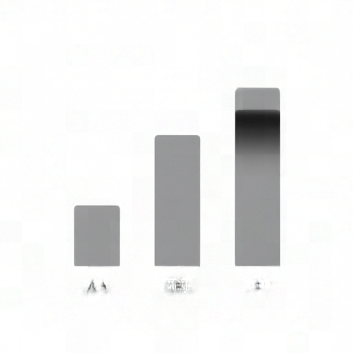
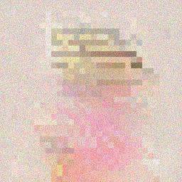
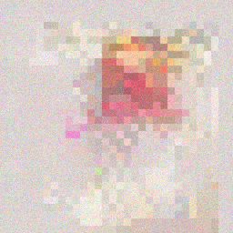

# Image and video generation report

Generated by `go run ./cmd/compatibility -update-media -media-scope image-video` from OvergoDB and the typed verification specifications. Do not edit this file directly.

Activation records identify available recipes. Verification records identify the source and measurements they actually captured. Neither establishes visual quality or a matched optimization comparison by itself. Missing evidence remains unavailable.

## Current validation checkpoint

The [validation index](docs/image_video_validation.json) records each acquisition's source base and changed component hashes. The default base is `84c5059b3171302c09ba10b52b04976ed1b9a5dc`; individual checks can identify a later base. Historical failures retain their original outcomes. This checkpoint does not complete the campaign.

Acquired September 12, 2026 on Windows with Go 1.26, Ryzen 9950X (16 cores/32 threads), 93.6 GiB installed RAM and RTX 4090 D (48 GiB VRAM), driver 616.64. GPU acquisitions used the existing exclusive measurement-process owner. OVERGO_DATA_ROOT pointed to the private image_video_gen worktree; OVERGO_CUDA_TEST=1 enabled device checks. Model artifacts and native references remained immutable.

Current code generates images with SenseNova, Krea, SimpleDiffusion and Un-0, and video with Wan, LiveEdit and Un-0 through their active recipes. Selected test results and their actual workload sizes appear below; complete frozen-case and public-workflow coverage remains open.

The SenseNova exact-output regression is corrected. A later shared attention optimization admitted strict-causal prefixes to batched SGEMM, changing accumulation order and BF16-rounded prefix states. Selecting the existing per-query attention option for those reference-bound prefixes restores both small-image hashes and the full-resolution reviewed PNG. No model weights, prompts, seeds, reference hashes or quality limits changed.

The freshly generated [SenseNova full-size image](docs/media_samples/5f3a56dff6b7a4a9e96d3d129082fdc349717357ff48d54454ff9535fb0cce68.png) is byte-identical to the retained reviewed image. Visual inspection confirms readable main headings and a coherent layout; the first-day marker resembles a caret and small text/icon defects remain features of that reference output.

The prior checkpoint fixed shared GIF timing and external JSON-array oracle handling. The [cost profile](docs/image_video_costs.json) maps all seven active model/task pairs, common owners, memory lifetimes and CPU/GPU transfers. Its byte estimates remain predictions rather than measured optimization gains.

Remaining work includes fresh full-length Wan generation and visual/temporal review, complete frozen-case coverage, public workflow and cancellation checks, and matched speed/memory/transfer comparisons. The earlier operator stop was fulfilled at b1206a56; work resumed on request.

The previous checkpoint index, including every original acquisition and failure description, is retained as evidence:sha256:8ed25de9a01b1ac7aac9237c97749935697b0b13221a461906e078462acdca9a. New checks declare their later source base separately; historical failures are not relabeled as passes.

The [shared-loader baseline](docs/image_video_baseline.json) retains complete Wan denoiser and projection loading measurements, exact tensor identities and acceptance criteria frozen before refactoring. Initial timings overlapped another worktree's gate and remain diagnostic only; the accepted cohort was acquired after those test processes exited. No loading optimization is claimed yet.

Wan now returns initialization errors without a cleanup panic, releases session resources after request cancellation, and stops decoding when the request is canceled. The G4 recovery check stops after one frame and then reproduces all five frames exactly on the same generator. The unchanged G3 reference and changed-negative fresh-session comparison also pass. Original failures, the skipped setup attempt, isolation probes and both corrected cohorts remain in OvergoDB as evidence:sha256:4ead158b1a90b0c5b13e17cf09049508f80fdf0d80592c9996f49c29b6ec15b2. These small lifecycle cases do not replace the remaining full-resolution video validation.

The preceding lifecycle acquisition, including its passing output and exact source hashes, remains evidence:sha256:d389b255d50abf529557b3ad8a2df7f78ef16e5c3bfad5f0e7babc5aaa76631d.

The preceding lifecycle acquisition, including its passing output and exact source hashes, remains evidence:sha256:060e251d5e4ddd767ae7a2b4601b83ea65702f911abc93bd3291fd2c389c29b6.

| Check | Recorded result | Scope and observations | Evidence |
| --- | --- | --- | --- |
| Wan cancellation, cleanup and reuse | Passed selected tests | Current source passes partial initialization without a panic, the unchanged G3 production reference, changed-negative conditioning against a fresh session, and cleanup after request cancellation. G4 decode stops after the first frame; the next request reproduces all five decoded frames exactly. G3 uses one 32x16 frame and four steps; G4 uses five 32x16 frames and two steps. This is lifecycle and reference coverage, not a new full-resolution clip or a performance comparison. | `evidence:sha256:ed239680eb5ad0b1d4be3179b10b5123075d40ffae34885ea73c06340b55c938` |
| SenseNova exact-output recovery | Passed selected tests | The production and independent native-intermediate trajectories both pass their unchanged exact PNG hashes: 6ef4065018d328c2945e6de0a8b87fe3eb2aec44039b43207398969712446de0 and bc7dabb6526beee13200a1b421e080c5015354bfee66fba75d4dbf1dc44c8617. The fix selects the existing per-query F32 attention path for strict-causal routed prefixes. | `evidence:sha256:9b9ff5101c1a11fe4ead51c4d1a9a8e1ec39cfff735b0b71f493fe0ed43f1527` |
| SenseNova full-resolution recovery | Passed selected tests | 1536x2720, 50 steps, seed 42: the generated PNG exactly matches the reviewed reference 5f3a56dff6b7a4a9e96d3d129082fdc349717357ff48d54454ff9535fb0cce68. Existing quality and performance limits pass: wall 139.180 s, worker-tracked device peak 17.100 GiB. The retained native measurements are 206.010 s and 18.162 GiB; this is a correctness repair, not a matched optimization claim. | `evidence:sha256:e2ee03e661c7f3bbb8ce736c6143fe69836f2f0208c38725372beb856e5081c3` |
| SenseNova causal-attention isolation probe | Passed selected tests | Diagnostic only: disabling the newer causal SGEMM admission in an overlay restored both original small-image hashes before the targeted fix. The broad executor change was not adopted; production changes only the reference-bound prefix graph. | `evidence:sha256:27aad4439178d79ee6219190e008d7cd6698f7c837b3442cc8c1a5de51073b97` |
| Un-0 image and video references (before timing fix) | Passed selected tests | Six tests passed: artifact-derived dimensions, native PNG and GIF bytes, deterministic repeat, class sensitivity, and Torch dynamics/generator parity. The original 6-frame, 8-fps GIF byte oracle passed before the timing correction. | `evidence:sha256:1b76ebf297818aec6b26dce434375cedaa0ee7bc4b7fa980775c853fdf7856de` |
| Wan denoiser and temporal VAE | Passed selected tests | G3 F32/BF16 and G4 F32 denoiser golden comparisons passed; G3/G4 temporal VAE decode comparisons passed. These small reference trajectories do not validate a newly generated 81-frame full-resolution clip. | `evidence:sha256:4c147dfaa703e01d75ed7ea35368baaa34990408e7b0aa2626da133764c0e57a` |
| Krea generation and cancellation recovery | Passed selected tests | 256x256, 8 steps, seed 42: real generation, in-flight decoder cancellation and subsequent decode passed. Owned storage stayed at 25,997,788,492 bytes and 496 allocations across cancellation; observed decoder peak was 26,925,269,372 bytes. Recovered PNG SHA-256: 3bf4ea50f7cfa6991dcd7ef76de20e67a5928f974c5f7279508ad7a1cf180da2. This lifecycle check is not full-resolution visual parity. | `evidence:sha256:dbbffc09e070acd8c1d3507b443ed25af28edd93d5bc3270e5faf0da2782df0e` |
| SimpleDiffusion host/CUDA comparison | Passed selected tests | 64x64, 2 steps, seed 7: warm CUDA median 22.3562 ms versus host 325.7646 ms across the existing three-call comparison. Float maximum error 2.265e-6; one PNG channel differed by one byte level, within the unchanged bounds. This measures warm generation, excluding cold loading. | `evidence:sha256:a9605a631c21bf1d48ac1f321dfdade6ac4121fa3ae454621841e16aa62ae745` |
| LiveEdit device runtime | Passed selected tests | Two requests passed exact latent/frame identities for a real-weight, 5-frame 16x32 source crop with explicit conditioning and noise. Observed walls: 0.534 s and 0.100 s. Context projections remained at one. Component peaks are separate ownership measurements, not a combined process peak. This does not establish full-size video-edit quality. | `evidence:sha256:e2538f05d33e5fb2b58270cdf2711beb05b4f73e11c6c4904bbd7e6495465428` |
| Historical: SenseNova production and full-resolution quality | Not passed: overgo/internal/sensenovarecipe: TestMediaCurrentSenseNovaValidation failed | The 256x256, 2-step production PNG hash check FAILED: expected 6ef4065018d328c2945e6de0a8b87fe3eb2aec44039b43207398969712446de0, observed 03a5a657b1a9c4690dad0673a730a379a4d579a6d46ae8079b5f9218fc3c179c. Separately, the 1536x2720, 50-step quality/performance test passed its unchanged signature bounds: wall 140.804 s and device peak 17.100 GiB. Its PNG differs from the reviewed reference; the whole acquisition remains failed. | `evidence:sha256:974857c7279e1e3e149fd001d546654e7c0e5278ff97f88891ee07ce0eb76ade` |
| Historical: SenseNova native diagnostic | Not passed: overgo/internal/sensenovarecipe: TestMediaSenseNovaDiagnosis failed | Native source/input identity and all sampled latent, layer, boundary and velocity comparisons passed their existing bounds. The final PNG hash check still FAILED: expected bc7dabb6526beee13200a1b421e080c5015354bfee66fba75d4dbf1dc44c8617, observed 1b63ee276369cf58735ac90ccaf3656faf5696214380bf16a3526cbac20d8640. This historical failure is resolved by the prefix correction recorded above; neither exact reference was changed. | `evidence:sha256:a0d1acb69623ea35be8bde2ce15f11cda2f9962c1bf4d62b419e9a90628cc8f4` |
| Shared GIF timing correction | Passed selected tests | All representable positive integer GIF frame rates (1-100 fps), large frame indices, frame ordering, and migrated consumers passed. Cumulative timing now stays within half a centisecond: 81 frames at 16 fps encode as 5.06 s rather than 4.86 s. Un-0 native frame pixels, order, palette and other metadata remain exact; six frames at 8 fps now total 0.75 s. Original retained exports remain unchanged. | `evidence:sha256:cda3894fe09d2e3ff22bb181445f08e9c7e1d6a5cd0b50d038445bfcce33c1d5` |
| Wan denoiser loader baseline | Passed selected tests | Complete CPU denoiser loading: first/repeat wall 2.245044/2.315935 s, total allocations 11285633280/11285638528 bytes, process lifetime peaks 7560736768/7560753152 bytes; selected source payload 5641371904 bytes. Exact named F32 hashes agree across states. This is the unchanged-loader baseline, not an optimization result. GPU transfers are zero because this acquisition uses no GPU. | `evidence:sha256:b2a91b8acf922b33c70c06d0455c14b036f8fec83a69302dedd06e899e1545b0` |
| Wan projection loader baseline | Passed selected tests | Complete CPU projection loading: first/repeat wall 0.020232/0.014561 s, total allocations 71320568/71325608 bytes, process lifetime peaks 76722176/77131776 bytes; selected source payload 34615296 bytes. Exact named F32 hashes agree across states. This is the unchanged-loader baseline, not an optimization result. GPU transfers are zero because this acquisition uses no GPU. | `evidence:sha256:3b40bb2f46ac23a81e508f661ca5ced9c29739446b8f41e0516e6301f06fc2fc` |

Results describe the selected tests, including failures, rather than all supported requests. Commands and retained overlay sources in the index identify each acquisition. Test output is stored by content identity in OvergoDB.

Samples below retain their original producing-run metadata. A newer validation can reproduce the same content, as noted above. Historical GIFs retain their original timing; they have not been regenerated by this checkpoint.

## Campaign requirements

The [quality protocol](docs/image_video_protocol.json), [resource protocol](docs/image_video_resources.json), and [execution plan](docs/plan.json) define the required comparisons. This projection of activation and run records remains incomplete as a campaign result until those checks and their exact evidence are joined.

| Area | Required report evidence |
| --- | --- |
| Identity | Model, recipe, reference, criteria, complete request, source revision, environment, run, and output identities |
| Correctness and quality | Separate numerical, structural, visual and temporal outcomes; retain failures, unavailable checks and reference limitations |
| Processing | Matched cold/warm preparation, integration, decode, serialization, export, cleanup and total wall; include waiting and failed attempts |
| Transfers | HtoD, DtoH and DtoD bytes and calls by weight, conditioning, latent, intermediate, output and diagnostic boundary; synchronization and wait observations |
| Memory | Process host peak, Go allocations, pinned host storage, driver-owned live/peak bytes, retained session memory and current capacity as distinct scopes |
| Shared code | Original and replacement owners, real migrated consumers, removed duplicate paths, and added code |
| Reliability and workflows | Cancellation, release, repeated and changed shapes, restart/reuse, API and workbench receipts |
| Decision | Matched baseline/candidate measurements and protocol identities, accepted or rejected changes, tradeoffs, and combined validation |

Missing measurements remain unavailable; a reported zero requires an observation. Historical verifier timings and separate generation outputs do not form a matched performance result without an execution-specific link.

## Verdict

The selected tasks (image-gen, video-gen, video-edit) have 7 activations; 0 are stale and 7 healthy activations cite a readable measured verifier run. Measurements retain their original scope and source revision.

## Public media surface

Every media capability is exercised through the same task-generic recipe lifecycle; requests are typed JSON on standard input and outputs are typed store artifacts.

| Operation | Command |
| --- | --- |
| Verify (candidate execution + gate/run evidence) | `go run ./cmd/recipe verify -task <task> -repo <overgodb> -input - <model-path> < request.json` |
| Activate (bind verified evidence to the active alias) | `go run ./cmd/recipe activate -task <task> -repo <overgodb> -gate <id> -run-id <id> -reason <why> <model-path>` |
| Run (serve through the active recipe) | `go run ./cmd/recipe run -task <task> -repo <overgodb> -input - <model-path> < request.json` |
| Report (this document) | `go run ./cmd/compatibility -update-media -media-scope image-video` |
| Sample export (recorded generation outputs) | `go run ./cmd/compatibility -export-samples -media-scope image-video` |

The report includes only the selected tasks and the recipes actually declared by their active records.

## Media activations

| Model | Task | Activation tier | Stale | Measured claim |
| --- | --- | --- | --- | --- |
| `Krea-2-Turbo` | `image-gen` | verified | - | - |
| `LiveEdit` | `video-gen` | verified | - | - |
| `SenseNova-U1-8B-MoT-Infographic-V3` | `image-gen` | verified | - | - |
| `SimpleDiffusion-TensorProductAttentionRope` | `image-gen` | verified | - | - |
| `Un-0` | `image-gen` | verified | - | - |
| `Un-0` | `video-gen` | verified | - | - |
| `Wan2.1-T2V-1.3B` | `video-gen` | verified | - | - |

The matrix reports activation and evidence scope, not general model-family support: an activation means the recipe lifecycle admitted the model for the task at the stated tier, and a measured claim binds that capability to real execution evidence at its commit.

## Function inventory

The executable surface behind each healthy activation: every recipe node with its module and placement, from the activation's own stored definition. Modules are the native Go implementations the workflow runtime binds.

| Model | Task | Node | Module | Placement | Session | Component model |
| --- | --- | --- | --- | --- | --- | --- |
| `Krea-2-Turbo` | `image-gen` | `decode` | `model.latent-image-decode` | hybrid | - | `model:sha256:1b7acc66c8e9c396e08` |
| `Krea-2-Turbo` | `image-gen` | `integrate` | `model.latent-image-integrate` | hybrid | - | `model:sha256:8f2e2c875364a9c71ba` |
| `Krea-2-Turbo` | `image-gen` | `prepare` | `model.latent-image-prepare` | hybrid | capacity | `model:sha256:f56d447bad2b83262f8` |
| `LiveEdit` | `video-gen` | `decode` | `model.reference-video-decode` | hybrid | - | composite |
| `LiveEdit` | `video-gen` | `integrate` | `model.reference-video-integrate` | hybrid | - | composite |
| `LiveEdit` | `video-gen` | `prepare` | `model.reference-video-prepare` | hybrid | capacity | composite |
| `SenseNova-U1-8B-MoT-Infographic-V3` | `image-gen` | `decode` | `model.routed-image-decode` | hybrid | - | composite |
| `SenseNova-U1-8B-MoT-Infographic-V3` | `image-gen` | `integrate` | `model.routed-image-integrate` | hybrid | - | composite |
| `SenseNova-U1-8B-MoT-Infographic-V3` | `image-gen` | `prepare` | `model.routed-image-prepare` | hybrid | capacity | composite |
| `SimpleDiffusion-TensorProductAttentionRope` | `image-gen` | `decode` | `model.diffusion-image-decode` | host | - | composite |
| `SimpleDiffusion-TensorProductAttentionRope` | `image-gen` | `integrate` | `model.diffusion-image-integrate` | host | - | composite |
| `SimpleDiffusion-TensorProductAttentionRope` | `image-gen` | `prepare` | `model.diffusion-image-prepare` | host | capacity | composite |
| `Un-0` | `image-gen` | `decode` | `model.oscillator-image-decode` | host | - | composite |
| `Un-0` | `image-gen` | `integrate` | `model.oscillator-image-integrate` | host | - | composite |
| `Un-0` | `image-gen` | `prepare` | `model.oscillator-image-prepare` | host | capacity | composite |
| `Un-0` | `video-gen` | `decode` | `model.oscillator-video-decode` | host | - | composite |
| `Un-0` | `video-gen` | `integrate` | `model.oscillator-video-integrate` | host | - | composite |
| `Un-0` | `video-gen` | `prepare` | `model.oscillator-video-prepare` | host | capacity | composite |
| `Wan2.1-T2V-1.3B` | `video-gen` | `decode` | `model.latent-video-decode` | hybrid | - | composite |
| `Wan2.1-T2V-1.3B` | `video-gen` | `integrate` | `model.latent-video-integrate` | hybrid | - | composite |
| `Wan2.1-T2V-1.3B` | `video-gen` | `prepare` | `model.latent-video-prepare` | hybrid | capacity | composite |

## Recipe inventory

One row per healthy activation: the recipe artifact the active alias resolves, its evidence tier, and its non-model dependencies.

| Model | Task | Recipe | Evidence tier | Dependencies |
| --- | --- | --- | --- | --- |
| `Krea-2-Turbo` | `image-gen` | `recipe:sha256:0b1bcc2fb9cf5f42cd` | verified | profile `profile:sha256:4dedf632a6744df0c` |
| `LiveEdit` | `video-gen` | `recipe:sha256:7cd66ed08ebee5e566` | verified | profile `profile:sha256:5dff72b6d581a9d1d` |
| `SenseNova-U1-8B-MoT-Infographic-V3` | `image-gen` | `recipe:sha256:5a729e98ef825033d4` | verified | flow-profile `profile:sha256:307706b480209dc49` |
| `SimpleDiffusion-TensorProductAttentionRope` | `image-gen` | `recipe:sha256:4f0b3b9dbad2427851` | verified | - |
| `Un-0` | `image-gen` | `recipe:sha256:213d890a8988e995e5` | verified | - |
| `Un-0` | `video-gen` | `recipe:sha256:4f6267a0ddb44c1357` | verified | - |
| `Wan2.1-T2V-1.3B` | `video-gen` | `recipe:sha256:bff12bb8946afe0d8c` | verified | profile `profile:sha256:5dff72b6d581a9d1d` |

## Measured results

One row per healthy activation: the verifier run the activation cites, exactly as recorded -- wall, measured phase decomposition, peak device bytes, verifying commit, and the output artifacts the run published. A dash means the activation stands without that measurement.

| Model | Task | Verifier wall | Phases | Peak device | Commit | Run outputs |
| --- | --- | --- | --- | --- | --- | --- |
| `Krea-2-Turbo` | `image-gen` | 14.581s | decode 162ms, integrate 1.417s, prepare 9.729s | - | `05faa01ef333` | `evidence:sha256:5b3a1c4bb7981dba` |
| `LiveEdit` | `video-gen` | 5.409s | integrate 671ms | 3260313344 B | `f313f43d6c57` | `evidence:sha256:9962cef18a9b42ed` |
| `SenseNova-U1-8B-MoT-Infographic-V3` | `image-gen` | 2m17.156s | decode 939ms, integrate 2m2.434s, prepare 13.187s | - | `73414af5ea9b` | `evidence:sha256:3d0bc88bed1aadcc` |
| `SimpleDiffusion-TensorProductAttentionRope` | `image-gen` | 1.845s | decode 8ms, integrate 1.413s | - | `f313f43d6c57` | `evidence:sha256:710bb24341b1d20a` |
| `Un-0` | `image-gen` | 54ms | decode 2ms, integrate 1ms | - | `f313f43d6c57` | `evidence:sha256:033e4554d122101e` |
| `Un-0` | `video-gen` | 41ms | decode 18ms | - | `f313f43d6c57` | `evidence:sha256:30d089f92a60ec23` |
| `Wan2.1-T2V-1.3B` | `video-gen` | 6m22.361s | decode 5ms, integrate 6m16.764s | 10329897932 B | `b862f3c902fb` | `evidence:sha256:d137ace0d95df805` |

## Recorded run outcomes

These counts include generation and verification records for the selected recipes. They are not counts of images or quality passes. Failed and cancelled attempts remain visible.

### Krea-2-Turbo (image-gen)

Succeeded: 2; failed: 0; cancelled: 0.

### LiveEdit (video-gen)

Succeeded: 4; failed: 0; cancelled: 0.

### SenseNova-U1-8B-MoT-Infographic-V3 (image-gen)

Succeeded: 6; failed: 0; cancelled: 0.

### SimpleDiffusion-TensorProductAttentionRope (image-gen)

Succeeded: 4; failed: 0; cancelled: 0.

### Un-0 (image-gen)

Succeeded: 246; failed: 2; cancelled: 0.

- `run:sha256:155d0923368a0afba994faa203d4d32a0fc18b8cac6919e84851544b712da9f2`: failed; execution_failed. Source: unavailable. Environment: unavailable.
- `run:sha256:22d16a199eb8c2373fccb4e8bcf64e85878a2b67ce3fb86bcf83160e6da52d9c`: failed; execution_failed. Source: unavailable. Environment: unavailable.

### Un-0 (video-gen)

Succeeded: 164; failed: 0; cancelled: 0.

### Wan2.1-T2V-1.3B (video-gen)

Succeeded: 6; failed: 0; cancelled: 0.

## Samples

Outputs from recorded successful generation runs, exported by `go run ./cmd/compatibility -export-samples -media-scope image-video` and named by content SHA-256. A successful run does not by itself establish visual quality.

Samples match the frozen protocol's input artifact identities. Repeated identical output bytes share one file; each displayed sample cites a producing run. The run summary above retains all recorded attempts for the selected recipes.

### SenseNova-U1-8B-MoT-Infographic-V3 (`image-gen`)

- Image: [e652ebc738f538475c2ce188ac4b2f4daca3e00fd0f9b1ee0b322d603c9c9a7d.png](docs/media_samples/e652ebc738f538475c2ce188ac4b2f4daca3e00fd0f9b1ee0b322d603c9c9a7d.png)

  

  Request: `{"cfg_scale":4.5,"height":512,"prompt":"a minimal infographic of three rising bars labeled A B C","seed":42,"steps":4,"timestep_shift":3,"width":512}`

  Run: `run:sha256:09fd4e16a87335eab349fdc801d768f4627e73c1268bf697b9465f84036d8ff4`; output: `output:sha256:e652ebc738f538475c2ce188ac4b2f4daca3e00fd0f9b1ee0b322d603c9c9a7d`. Source: unavailable. Environment: unavailable.

  Input artifacts: `file:sha256:818cf1f980c17a498039c0efa4f007e630877424592b5c2013255c36f0223f43`.
- Image: [5f3a56dff6b7a4a9e96d3d129082fdc349717357ff48d54454ff9535fb0cce68.png](docs/media_samples/5f3a56dff6b7a4a9e96d3d129082fdc349717357ff48d54454ff9535fb0cce68.png)

  

  Request: `{"cfg_scale":4,"height":2720,"prompt":"该信息图以明亮蓝色、活力橙、白色与浅灰色为主色调，主题为\"顺利开局：新员工第一周生存手册\"，突出展示入职准备、每日任务、沟通规范、会议礼…","seed":42,"steps":50,"timestep_shift":3,"width":1536}`

  Run: `run:sha256:c71ee19cbc2dc5bfdba69ee809e0d072f8dd662d5e445454a766cb0daf8e98eb`; output: `output:sha256:5f3a56dff6b7a4a9e96d3d129082fdc349717357ff48d54454ff9535fb0cce68`. Source: unavailable. Environment: unavailable.

  Input artifacts: `file:sha256:f3caa7db1e6aef43ec9a0caddff9971ab23e94a6e9a8b316eea6d2debcc59e10`.
- Image: [e8bf6ac4f2f33364f1852d807d7953acbe348c196cc76943552a8963a1811637.png](docs/media_samples/e8bf6ac4f2f33364f1852d807d7953acbe348c196cc76943552a8963a1811637.png)

  

  Request: `{"cfg_scale":4.5,"height":512,"prompt":"a minimal infographic of three rising bars labeled A B C","seed":142,"steps":4,"timestep_shift":3,"width":512}`

  Run: `run:sha256:fb2dee2bf270183c7c81f61a8b580ceddacca5b0b0267b9571481b18721168d6`; output: `output:sha256:e8bf6ac4f2f33364f1852d807d7953acbe348c196cc76943552a8963a1811637`. Source: unavailable. Environment: unavailable.

  Input artifacts: `file:sha256:44ae255ebc22b8ab3adea63bde557ce5b85b6020aa993a015c411dd06b18fc42`.

### Un-0 (`image-gen`)

- Image: [cf5dcb195503d8c9ce318a0fc8997441466c0aa3f911ae772f0ab82c13448e28.png](docs/media_samples/cf5dcb195503d8c9ce318a0fc8997441466c0aa3f911ae772f0ab82c13448e28.png)

  

  Request: `{"class":1,"seed":111}`

  Run: `run:sha256:52b98c37cff7a30883e7982858c573e482c5d47d570ea29d88f8a232d3d76e13`; output: `output:sha256:cf5dcb195503d8c9ce318a0fc8997441466c0aa3f911ae772f0ab82c13448e28`. Source: unavailable. Environment: unavailable.

  Input artifacts: `file:sha256:8e601d036e88e152f15809ac993be461f9835d6241e54d851a42946195f3fbfb`.
- Image: [a8bc7f12cb9a537b40bf150493a002251bbbc59620a69944e19778dd463da6f3.png](docs/media_samples/a8bc7f12cb9a537b40bf150493a002251bbbc59620a69944e19778dd463da6f3.png)

  

  Request: `{"class":1,"seed":11}`

  Run: `run:sha256:9614c0b2a5cefc90faa85a2715bc93c58c61655bb51f042667577ceab06b31f5`; output: `output:sha256:a8bc7f12cb9a537b40bf150493a002251bbbc59620a69944e19778dd463da6f3`. Source: unavailable. Environment: unavailable.

  Input artifacts: `file:sha256:82b9edbba80bbd74c5f6e3df94b3a7af504d2ffce8e690e91cca7da6a454172a`.

### Un-0 (`video-gen`)

- Video clip: [9cc39bd74b99db9f50c8db84433c396e55eafedb28336bdc4901bb5b99e3195d.gif](docs/media_samples/9cc39bd74b99db9f50c8db84433c396e55eafedb28336bdc4901bb5b99e3195d.gif)

  

  Request: `{"class":1,"frames":12,"scale":2,"seed":11}`

  Run: `run:sha256:d692839bbd7a3a5cdb53ec725cf8d6fc7a71639e0d1a341ac21e61d6df31048f`; output: `output:sha256:5f90247cb36b1ea021dd840ea30585920796630f39ccde1a3c01a0905a85c9c5`. Source: unavailable. Environment: unavailable.

  Input artifacts: `file:sha256:1d74176e310fa363bf987866df9d59bf942e301d2d326dbd501ac2b8bc01e80d`.
- Video clip: [9b52d1275c56c6006c6707c060dba2dba4cae2ad6c6e2b982c90cf808fc6271a.gif](docs/media_samples/9b52d1275c56c6006c6707c060dba2dba4cae2ad6c6e2b982c90cf808fc6271a.gif)

  

  Request: `{"class":1,"frames":12,"scale":2,"seed":111}`

  Run: `run:sha256:f05af31a8d850834f3124682aa49775e82df0cc204434160ff1813c095623b31`; output: `output:sha256:4dbbb9ab06b2c7f70cd2cf365d9b9edbde3bbef9f421661700e0f9287c5f0826`. Source: unavailable. Environment: unavailable.

  Input artifacts: `file:sha256:0bf08dc9e7fa42a77c7a375466cf0809af3cfc223fe31a027b8efdd064d6e48e`.

### SimpleDiffusion-TensorProductAttentionRope (`image-gen`)

- Image: [43cb008447732762135bf0dd0d0c106f10277785d460b5481d8a7dfe40599319.png](docs/media_samples/43cb008447732762135bf0dd0d0c106f10277785d460b5481d8a7dfe40599319.png)

  

  Request: `{"height":256,"seed":5,"steps":8,"width":256}`

  Run: `run:sha256:788066c95ff799e0e2989ddf90e6baf8850b5d4cf724c1113d31f96250355f6c`; output: `output:sha256:43cb008447732762135bf0dd0d0c106f10277785d460b5481d8a7dfe40599319`. Source: unavailable. Environment: unavailable.

  Input artifacts: `file:sha256:ab444aa99af1a85d3b6a2b64fb7459892048e244112cc4e3f88101d797c377ea`.
- Image: [0313903cf4506b5beeb9d04c7aad008a44cc37a96ca2abcdb3b02cca8c0c679e.png](docs/media_samples/0313903cf4506b5beeb9d04c7aad008a44cc37a96ca2abcdb3b02cca8c0c679e.png)

  

  Request: `{"height":256,"seed":105,"steps":8,"width":256}`

  Run: `run:sha256:fe5a68fb780fc092cf5c9505862e5c8584218ea5d9ad042fec9224e7250199ce`; output: `output:sha256:0313903cf4506b5beeb9d04c7aad008a44cc37a96ca2abcdb3b02cca8c0c679e`. Source: unavailable. Environment: unavailable.

  Input artifacts: `file:sha256:2b9ae1a1da5bce737b548e20c27223dab9a351ba6e45dcd81c813fc63fc119dd`.

### LiveEdit (`video-gen`)

- Video clip: [6f8c4271f3acb7ebf96fed67575e18a42e6bb850db04cbb899a041b85652dd33.gif](docs/media_samples/6f8c4271f3acb7ebf96fed67575e18a42e6bb850db04cbb899a041b85652dd33.gif)

  

  Request: `{"context_timestep":0,"frames_per_chunk":1,"initial_noise":"[256 values]","local_attention_frames":1,"seed":0,"sigmas":[0.8333333],"text_context":"[786432 values]","timesteps":[900]}`

  Run: `run:sha256:923dc7ca901c00a9c03522df9fbe34a73b4484621d0531f632298464a7c753d1`; output: `output:sha256:6f8c4271f3acb7ebf96fed67575e18a42e6bb850db04cbb899a041b85652dd33`. Source: unavailable. Environment: unavailable.

  Input artifacts: `file:sha256:13d22d58fe9d17432757def7ec1cdcb170f07358c6ccaf0a5d4dcfdeec1e95ca`, `file:sha256:e14e51433c7ccd5111ee3e176a4da64342f7d24412979eb1faa406836ff39e91`.

### Wan2.1-T2V-1.3B (`video-gen`)

- Video clip: [e4442cf7ee01b00d3f12d238640bb14a48b94e89d2a2c0130e4c2202be69a02e.gif](docs/media_samples/e4442cf7ee01b00d3f12d238640bb14a48b94e89d2a2c0130e4c2202be69a02e.gif)

  

  Request: `{"cond_context":"[786432 values]","frames":5,"guide_scale":6,"height":64,"noise":{"Block":256,"Grid":4096,"Offset":0,"Seed":131,"Unroll":4},"shift":5,"steps":2,"uncond_context":"[786432 values]","width":64}`

  Run: `run:sha256:6d3de950bf9fb97544a04f433a3890d9f134b1af459dc2dfb0d463c8d12085c8`; output: `output:sha256:e4442cf7ee01b00d3f12d238640bb14a48b94e89d2a2c0130e4c2202be69a02e`. Source: unavailable. Environment: unavailable.

  Input artifacts: `file:sha256:548efce9b4a867734a22f75d4fdb1c00faa9582945fd355f853fdeb71de5ecc9`.
- Video clip: [4cc19c2db162f6f0678d4ab026f12229abebbbc39a07a3f6154bfc07f74faaa1.gif](docs/media_samples/4cc19c2db162f6f0678d4ab026f12229abebbbc39a07a3f6154bfc07f74faaa1.gif)

  

  Request: `{"cond_context":"[786432 values]","frames":5,"guide_scale":6,"height":64,"noise":{"Block":256,"Grid":4096,"Offset":0,"Seed":31,"Unroll":4},"shift":5,"steps":2,"uncond_context":"[786432 values]","width":64}`

  Run: `run:sha256:8768bd7df757067c19aaac03c266f28ce397d911a79a58ad831582c7db6ea9ab`; output: `output:sha256:4cc19c2db162f6f0678d4ab026f12229abebbbc39a07a3f6154bfc07f74faaa1`. Source: unavailable. Environment: unavailable.

  Input artifacts: `file:sha256:ddb180564d8a0a1fdacff9ce2f3276a3282a00b96af71957eda687646d7b8680`.
- Video clip: [88a27a06c4c724e5d92c6271d793528a8dfe4152fc7750a7a08509b59d39c27f.gif](docs/media_samples/88a27a06c4c724e5d92c6271d793528a8dfe4152fc7750a7a08509b59d39c27f.gif)

  

  Request: `{"cond_context":"[786432 values]","frames":81,"guide_scale":6,"height":480,"noise":{"Block":256,"Grid":684,"Offset":0,"Seed":31,"Unroll":4},"shift":5,"steps":50,"uncond_context":"[786432 values]","width":832}`

  Run: `run:sha256:d95d3deec8bd0da02fc3b653f421572ceea28049bd34d9051583d501e983a9d3`; output: `output:sha256:88a27a06c4c724e5d92c6271d793528a8dfe4152fc7750a7a08509b59d39c27f`. Source: unavailable. Environment: unavailable.

  Input artifacts: `file:sha256:364be3ce53202ce6b5be13d1265ff1e909f6c232b1796f06c73d451fad326a72`.

### Krea-2-Turbo (`image-gen`)

- Image: [4044fbe3e2590fbc01436e93d2f9e396f94dc53b5fdf705c86f40fca74a4d2ee.png](docs/media_samples/4044fbe3e2590fbc01436e93d2f9e396f94dc53b5fdf705c86f40fca74a4d2ee.png)

  

  Request: `{"height":512,"prompt":"a red fox licking a vanilla ice cream cone in snow","seed":143,"steps":4,"width":512}`

  Run: `run:sha256:584d90be78cff48db34d9dbfb0112dcacef7464772b731c35766ea223b4ff120`; output: `output:sha256:4044fbe3e2590fbc01436e93d2f9e396f94dc53b5fdf705c86f40fca74a4d2ee`. Source: unavailable. Environment: unavailable.

  Input artifacts: `file:sha256:1d840594046f2981e9fb7c335808a4f3399101072ab0a8ab2768492642f9b6e2`.
